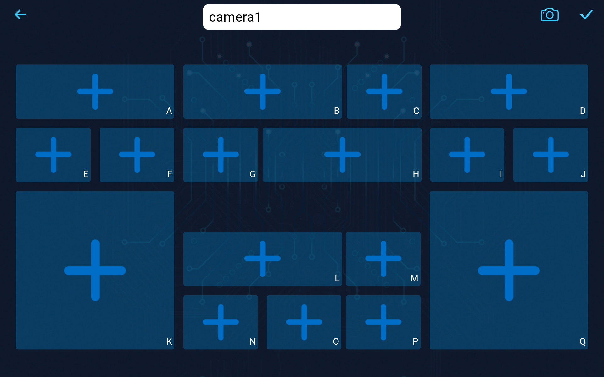
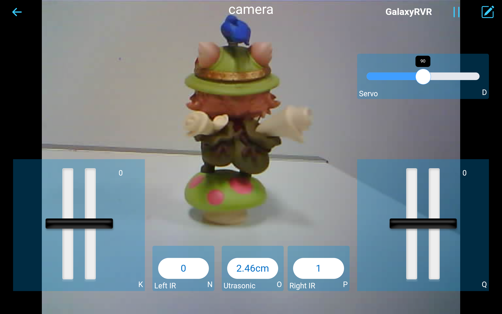

第十二课 使用应用程序操控探测车
===========================================

在上一次的冒险中，我们掌握了使用SunFounder控制器的技巧，不仅可以通过探测车的摄像头“看到”世界，还可以控制其视角，调节摄像头的倾斜角度。这就像是给我们的火星探测车赋予了视觉感知！

现在，试想一下，如果你不仅能控制火星探测车的视角，还能操控它的行进路径，任意指引它的方向呢？在这一课中，我们将带你做到这一点！我们将把对SunFounder控制器的理解提升到一个新的层次，学习如何操控我们的探测车，体验作为火星探测车驾驶员的激动人心的感觉！

通过我们的生动活泼的STEAM课程，孩子们不仅能学习，还能亲身体验太空探索的奇妙与刺激！系好安全带，准备好迎接这场激动人心的旅程吧！

.. raw:: html

    <video width="600" loop autoplay muted>
        <source src="_static/video/camera_app.mp4" type="video/mp4">
        Your browser does not support the video tag.
    </video>

学习目标
-----------------------

* 更深入地理解SunFounder控制器。
* 学会通过手机应用程序操控火星探测车。

所需材料
------------------------

* 火星探测车模型（配备所有组件，除了太阳能板和底板）
* Arduino IDE
* 计算机
* 安装了SunFounder控制器应用程序的平板或智能手机

课程步骤
----------------------

**步骤1：深入了解SunFounder控制器**

在上一课中，我们初步了解了SunFounder控制器及其基本操作和用途。但相信你一定还有一些疑问，是不是？现在是时候解答这些疑问，深入探索这一科技奇迹了。

当你创建一个新的控制器时，你会看到一个可能一开始看起来有些陌生的界面。

界面上会出现各种各样的形状：长方形、短方形和大正方形，每个形状都有一个从A到Q的标识。

你是否好奇，为什么会有如此多的形状？A到Q的标识又代表什么呢？

让我们一起开始探索吧！

* **解读形状**

    比如，你点击一个长方形区域，就像打开了一个宝箱，你会发现许多小部件。还记得我们在上节课中提到的 **滑块** 吗？通过滑动它，控制火星探测车的摄像头倾斜角度。接下来是 **仪表盘** ，它可以用来显示探测车的速度。还有很多其他的小部件！

    .. image:: img/app/app_long.jpg

    点击短方形区域，展示的将是另一组小部件。 **按钮** 小部件，就像一个开关，可以发送单一命令；而 **麦克风** 小部件则可以通过语音指令来控制探测车，当然，还有其他小部件等你探索。

    .. image:: img/app/app_short.jpg

    那么，正方形区域呢？它包含了 **操纵杆** 、D-pad（方向键）和油门小部件。没错，还有更多的东西！

    .. image:: img/app/app_square.jpg

    在此阶段，不需要过于担心每个小部件的功能和使用方法。首先，熟悉每种形状中包含的小部件即可。

* **利用小部件**

    通过上面的内容，我们了解了有许多不同的小部件。那么，这些小部件都能做些什么呢？

    我们将这些小部件分为两类：控制小部件和显示小部件。

    * **控制小部件**：它们主要用于操作应用程序，探测车收到这些控制命令后，执行相应的动作。
    * **显示小部件**：它们用于在应用程序中展示一些数值，例如传感器数据等。

    关于这些小部件的详细描述，请参考：|link_widgets_list|。

    同时，关于这些小部件的功能、参数等内容，请参考：|link_ai_camera_library_api|。

* **标识符的作用**

    每个形状的右下角都有一个标识符。为什么会有这个标识符呢？让我们通过一个例子来理解。

    在上课时，我们曾将一个 **滑块** 小部件添加到 **D** 区域。获取其值的代码大概是这样的：

        .. code-block:: arduino

            int16_t sliderD = aiCam.getSlider(REGION_D);

    如果我们将**滑块**小部件添加到 **B** 区域，代码又该怎么写呢？其实很简单，只需要将 ``REGION_D`` 替换为 ``REGION_B`` 即可。

        .. code-block:: arduino

            int16_t sliderB = aiCam.getSlider(REGION_B);

    很简单吧？这些标识符帮助我们区分每个区域中添加了哪些小部件。

.. note::
    * 关于创建和添加小部件、连接和操作SunFounder控制器的详细教程，请参考 ``第11课 第3步`` 。
    * 若需要了解更深入的操作，请访问|link_sc_page|。

**步骤2：通过双油门控制火星探测车**

现在我们已经深入了解了SunFounder控制器的小部件，接下来我们将通过添加两个 **油门** 小部件来进一步提升操作，控制火星探测车的移动。

#. 在 **K** 和 **Q** 区域各放置一个 **油门** 小部件。你需要点击右上角的 |app_edit| 按钮进入编辑模式，完成设置后，点击|app_save|按钮保存更改。

    .. image:: img/app/app_throttle.png

#. 由于我们打算使用两个 **油门** 小部件来控制探测车的运动，因此我们需要相应地修改控制探测车移动的函数：

    .. code-block:: arduino

        // 设置电机功率的函数
        void carSetMotors(int8_t power_L, int8_t power_R) {
            // 设置左电机功率
            if (power_L >= 0) {
                SoftPWMSet(in1, map(power_L, 0, 100, 0, 255));
                SoftPWMSet(in2, 0);
            } else {
                SoftPWMSet(in1, 0);
                SoftPWMSet(in2, map(power_L, 0, -100, 0, 255));
            }

            // 设置右电机功率
            if (power_R >= 0) {
                SoftPWMSet(in3, 0);
                SoftPWMSet(in4, map(power_R, 0, 100, 0, 255));
            } else {
                SoftPWMSet(in3, map(power_R, 0, -100, 0, 255));
                SoftPWMSet(in4, 0);
            }
        }

    现在，让我们分析一下 ``carSetMotors()`` 函数。该函数接收两个参数， ``power_L`` 和 ``power_R`` , 它们分别代表左电机和右电机的功率设置。这两个参数的值大约在-100到100之间，其中负值表示反向运动，0表示停止，正值表示前进。

    * 设置左电机功率：

        * 如果``power_L``大于或等于0，则左电机前进。

        * ``SoftPWMSet(in1, map(power_L, 0, 100, 0, 255))`` 使用Arduino的 ``map`` 函数将输入范围（0到100）映射到输出范围（0到255）——因为Arduino的PWM值介于0（0%占空比）和255（100%占空比）之间。这个映射值然后传递给 ``SoftPWMSet`` 函数和 ``in1`` 。

        * 如果 ``power_L`` 小于0，则左电机反向运动， ``map`` 函数的输入范围变为0到-100。

    * 设置右电机功率：

        * 逻辑与左电机相同，但使用 ``in3`` 和 ``in4`` ，并且功率值为 ``power_R`` 而不是 ``power_L`` 。

    总的来说，这个函数接收两个电机的功率值，将它们转换成适当的PWM值，并将这些PWM值设置到正确的电机控制引脚，从而实现期望的运动。

#. 在 ``onReceive()`` 函数中，获取两个 **油门** 小部件的值，并将其作为火星探测车左右电机的功率值。

    .. code-block:: arduino
        :emphasize-lines: 9,10,13

        void onReceive() {
            // 获取D区域滑块的值
            int16_t sliderD = aiCam.getSlider(REGION_D);

            // 将伺服电机移动到滑块指示的角度
            myServo.write(int(sliderD));

            // 获取左右电机的油门值
            int throttle_L = aiCam.getThrottle(REGION_K);
            int throttle_R = aiCam.getThrottle(REGION_Q);

            // 设置电机功率
            carSetMotors(throttle_L, throttle_R);
        }

这里是完整的代码：

.. raw:: html

    <iframe src=https://create.arduino.cc/editor/sunfounder01/c70d2598-a1f9-465a-83bb-4ebd38eb74fa/preview?embed style="height:510px;width:100%;margin:10px 0" frameborder=0></iframe>

每次重新运行代码时，你需要重复以下四个步骤：

* 在上传代码之前，确保开关处于右侧位置。

    .. image:: img/camera_upload.png

* 成功上传代码后，将开关切换到左侧以启动ESP32 CAM。
* 连接到 ``GalaxyRVR`` 网络。
* 连接并运行控制器。

现在，只需轻轻滑动你的``油门``小部件，你就能看到火星探测车的动感表现，动力十足，转向灵活。让探索之旅开始吧！

**步骤3：可视化传感器读数**

在使用SunFounder控制器的过程中，我们通过控制小部件与火星探测车进行了互动，包括用于调整倾斜角度的滑块和用于控制移动的油门。那么，如何利用显示小部件，实时展现探测车周围的环境呢？

我们可以通过可视化左右红外（IR）避障模块的值以及超声波模块检测到的距离，来实现这一目标。通过这些实时数据，我们能够清晰地了解探测车当前的工作环境。

以下是如何实现的步骤：

#. 首先，向你的SunFounder控制器添加三个数字小部件。别忘了，你可以通过设置按钮个性化它们的名称和单位。

    .. image:: img/app/app_show.png

#. 接下来，深入代码。首先，将我们前面课程中提到的IR避障模块和超声波模块的代码片段带过来。

    .. code-block:: arduino

        ...
        // 定义超声波模块的引脚
        #define ULTRASONIC_PIN 10

        // 定义IR模块的引脚
        #define IR_RIGHT 7
        #define IR_LEFT 8

        void setup() {
            ...

            // 设置IR模块引脚为输入
            pinMode(IR_RIGHT, INPUT);
            pinMode(IR_LEFT, INPUT);
        }

        float readSensorData() {
            // 需要4毫秒延迟，否则读取值可能为0
            delay(4);

            // 设置为输出模式发送信号
            pinMode(ULTRASONIC_PIN, OUTPUT);

            ...
        }

#. 在 ``onReceive()`` 函数中，提取来自避障模块和超声波传感器的值。然后，将这些值更新到 ``sendDoc[]`` 字典中。 ``N`` 、 ``P`` 和 ``O`` 键分别对应你添加的三个数字小部件的区域代码。

    .. code-block:: arduino

        // 接收到控制器数据时执行的函数
        void onReceive() {

            ...

            // 读取IR传感器的值
            int leftValue = digitalRead(IR_LEFT);
            int rightValue = digitalRead(IR_RIGHT);
            aiCam.sendDoc["N"] = leftValue;
            aiCam.sendDoc["P"] = rightValue;
            
            // 超声波传感器读取
            float distance = readSensorData();
            aiCam.sendDoc["O"] = distance;
        }

这里是完整的代码：

.. raw:: html

    <iframe src=https://create.arduino.cc/editor/sunfounder01/6c867007-a0e8-4f85-980d-ec1cd1a70969/preview?embed style="height:510px;width:100%;margin:10px 0" frameborder=0></iframe>

上传代码成功后，启动你的SunFounder控制器。你将看到避障模块的实时值和超声波传感器探测到的距离，这些数据将清晰地展示探测车周围的环境。

完成这个步骤后，你已经成功掌握了显示小部件的使用。可以随意尝试不同的小部件，展示你感兴趣的信息。祝你探索愉快！

**步骤4：总结与展望**

在本课中，我们更深入地理解了SunFounder控制器，掌握了如何利用其小部件不仅操控火星探测车，还能实时监控其周围的环境数据。

现在，给你一个挑战：

如何在你的SunFounder控制器中添加一些开关小部件？当这些开关激活时，火星探测车可以在避障模式和跟随模式之间切换。或者，试试使用开关控制灯条——开关开关、关闭，甚至改变其颜色？

你有信心挑战吗？

我们期待看到你成功完成这个挑战！
