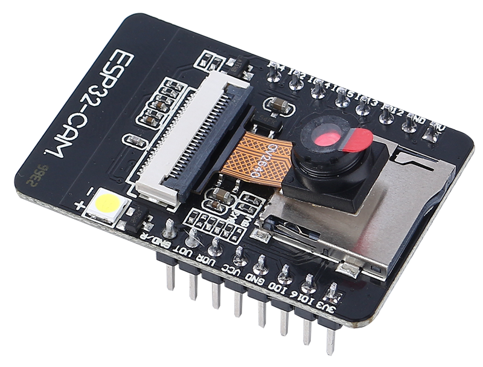

.. include:: /index.rst
   :start-after: start_hello_message
   :end-before: end_hello_message

マーズローバーのビジュアルシステムを探る - カメラとリアルタイム制御
==================================================================================

おかえりなさい、若き探検家の皆さん！レッスン10では、チルト機構を使ってマーズローバーに「うなずく」能力を装備しました。今回は、ローバーに「目」、つまりカメラを与える時です！

このスリリングな旅では、ローバーのカメラシステムのセットアップに飛び込みます。ローバーのカメラが捉えた映像をウェブページに中継し、ローバーが見ているものをリアルタイムで正確に見る方法を学びます。火星の風景をローバーの視点から体験する興奮を想像してみてください！

さらに興奮は続きます。SunFounder Controllerアプリも紹介します。このアプリを使うと、ローバーが移動する際の視界をライブで見ることができ、スマートフォンやタブレットから直接チルト機構を制御できます。画面内蔵のリモコンを持っているようなものです！

学習目標
------------------
* ESP32 CAMとのWi-Fi接続を確立する方法を理解します。
* ローバーが見ているものをリアルタイムで正確に見る方法を学びます。
* SunFounder Controllerアプリを使用して仮想リモコンを作成し、マーズローバーを制御する方法を学びます。

必要な材料
------------------------

* マーズローバーモデル（すべてのコンポーネントを装備）
* Arduino IDE
* コンピューター
* SunFounder Controllerアプリがインストールされたタブレットまたはスマートフォン

コースの手順
----------------------

**ステップ 1: ESP32 CAMの紹介**

前回の冒険では、ESP32 CAMを統合してマーズローバーに「目」を装備しました。今日は、それについてさらに学び、実際に「見る」ことができるようにします。

ESP32 CAMは、ローバーの目のように機能し、小型でありながら強力なモジュールです。Wi-FiとBluetooth機能を統合しているだけでなく、コンパクトなカメラも内蔵しています。このカメラは、ローバーが周囲の画像をキャプチャするのに役立ちます。

私たちが環境を観察するために目を使うのと同じように、ESP32 CAMはローバーの先に何があるかを「見て」、これらの視覚データをスマートフォンやコンピューターに送信できます。これにより、ローバーが見ているすべてをリアルタイムで見ることができます！

あたかもローバーを直接操縦し、ローバー自体だけでなく、探検している世界も観察しているかのようです！信じられないでしょう？それでは、さらに深く掘り下げてみましょう！

**ステップ 2: ローバーのカメラをプログラミングし、映像を表示する**

ESP32-CAMをローバーに取り付けた後、それに命を吹き込む必要があります。そのために、Arduino IDEを使用して、カメラを制御し、Wi-Fiに接続し、キャプチャした映像をストリーミングするプログラムを作成します。

方法は次のとおりです：

#. ``SunFounder AI Camera`` ライブラリをインストールします。

    * Arduino IDEの **ライブラリマネージャー** を開き、「SunFounder Camera」を検索して、 **INSTALL** をクリックします。

        .. image:: img/camera_install_lib.png

    * ライブラリの依存関係のインストールに関するポップアップウィンドウが表示されます。 **INSTALL ALL** をクリックし、プロセスが完了するまで待ちます。

        .. image:: img/camera_install_lib1.png

#. Arduino IDEで、以下のコードを入力します。

    コード内の変数 ``NAME``、``TYPE``、``PORT`` については、今は詳しく説明しません。これらは次のステップで重要になります。これらの変数が、マーズローバーからのリアルタイムビデオフィードを確立するための今後の旅で重要になることを覚えておいてください。

    .. raw:: html

        <iframe src=https://create.arduino.cc/editor/sunfounder01/06b648e4-23e8-4b28-accd-aac171069116/preview?embed style="height:510px;width:100%;margin:10px 0" frameborder=0></iframe>

    コードには2つの接続モードがあることに注意してください。 **APモード** と **STAモード** です。特定のニーズに基づいてどちらを使用するかを決定できます。

    * **APモード**: このモードでは、ローバーがホットスポット（コード内では ``GalaxyRVR`` という名前）を作成します。これにより、携帯電話、タブレット、ノートパソコンなどの任意のデバイスがこのネットワークに接続できます。これは、どのような状況でもローバーをリモートで制御したい場合に特に便利です。ただし、デバイスが一時的にインターネットに接続できなくなることに注意してください。

        .. code-block:: arduino

            // AP Mode
            #define WIFI_MODE WIFI_MODE_AP
            #define SSID "GalaxyRVR"
            #define PASSWORD "12345678"

    * **STAモード**: このモードでは、ローバーが自宅のWi-Fiネットワークに接続します。制御デバイス（携帯電話やタブレットなど）も同じWi-Fiネットワークに接続する必要があることに注意してください。このモードでは、ローバーを制御しながらデバイスの通常のインターネットアクセスを維持できますが、ローバーの動作範囲はWi-Fiのカバレッジエリアに制限されます。

        .. code-block:: arduino

            // STA Mode
            #define WIFI_MODE WIFI_MODE_STA
            #define SSID "YOUR SSID"
            #define PASSWORD "YOUR PASSWORD"

#. コードをローバーにアップロードして、ESP32 CAMに命を吹き込みましょう！

    * ESP32-CAMとArduinoボードは同じRX（受信）ピンとTX（送信）ピンを共有しています。そのため、コードをアップロードする前に、このスイッチを右側にスライドしてESP32-CAMを解放し、競合や潜在的な問題を回避する必要があります。

        .. image:: ../img/camera_upload.png
            :width: 600

    * コードが正常にアップロードされたら、スイッチを左側に戻してESP32 CAMを起動します。

        .. note::
            この手順と前の手順は、コードを再アップロードするたびに必要です。

        .. image:: img/camera_run.png
            :width: 600

    * **シリアルモニター** を開き、ボーレートを115200に設定します。情報が表示されない場合は、GalaxyRVRシールドの **リセットボタン** を押してコードを再度実行します。シリアルモニターの出力にIPアドレスが表示されるはずです。これがローバーのカメラがブロードキャストしているアドレスです。

        .. image:: img/camera_serial.png

    * それでは、実際にローバーが見ているものを見てみましょう！ウェブブラウザ（Google Chromeをお勧めします）を開き、シリアルモニターに表示されているURLを ``http://ip:9000/mjpg`` の形式で入力します。

        .. image:: img/camera_view.png

これで完了です！ローバーのカメラからのライブフィードを見ることができるはずです。本物のマーズローバー科学者のように、火星（あるいは自分のリビングルーム）をローバーの視点から見ていると思うと、素晴らしいと思いませんか？

これはほんの始まりに過ぎません。探求し学ぶべきことはまだたくさんあります。次のステップでは、ライブカメラフィードを見ながらローバーを制御する方法を探ります。わくわくしませんか？前進しましょう、探検家の皆さん！

