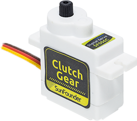
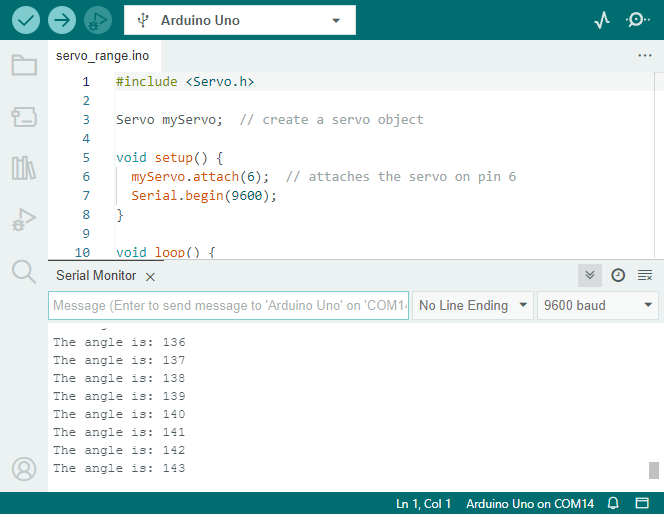


第10课：探索火星车视觉系统——舵机和倾斜机构
===================================================================================

欢迎回来，年轻的探索者们！在今天的冒险中，我们将深入探讨火星车视觉系统的迷人世界。
就像我们的眼睛和脖子协同工作帮助我们观察和导航周围环境一样，我们的火星车也需要一个类似的系统来
穿越危险的火星地貌。而这正是我们今天要构建的！

我们火星车的视觉系统有两个主要部分：一个充当其"眼睛"的摄像头，以及一个充当"脖子"的倾斜机构，
使其能够上下看。通过本课的学习，我们将赋予火星车"看"和"点头"的能力！

首先，我们将构建倾斜机构——一个将固定火星车摄像头并使其能够垂直旋转的装置。
就像给我们的火星车一个脖子，让它能够上下点动它的"头部"或摄像头！

接下来，我们将学习舵机，这个驱动我们倾斜机构的微小但强大的"肌肉"。
我们将了解它的工作原理以及如何通过Arduino编程进行控制。

就像我们的颈部肌肉移动头部使眼睛能获得更好的视野一样，舵机将驱动倾斜机构，使火星车的
摄像头能够更好地勘测火星地貌。

那么，系好安全带，探索者们，让我们开始为我们的火星车装备它自己的视觉系统的任务吧！

.. raw:: html

    <video width="600" loop autoplay muted>
        <source src="../_static/video/servo_range.mp4" type="video/mp4">
        您的浏览器不支持此视频标签。
    </video>

目标
----------------

* 练习在火星车模型上安装和操作倾斜机构。
* 理解舵机的工作原理和应用。
* 学习如何通过Arduino编程控制舵机运动。

材料
---------------

* Arduino UNO开发板
* 舵机
* 云台和摄像头
* 火星车模型（已配备TT电机、悬挂系统、超声波和红外避障模块、RGB LED灯带）
* Arduino IDE
* 计算机

步骤
-----------

**步骤1：什么是舵机？**

你有没有看过木偶戏？如果你看过，你可能惊叹于木偶师如何仅通过拉动一些绳子，就能让木偶的手臂、腿和头部如此顺畅地移动。在某种程度上，舵机就像我们的木偶师。

舵机是一种特殊类型的电机，它们不像轮子那样只是不停地旋转。相反，它们可以移动到一个特定的位置并保持该位置。想象你在玩"西蒙说"的游戏，西蒙说："把你的手臂举到90度角！"你能做到，对吧？这是因为，像舵机一样，你可以精确控制你的手臂移动多少。

* 棕色线：GND
* 橙色线：信号引脚，连接到主板的PWM引脚。
* 红线：VCC

就像你可以控制你的手臂移动到特定位置一样，我们可以使用舵机来控制项目中物体的精确位置。在我们的火星车中，我们将使用舵机来控制倾斜机构的上下运动，就像你可以上下点头一样。

在下一步中，我们将踏上进入舵机内部的迷人之旅，了解其工作原理。兴奋吗？让我们出发！

**步骤2：舵机是如何工作的？**

那么，舵机是如何施展它的魔法的呢？让我们踏上一段进入舵机内部的激动之旅！

如果我们窥视舵机内部，会看到几个部分。舵机的核心是一个普通电机，与驱动我们火星车轮子的电机非常相似。电机周围环绕着一个大齿轮，连接到电机轴上的一个小齿轮。这就是电机的快速圆周运动如何被转换为较慢但更强力的运动。

.. image:: img/servo_internal.png
    :align: center

但这不是让舵机特别的原因。魔力发生在一个叫做"电位器"的微型电子元件和"控制电路"中。它的工作原理是这样的：当舵机移动时，电位器转动并改变其电阻。控制电路测量这种电阻变化，并精确知道舵机所处的位置。很聪明，不是吗？

要控制舵机，我们发送一种特殊类型的信号，称为"脉宽调制"信号或PWM。通过改变这些脉冲的宽度，我们可以精确控制舵机移动多少并将其保持在那个位置。

在下一步中，我们将学习如何使用Arduino控制舵机。准备好以代码形式施展魔法了吗？让我们开始吧！

**步骤3：使用Arduino控制舵机**

好了，探索者们，既然我们知道舵机是如何工作的，让我们学习如何使用我们的魔杖——Arduino来控制它！

控制舵机就像给它指路一样。还记得我们之前提到的脉宽调制（PWM）信号吗？我们将用它们来告诉舵机移动到哪里。

幸运的是，Arduino通过一个内置库 ``Servo`` 使这项任务变得简单。使用这个库，我们可以创建一个 ``Servo`` 对象，将引脚附加到它（舵机连接的引脚），然后使用一个简单的命令 ``write()`` 来设置角度。

以下是代码片段：

.. code-block:: arduino

    #include <Servo.h>

    Servo myServo;  // create a servo object

    void setup() {
        myServo.attach(6);  // attaches the servo on pin 6
    }

    void loop() {
        myServo.write(90);  // tell servo to go to 90 degrees
    }

在这段代码中，``myServo`` 是我们的舵机对象，``attach(6)`` 告诉Arduino我们的舵机连接到引脚6，``write(90)`` 告诉舵机移动到90度。

做得好，探索者们！你刚刚学会了如何使用Arduino控制舵机。你也可以尝试不同的角度！

**步骤4：组装视觉系统**

你现在已经准备好组装我们火星车的视觉系统了。

.. note::

    * 将ESP32 CAM插入摄像头适配器时，注意其方向。它应与ESP32适配器正确对齐。

    .. image:: img/esp32_cam_direction.png
        :width: 300
        :align: center

.. raw:: html

    <iframe width="600" height="400" src="https://www.youtube.com/embed/h43JVI3xLqE?si=Q7-RvRvZOusK7vPo" title="YouTube video player" frameborder="0" allow="accelerometer; autoplay; clipboard-write; encrypted-media; gyroscope; picture-in-picture; web-share" allowfullscreen></iframe>

**步骤5：理解倾斜机构的限制**

尽管舵机设计为在0到180度之间旋转，但你可能会注意到它在超过某个点（比如150度后）就停止响应了。你有没有想过为什么会这样？让我们在下次冒险中一起探索这个谜团！

你能想象一只鸟试图过度弯曲脖子，以至于碰到自己的身体而无法再移动吗？我们火星车的倾斜机构面临类似的情况。当舵机将机构向下移动时，它可能会撞到火星车的车身，无法超过某个角度。

如果我们试图通过在代码中写入一个无法达到的角度来强制它超过这个点，我们的小舵机可能会卡住甚至损坏自己！我们不希望发生这种情况，对吧？那么，让我们通过一个小实验来了解它的运动限制。

我们使用for循环将舵机从0度旋转到180度，同时在串口监视器中记录角度。

.. raw:: html

    <iframe src=https://create.arduino.cc/editor/sunfounder01/848c7a3a-16b2-4a7e-8d66-bb91848bc6d9/preview?embed style="height:510px;width:100%;margin:10px 0" frameborder=0></iframe>

* ESP32-CAM和Arduino板共享相同的RX（接收）和TX（发送）引脚。因此，在上传代码之前，你需要先将此开关拨到右侧以释放ESP32-CAM，避免任何冲突或潜在问题。

    .. image:: ../img/camera_upload.png
        :width: 600

* 上传此代码后，打开 **串口监视器** 。如果没有显示信息，按下GalaxyRVR扩展板上的 **重置按钮** 重新运行代码。

* 你会看到舵机旋转，串口监视器将显示角度。

.. raw:: html

    <video width="600" loop autoplay muted>
        <source src="../_static/video/servo_range.mp4" type="video/mp4">
        您的浏览器不支持此视频标签。
    </video>

在我的火星车上，倾斜机构可以向上旋转到大约135°，然后碰到火星车车身，无法继续前进。

所以，探索者们，永远记住尊重你的火星车的极限，以保持其安全和正常运转！

**步骤6：分享与反思**

做得很好，探索者们！今天，你不仅为火星车搭建了一个倾斜机构，还了解了如何控制舵机来驱动它。这是我们的火星车任务向前迈出的一大步。

现在，让我们分享我们的经验并反思我们学到了什么。

在搭建倾斜机构或编程舵机时，你遇到了什么挑战吗？你是如何克服的？

请记住，我们克服的每一个挑战都让我们更聪明，让我们的火星车更好。所以不要犹豫，分享你的故事、想法和解决方案。你永远不知道，你的创新解决方案可能会帮助其他探索者的旅程！
