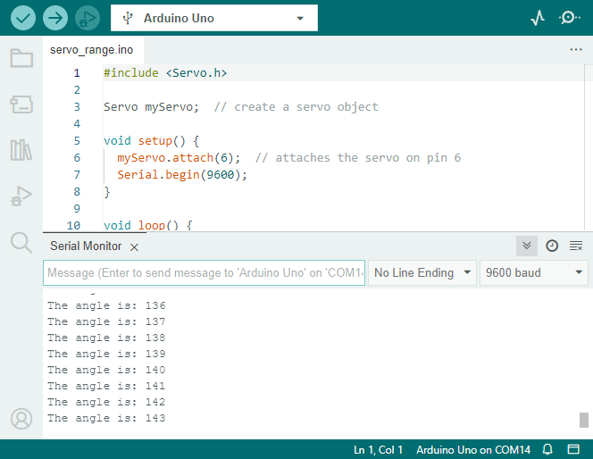

Lección 10: Sistema Visual del Rover — Cámara y Servo
==========================================================================================

Bienvenidos de nuevo, jóvenes exploradores. En la aventura de hoy, nos adentraremos en el fascinante mundo del sistema visual del Mars Rover.
Así como nuestros ojos y cuello trabajan juntos para ayudarnos a ver y navegar nuestro entorno, nuestro Rover también necesita un sistema similar para
navegar el traicionero paisaje marciano. ¡Y eso es exactamente lo que vamos a construir hoy!

El sistema visual de nuestro Rover tiene dos partes principales: una cámara que actúa como sus "ojos", y un mecanismo de inclinación que actúa como un
"cuello", permitiéndole mirar hacia arriba y hacia abajo. Al final de esta lección, le daremos a nuestro Rover la capacidad de "ver" y "asentir".

Primero, construiremos el mecanismo de inclinación —un dispositivo que sostendrá la cámara de nuestro Rover y le permitirá rotar verticalmente.
¡Es como darle un cuello a nuestro Rover, para que pueda mover su "cabeza" o cámara hacia arriba y hacia abajo!

A continuación, aprenderemos sobre el servo, el pequeño pero poderoso "músculo" que mueve nuestro mecanismo de inclinación.
Entenderemos cómo funciona y cómo podemos controlarlo utilizando programación con Arduino.

Así como los músculos de nuestro cuello mueven nuestra cabeza para que nuestros ojos puedan obtener una mejor vista, el servo moverá el mecanismo de
inclinación para que la cámara del Rover pueda explorar mejor el paisaje marciano.

¡Así que abróchense los cinturones, exploradores, comencemos nuestra misión para equipar a nuestro Rover con su propio sistema visual!

.. raw:: html

    <video width="600" loop autoplay muted>
        <source src="../_static/video/servo_range.mp4" type="video/mp4">
        Tu navegador no soporta la etiqueta de video.
    </video>

Objetivo
----------------

* Practicar la instalación y operación del mecanismo de inclinación en el modelo Mars Rover.
* Comprender los principios de funcionamiento y aplicación del servo.
* Aprender a controlar el movimiento del servo mediante programación con Arduino.

Materiales
---------------

* Placa de desarrollo Arduino UNO
* Servo
* Gimbal y cámara
* Modelo Mars Rover (ya equipado con motor TT, sistema de suspensión, módulos ultrasónico e infrarrojo de evitación de obstáculos, tira de LED RGB)
* Arduino IDE
* Computadora

Pasos
-----------

**Paso 1: ¿Qué es un Servo?**

¿Alguna vez has visto un espectáculo de títeres? Si es así, es posible que te hayas maravillado de cómo el titiritero puede hacer que los brazos, las piernas y la cabeza del títere se muevan tan suavemente, solo tirando de algunos hilos. En cierto modo, los servomotores son como nuestros titiriteros.

Los servomotores son un tipo especial de motores que no solo giran y giran como una rueda. En cambio, pueden moverse a una posición específica y mantener esa posición. Imagina que estás jugando a Simón dice, y Simón dice: "¡Levanta tu brazo a un ángulo de 90 grados!" Puedes hacerlo, ¿verdad? Eso es porque, como un servo, puedes controlar exactamente cuánto mover tu brazo.

.. image:: img/servo.png
    :align: center

* Línea marrón: GND
* Línea naranja: Pin de señal, conectar al pin PWM de la placa principal.
* Cable rojo: VCC

Así como puedes controlar tus brazos para moverlos a posiciones específicas, podemos usar servomotores para controlar la posición exacta de objetos en nuestros proyectos. En nuestro Mars Rover, usaremos un servo para controlar el movimiento hacia arriba y hacia abajo de nuestro mecanismo de inclinación, de la misma manera que puedes asentir con la cabeza.

En el siguiente paso, emprenderemos un fascinante viaje al interior de un servomotor para entender cómo funciona. ¿Emocionados? ¡Vamos!

**Paso 2: ¿Cómo Funciona un Servo?**

Entonces, ¿cómo hace un servo su magia? ¡Emprendamos un emocionante viaje al interior de un servo!

Si pudiéramos mirar dentro de un servo, veríamos algunas partes. En el corazón de un servo hay un motor normal, muy similar a los motores que hacen girar las ruedas de nuestro Mars Rover. Alrededor del motor, hay un engranaje grande que está conectado a un engranaje más pequeño en el eje del motor. Así es como el movimiento circular rápido del motor se transforma en un movimiento más lento pero más fuerte.

.. image:: img/servo_internal.png
    :align: center

Pero eso no es lo que hace especial a un servo. La magia ocurre en una pequeña pieza electrónica llamada "potenciómetro" y el "circuito de control". Así es como funciona: cuando el servo se mueve, el potenciómetro gira y cambia su resistencia. El circuito de control mide este cambio de resistencia y sabe exactamente en qué posición se encuentra el servo. ¿Ingenioso, verdad?

Para controlar un servo, le enviamos un tipo especial de señal llamada señal de "modulación por ancho de pulso" o PWM. Al cambiar el ancho de estos pulsos, podemos controlar exactamente cuánto se mueve el servo y mantenerlo en esa posición.

En el siguiente paso, aprenderemos cómo controlar un servo usando un Arduino. ¿Listos para algunos hechizos mágicos en forma de código? ¡Vamos!

**Paso 3: Controlando un Servo con Arduino**

Muy bien, exploradores, ahora que sabemos cómo funciona un servo, aprendamos a controlarlo usando nuestra varita mágica, ¡el Arduino!

Controlar un servo es como darle direcciones. ¿Recuerdan las señales de modulación por ancho de pulso (PWM) que mencionamos antes? Vamos a usarlas para decirle al servo hacia dónde moverse.

Afortunadamente, Arduino nos facilita esta tarea con una biblioteca incorporada llamada ``Servo``. Con esta biblioteca, podemos crear un objeto ``Servo``, asignarle un pin (el pin al que está conectado nuestro servo), y luego usar un comando simple, ``write()``, para establecer el ángulo.

Aquí hay un fragmento de cómo se ve el código:

.. code-block:: arduino

    #include <Servo.h>

    Servo myServo;  // create a servo object

    void setup() {
        myServo.attach(6);  // attaches the servo on pin 6
    }

    void loop() {
        myServo.write(90);  // tell servo to go to 90 degrees
    }

En este código, ``myServo`` es nuestro objeto Servo, ``attach(6)`` le dice al Arduino que nuestro servo está conectado al pin 6, y ``write(90)`` le indica al servo que se mueva a 90 grados.

¡Buen trabajo, exploradores! Acaban de aprender cómo controlar un servomotor con Arduino. ¡También pueden experimentar con diferentes ángulos!

**Paso 4: Ensamblar el Sistema Visual**

Ahora están listos para ensamblar el sistema visual de nuestro Rover.

.. note::

    * Al insertar la ESP32 CAM en el Adaptador de Cámara, ten en cuenta su orientación. Debe alinearse correctamente con el Adaptador ESP32.

    .. image:: img/esp32_cam_direction.png
        :width: 300
        :align: center

.. raw:: html

    <iframe width="600" height="400" src="https://www.youtube.com/embed/h43JVI3xLqE?si=Q7-RvRvZOusK7vPo" title="YouTube video player" frameborder="0" allow="accelerometer; autoplay; clipboard-write; encrypted-media; gyroscope; picture-in-picture; web-share" allowfullscreen></iframe>

**Paso 5: Comprendiendo los Límites del Mecanismo de Inclinación**

Aunque el servo está diseñado para girar entre 0 y 180 grados, puedes notar que deja de responder más allá de cierto punto (digamos después de 150 grados). ¿Alguna vez te has preguntado por qué sucede esto? ¡Exploremos este misterio juntos en nuestra próxima aventura!

¿Puedes imaginar un pájaro tratando de doblar su cuello tanto que golpea su propio cuerpo y no puede moverse más? El mecanismo de inclinación de nuestro Rover enfrenta una situación similar. A medida que el servo mueve el mecanismo hacia abajo, puede chocar con el cuerpo de nuestro Rover y no puede ir más allá de cierto ángulo.

Si tratamos de forzarlo a moverse más allá de este punto escribiendo un ángulo inalcanzable en nuestro código, nuestro pequeño pajarito servo puede atascarse e incluso dañarse. ¡No queremos que eso suceda, verdad? Entonces, comprendamos sus limitaciones de movimiento con un pequeño experimento.

Usamos un bucle for para rotar el servo de 0 a 180 grados mientras registramos el ángulo en el Monitor Serie.

.. raw:: html

    <iframe src=https://create.arduino.cc/editor/sunfounder01/848c7a3a-16b2-4a7e-8d66-bb91848bc6d9/preview?embed style="height:510px;width:100%;margin:10px 0" frameborder=0></iframe>

* La ESP32-CAM y la placa Arduino comparten los mismos pines RX (recepción) y TX (transmisión). Por lo tanto, antes de cargar el código, primero deberás liberar la ESP32-CAM deslizando este interruptor hacia el lado derecho para evitar conflictos o problemas potenciales.

    .. image:: ../img/camera_upload.png
        :width: 600

* Después de cargar este código, abre el **Monitor Serie**. Si no aparece información, presiona el **Botón de Reinicio** en el shield GalaxyRVR para ejecutar el código nuevamente.

* Verás el servo girar, y el Monitor Serie mostrará el ángulo.

.. raw:: html

    <video width="600" loop autoplay muted>
        <source src="../_static/video/servo_range.mp4" type="video/mp4">
        Tu navegador no soporta la etiqueta de video.
    </video>

En mi Rover, el mecanismo de inclinación podía llegar hasta aproximadamente 135° antes de golpear el cuerpo del Rover y no podía avanzar más.

¡Así que, exploradores, recuerden siempre respetar los límites de su rover para mantenerlo seguro y funcionando!

**Paso 6: Compartir y Reflexionar**

¡Bien hecho, exploradores! Hoy, no solo han construido un mecanismo de inclinación para su Rover, sino que también han comprendido cómo controlar un servo para moverlo. Eso es un gran paso adelante en nuestra misión del Mars Rover.

Ahora, compartamos nuestras experiencias y reflexionemos sobre lo que hemos aprendido.

¿Encontraron algún desafío al configurar el mecanismo de inclinación o programar el servo? ¿Cómo lo superaron?

Recuerden, cada desafío que superamos nos hace más inteligentes y mejora nuestro Rover. Así que no duden en compartir sus historias, ideas y soluciones. ¡Nunca se sabe, su solución innovadora podría ayudar a un compañero explorador en su viaje!
