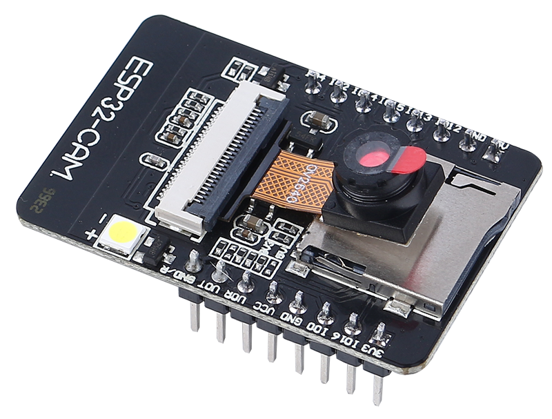

.. note::

    Hello, welcome to the SunFounder Raspberry Pi & Arduino & ESP32 Enthusiasts Community on Facebook! Dive deeper into Raspberry Pi, Arduino, and ESP32 with fellow enthusiasts.

    **Why Join?**

    - **Expert Support**: Solve post-sale issues and technical challenges with help from our community and team.
    - **Learn & Share**: Exchange tips and tutorials to enhance your skills.
    - **Exclusive Previews**: Get early access to new product announcements and sneak peeks.
    - **Special Discounts**: Enjoy exclusive discounts on our newest products.
    - **Festive Promotions and Giveaways**: Take part in giveaways and holiday promotions.

    👉 Ready to explore and create with us? Click [|link_sf_facebook|] and join today!

Lesson 11: Exploring the Mars Rover Visual System - Camera and Real-time Control
==================================================================================

Welcome back, young explorers! In the last lesson, we equipped our Mars Rover with the ability to "nod" using a tilt mechanism. Now, it's time to give our Rover "eyes" - the camera!

In this thrilling journey, we'll dive into the setup of the Rover's camera system. You'll learn how to relay the visuals captured by the Rover's camera to a web page, so you can see exactly what the Rover sees, in real time. Imagine the excitement of experiencing the Martian landscape from the Rover's perspective!

The excitement continues as we also introduce the SunFounder Controller app. This application allows us to get a live feed of the Rover's view as it navigates around, and we can control the tilt mechanism directly from our smartphones or tablets. It's like having a remote control with a built-in screen! 

Learning Goals
------------------
* Understand how to establish a WiFi connection with the ESP32 CAM.
* Learn how to see exactly what the Rover sees, in real time.
* Learn how to use the SunFounder Controller app to create a virtual remote and control the Mars Rover.

Materials needed
------------------------

* Mars Rover model (equipped with all components)
* Arduino IDE
* Computer
* Tablet or smartphone with SunFounder Controller app installed

Course Steps
----------------------

**Step 1: Introduction to ESP32 CAM**

In our previous adventure, we have equipped our Mars Rover with a pair of "eyes" by integrating the ESP32 CAM. Today, we're going to learn more about it and actually make it "see".

The ESP32 CAM, acting like the eyes of our Rover, is a small yet powerful module. Not only does it integrate Wi-Fi and Bluetooth functionalities, it also comes with a compact camera. This camera helps our Rover capture images of its surroundings.

Just like we use our eyes to observe our environment, the ESP32 CAM can "see" what lies ahead for the Rover, then send these visual data to our smartphone or computer. This allows us to see everything the Rover sees in real-time!

It's as if we're piloting the Rover directly, observing not just the Rover itself, but also the world it explores! Incredible, isn't it? So, let's dive deeper into it...

**Step 2: Programming the Rover's Camera and Viewing the Feed**

After fitting the ESP32-CAM to our Rover, we now need to breathe life into it. 
To do so, we will use the Arduino IDE to write a program that will control the camera, allow it to connect to WiFi, 
and stream the visuals it captures. 

Here's how we can do it:

#. Install the ``SunFounder AI Camera`` library.

    * Open the Arduino IDE's **Library Manager**, search for "SunFounder Camera", and click **INSTALL**.

        .. image:: img/camera_install_lib.png

    * A pop-up window will appear for the installation of library dependencies. Click **INSTALL ALL** and wait for the process to complete.

        .. image:: img/camera_install_lib1.png

#. In the Arduino IDE, input the following code.

    Regarding the variables ``NAME``, ``TYPE``, and ``PORT`` in the code, let's not delve into them at this point. They will come into play in our next step. Just keep in mind that these variables will be important in our upcoming journey to establish a real-time video feed from our Mars Rover.

    .. raw:: html

        <iframe src=https://create.arduino.cc/editor/sunfounder01/06b648e4-23e8-4b28-accd-aac171069116/preview?embed style="height:510px;width:100%;margin:10px 0" frameborder=0></iframe>

    Notice we have two connection modes in the code - **AP** mode and **STA** mode. You can decide which one to use based on your specific needs.

    * **AP Mode**: In this mode, the Rover creates a hotspot (named as ``GalaxyRVR`` in our code). This allows any device like a mobile phone, tablet, or laptop to connect to this network. This is especially useful when you want to control the Rover remotely under any circumstances. However, note that this would make your device temporarily unable to connect to the Internet.

        .. code-block:: arduino

            // AP Mode
            #define WIFI_MODE WIFI_MODE_AP
            #define SSID "GalaxyRVR"
            #define PASSWORD "12345678"

    * **STA Mode**: In this mode, the Rover connects to your home WiFi network. Remember that your controlling device (like a mobile phone or tablet) should also be connected to the same WiFi network. This mode allows your device to keep its regular internet access while controlling the Rover, but limits the Rover's operational range to your WiFi coverage area.

        .. code-block:: arduino

            // STA Mode
            #define WIFI_MODE WIFI_MODE_STA
            #define SSID "YOUR SSID"
            #define PASSWORD "YOUR PASSWORD"

#. Upload the code to our Rover and bring our ESP32 CAM to life!

    * The ESP32-CAM and the Arduino board share the same RX (receive) and TX (transmit) pins. So, before uploading the code, you’ll need to first release the ESP32-CAM by slide this switch to right side to avoid any conflicts or potential issues.

        .. image:: ../img/camera_upload.png
            :width: 600

    * Once the code has been uploaded successfully, switch it back to the left side to start the ESP32 CAM.

        .. note::
            This step and the previous one are required every time you re-upload the code.

        .. image:: img/camera_run.png
            :width: 600
        
    * Open the **Serial Monitor** and set the baud rate to 115200. If no information appears, press the **Reset button** on the GalaxyRVR shield to run the code again. You should see an IP address in the serial monitor output. This is the address your Rover's camera is broadcasting to.

        .. image:: img/camera_serial.png

    * Now, it's time to actually see what our Rover sees! Open up a web browser - we recommend Google Chrome - and enter the URL you see in the Serial Monitor, in the format ``http://ip:9000/mjpg``.

        .. image:: img/camera_view.png

And voila! You should now be able to see the live feed from your Rover's camera. Isn't it amazing to think that you are viewing Mars (or maybe just your living room) from the Rover's perspective? Just like a real Mars Rover scientist!

Remember, this is just the beginning. There is so much more to explore and learn. In our next step, we will explore how to control our Rover while viewing the live camera feed. Exciting, isn't it? Onwards, explorers!

