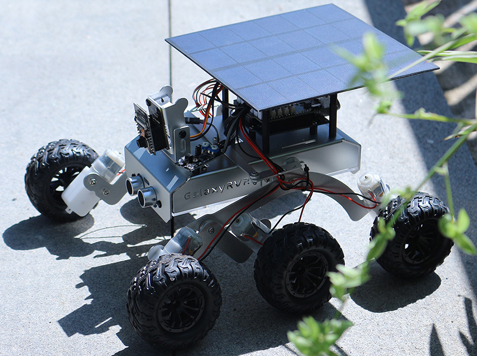
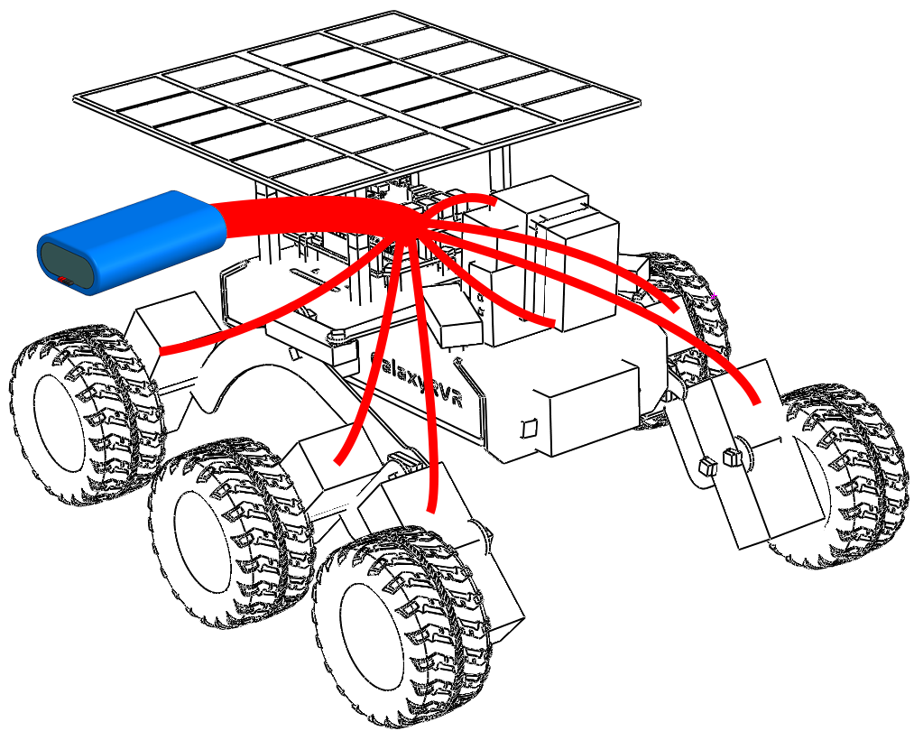
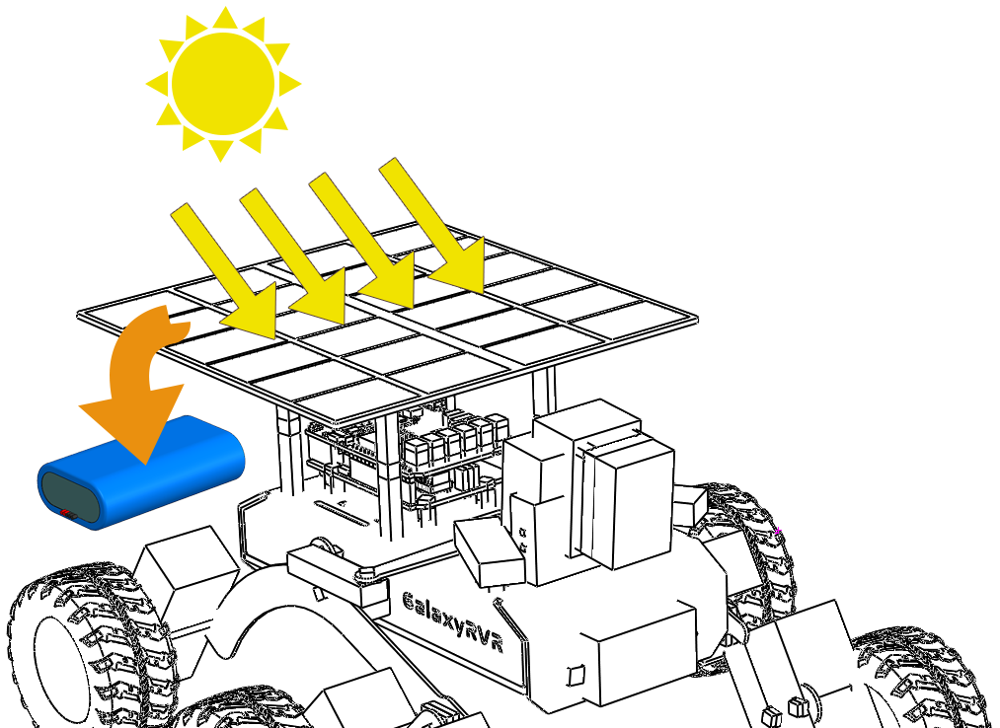

第12课：探索火星车能源系统
=================================================================

欢迎来到我们火星车探索之旅的最后一课。这次，我们将深入探索火星车的心脏——它的能源系统。

当我们考虑探索像火星这样的遥远行星时，最关键的方面之一就是能源。
这些火星车如何在如此恶劣和遥远的环境中为自己供电？
在本课中，我们将探索这个迷人的话题，并学习像我们的火星车模型这样的火星车如何利用和管理能源。

我们将研究电池和太阳能板的工作原理，甚至亲自动手在我们的火星车模型上安装和
使用这些电源。此外，我们将更上一层楼，使用Arduino来监测
电池电量。

学习目标
-----------------------

* 理解电池和太阳能板的工作原理。
* 练习在火星车模型上安装太阳能板。
* 学习如何使用Arduino监测电池电量和太阳能板的充电状态。

所需材料
------------------------

* 火星车模型（配备所有组件，除太阳能板和底板外）
* 太阳能板和底板
* Arduino IDE
* 计算机

课程步骤
----------------------

**步骤1：火星车能源系统简介**

就像我们的身体需要持续的能量供应才能运作一样，我们的火星车需要一种储存和产生电力的方式来执行探索任务。把火星车的能源系统想象成我们身体里的心脏。就像我们的心脏将血液泵送到身体的所有部位，供应必要的氧气和营养一样，火星车的能源系统持续将能量输送到火星车的每个部分，确保其能顺利执行任务。

这个能源系统的主要组件是电池和太阳能板，它们协同工作，确保火星车无论白天还是黑夜都能持续运行。

电池在火星车能源系统中的作用类似于我们身体中能量储存的角色。就像我们需要储存能量以供活动时使用一样，火星车需要一种储存能量的方式来执行探索任务。储存在电池中的能量被持续输送到火星车的各个部分，使其能够有条不紊地执行任务。

但是，当电池中的能量耗尽时会发生什么？它如何补充能量储备？这就是太阳能板发挥作用的地方。

就像树木吸收阳光进行光合作用制造食物一样，我们的火星车使用太阳能板利用太阳的能量，将其转换为电能储存在电池中供使用。每个太阳能板由许多更小的太阳能电池组成。这些电池由一种能将光转换为电的材料制成——这个过程称为光伏效应。当阳光照射到电池上时，它们会产生电流，可以立即使用或储存在火星车的电池中供以后使用。

然而，在火星上利用太阳能并非听起来那么容易。沙尘暴会减少照射到太阳能板上的阳光量，而火星上较弱的阳光（与地球相比）意味着太阳能板产生的功率比在地球上少。尽管有这些挑战，太阳能仍然是驱动我们火星车最实用和最高效的方式。

但是，我们如何知道太阳能板是否在工作，以及电池何时电量不足？这就是我们的Arduino发挥作用的地方。在下一节中，我们将学习如何使用Arduino监测火星车电池的充放电状态。

**步骤2：在火星车上安装太阳能板**

在开始这一步之前，我们需要准备好火星车模型、太阳能板以及将太阳能板连接到火星车电源系统所需的电缆。

这是一个将理论付诸实践的过程，让我们真正体会科学、技术、工程和数学（STEM）教育的魅力。让我们开始吧！

.. raw:: html

    <iframe width="600" height="400" src="https://www.youtube.com/embed/-Vj-dcniFrA" title="YouTube video player" frameborder="0" allow="accelerometer; autoplay; clipboard-write; encrypted-media; gyroscope; picture-in-picture; web-share" allowfullscreen></iframe>

**步骤3：通过编程监测电池电压和电量**

现在我们已经将太阳能板安装到火星车模型上，下一步是通过编程监测电池的电压和电量。

.. raw:: html

    <iframe src=https://create.arduino.cc/editor/sunfounder01/2e85e234-9575-4a1f-982b-2f9aba8e3156/preview?embed style="height:510px;width:100%;margin:10px 0" frameborder=0></iframe>

这段代码创建了一个简单的电池监测器，这在电源管理至关重要的应用中（如火星车）特别有用。它允许你监测电池的状态，帮助你了解何时需要为火星车充电，或者何时应安排耗电任务。

让我们来分解这段代码的不同部分：

* 这一行定义 ``BATTERY_PIN`` 为模拟引脚A3，从这里读取电池电压。

    .. code-block:: arduino

        #define BATTERY_PIN A3

* 这个函数计算电池的电压。它首先从 ``BATTERY_PIN`` 读取模拟值，然后将其转换为电压。由于Arduino的模拟-数字转换器（ADC）在0-1023的范围内工作，我们将原始读数除以1023。然后乘以5（Arduino的参考电压）和2（假设分压器为2），将其转换为电压读数。

    .. code-block:: arduino
        :emphasize-lines: 5

        float batteryGetVoltage() {
            // Reads the analog value from the battery pin
            int adcValue = analogRead(BATTERY_PIN);
            // Converts the analog value to voltage
            float adcVoltage = adcValue / 1023.0 * 5 * 2;
            // Rounds the voltage to two decimal places
            float batteryVoltage = int(adcVoltage * 100) / 100.0;
            return batteryVoltage;
        }

    来自Arduino模拟-数字转换器的原始ADC读数除以1023转换为分数，然后乘以5转换为电压，因为Arduino使用5伏参考电压。

    然而，由于电池电压高于Arduino的最大输入电压，使用了一个电阻来保护Arduino。因此，我们将ADC电压乘以2来抵消电阻的影响，获得正确的电池电压。

* 这个函数根据电压计算电池的电量百分比。它使用 ``map`` 函数将电压值（范围6.6至8.4伏）映射到百分比（范围0至100）。

    .. code-block:: arduino

        uint8_t batteryGetPercentage() {
            float voltage = batteryGetVoltage();  // Gets the battery voltage
            // Maps the voltage to a percentage.
            int16_t temp = map(voltage, 6.6, 8.4, 0, 100);
            // Ensures the percentage is between 0 and 100
            uint8_t percentage = max(min(temp, 100), 0);
            return percentage;
        }

**步骤4：测试火星车能源系统——室内和室外运行**

完成了电池监测系统的编码后，现在是时候让火星车行动起来了。
首先将火星车充满电，然后计划两次30分钟的探索任务——一次在室内，
另一次在室外的阳光下。记录每次任务开始前的初始电池电量，
并与每次测试结束时的电池百分比进行比较。
下表是一个有用的模板，用于记录你的发现：

.. list-table:: 电源测试
   :widths: 50 25 25
   :header-rows: 1

   * -
     - 阳光下
     - 室内
   * - 起始电池百分比
     -
     -
   * - 结束电池百分比
     -
     -

观察每次测试后电池电量的差异。火星车在室外阳光下运行时的电池持续时间是否更长？从这个观察中，我们可以得出关于太阳能板功效的什么结论？

理解这些差异将帮助我们更好地理解太阳能如何有效地为火星车供电，甚至在像火星表面那样的偏远恶劣环境中也能如此。

**步骤5：反思**

通过这节课，我们重点理解了能源系统在火星车中的关键作用，以及监测火星车剩余能量的机制。基于太阳能板的能源系统不仅为火星车提供动力，还强调了可再生能源在太空探索中的重要性。

利用你现在掌握的知识，思考这个系统在现实中的应用。考虑太阳能系统在火星上可能遇到的挑战。极端温度、沙尘暴或长时间的黑暗会如何影响能源供应？你能提出什么解决方案来应对这些障碍？

**步骤6：展望未来**

既然我们已经赋予了火星车移动的能力，是时候让它开始探索之旅了！你可以让它在各种模拟火星环境的地形中漫游。

例如，你可以让它爬过一堆石头。

.. raw:: html

   <video width="600" loop autoplay muted>
      <source src="../_static/video/move_stone.mp4" type="video/mp4">
      您的浏览器不支持此视频标签。
   </video>

或者让它穿过茂密的草丛。

.. raw:: html

   <video width="600" loop autoplay muted>
      <source src="../_static/video/move_grass.mp4" type="video/mp4">
      您的浏览器不支持此视频标签。
   </video>

或者让它在布满石头的砾石地形上行驶。

.. raw:: html

   <video width="600" loop autoplay muted>
      <source src="../_static/video/move_stone1.mp4" type="video/mp4">
      您的浏览器不支持此视频标签。
   </video>

然而，请注意，如果障碍物太高，火星车可能无法爬过去。

.. raw:: html

   <video width="400" height="400" loop autoplay muted>
      <source src="../_static/video/move_failed.mp4" type="video/mp4">
      您的浏览器不支持此视频标签。
   </video>

这些不同的地形给火星车带来了独特的挑战，就像真实的火星车所面临的一样。当你看着你的火星车试图克服这些障碍时，你正在体验NASA的科学家和工程师在向火星发射火星车时所经历的一小部分！

在我们结束火星车课程之际，反思我们所学到的东西很重要。我们希望这段旅程不仅扩展了你的知识和技能，还激发了好奇心和探索欲。无论你的火星车是在后院漫游，还是在你的想象中驰骋广阔天地，沿途的发现一定会是非凡的。
