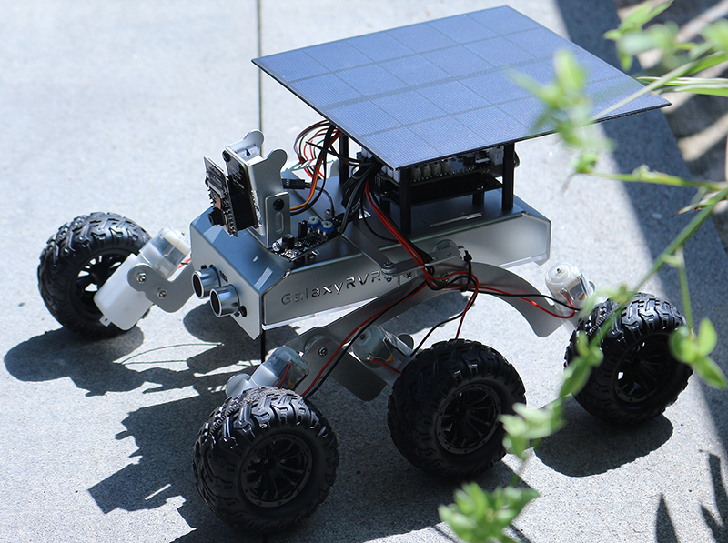
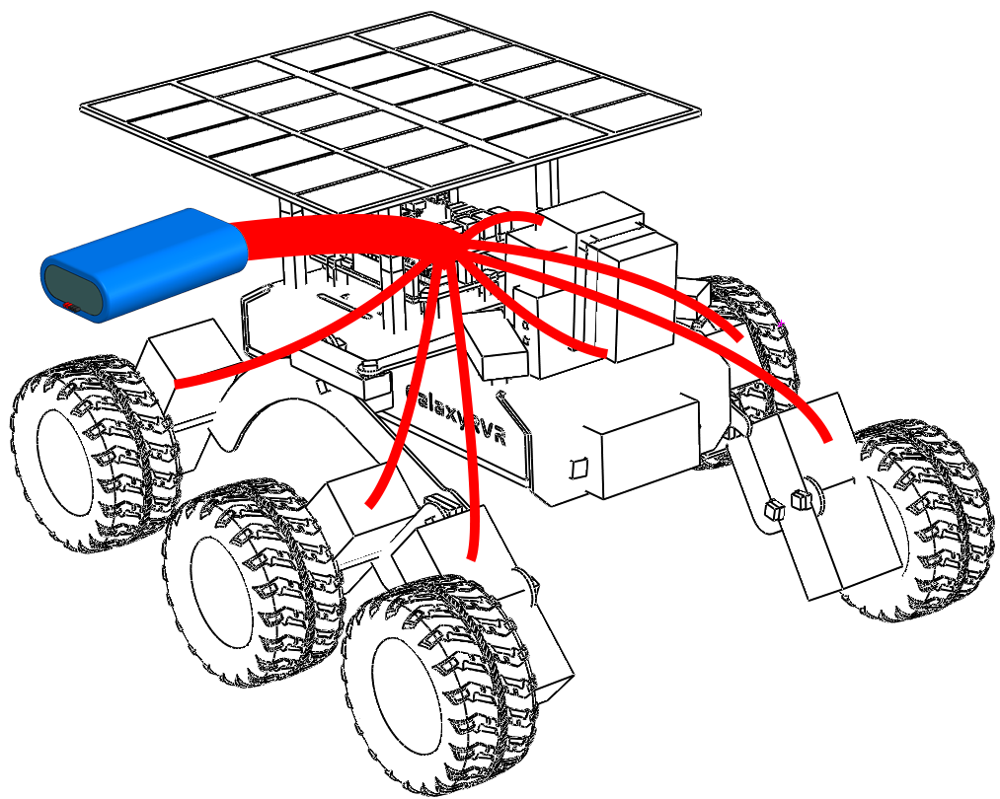
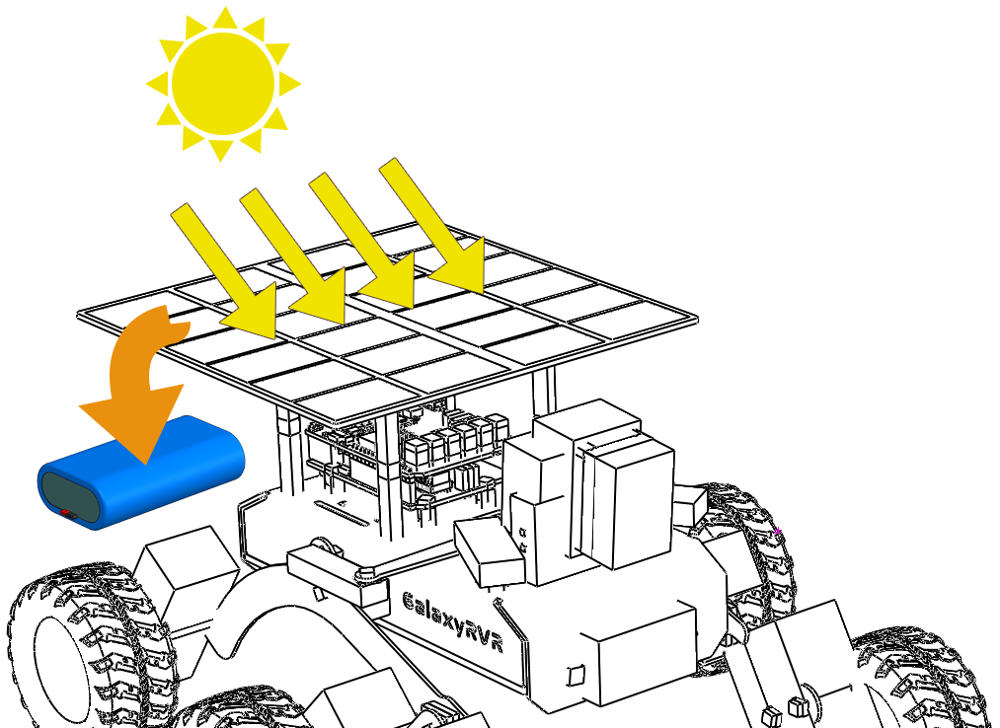

.. include:: /index.rst
   :start-after: start_hello_message
   :end-before: end_hello_message

レッスン 12: マーズローバーのエネルギーシステムを調査する
=================================================================

火星ローバー探検の旅の最終レッスンへようこそ。今回は、ローバーの心臓部であるエネルギーシステムに深く飛び込みます。

火星のような遠く離れた惑星の探検を考えるとき、最も重要な考慮事項の1つはエネルギーです。これらのローバーは、過酷で遠隔の環境でどのようにして動力を得ているのでしょうか？このレッスンでは、この魅力的なトピックを探求し、私たちの火星ローバーモデルのようなローバーがどのようにエネルギーを利用し管理するかを学びます。

バッテリーとソーラーパネルの動作原理を調査し、ローバーモデルにこれらの電源を取り付けて使用する実際の練習も行います。さらに、Arduinoを使用してバッテリーレベルを監視することで、スキルを一段階上のレベルに引き上げます。

学習目標
-----------------------

* バッテリーとソーラーパネルの動作原理を理解します。
* マーズローバーモデルにソーラーパネルを取り付ける練習をします。
* Arduinoを使用してバッテリーレベルとソーラーパネルの充電状態を監視する方法を学びます。

必要な材料
------------------------

* マーズローバーモデル（ソーラーパネルと底板を除くすべてのコンポーネントを装備）
* ソーラーパネルと底板
* Arduino IDE
* コンピューター

コースの手順
----------------------

**ステップ 1: マーズローバーのエネルギーシステムの紹介**

私たちの体が機能するために絶え間ないエネルギー供給を必要とするのと同様に、マーズローバーも探査ミッションのために電力を蓄え、生成する方法が必要です。ローバーのエネルギーシステムを私たちの体の心臓のように想像してみてください。心臓が全身に血液を送り出し、必要な酸素と栄養素を供給するように、ローバーのエネルギーシステムはローバーのすべての部分にエネルギーを流し続け、タスクをスムーズに実行できるようにします。

このエネルギーシステムの主要コンポーネントは、バッテリーとソーラーパネルであり、これらが連携してローバーが昼夜を問わず常に動作できるようにします。

ローバーのエネルギーシステムにおけるバッテリーの役割は、私たちの体におけるエネルギー貯蔵の役割と似ています。活動時に使用するためにエネルギーを蓄える必要があるのと同様に、ローバーも探査ミッションのためにエネルギーを蓄える方法が必要です。バッテリーに蓄えられたエネルギーは、ローバーのさまざまな部分に継続的に送られ、系統的にタスクを実行できるようにします。

しかし、バッテリーのエネルギーが切れたらどうなるでしょうか？どのようにしてエネルギー貯蔵を補充するのでしょうか？ここでソーラーパネルが登場します。

木々が光合成のために日光を吸収して栄養を作り出すのと同様に、マーズローバーはソーラーパネルを使用して太陽からエネルギーを利用し、それを電気に変換してバッテリーに貯蔵します。各ソーラーパネルは、多くの小さな太陽電池で構成されています。これらのセルは、光を電気に変換できる材料で構成されています。これは光起電力効果と呼ばれるプロセスです。太陽光がセルに当たると、電流が発生し、すぐに使用するか、ローバーのバッテリーに貯蔵して後で使用できます。

しかし、火星で太陽エネルギーを利用することは、聞こえほど簡単ではありません。砂嵐によってパネルに届く太陽光の量が減少する可能性があり、また火星の太陽光は（地球と比較して）弱いため、パネルが地球上で発電するよりも少ない電力しか生成できません。これらの課題にもかかわらず、太陽光発電は依然としてマーズローバーに電力を供給する最も実用的で効率的な方法です。

しかし、ソーラーパネルが機能しているときや、バッテリーの残量が少なくなっているときは、どのようにしてわかるのでしょうか？ここでArduinoの出番です。次のセクションでは、Arduinoを使用してローバーのバッテリーの充電と放電を監視する方法を学びます。

**ステップ 2: マーズローバーにソーラーパネルを取り付ける**

このステップを始める前に、マーズローバーモデル、ソーラーパネル、およびソーラーパネルをローバーの電源システムに接続するために必要なケーブルを用意する必要があります。

これは、理論を実践に移し、科学、技術、工学、数学（STEM）教育の魅力を真に理解するためのプロセスです。始めましょう！

.. raw:: html

    <iframe width="600" height="400" src="https://www.youtube.com/embed/-Vj-dcniFrA" title="YouTube video player" frameborder="0" allow="accelerometer; autoplay; clipboard-write; encrypted-media; gyroscope; picture-in-picture; web-share" allowfullscreen></iframe>

**ステップ 3: バッテリー電圧と充電を監視するプログラミング**

マーズローバーモデルにソーラーパネルを取り付けたので、次のステップはプログラミングを通じてバッテリーの電圧と充電を監視することです。

.. raw:: html

    <iframe src=https://create.arduino.cc/editor/sunfounder01/2e85e234-9575-4a1f-982b-2f9aba8e3156/preview?embed style="height:510px;width:100%;margin:10px 0" frameborder=0></iframe>

このコードは、効果的にシンプルなバッテリーモニターを作成します。これは、電力管理が重要であるマーズローバーのようなアプリケーションで特に役立ちます。バッテリーの状態を監視し、ローバーをいつ充電する必要があるか、またはいつ電力消費タスクをスケジュールすべきかを理解するのに役立ちます。

それでは、このコードのさまざまな部分を詳しく見ていきましょう：

* この行は、``BATTERY_PIN`` をアナログピンA3として定義しています。ここからバッテリー電圧が読み取られます。

    .. code-block:: arduino

        #define BATTERY_PIN A3

* この関数はバッテリーの電圧を計算します。まず ``BATTERY_PIN`` からアナログ値を読み取り、それを電圧に変換します。Arduinoのアナログ-デジタルコンバーター（ADC）は0〜1023のスケールで動作するため、生の読み取り値を1023で割ります。次に5（Arduinoの基準電圧）を掛け、さらに2（分圧器が2であると仮定）を掛けて、これを電圧読み取り値に変換します。

    .. code-block:: arduino
        :emphasize-lines: 5

        float batteryGetVoltage() {
            // Reads the analog value from the battery pin
            int adcValue = analogRead(BATTERY_PIN);
            // Converts the analog value to voltage
            float adcVoltage = adcValue / 1023.0 * 5 * 2;
            // Rounds the voltage to two decimal places
            float batteryVoltage = int(adcVoltage * 100) / 100.0;
            return batteryVoltage;
        }

    Arduinoのアナログ-デジタルコンバーターからの生のADC読み取り値を1023で割って分数に変換し、次に5を掛けて電圧に変換します。これはArduinoが5ボルトの基準電圧を使用するためです。

    ただし、バッテリー電圧はArduinoの最大入力電圧よりも高いため、Arduinoを保護するために抵抗が使用されています。そのため、ADC電圧に2を掛けて抵抗の影響を打ち消し、正しいバッテリー電圧を取得します。

* この関数は、電圧に基づいてバッテリーの充電率（パーセント）を計算します。``map`` 関数を使用して、電圧値（6.6〜8.4ボルトの範囲）をパーセンテージ（0〜100の範囲）にマッピングします。

    .. code-block:: arduino

        uint8_t batteryGetPercentage() {
            float voltage = batteryGetVoltage();  // Gets the battery voltage
            // Maps the voltage to a percentage.
            int16_t temp = map(voltage, 6.6, 8.4, 0, 100);
            // Ensures the percentage is between 0 and 100
            uint8_t percentage = max(min(temp, 100), 0);
            return percentage;
        }

**ステップ 4: マーズローバーのエネルギーシステムをテストする - 屋内と屋外での走行**

バッテリー監視システムのコーディングが完了したので、マーズローバーを実際に動かしてみましょう。ローバーを満充電にして、2回の30分間の探索ミッションを計画します。1回は屋内、もう1回は日差しのある屋外です。各ミッションの前に初期バッテリーレベルを記録し、各テストの終了時のバッテリー残量と比較します。次の表は、結果を記録するための便利なテンプレートです：

.. list-table:: 電力テスト
   :widths: 50 25 25
   :header-rows: 1

   * -
     - 日向
     - 室内
   * - 開始時バッテリー残量
     -
     -
   * - 終了時バッテリー残量
     -
     -

各テスト後のバッテリーレベルの差を観察してください。屋外の日差しの下でローバーのバッテリーは長持ちしましたか？この観察から、ソーラーパネルの効果についてどのような結論が得られますか？

これらの差異を理解することで、火星表面のような遠隔で過酷な環境でも、太陽エネルギーがどのようにマーズローバーに効果的に電力を供給できるかをよりよく理解するのに役立ちます。

**ステップ 5: 振り返り**

このレッスンを通じて、マーズローバーにおけるエネルギーシステムの重要な役割と、ローバーの残存エネルギーを監視するメカニズムの理解に焦点を当ててきました。ソーラーパネルベースのエネルギーシステムは、ローバーに電力を供給するだけでなく、宇宙探査における再生可能エネルギー源の重要性を強調しています。

今得た知識をもとに、このシステムの現実世界での影響について考えてみてください。火星で太陽エネルギーシステムが直面する可能性のある課題を考慮してください。極端な温度、砂嵐、長時間の暗闇はエネルギー供給にどのような影響を与えるでしょうか？これらの障害に取り組むためにどのような解決策を提案できますか？

**ステップ 6: 今後の展望**

マーズローバーに移動能力を与えたので、探検の旅を始めましょう！火星環境を模したさまざまな地形を探索させることができます。

たとえば、石の山を乗り越えさせることができます。

.. raw:: html

   <video width="600" loop autoplay muted>
      <source src="../_static/video/move_stone.mp4" type="video/mp4">
      お使いのブラウザはこのビデオタグをサポートしていません。
   </video>

または、厚い草むらを進ませることもできます。

.. raw:: html

   <video width="600" loop autoplay muted>
      <source src="../_static/video/move_grass.mp4" type="video/mp4">
      お使いのブラウザはこのビデオタグをサポートしていません。
   </video>

あるいは、石だらけの砂利の地形をコースに設定することもできます。

.. raw:: html

   <video width="600" loop autoplay muted>
      <source src="../_static/video/move_stone1.mp4" type="video/mp4">
      お使いのブラウザはこのビデオタグをサポートしていません。
   </video>

ただし、障害物が高すぎる場合、ローバーはそれを乗り越えられない可能性があることに注意してください。

.. raw:: html

   <video width="400" height="400" loop autoplay muted>
      <source src="../_static/video/move_failed.mp4" type="video/mp4">
      お使いのブラウザはこのビデオタグをサポートしていません。
   </video>

これらの多様な地形は、実際のマーズローバーと同様に、ローバーに固有の課題をもたらします。ローバーがこれらの障害を克服しようとする様子を見ていると、NASAの科学者やエンジニアがローバーを火星に送るときに経験することの一端を体験しています！

マーズローバーのレッスンを締めくくるにあたり、学んだことを振り返ることが重要です。この旅が皆さんの知識とスキルを広げただけでなく、好奇心と探求心を刺激したことを願っています。ローバーが裏庭を探検しようと、想像力の広大な広がりを横断しようと、途中で行う発見はきっと素晴らしいものになるでしょう。
