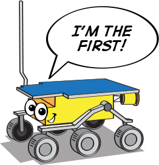
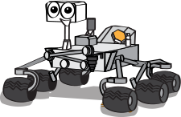

第1课 揭开火星车的神秘面纱
========================================

欢迎来到第1课：了解火星车。今天，我们将深入探索火星车的激动人心世界——这些是人类在红色星球上的远程探测器。我们将了解它们的演变过程、功能以及它们所代表的科技奇迹。此外，你将发挥创造力设计自己的火星车，并通过阐述你的独特设计来锻炼演讲技巧。准备好从你的教室探索火星吧！

学习目标
-------------------------
* 了解火星车的演变过程和目的
* 通过设计自己的火星车表达创造力
* 通过分享和解释你的火星车设计来提升演讲技巧

所需材料
-----------
* 火星车图片和技术规格，供参考
* 关于火星车历史的纪录片视频
* 用于研究和观看纪录片的联网计算机
* 用于授课的演示幻灯片或交互式白板
* 用于火星车设计活动的绘图纸、铅笔和着色材料
* 用于引导式笔记、反思和设计规划的工作表

步骤
--------------

**步骤1：什么是火星车？**

在深入了解火星车之前，让我们先认识一下火星本身。从图片和模型中我们可以看到，
火星表面布满了陨石坑、山脉、山谷和沙尘暴，描绘出了一幅既迷人又充满挑战的地貌画面。

    .. image:: img/mars_surface.jpg
        :width: 600
    .. image:: img/mars_surface.png
        :width: 600

你能想象在这样的崎岖地形中导航会是什么样子吗？
现在，假设你的任务是设计一辆用于火星的火星车。

* 考虑到火星的地形和条件，你会注意哪些方面？
* 你会为其配备哪些功能以确保它能有效执行任务？
* 你认为你的火星车需要完成哪些任务？

请记住，火星车是一种旨在探索火星、研究其环境并将数据传回地球的机器人。
因此，请考虑移动、通信、电源供应、科学研究能力以及在火星极端条件下的耐久性等方面。

让我们花点时间集思广益，分享我们的想法。像工程师和科学家一样思考，是不是很有趣？
我们将在接下来的步骤中更深入地了解真实的火星车设计及其功能，
所以在学习过程中请记住你的创意想法。

**步骤2：探索火星车的历史**

接下来，我们将通过观看一部详细讲述火星车历史的纪录片，踏上穿越时空的旅程。
这部纪录片带我们从1971年首次尝试在火星上部署火星车但不幸失败的苏联火星3号，
到1997年美国成功的第一辆火星车 **旅居者号** 。

我们的旅程不止于此，我们还将进一步了解迄今为止最先进的火星车——勇气号、机遇号、好奇号和毅力号的探险历程。

.. raw:: html

    <iframe width="600" height="400" src="https://www.youtube.com/embed/OO5CTBBgtXs" title="YouTube video player" frameborder="0" allow="accelerometer; autoplay; clipboard-write; encrypted-media; gyroscope; picture-in-picture; web-share" allowfullscreen></iframe>

这部纪录片不仅呈现了历史背景，还全面展示了推动当前火星探索时代的渐进式科学和工程里程碑。

**步骤3：总结火星车**

观看纪录片后，让我们总结一下已发送到红色星球的不同火星车。

* **旅居者号** (1997)

    **旅居者号** 作为火星探路者任务的一部分，开启了它的旅程，是火星车的先驱。
    它于1997年7月4日成功登陆阿瑞斯谷地区。作为第一个在地球以外的行星上行驶的轮式车辆，
    **旅居者号** 标志着火星探索的一个重要里程碑。
    尽管它只在火星上运行了92个火星日（sols），但它为未来的探索火星车奠定了基础。

    .. image:: img/mars_sojourner.jpg

* **勇气号** (2004–2010) 和 ** 机遇号** (2004–2018)

    **勇气号** 和 ** 机遇号** 是美国宇航局火星探索漫游者（MER）任务中的孪生火星车。** 勇气号** 也称为MER-A，
    从2004年到2010年在火星上运行。

    另一方面， **机遇号** （MER-B）从2004年到2018年运行了异常漫长的时间。
    它们共同极大地扩展了我们对火星表面和地质历史的理解。

    .. image:: img/mars_opportunity.jpg

* **好奇号** (2012–至今)：

    **好奇号** 是一辆汽车大小的火星车，旨在作为美国宇航局火星科学实验室（MSL）任务的一部分探索火星的盖尔陨石坑。
    自2012年抵达以来， **好奇号** 取得了许多重大发现，
    包括火星上曾经存在液态水的证据。

    .. image:: img/mars_curiosity.jpg

* **毅力号** (2021–至今)：

    **毅力号** 是最近抵达火星的火星车。它旨在作为美国宇航局火星2020任务的一部分探索耶泽罗陨石坑。
    除了其科学仪器外， **毅力号** 还携带了一架小型实验性火星直升机"机智号"，标志着火星探索的又一首次。

    .. image:: img/mars_perseverance.jpg

现在，让我们进行讨论。反思这些火星车的演变过程。

* 这些火星车的设计有何不同？又有何相似之处？
* 任务目标如何影响每辆火星车的设计？
* 你能看出每辆火星车之间有哪些技术进步？
* 你认为下一辆火星车应该具备哪些功能？
* 分享你的想法和反思，以及你可能有的任何问题！

**步骤4：艺术活动：画出你自己的火星车**

.. image:: img/spirit-opportunity.jpg
    :width: 500

.. image:: img/perseverance_rover.png

在接下来的活动中，让我们运用所学的知识和创造力，设计属于我们自己的火星车。考虑我们迄今研究过的火星车的关键特征，同时思考你希望在设计中融入的独特属性。

你需要的材料：

* 绘图纸
* 铅笔和橡皮
* 彩色铅笔、蜡笔或马克笔

绘画指导：

#. 从火星车的车身开始。它应该是什么形状？有多大？
#. 考虑轮子。你的火星车会有多少个轮子？它们的大小和形状如何？
#. 不要忘记仪器。你的火星车将携带哪些科学设备？摄像头、钻头、光谱仪，还是全新的设备？
#. 最后，考虑任何独特的功能。你的火星车有太阳能板，还是使用其他电源？它能直接与地球通信，还是需要中继卫星？

当每个人都完成画作后，我们将与全班分享。请解释你的设计选择以及你为火星车设想的任务。

**步骤5：展示你的火星车设计**

现在每个人都完成了他们的火星车图纸，是时候分享它们了！在展示时，请讨论你设计背后的思考过程。你的火星车任务是什么？设计如何支持这个任务？

请记住，这个活动中没有错误的答案。目的是激发你的创造力并加深你对火星车技术的理解。

**步骤6：反思与总结**

当我们结束这堂火星车课程时，让我们花几分钟反思我们学到的知识。我们的火星车设计如何反映了技术的进步和科学目标？真正的火星车未来会如何继续演变？

请记住，太空探索，就像任何STEAM领域一样，是关于提问、解决问题和运用创造力的。保持探索，保持提问，保持好奇心！
