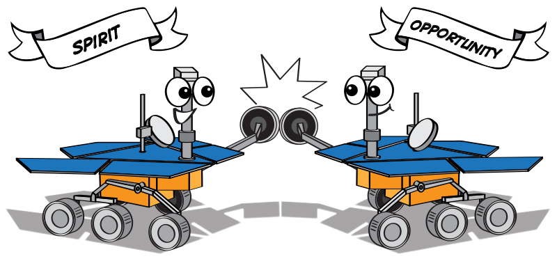

Lección 1: Conociendo el Rover Marciano
========================================

Bienvenido a la Lección 1: Comprendiendo el Rover Marciano. Hoy nos sumergimos en el apasionante mundo de los rovers marcianos, nuestros exploradores remotos en el Planeta Rojo. Aprenderemos sobre su evolución, sus funciones y las maravillas tecnológicas que representan. Además, canalizarás tu creatividad para dise?ar tu propio rover y perfeccionarás tus habilidades de presentación al explicar tu dise?o único. ?Prepárate para explorar Marte desde tu salón de clases!

Objetivos de Aprendizaje
-------------------------
* Comprender la evolución y el propósito de los rovers marcianos
* Expresar la creatividad dise?ando tu propio rover marciano
* Mejorar las habilidades de presentación compartiendo y explicando tu dise?o de rover

Materiales
-----------
* Imágenes de rovers marcianos y especificaciones técnicas como referencia
* Video documental sobre la historia de los rovers marcianos
* Computadora con acceso a Internet para investigar y ver el documental
* Diapositivas de presentación o pizarra interactiva para impartir la lección
* Papel de dibujo, lápices y materiales para colorear para la actividad de dise?o del rover
* Hojas de trabajo para tomar notas guiadas, reflexión y planificación del dise?o

Pasos
--------------

**Paso 1: ?Qué son los Rovers Marcianos?**

Antes de sumergirnos en los rovers marcianos, primero familiaricémonos con Marte mismo. Como podemos ver en las imágenes y modelos, la superficie de Marte está marcada por cráteres, monta?as, valles y tormentas de polvo, pintando un panorama de un paisaje que es tanto fascinante como desafiante.

    .. image:: img/mars_surface.jpg
        :width: 600
    .. image:: img/mars_surface.png
        :width: 600

?Puedes imaginar cómo sería navegar por un terreno tan accidentado? Ahora, supongamos que tienes la tarea de dise?ar un rover para Marte.

* ?Qué consideraciones tendrás en cuenta dado el terreno y las condiciones de Marte?
* ?Qué características le equiparás para asegurar que pueda realizar sus funciones de manera efectiva?
* ?Qué tareas imaginas que tu rover marciano necesitaría realizar?

Recuerda, un rover marciano es un robot dise?ado para explorar Marte, estudiar su entorno y enviar datos de vuelta a la Tierra. Así que piensa en aspectos como el movimiento, la comunicación, la fuente de alimentación, las capacidades de investigación científica y la durabilidad bajo las condiciones extremas de Marte.

Tomémonos un momento para reflexionar y compartir nuestras ideas. Es interesante pensar como ingenieros y científicos, ?no es así? Profundizaremos en los dise?os reales de rovers marcianos y sus funciones en los siguientes pasos, así que ten tus ideas creativas en mente mientras avanzamos.

**Paso 2: Explorando la Historia de los Rovers Marcianos**

A continuación, emprenderemos un viaje a través del tiempo viendo un documental que detalla la historia de los rovers marcianos. El documental nos lleva desde el primer intento de desplegar un rover en Marte, el rover soviético Mars 3 que desafortunadamente no tuvo éxito al aterrizar en 1971, hasta el primer rover marciano exitoso de la NASA, Sojourner, en 1997.

Nuestro viaje no se detiene ahí, ya que nos adentramos para comprender las aventuras de los rovers más avanzados hasta ahora: Spirit, Opportunity, Curiosity y Perseverance.

.. raw:: html

    <iframe width="600" height="400" src="https://www.youtube.com/embed/OO5CTBBgtXs" title="YouTube video player" frameborder="0" allow="accelerometer; autoplay; clipboard-write; encrypted-media; gyroscope; picture-in-picture; web-share" allowfullscreen></iframe>

Este documental no solo presenta un contexto histórico, sino que también proporciona una comprensión integral de los hitos científicos y de ingeniería progresivos que han llevado a la era actual de exploración de Marte.

**Paso 3: Resumen de los Rovers Marcianos**

Después de ver el documental, resumamos los diferentes rovers marcianos que han sido enviados al planeta rojo.

* **Sojourner** (1997)

    **Sojourner**, el pionero de los rovers marcianos, comenzó su viaje como parte de la misión Mars Pathfinder. Aterrizó con éxito en la región de Ares Vallis el 4 de julio de 1997. Como el primer vehículo con ruedas en desplazarse sobre un planeta distinto a la Tierra, Sojourner marcó un hito significativo en la exploración marciana. Aunque estuvo operativo en Marte solo durante 92 días marcianos, o soles, sentó las bases para los futuros rovers de exploración.

    .. image:: img/mars_sojourner.jpg

* **Spirit** (2004–2010) y **Opportunity** (2004–2018)

    **Spirit** y **Opportunity** son rovers gemelos de la misión Mars Exploration Rover (MER) de la NASA. **Spirit**, también conocido como MER-A, operó en Marte desde 2004 hasta 2010.

    Por otro lado, **Opportunity**, o MER-B, tuvo una carrera notablemente larga desde 2004 hasta 2018. Juntos, ampliaron enormemente nuestra comprensión de la superficie marciana y la historia geológica.

    .. image:: img/mars_opportunity.jpg

* **Curiosity** (2012–presente):

    **Curiosity**, un rover marciano del tama?o de un automóvil, fue dise?ado para explorar el cráter Gale en Marte como parte de la misión Mars Science Laboratory (MSL) de la NASA. Desde su llegada en 2012, **Curiosity** ha realizado numerosos descubrimientos significativos, incluyendo evidencia de agua líquida pasada en Marte.

    .. image:: img/mars_curiosity.jpg

* Perseverance (2021–presente):

    **Perseverance**, también conocido como Percy, es el rover más reciente en llegar a Marte. Está dise?ado para explorar el cráter Jezero como parte de la misión Mars 2020 de la NASA. Junto con sus instrumentos científicos, **Perseverance** también transporta a Ingenuity, un peque?o helicóptero marciano experimental, marcando otro hito en la exploración marciana.

    .. image:: img/mars_perseverance.jpg

Ahora, tengamos una discusión. Reflexiona sobre la evolución de estos rovers.

* ?En qué se diferencian los dise?os de estos rovers? ?En qué se parecen?
* ?Cómo influyeron los objetivos de la misión en el dise?o de cada rover?
* ?Qué avances tecnológicos puedes identificar entre cada rover?
* ?Qué características crees que debería tener el próximo rover marciano?
* ?Comparte tus pensamientos y reflexiones, así como cualquier pregunta que puedas tener!

**Paso 4: Actividad Artística: Dibuja tu Propio Rover Marciano**

.. image:: img/sojourner-first.jpg

.. image:: img/curiosity.png

Para nuestra próxima actividad, pongamos nuestro conocimiento y creatividad a trabajar dise?ando nuestro propio rover marciano. Considera las características clave de los rovers que hemos estudiado hasta ahora, pero también piensa en los atributos únicos que te gustaría incorporar en tu dise?o.

Materiales que necesitarás:

* Papel de dibujo
* Lápices y gomas de borrar
* Lápices de colores, crayones o marcadores

Instrucciones de dibujo:

#. Comienza con el cuerpo del rover. ?Qué forma tendrá? ?Qué tama?o?
#. Considera las ruedas. ?Cuántas ruedas tendrá tu rover? ?De qué tama?o y forma serán?
#. No olvides los instrumentos. ?Qué equipo científico llevará tu rover? ?Cámaras, taladros, espectrómetros o algo completamente nuevo?
#. Por último, considera cualquier característica única. ?Tu rover tiene paneles solares o utiliza una fuente de energía diferente? ?Puede comunicarse directamente con la Tierra o necesita un satélite de retransmisión?

Una vez que todos hayan completado sus dibujos, los compartiremos con la clase. Explica tus decisiones de dise?o y la misión que imaginas para tu rover.

**Paso 5: Presenta tus Dise?os de Rover Marciano**

Ahora que todos han completado sus dibujos del Rover Marciano, ?es hora de compartirlos! Mientras presentas, discute el proceso de pensamiento detrás de tu dise?o. ?Cuál es la misión de tu rover? ?Cómo apoya el dise?o esta misión?

Recuerda, no hay respuestas incorrectas en esta actividad. El propósito es estimular tu creatividad y profundizar tu comprensión de la tecnología de los rovers marcianos.

**Paso 6: Reflexión y Conclusión**

Al concluir nuestra lección sobre el Rover Marciano, tomémonos unos minutos para reflexionar sobre lo que hemos aprendido. ?Cómo reflejan nuestros dise?os de rover los avances tecnológicos y los objetivos científicos? ?Cómo podrían continuar evolucionando los rovers marcianos reales en el futuro?

Recuerda, la exploración del espacio, como cualquier campo STEAM, se trata de hacer preguntas, resolver problemas y usar la creatividad. ?Sigue explorando, sigue haciendo preguntas y sigue siendo curioso!