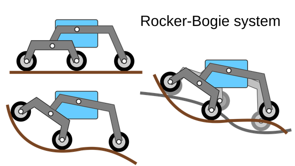
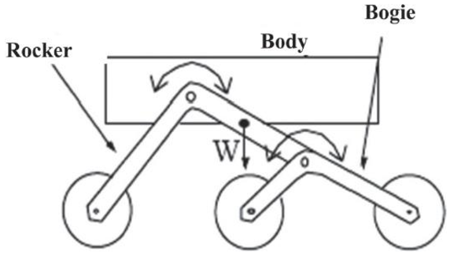
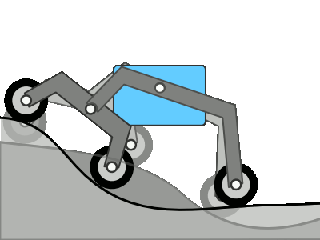
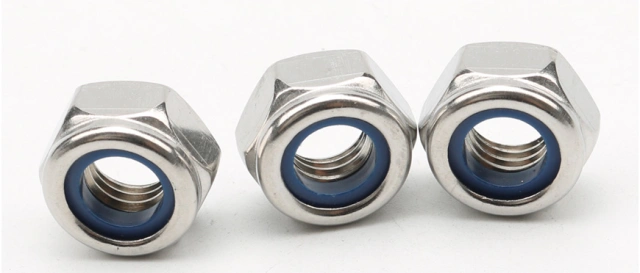

第2课 理解并制作摇臂转向架系统
============================================================
在上一课中，我们了解了火星车及其基本结构。在观察火星车的演变过程时，我们注意到一个有趣的方面——它们的悬挂系统具有一致性。
尽管技术不断进步，从旅居者号到毅力号的所有火星车都采用了
一种类似的悬挂系统，称为摇臂转向架系统。

但你可能会问，为什么要坚持使用摇臂转向架系统呢？这种特殊的设计为火星探索提供了哪些优势？

在今天这节课中，我们将更深入地探讨摇臂转向架系统背后的科学和工程原理，然后动手制作一个。

让我们开始这段激动人心的工程之旅吧！

学习目标
----------------------

* 了解摇臂转向架悬挂系统的设计原理及其优势。
* 学习如何设计和制作摇臂转向架悬挂系统的基本模型。
* 应用基本物理学原理解释摇臂转向架悬挂系统如何克服复杂地形。

所需材料
-------------
* 蓝图和参考资料（如NASA火星车设计图纸以及关于摇臂转向架悬挂系统工作原理的视频）
* 火星车结构套件
* 基本工具和配件（例如螺丝刀、螺丝等）

步骤
--------------

**步骤1：揭开摇臂转向架系统的奥秘**

摇臂转向架系统就像机械界的山羊——它设计用于在火星车穿越崎岖多岩地形时保持所有车轮接地。它是专门为应对火星不可预测的地貌而打造的，包括陡坡和大块岩石。该系统不使用弹簧，而是利用其六个车轮的几何结构和相互作用来征服复杂地形。这是一个如何通过巧妙的机械设计克服环境障碍的典范。

让我们深入了解这个系统的两个主要部分——"摇臂"和"转向架"。

* 系统的"摇臂"部分就像火星车车身两侧的两个大肢体。这些肢体（摇臂）通过一种称为差速器的机构相互连接并连接到火星车的车身（底盘）。就像两条腿走路一样，摇臂相对于底盘向相反方向旋转，确保大多数车轮与地面保持接触。火星车的车身保持两个摇臂的平均角度。摇臂的一端连接到一个车轮，而另一端连接到转向架。

* 系统的"转向架"部分就像附着在摇臂上的小肢体生物。它是一个较小的连杆系统，在其中部与摇臂枢轴连接，两端各有一个车轮。

有了这个基本的了解，让我们进入下一步的冒险吧。

**步骤2：观察系统运行**

下面是一个GIF动图，展示了摇臂转向架悬挂系统的独特功能，并说明了它如何使火星车能够在具有挑战性的火星地形中导航。

观看动图后，让我们进行讨论！思考这些问题：

* 为什么你认为摇臂转向架悬挂系统适合火星探索？
* 你能用自己的话描述摇臂转向架系统是如何工作的吗？
* 摇臂转向架系统的哪些关键特性帮助火星车在崎岖地形中行驶？

请随意分享你对摇臂转向架悬挂系统的想法和见解。

**步骤3：动手制作**

现在我们已经了解了摇臂转向架系统，是时候自己动手制作了。

你需要的材料：

* GalaxyRVR套件
* 基本工具，如螺丝刀和扳手
* 按照GalaxyRVR套件组装说明中的步骤构建火星车的悬挂系统。

.. raw:: html

    <iframe width="600" height="400" src="https://www.youtube.com/embed/a1xtgDUEvR0" title="YouTube video player" frameborder="0" allow="accelerometer; autoplay; clipboard-write; encrypted-media; gyroscope; picture-in-picture; web-share" allowfullscreen></iframe>

请注意，耐心和精确度在这里至关重要，确保正确放置每个部件并将其牢固固定。

同时，与你的同伴讨论你正在组装的每个组件的设计和功能。
这不仅有助于理解设计，还能理解其在火星探索中的实际应用。

请记住，如果在组装或测试过程中遇到任何问题，不要担心。
这都是工程过程的一部分！解决问题正是我们学习和创新的方式。

**步骤4：总结与反思**

在组装悬挂系统的过程中，你是否注意到所有运动部件都使用了防松螺母？你有没有想过为什么？

防松螺母是一种紧固件，它在普通螺母内部包含一个橡胶圈。这种设计确保组装好的部件不会因运动中的振动而轻易松动脱落。

此外，它还确保部件可以在一定范围内自由旋转。

因此在组装时，你需要先用套筒和螺丝刀拧紧螺丝和防松螺母，然后再稍微松开一点。这样可以确保部件之间有自由旋转的空间，同时又不会太松。

.. raw:: html

   <video width="600" loop autoplay muted>
        <source src="../_static/video/rocker_bogie_system.mp4" type="video/mp4">
        您的浏览器不支持此视频标签。
   </video>

在这节课中，我们不仅学习了摇臂转向架系统，还亲手制作了一个。此外，我们可以手动模拟它如何使火星车在各种崎岖地形上平稳移动。

有了这些知识和经验，我们现在更有能力深入探索火星的未知领域。让我们继续揭开红色星球的神秘面纱。
