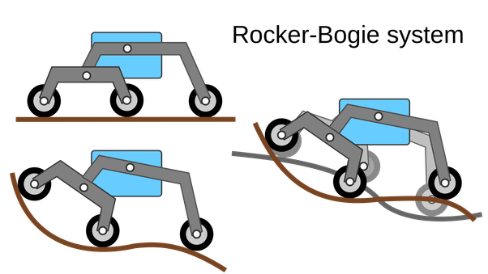
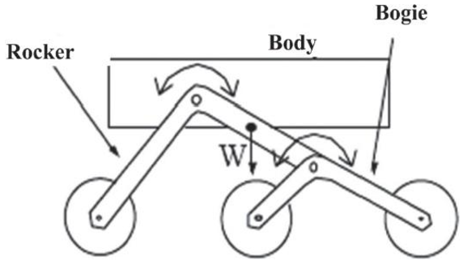
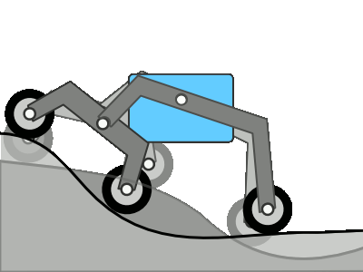
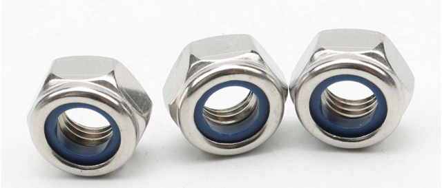

.. note::

    Ciao, benvenuto nella community SunFounder per appassionati di Raspberry Pi, Arduino e ESP32 su Facebook! Approfondisci la tua conoscenza di Raspberry Pi, Arduino e ESP32 con altri appassionati.

    **Perché unirsi?**

    - **Supporto esperto**: Risolvi problemi post-vendita e sfide tecniche con l'aiuto della nostra community e del nostro team.
    - **Impara e condividi**: Scambia consigli e tutorial per migliorare le tue competenze.
    - **Anteprime esclusive**: Ottieni accesso anticipato agli annunci di nuovi prodotti e anteprime.
    - **Sconti speciali**: Goditi sconti esclusivi sui nostri prodotti più recenti.
    - **Promozioni festive e omaggi**: Partecipa a omaggi e promozioni festive.

    👉 Pronto a esplorare e creare con noi? Clicca [|link_sf_facebook|] e unisciti oggi!

Lezione 2: Comprendere e costruire il sistema Rocker-Bogie
============================================================
Nella lezione precedente, abbiamo imparato a conoscere i rover marziani e la loro struttura di base. Un aspetto interessante che notiamo
osservando l'evoluzione dei rover marziani è la coerenza nel loro sistema di sospensione.
Nonostante il progresso della tecnologia, tutti i rover da Sojourner a Perseverance sono stati
progettati utilizzando un tipo simile di sistema di sospensione noto come sistema Rocker-Bogie.

Ma perché mantenere il sistema Rocker-Bogie, ti chiederai? Quali vantaggi offre questo particolare design per l'esplorazione di Marte?

Nella lezione di oggi, approfondiremo la scienza e l'ingegneria dietro il sistema Rocker-Bogie, per poi costruirne uno.

Imbarchiamoci in questo entusiasmante viaggio ingegneristico!

Obiettivi di apprendimento
--------------------------

* Comprendere il principio di progettazione del sistema di sospensione Rocker-Bogie e i suoi vantaggi.
* Imparare a progettare e realizzare un modello base del sistema di sospensione Rocker-Bogie.
* Applicare i principi di base della fisica per spiegare come il sistema di sospensione Rocker-Bogie supera i terreni complessi.

Materiali
-------------
* Progetti e materiali di riferimento (come disegni di progettazione del Mars Rover della NASA e video su come funziona il sistema di sospensione Rocker-Bogie)
* Kit struttura Mars Rover
* Strumenti e accessori di base (es. cacciavite, viti, ecc.)

Procedura
--------------

**Fase 1: Svelare il sistema Rocker-Bogie**

Il sistema Rocker-Bogie è come una capra di montagna della meccanica - progettato per mantenere tutte le ruote del rover a contatto con il suolo mentre naviga su terreni accidentati e rocciosi. È appositamente costruito per gestire il paesaggio imprevedibile di Marte, comprese pendenze ripide e massi considerevoli. Questo sistema salta le molle e sfrutta invece la geometria delle sue sei ruote e le loro interazioni per conquistare terreni difficili. È un brillante esempio di come un design meccanico intelligente possa superare gli ostacoli ambientali.

Immergiamoci nelle due parti principali di questo sistema - il "rocker" e il "bogie".

* La parte "rocker" del sistema è come i due grandi arti su entrambi i lati del corpo del rover. Questi arti, o rocker, si collegano tra loro e al corpo del rover, o telaio, attraverso un meccanismo chiamato differenziale. Proprio come due gambe che camminano, i rocker ruotano in direzioni opposte rispetto al telaio, assicurando che la maggior parte delle ruote rimanga a contatto con il suolo. Il corpo del rover mantiene l'angolo medio di entrambi i rocker. Un'estremità di un rocker si collega a una ruota, mentre l'altra estremità si collega al bogie.

* La parte "bogie" del sistema è come una mini-creatura con arti attaccata al rocker. È un sistema di collegamento più piccolo che ruota al centro sul rocker e ha una ruota a entrambe le estremità.

Con questa comprensione di base, passiamo alla prossima fase della nostra avventura.

**Fase 2: Vedere il sistema in azione**

Di seguito è una GIF che mostra le caratteristiche uniche del sistema di sospensione Rocker-Bogie e illustra come consente ai rover marziani di navigare il difficile terreno marziano.

Dopo aver guardato la gif, discutiamo! Pensa a queste domande:

* Perché pensi che il sistema di sospensione Rocker-Bogie sia adatto all'esplorazione di Marte?
* Puoi descrivere come funziona il sistema Rocker-Bogie con parole tue?
* Quali sono le caratteristiche chiave del sistema Rocker-Bogie che aiutano i rover a negoziare terreni accidentati?

Sentiti libero di condividere i tuoi pensieri e le tue idee sul sistema di sospensione Rocker-Bogie.

**Fase 3: Costruiamolo**

Ora che abbiamo imparato a conoscere il sistema Rocker-Bogie, è il momento di costruire il nostro.

Materiali necessari:

* Kit GalaxyRVR
* Strumenti di base come cacciavite e chiave inglese
* Segui i passaggi forniti nelle istruzioni di assemblaggio del Kit GalaxyRVR per costruire il sistema di sospensione del Rover.

.. raw:: html

    <iframe width="600" height="400" src="https://www.youtube.com/embed/a1xtgDUEvR0" title="YouTube video player" frameborder="0" allow="accelerometer; autoplay; clipboard-write; encrypted-media; gyroscope; picture-in-picture; web-share" allowfullscreen></iframe>

Tieni presente che pazienza e precisione sono essenziali qui, assicurati di posizionare correttamente ogni pezzo e fissarlo saldamente.

Nel frattempo, discuti con i tuoi compagni del design e della funzione di ogni componente che stai assemblando.
Questo non solo aiuterà a comprendere il design ma anche la sua applicazione pratica nell'esplorazione di Marte.

Ricorda, non preoccuparti se incontri problemi durante l'assemblaggio o il test.
Fa tutto parte del processo ingegneristico! Risolvere i problemi è il modo in cui impariamo e innoviamo.

**Fase 4: Riepilogo e riflessione**

Durante l'assemblaggio del sistema di sospensione, hai notato che tutte le parti mobili utilizzano dadi autobloccanti? Ti sei mai chiesto perché?

I dadi autobloccanti sono un tipo di fissaggio che include un anello di gomma all'interno di un dado normale. Questo design assicura che le parti assemblate non si allentino e cadano facilmente a causa delle vibrazioni durante il movimento.

Inoltre, assicura anche che le parti possano ruotare entro un certo intervallo.

Quindi durante l'assemblaggio, devi prima stringere la vite e il dado autobloccante con una chiave a bussola e un cacciavite, poi allentarli leggermente. Questo assicura che ci sia spazio per la rotazione libera tra le parti senza che siano troppo allentate.

.. raw:: html

   <video width="600" loop autoplay muted>
        <source src="../_static/video/rocker_bogie_system.mp4" type="video/mp4">
        Your browser does not support the video tag.
   </video>

In questa lezione, non solo abbiamo imparato a conoscere il sistema Rocker-Bogie ma ne abbiamo anche costruito uno noi stessi. Inoltre, possiamo simulare manualmente come permette al Mars Rover di muoversi agevolmente su vari terreni accidentati.

Armati di queste conoscenze ed esperienze, siamo ora meglio equipaggiati per avventurarci più a fondo nei regni sconosciuti dell'esplorazione marziana. Continuiamo a svelare i misteri del pianeta rosso.
