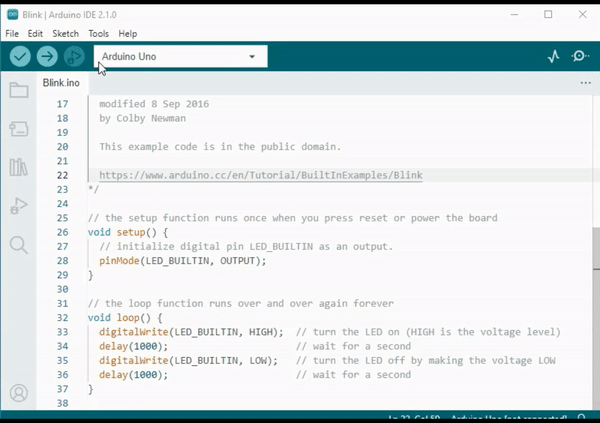
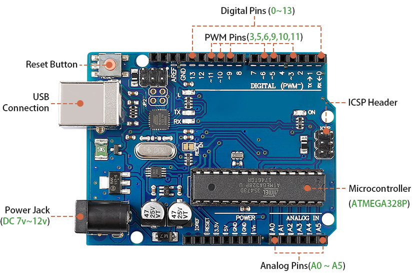
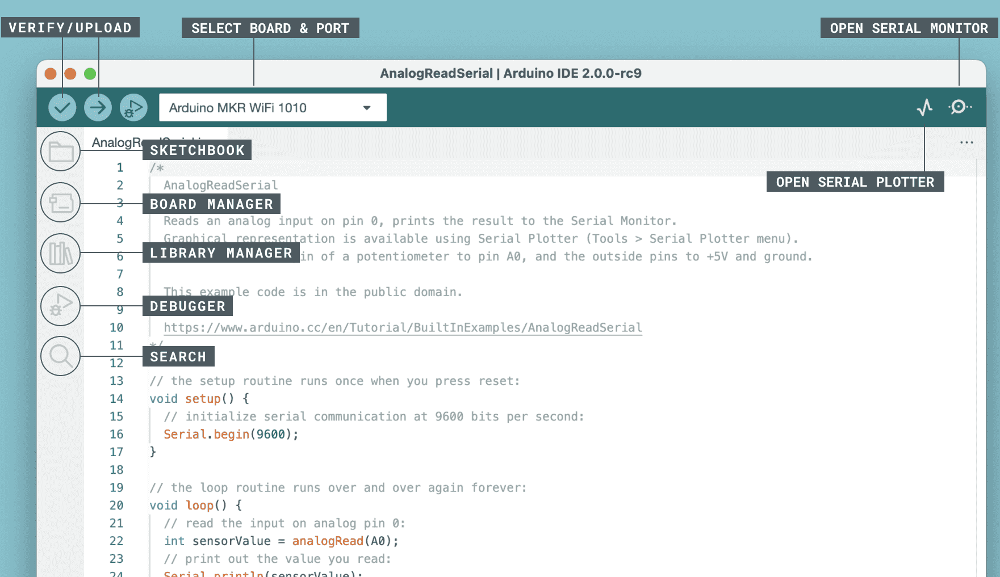


第3课：进入Arduino和编程的世界
=====================================================

在上一课中，我们成功构建了摇臂转向架悬挂系统。
然而，要使其发挥功能，我们需要为其提供电源、控制板以及控制其运动的编程。

因此，在本课中，我们将熟悉控制板和我们将要使用的编程平台。

课程目标
---------------------

* 理解Arduino的基本概念和功能。
* 了解SunFounder R3板。
* 安装Arduino IDE并熟悉其界面。
* 学习Arduino编程的基本语法规则。

课程材料
--------------------

* SunFounder R3板
* Arduino IDE
* USB数据线
* 计算机

Arduino简介
------------------------------------------

你可能经常在各种场合听到"Arduino"这个词，但它究竟是什么，为什么变得如此流行？

Arduino是一个易于使用的开源电子平台，适用于硬件和软件应用。它旨在制作能够感知和控制周围物理世界的数字设备和交互式对象。

让我们来分解一下：

* **开源** ：把开源想象成一个社区花园。每个人都可以使用它，每个人都可以为它做贡献，每个人都可以从中受益。通过开源，物理部分（硬件）的设计和编程指令（软件）都可以自由共享。这意味着任何人都可以使用它们、改进它们或创建自己的版本。这一切都是关于分享和创造力！

    .. image:: img/arduino_oscomm.png
        :width: 400
        :align: center

* **微控制器** ：微控制器就像Arduino的大脑。它是一个可以运行简单软件的微型计算机。虽然它不如你现在使用的计算机强大，但它非常适合执行简单任务，比如理解传感器的消息或点亮LED（小灯）。

    .. image:: img/arduino_micro.jpg
        :width: 500
        :align: center

* **开发板** ：把开发板想象成支撑大脑的身体。它是微控制器所在的电路板，包含帮助微控制器与世界交互的其他部件。这些部件包括振荡器（帮助计时）、电压调节器（控制电源级别）以及电源和数据连接器（就像你家中的插头和开关）。

    .. image:: img/arduino_board.png
        :width: 600
        :align: center

* **Arduino IDE** ：这就像你的Arduino的教学课堂。它是一个在你的计算机上运行的程序，你可以在其中编写指令，告诉你的Arduino该做什么。这些指令用一种基于C++的编程语言编写。编写完指令后，你可以使用USB数据线将它们发送到Arduino板，就像交作业一样！

    .. image:: img/arduino_ide_icon.png
        :width: 200
        :align: center

现在你已经理解了这些基本概念，你正走在成为Arduino专家的道路上！

然后我们将深入一些动手实践活动，让你熟悉Arduino编程和工程原理。
准备好迎接激动人心的学习之旅吧！

了解你的SunFounder R3板
------------------------------------------------------------------

在你的套件中，你会找到一块蓝色的电路板，看起来像一座充满金属小塔和路径的微型城市。但不要被它吓到！这是SunFounder R3开发板，一种Arduino板，可用于编程和控制大量的电子设备和项目。

让我们用简单的语言来了解它的主要特性：

* **14个数字引脚** ：把这些引脚想象成小信使。它们可以被编程为发送（输出）或接收（输入）简单的"是"或"否"消息给你的火星车的其他部分。这些消息实际上是"开"或"关"信号，电路板用它们来控制灯光或电机等设备。

    * 其中六个特殊引脚甚至可以用一种称为PWM（脉宽调制）的密码发送消息。这种代码可用于控制灯的亮度、电机的转速，甚至运动部件的位置。

* **6个模拟引脚** ：这些引脚就像电路板的六种特殊感官。它们可以读取不同类型传感器（如温度传感器）的信号，然后将这些信号转换成电路板能够理解并在编程中使用的语言。

* **USB连接** ：这就像电路板的脐带。你可以用它把你的电路板连接到计算机。这种连接允许你的计算机通过发送你编写的程序来"教"电路板该做什么。

* **电源插口** ：这是电路板的食物供应。你可以将电源（如电池或交流-直流适配器）连接到这个插口，为你的电路板提供其工作所需的电力。

* **ICSP接口** ：这就像一个用于编程电路板的特殊入口。如果你有外部编程器（一种用于"教"电路板的特殊设备），可以使用它。

* **重置按钮** ：如果你按下它，就像告诉电路板忘记它刚才正在做的事情，然后从头开始重新运行程序。

掌握了这些基础知识，你就准备好开始使用SunFounder R3板进行编程冒险了！

.. _install_arduino_ide:

安装Arduino IDE
-----------------------------------------------

既然我们了解了Arduino和Arduino板是什么，是时候开始将这些知识付诸实践了。我们将安装Arduino IDE，这是我们用来为Arduino板编程的软件。

最新版本的Arduino IDE是2.0版。它功能丰富且非常用户友好。但是，你应该知道它有一些系统要求：

    * Windows - Win 10及更新版本，64位
    * Linux - 64位
    * Mac OS X - 10.14版本："Mojave"或更新版本，64位

要开始，请按照以下步骤操作：

#. 访问 |link_download_arduino| 并下载适合你操作系统版本的IDE。

    .. image:: img/sp_001.png

**对于Windows用户：**

    #. 下载文件后（文件名类似于 ``arduino-ide_xxxx.exe``），双击它开始安装过程。

    #. 你将看到 **许可协议** 。花点时间阅读一下，如果你同意条款，点击"我同意"（I Agree）。

        .. image:: img/sp_002.png

    #. 接下来，系统会要求你选择安装选项。保持默认设置，点击"下一步"（Next）。

        .. image:: img/sp_003.png

    #. 选择你想要安装软件的位置。通常最好将其安装在与系统盘不同的驱动器上。

        .. image:: img/sp_004.png

    #. 点击"安装"（Install）开始安装。安装完成后，点击"完成"（Finish）。

        .. image:: img/sp_005.png

**对于macOS用户：**

    双击下载的文件（文件名类似于 ``arduino_ide_xxxx.dmg``）。按照屏幕上的指示将 **Arduino IDE** 应用程序拖入 **应用程序** 文件夹。几秒钟后，Arduino IDE将成功安装。

    .. image:: img/macos_install_ide.png
        :width: 800

**对于Linux用户：**

    你可以在此处找到在Linux系统上安装Arduino IDE 2.0的详细教程：|link_arduino_linux|。

探索Arduino乐园（IDE）
----------------------------------------------------------------

让我们一起想象Arduino IDE是一个神奇的乐园，里面充满了等待我们探索和玩耍的工具和小装置。接下来，我将引导你了解这个乐园的每个角落。

以下是你在乐园中可以找到的内容：

* **验证/上传** - 把它想象成你的魔法电梯。它把你编写的代码快速传送到你的Arduino板中。
* **选择板和端口** - 这是你的藏宝图。它会自动显示你已插入计算机的Arduino板，并告诉你它们的端口号。
* **草图本** - 这是你的个人图书馆。它是你所有草图（程序）在计算机上的存储位置。此外，它还可以连接到Arduino云，让你也可以从云端获取草图。
* **板卡管理器** - 把它想象成你的工具箱。你可以在这里找到并安装Arduino的不同开发板包。
* **库管理器** - 这是你的无尽宝箱。Arduino及其社区制作的数千个库在这里等着你。需要代码的工具或材料？深入其中找到它！
* **调试器** - 想象你拥有一种超能力，可以实时测试和调试你的代码，发现并解决问题。这就是调试器的功能！
* **搜索** - 把它想象成你的放大镜。它帮助你在代码中搜索关键词。
* **打开串口监视器** - 这就像你的通信设备。它打开一个新标签页，让你的计算机和Arduino板可以互相发送消息。

现在我们已经对这个乐园有了初步了解，是时候深入其中开始创作了！

.. _upload_sketch:

上传你的第一个草图
-----------------------------------------------

好了，是时候找点乐子了！我们将让一个LED闪烁——这在Arduino世界中就像说"Hello, World！"一样。

大多数Arduino板在引脚13上都有一个内置LED，这使它成为一个很好的第一个实验。

.. image:: img/1_led.jpg
    :width: 400
    :align: center

让我们来分解一下：

#. **连接它** ：使用USB数据线将你的SunFounder R3板连接到计算机。这是我们将为电路板供电并将程序（也称为"草图"）发送到它的方式。你可能觉得你只是在连接一个计算机设备，但相信我，你正在连接到一个充满可能性的世界！

    .. image:: img/connect_board_pc.gif

#. **找到示例草图** ：在Arduino IDE上，转到 **文件** -> ** 示例** -> ** 基础** -> **Blink** 。你看到弹出的是一个现成的程序，我们将对其进行修改。这就像得到了一个现成的蛋糕，我们即将对它进行装饰！

    .. image:: img/open_blink.png

#. **理解草图** ：查看这个新窗口中的代码。它告诉Arduino打开内置LED（位于引脚13）一秒钟，然后关闭一秒钟，然后重复。这就像发送摩斯密码，但是用光！

    .. image:: img/led_blink.png

#. **上传草图** ：一旦你选择了正确的板和端口，只需点击上传按钮。这就像寄出一封信一样简单——你正在将你的指令传递给Arduino板！大多数情况下，系统会自动为你检测板和端口。

    .. image:: img/upload_blink.gif

#. **观看效果** ：如果一切顺利，你会看到Arduino板上的LED开始闪烁。就像你的Arduino在对你眨眼！

    .. image:: img/blink_led.gif

你做得很好！你刚刚运行了你的第一个Arduino程序，成为了一名真正的程序员！那么接下来呢？我们只是触及了Arduino能做什么的表面。准备好迎接下一个挑战了吗？

一些有趣的Arduino编程知识
--------------------------------------------------------

是时候揭开Arduino编程的一些酷炫秘密了！

* 代码魔法：``setup()`` 和 ``loop()``

    Arduino草图，或者说一段代码，就像一出两幕剧：

    * ``setup()``：这是第一幕，开场场景。它只发生一次，当你的Arduino板首次启动时。它用于设置舞台，准备引脚模式和库等内容。
    * ``loop()``：在第一幕之后，我们进入第二幕，它会循环重复，直到最终的帷幕落下（只有在关闭电源或按下重置按钮时才会发生！）。这部分代码就像我们戏剧的主要部分，真正的动作在此发生。

    但请记住，即使 ``setup()`` 或 ``loop()`` 中没有魔法（代码），我们仍然需要保留它们。它们就像舞台——即使是空舞台也仍然是舞台。

    .. code-block:: arduino

        void setup() {
            // initialize digital pin LED_BUILTIN as an output.
            pinMode(LED_BUILTIN, OUTPUT);

            digitalWrite(LED_BUILTIN, HIGH);  // turn the LED on (HIGH is the voltage level)
            delay(1000);                      // wait for a second
            digitalWrite(LED_BUILTIN, LOW);   // turn the LED off by making the voltage LOW
            delay(1000);                      // wait for a second
        }

        // the loop function runs over and over again forever
        void loop() {

        }

* 编程中的标点符号

    就像在故事书中一样，Arduino使用特殊的标点符号来使代码有意义：

    * ``分号 (;)``：这些就像故事中的句号。它们告诉Arduino"好的，这个动作我完成了。下一步是什么？"
    * ``花括号 {}``：这些就像章节的开头和结尾。它们将代码段包裹在一起，标记一个部分的开始和结束。

    如果你碰巧忘记了一些标点符号，不用担心！Arduino就像一个友好的老师，会检查你的工作，指出错误在哪里，并向你展示如何修复它们。这都是学习冒险的一部分！

    .. image:: img/blink_error.gif

* 关于函数

    把这些函数想象成魔法咒语。每个咒语在我们的Arduino冒险中都有特定的效果：

    * ``pinMode()``：这个咒语决定一个引脚是输入还是输出。就像决定我们故事中的一个角色是说话（输出）还是听（输入）。
    * ``digitalWrite()``：这个咒语可以将引脚设为高电平（开）或低电平（关），就像开关魔法灯一样。
    * ``delay()``：这个咒语让Arduino暂停一段时间，就像在我们的故事中间小睡一会儿。

    就像咒语书一样，你可以在 |link_arduino_web| 找到所有这些咒语以及更多。你知道的咒语越多，你的Arduino冒险就可以越精彩！

* 注释：我们的秘密消息

    在编程中，我们还有一种秘密语言，称为``注释``。这些是我们可以在代码中使用 ``//`` 或 ``/* */`` 编写的消息。神奇之处在于？Arduino完全忽略它们！这是一个很好的地方，可以为你自己或他人留下笔记，解释代码中棘手的部分在做什么。

* 代码可读性：让代码更友好

    虽然你可以按照任何你喜欢的方式编写代码（例如，将分号放在单独的行上不会引起任何错误），但重要的是要考虑代码的可读性。

    .. image:: img/blink_noerror.gif

    就像写一个好故事一样，我们编写代码的方式可以使它有趣且易于阅读，或者枯燥且难以阅读。以下是一些让你的代码更友好的方法：

    * 使用适当的缩进将你的语句排列成整齐的段落。它有助于读者理解一个部分在哪里结束，另一个部分在哪里开始。
    * 使用有意义的变量名。这就像在故事中给角色起一个合适的名字。
    * 保持你的函数小而简单，就像书中简短而精彩的章节。
    * 为棘手的部分留下注释。就像留下脚注来解释一个难懂的单词。

    请记住，我们不仅为机器编码，也为人编码，所以让我们确保我们的代码讲一个清晰易懂的故事！

**反思与改进**

花点时间反思我们的旅程，可以为我们提供在匆忙探索中可能忽略的见解。问自己：

* 这次Arduino冒险中最有趣的部分是什么？
* 过程中有遇到任何挑战吗？你是如何克服的？
* 你能向朋友解释Arduino是什么、Arduino IDE做什么，或者如何运行Arduino代码吗？
* 你会如何描述你的第一次Arduino编程体验？
* 你还想学习更多关于Arduino的什么？

通过思考这些问题，你在加深理解并为未来的探索做准备。永远记住，反思中没有"错误"的答案——毕竟这是你的个人旅程！
