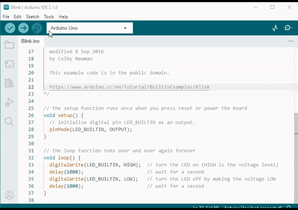
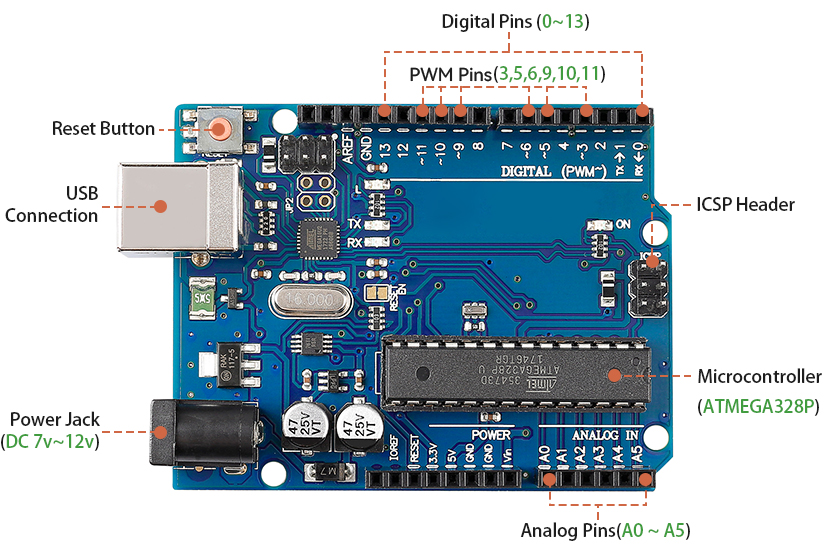
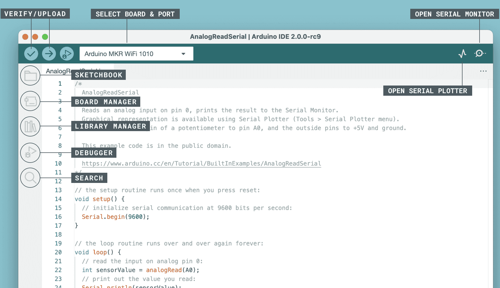
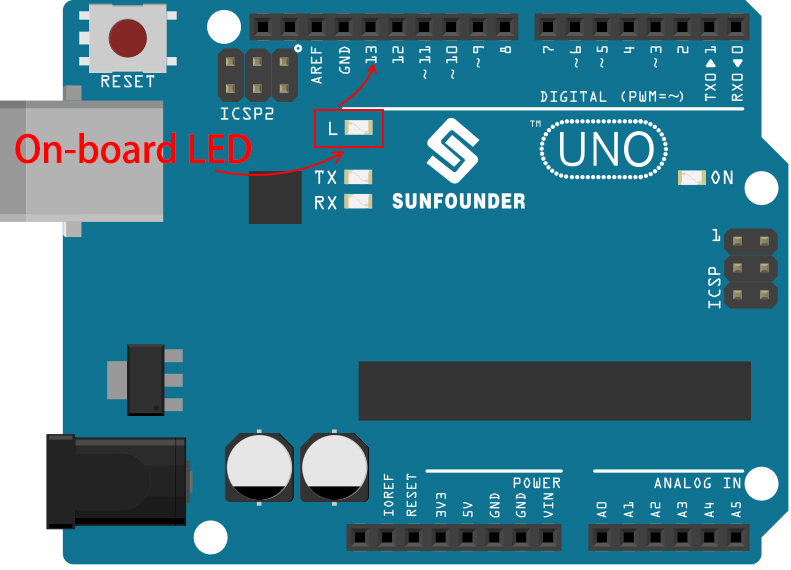

.. include:: /index.rst
   :start-after: start_hello_message
   :end-before: end_hello_message

Lektion 3: Eintauchen in die Welt von Arduino und Programmierung
======================================================================

In unserer vorherigen Lektion haben wir erfolgreich das Rocker-Bogie-Federungssystem gebaut.
Um es jedoch funktionsfähig zu machen, benötigen wir eine Stromversorgung, eine Steuerplatine und eine Programmierung, um seine Bewegungen zu steuern.

In dieser Lektion werden wir uns daher mit der Steuerplatine und der Programmierplattform vertraut machen, die wir verwenden werden.

Lernziele
---------------------

* Die grundlegenden Konzepte und Funktionen von Arduino verstehen.
* Die SunFounder R3 Platine kennenlernen.
* Die Arduino IDE installieren und sich mit ihrer Benutzeroberfläche vertraut machen.
* Grundlegende Syntaxregeln für die Arduino-Programmierung erlernen.

Materialien
--------------------

* SunFounder R3 Platine
* Arduino IDE
* USB-Kabel
* Computer

Einführung in Arduino
----------------------------------------------

Sie haben den Begriff „Arduino" vielleicht schon oft in verschiedenen Zusammenhängen gehört, aber was genau ist das und warum ist es so beliebt geworden?

Arduino ist eine Open-Source-Elektronikplattform, die sowohl für Hardware- als auch für Softwareanwendungen einfach zu bedienen ist. Sie wurde entwickelt, um digitale Geräte und interaktive Objekte zu schaffen, die die physikalische Welt um sich herum wahrnehmen und steuern können.

Lassen Sie es uns aufschlüsseln:

* **Open-Source**: Stellen Sie sich Open-Source wie einen Gemeinschaftsgarten vor. Jeder kann ihn nutzen, jeder kann zu ihm beitragen und jeder kann davon profitieren. Bei Open-Source werden sowohl die Entwürfe der physischen Teile (die Hardware) als auch die Programmieranweisungen (die Software) frei geteilt. Das bedeutet, dass jeder sie nutzen, verbessern oder eigene Versionen erstellen kann. Es geht um Teilen und Kreativität!

    .. image:: img/arduino_oscomm.png
        :width: 400
        :align: center

* **Mikrocontroller**: Ein Mikrocontroller ist wie das Gehirn des Arduino. Es ist ein winziger Computer, der einfache Software ausführen kann. Obwohl er nicht so leistungsstark ist wie der Computer, den Sie gerade verwenden, ist er perfekt für einfache Aufgaben wie das Verstehen von Nachrichten von Sensoren oder das Ansteuern einer LED (einer kleinen Leuchte).

    .. image:: img/arduino_micro.jpg
        :width: 500
        :align: center

* **Entwicklungsboard**: Stellen Sie sich das Entwicklungsboard als den Körper vor, der das Gehirn trägt. Es ist die Platine, auf der der Mikrocontroller sitzt, und es enthält weitere Teile, die dem Mikrocontroller helfen, mit der Welt zu interagieren. Zu diesen Teilen gehören Oszillatoren (die bei der Zeitsteuerung helfen), Spannungsregler (die die Stromversorgung regeln) und Anschlüsse für Strom und Daten (wie die Stecker und Schalter in Ihrem Haus).

    .. image:: img/arduino_board.png
        :width: 600
        :align: center

* **Arduino IDE**: Dies ist wie das Klassenzimmer für Ihren Arduino. Es ist ein Programm, das auf Ihrem Computer läuft und in dem Sie die Anweisungen schreiben können, die Ihrem Arduino sagen, was er tun soll. Diese Anweisungen werden in einer auf C++ basierenden Programmiersprache geschrieben. Sobald Sie Ihre Anweisungen geschrieben haben, können Sie sie mit einem USB-Kabel an die Arduino-Platine senden – wie das Abgeben Ihrer Hausaufgaben!

    .. image:: img/arduino_ide_icon.png
        :width: 200
        :align: center

Nachdem Sie nun diese grundlegenden Ideen verstanden haben, sind Sie auf dem besten Weg, ein Arduino-Experte zu werden!

Dann tauchen wir in praktische Aktivitäten ein, um Sie mit der Arduino-Programmierung und den Ingenieursprinzipien vertraut zu machen.
Machen Sie sich bereit für eine spannende Lernreise!

Die SunFounder R3 Platine kennenlernen
--------------------------------------------------------------

In Ihrem Bausatz finden Sie eine blaue Platine, die wie eine winzige Stadt mit kleinen metallischen Türmen und Wegen aussieht. Aber lassen Sie sich nicht einschüchtern! Dies ist die SunFounder R3 Entwicklungsplatine, eine Art Arduino-Platine, mit der Sie eine Vielzahl von elektronischen Geräten und Projekten programmieren und steuern können.

Lassen Sie uns ihre wichtigsten Merkmale in einfachen Worten verstehen:

* **14 Digitale Pins**: Stellen Sie sich diese Pins wie kleine Boten vor. Sie können programmiert werden, um einfache „Ja"- oder „Nein"-Nachrichten an andere Teile Ihres Mars Rovers zu senden (Ausgang) oder zu empfangen (Eingang). Diese Nachrichten sind eigentlich „Ein"- oder „Aus"-Signale, mit denen die Platine Dinge wie Lichter oder Motoren steuert.

    * Sechs dieser speziellen Pins können sogar Nachrichten in einer Art Geheimcode namens PWM (Pulsweitenmodulation) senden. Dieser Code kann verwendet werden, um die Helligkeit einer Leuchte, die Drehzahl eines Motors oder sogar die Position eines beweglichen Teils zu steuern.

* **6 Analoge Pins**: Diese Pins sind wie die sechs speziellen Sinne der Platine. Sie können Signale von verschiedenen Sensortypen (z. B. einem Temperatursensor) lesen und diese Signale dann in eine Sprache übersetzen, die die Platine verstehen und in ihrer Programmierung verwenden kann.

* **USB-Anschluss**: Dies ist wie die Nabelschnur der Platine. Sie können damit Ihre Platine mit Ihrem Computer verbinden. Diese Verbindung ermöglicht es Ihrem Computer, der Platine beizubringen, was sie tun soll, indem er ihr ein von Ihnen geschriebenes Programm sendet.

* **Stromanschluss (Power Jack)**: Dies ist die Nahrungsquelle der Platine. Sie können eine Stromversorgung wie eine Batterie oder ein Netzteil an diesen Anschluss anschließen, um Ihre Platine mit dem Strom zu versorgen, den sie für ihre Arbeit benötigt.

* **ICSP-Header**: Dies ist wie ein spezieller Eingang zum Programmieren der Platine. Er kann verwendet werden, wenn Sie einen externen Programmierer (ein spezielles Gerät zum „Belehren" der Platine) haben.

* **Reset-Taste**: Wenn Sie sie drücken, sagen Sie der Platine im Grunde, sie soll vergessen, was sie gerade getan hat, und ihr Programm von vorne beginnen.

Mit diesen Grundlagen sind Sie bestens gerüstet, um Ihre Programmierabenteuer mit der SunFounder R3 Platine zu beginnen!

.. _install_arduino_ide:

Arduino IDE installieren
------------------------------------------------

Da wir nun verstehen, was Arduino und die Arduino-Platine sind, ist es an der Zeit, dieses Wissen anzuwenden. Wir werden die Arduino IDE installieren, die Software, mit der wir unsere Arduino-Platine programmieren werden.

Die neueste Version der Arduino IDE ist Version 2.0. Sie ist vollgepackt mit Funktionen und sehr benutzerfreundlich. Sie sollten jedoch wissen, dass sie einige Systemanforderungen hat:

    * Windows - Win 10 und neuer, 64 Bit
    * Linux - 64 Bit
    * Mac OS X - Version 10.14: „Mojave" oder neuer, 64 Bit

Gehen Sie folgendermaßen vor, um loszulegen:

#. Besuchen Sie |link_download_arduino| und laden Sie die IDE für Ihr Betriebssystem herunter.

    .. image:: img/sp_001.png

**Für Windows-Benutzer:**

    #. Sobald Sie die Datei heruntergeladen haben (sie wird ungefähr ``arduino-ide_xxxx.exe`` heißen), doppelklicken Sie darauf, um den Installationsvorgang zu starten.

    #. Ihnen wird die **Lizenzvereinbarung** angezeigt. Nehmen Sie sich einen Moment Zeit, um sie zu lesen. Wenn Sie den Bedingungen zustimmen, klicken Sie auf „I Agree".

        .. image:: img/sp_002.png

    #. Als Nächstes werden Sie aufgefordert, Installationsoptionen zu wählen. Lassen Sie diese wie sie sind und klicken Sie auf „Next".

        .. image:: img/sp_003.png

    #. Wählen Sie aus, wo Sie die Software installieren möchten. Im Allgemeinen ist es am besten, sie auf einem anderen Laufwerk zu installieren als dem Ihres Systems.

        .. image:: img/sp_004.png

    #. Klicken Sie auf „Install", um die Installation zu starten. Wenn sie abgeschlossen ist, klicken Sie auf „Finish".

        .. image:: img/sp_005.png

**Für macOS-Benutzer:**

    Doppelklicken Sie auf die heruntergeladene Datei (die etwa ``arduino_ide_xxxx.dmg`` heißen wird). Folgen Sie den Anweisungen auf dem Bildschirm, um die **Arduino IDE** App in den **Programme**-Ordner zu ziehen. Nach einigen Sekunden ist die Arduino IDE erfolgreich installiert.

    .. image:: img/macos_install_ide.png
        :width: 800

**Für Linux-Benutzer:**

    Ein ausführliches Tutorial zur Installation der Arduino IDE 2.0 auf einem Linux-System finden Sie hier: |link_arduino_linux|.

Den Arduino-Spielplatz (IDE) entdecken
--------------------------------------------------------

Stellen wir uns gemeinsam vor, dass die Arduino IDE ein magischer Spielplatz voller Werkzeuge und Geräte ist, die darauf warten, von uns erkundet und bespielt zu werden. Als Nächstes werde ich Sie dabei begleiten, jede Ecke dieses Spielplatzes zu verstehen.

Hier ist, was Sie auf Ihrem Spielplatz finden:

* **Verify / Upload** – Stellen Sie sich das wie einen magischen Aufzug vor. Er nimmt den von Ihnen geschriebenen Code und bringt ihn in Ihre Arduino-Platine.
* **Select Board & Port** – Dies ist Ihre Schatzkarte. Sie zeigt automatisch die Arduino-Boards an, die Sie an Ihren Computer angeschlossen haben, und nennt deren Portnummer.
* **Sketchbook** – Dies ist Ihre persönliche Bibliothek. Hier werden alle Ihre Sketche (Programme) auf Ihrem Computer gespeichert. Außerdem kann es eine Verbindung zur Arduino Cloud herstellen, sodass Sie Ihre Sketche auch aus der Online-Welt abrufen können.
* **Boards Manager** – Betrachten Sie dies als Ihren Werkzeugkasten. Hier können Sie verschiedene Pakete für Ihr Arduino finden und installieren.
* **Library Manager** – Dies ist Ihre unendliche Schatztruhe. Tausende von Bibliotheken, die von Arduino und seiner Community erstellt wurden, warten hier auf Sie. Benötigen Sie ein Werkzeug oder Material für Ihren Code? Tauchen Sie ein und finden Sie es!
* **Debugger** – Stellen Sie sich vor, Sie hätten die Superkraft, Ihren Code in Echtzeit zu testen und zu debuggen, Probleme zu finden und zu beheben, während sie auftreten. Das ist es!
* **Search** – Betrachten Sie dies als Ihre Lupe. Sie hilft Ihnen, nach Schlüsselwörtern in Ihrem Code zu suchen.
* **Open Serial Monitor** – Dies ist wie Ihr Kommunikationsgerät. Es öffnet einen neuen Tab, der es Ihrem Computer und Ihrer Arduino-Platine ermöglicht, Nachrichten hin und her zu senden.

Nachdem wir nun einen Blick auf den Spielplatz geworfen haben, ist es Zeit, einzutauchen und mit dem Erstellen zu beginnen!

.. _upload_sketch:

Ihren ersten Sketch hochladen
------------------------------------------------------

Alles klar, es ist Zeit für Spaß! Wir werden eine LED blinken lassen – das ist wie „Hallo Welt!" in der Welt von Arduino.

Die meisten Arduino-Boards haben eine eingebaute LED an Pin 13, was dies zu einem guten ersten Experiment macht.

Lassen Sie es uns aufschlüsseln:

#. **Einstecken**: Verbinden Sie Ihre SunFounder R3 Platine mit einem USB-Kabel mit Ihrem Computer. So versorgen wir unsere Platine mit Strom und senden unser Programm (auch „Sketch" genannt) an sie. Es mag sich anfühlen, als ob Sie nur ein Computergerät einstecken, aber glauben Sie mir, Sie verbinden sich mit einer Welt voller Möglichkeiten!

    .. image:: img/connect_board_pc.gif

#. **Den Beispielsketch finden**: Gehen Sie in der Arduino IDE zu **File** -> **Examples** -> **Basic** -> **Blink**. Was sich daraufhin öffnet, ist ein gebrauchsfertiges Programm, das wir modifizieren werden. Es ist, als ob Sie einen fertigen Kuchen bekommen, den wir jetzt verzieren!

    .. image:: img/open_blink.png

#. **Den Sketch verstehen**: Betrachten Sie den Code in diesem neuen Fenster. Er sagt dem Arduino, er soll die eingebaute LED (an Pin 13) für eine Sekunde einschalten, dann für eine Sekunde ausschalten und dies dann wiederholen. Es ist wie Morsezeichen, aber mit Licht!

    .. image:: img/led_blink.png

#. **Den Sketch hochladen**: Sobald Sie das richtige Board und den richtigen Port ausgewählt haben, klicken Sie einfach auf die Upload-Schaltfläche. Es ist so einfach wie das Versenden eines Briefes – Sie übermitteln Ihre Anweisungen an die Arduino-Platine! Meistens erkennt das System das Board und den Port automatisch für Sie.

    .. image:: img/upload_blink.gif

#. **Zusehen, wie es funktioniert**: Wenn alles gut geht, sehen Sie, wie die LED auf Ihrer Arduino-Platine zu blinken beginnt. Es ist, als ob Ihr Arduino Ihnen zuzwinkert!

    .. image:: img/blink_led.gif

Großartige Arbeit! Sie haben soeben Ihr erstes Arduino-Programm ausgeführt und sind damit ein echter Programmierer! Also, was kommt als Nächstes? Wir kratzen erst an der Oberfläche dessen, was Arduino kann. Bereit für die nächste Herausforderung?

Einige lustige Fakten zur Arduino-Programmierung
------------------------------------------------------------

Zeit, einige coole Geheimnisse der Arduino-Programmierung zu lüften!

* Code-Magie: ``setup()`` und ``loop()``

    Ein Arduino-Sketch oder ein Code-Stück ist wie ein Theaterstück in zwei Akten:

    * ``setup()``: Dies ist Akt 1, die Eröffnungsszene. Sie findet nur einmal statt, wenn Ihre Arduino-Platine zum ersten Mal aufwacht. Sie wird verwendet, um die Bühne zu bereiten, indem Dinge wie Pin-Modi und Bibliotheken vorbereitet werden.
    * ``loop()``: Nach Akt 1 gehen wir zu Akt 2 über, der sich in einer Schleife wiederholt, bis der letzte Vorhang fällt (was nur passiert, wenn wir die Stromversorgung ausschalten oder die Reset-Taste drücken!). Dieser Teil des Codes ist wie der Hauptteil unseres Stücks, in dem die eigentliche Handlung stattfindet.

    Aber denken Sie daran: Auch wenn es keine Magie (Code) in ``setup()`` oder ``loop()`` gibt, müssen wir sie dennoch behalten. Sie sind wie die Bühne – selbst eine leere Bühne ist immer noch eine Bühne.

    .. code-block:: arduino

        void setup() {
            // initialisiert den digitalen Pin LED_BUILTIN als Ausgang.
            pinMode(LED_BUILTIN, OUTPUT);

            digitalWrite(LED_BUILTIN, HIGH);  // schaltet die LED ein (HIGH ist der Spannungspegel)
            delay(1000);                      // wartet eine Sekunde
            digitalWrite(LED_BUILTIN, LOW);   // schaltet die LED aus, indem die Spannung auf LOW gesetzt wird
            delay(1000);                      // wartet eine Sekunde
        }

        // die loop-Funktion läuft immer wieder
        void loop() {

        }

* Satzzeichen in der Programmierung

    Genau wie in einem Geschichtenbuch verwendet Arduino spezielle Satzzeichen, um den Code verständlich zu machen:

    * ``Semikolon (;)``: Dies ist wie der Punkt in einer Geschichte. Es sagt dem Arduino: „Okay, ich bin mit dieser Aktion fertig. Was kommt als Nächstes?"
    * ``Geschweifte Klammern {}``: Dies sind wie der Anfang und das Ende eines Kapitels. Sie fassen Codeabschnitte zusammen und markieren, wo ein Abschnitt beginnt und endet.

    Wenn Sie einige dieser Satzzeichen vergessen, machen Sie sich keine Sorgen! Der Arduino ist wie ein freundlicher Lehrer, der Ihre Arbeit überprüft, Ihnen zeigt, wo die Fehler sind, und Ihnen erklärt, wie Sie sie beheben können. Das ist alles Teil des Lernabenteuers!

    .. image:: img/blink_error.gif

* Über die Funktionen

    Stellen Sie sich diese Funktionen als magische Zaüber vor. Jeder Zaüber hat eine bestimmte Wirkung in unserem Arduino-Abenteuer:

    * ``pinMode()``: Dieser Zaüber entscheidet, ob ein Pin ein INPUT oder ein OUTPUT ist. Es ist, als ob man entscheidet, ob eine Figur in unserer Geschichte spricht (OUTPUT) oder zuhört (INPUT).
    * ``digitalWrite()``: Dieser Zaüber kann einen Pin auf HIGH (ein) oder LOW (aus) setzen, wie das Ein- und Ausschalten eines magischen Lichts.
    * ``delay()``: Dieser Zaüber bringt den Arduino dazu, für eine bestimmte Zeit zu pausieren, wie ein kurzes Nickerchen mitten in unserer Geschichte.

    Wie in einem Zauberbuch finden Sie all diese Zaüber und viele weitere auf der |link_arduino_web|. Je mehr Zaüber Sie kennen, desto aufregender können Ihre Arduino-Abenteuer werden!

* Kommentare: Unsere Geheimen Nachrichten

    Wir haben auch eine geheime Sprache beim Programmieren, die sogenannten ``Kommentare``. Dies sind Nachrichten, die wir im Code mit ``//`` oder ``/* */`` schreiben können. Das Magische daran? Der Arduino ignoriert sie völlig! Es ist ein großartiger Ort, um Notizen für sich selbst oder andere zu hinterlassen, die erklären, was die kniffligen Teile des Codes tun.

* Lesbarkeit des Codes: Code benutzerfreundlich machen

    Während Sie Ihren Code auf jede beliebige Weise schreiben können (z. B. führt das Setzen von Semikolons in einer separaten Zeile zu keinen Fehlern), ist es wichtig, die Lesbarkeit des Codes im Auge zu behalten.

    .. image:: img/blink_noerror.gif

    Genau wie beim Schreiben einer guten Geschichte kann die Art, wie wir Code schreiben, ihn entweder unterhaltsam und einfach oder langweilig und schwer lesbar machen. Hier sind einige Möglichkeiten, Ihren Code benutzerfreundlicher zu gestalten:

    * Verwenden Sie eine ordentliche Einrückung, um Ihre Anweisungen in saubere Absätze zu gliedern. Sie hilft dem Leser zu verstehen, wo ein Abschnitt endet und ein anderer beginnt.
    * Verwenden Sie Variablennamen, die Sinn ergeben. Es ist, als ob man einer Figur in einer Geschichte einen passenden Namen gibt.
    * Halten Sie Ihre Funktionen klein und einfach, wie kurze und prägnante Kapitel in einem Buch.
    * Hinterlassen Sie Kommentare für die kniffligen Teile. Es ist, als ob man eine Fußnote hinterlässt, um ein schwieriges Wort zu erklären.

    Denken Sie daran: Wir programmieren nicht nur für Maschinen, sondern auch für Menschen. Stellen wir also sicher, dass unser Code eine klare und verständliche Geschichte erzählt!

**Reflektieren und verbessern**

Wenn wir einen Moment innehalten, um über unsere Reise nachzudenken, können wir Erkenntnisse gewinnen, die wir in der Hektik der Erkundung vielleicht übersehen. Fragen Sie sich:

* Was war der interessanteste Teil dieses Arduino-Abenteuers?
* Gab es Herausforderungen auf dem Weg? Wie haben Sie sie überwunden?
* Könnten Sie einem Freund erklären, was Arduino ist, was die Arduino IDE tut oder wie man Arduino-Code ausführt?
* Wie würden Sie Ihre erste Erfahrung mit der Arduino-Programmierung beschreiben?
* Was möchten Sie noch mehr über Arduino lernen?

Indem Sie über diese Fragen nachdenken, vertiefen Sie Ihr Verständnis und bereiten sich auf zukünftige Erkundungen vor. Denken Sie immer daran: Es gibt keine „falsche" Antwort beim Reflektieren – es ist schließlich Ihre persönliche Reise!
