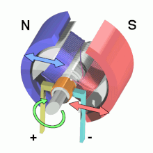
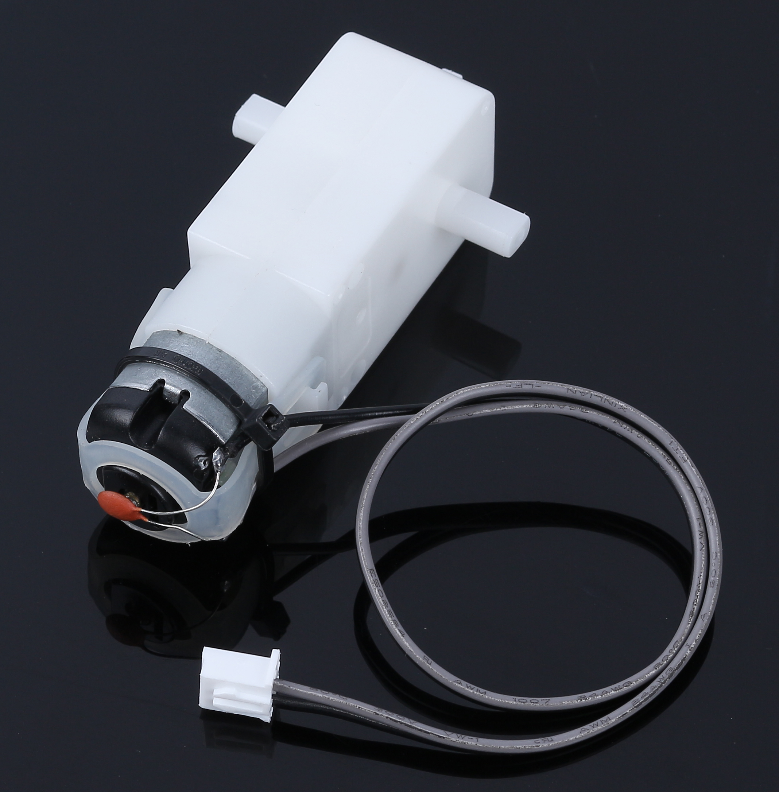
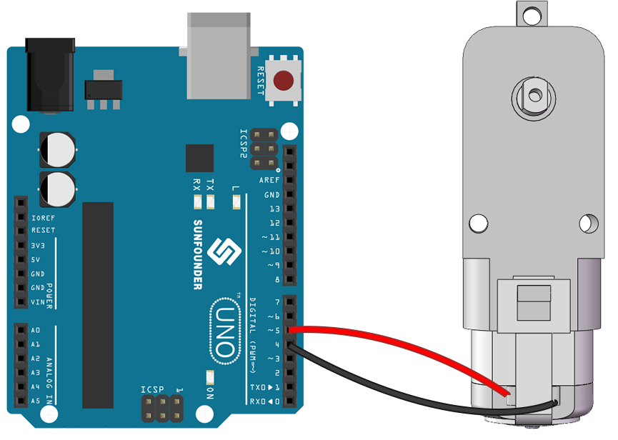
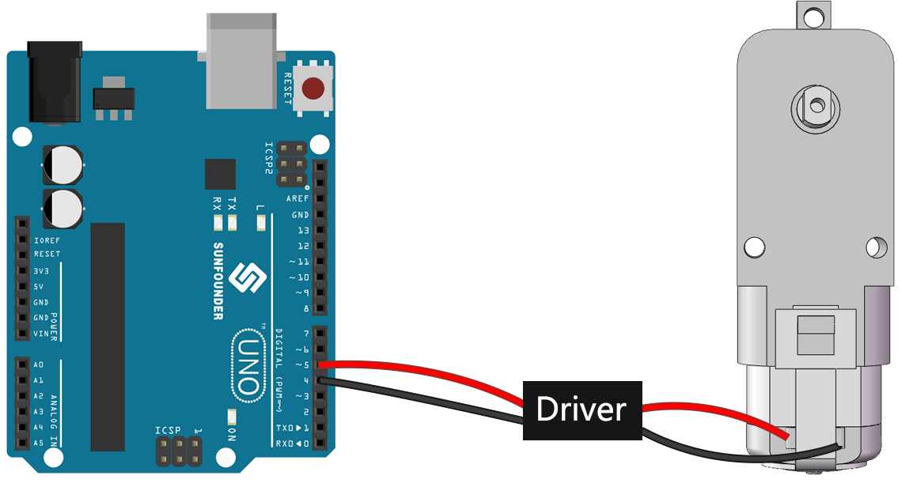
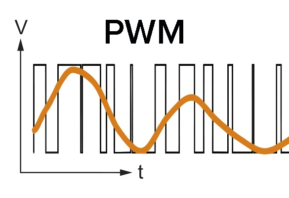


第4课：掌握TT电机
=================================

在之前的课程中，我们探索了火星车、它们的悬挂系统，并深入了解了Arduino的知识。

在这激动人心的课程中，我们将探讨电机的运作原理，这是驱动火星车的关键部件。
我们将了解驱动这些电机的原理，并学习如何使用SunFounder R3板和GalaxyRVR扩展板来控制它们。

通过本课程的学习，你将牢固掌握电机的工作原理并获得电机控制的动手经验。

让我们开始吧！

.. raw:: html

    <video width="600" loop autoplay muted>
        <source src="../_static/video/left_1.mp4" type="video/mp4">
        您的浏览器不支持此视频标签。
    </video>

.. note::

    如果你是在完全组装好GalaxyRVR之后学习本课程，你需要在上传代码之前将此开关拨到右侧。

    .. image:: ../img/camera_upload.png
        :width: 500
        :align: center

课程目标
----------------------
* 理解电机的基本原理和TT电机的特性。
* 学习如何控制TT电机的方向和速度。
* 了解GalaxyRVR扩展板如何控制六个电机。

课程材料
-----------------------

* SunFounder R3板
* TT电机
* GalaxyRVR扩展板
* 电池
* USB数据线
* Arduino IDE
* 计算机

课程步骤
------------------

**步骤1：什么是电机？**

电机在我们日常生活中扮演着不可或缺的角色。它们无处不在！从为我们降温的电风扇，到帮助我们制作美味蛋糕的搅拌机，再到在街道上飞驰的电动汽车——电机让东西动起来！

电机就像机器的心脏。它将电能转换为机械能，使我们的玩具、电器甚至大型车辆充满活力！

电机背后的魔法其实不是魔法——而是科学，具体来说是电磁感应原理。它的工作原理是这样的：当电流供应给电机时，会产生一个磁场。这个磁场然后与电机内的其他磁铁相互作用，使电机旋转。这种旋转，就像旋转陀螺一样，可以用来驱动轮子、螺旋桨或机器的任何其他运动部件。

我们在GalaxyRVR中关注的那种特定类型的电机称为TT减速电机。

这本质上是一个普通电机与一系列齿轮的组合，全部封装在塑料外壳内。

当电机旋转时，齿轮将这种旋转传递到我们火星车的轮子上。使用齿轮提供了一个关键的优势——它增加了扭矩，使电机能够移动更大、更重的负载。

.. image:: img/motor_internal.gif
    :align: center
    :width: 600

看到科学和工程原理如何变为现实，是不是很迷人？电机是这些原理在行动中的完美例子。通过了解电机的工作原理，我们可以想象和发明各种各样的机器。让我们更深入地探索电机的世界，释放我们的创造力！

**步骤2：探索电机的功能和运作**

在了解了电机是什么以及它的广泛应用范围之后，是时候深入探究电机运作的核心了。

本质上，电机的工作原理是电磁学。当电流通过导线时，会在其周围产生磁场。这个磁场可以与其他磁场相互作用，产生运动。

考虑一个简单的实验，我们将电机直接连接到电池上。电池的电流流入电机，触发电机内部机制开始旋转。这种旋转动作是由于电机内部的磁力所致。

    .. image:: img/motor_battery.png

有趣的是，如果你反转电池的连接，电机会向相反方向旋转！这是因为电流方向改变了，从而改变了磁场的方向，进而改变了电机的旋转方向。

现在我们知道了将电机直接连接到电池可以使其旋转，但我们通常希望用代码来控制它的运动，所以我们在它们之间加入一个Arduino板。但如果我们尝试将电机直接连接到Arduino板上的信号引脚，会发生什么呢？

如果你猜测电机不会旋转，那你是对的！但为什么会这样呢？

答案在于Arduino板的电流输出。典型Arduino板上的信号引脚只能输出约20mA的电流，这不足以驱动电机。

那么，我们如何使用Arduino控制电机呢？这时一个关键部件就出现了——电机驱动。把电机驱动想象成Arduino和电机之间的桥梁。它从Arduino接收低电流控制信号，将其放大，然后发送到电机，从而使电机旋转。

在下一步中，我们将深入了解电机驱动的具体情况，并理解如何有效地将其与Arduino板一起使用来控制电机。敬请期待更多精彩学习内容！

**步骤3：电机驱动如何控制电机**

我们的GalaxyRVR扩展板，包含在套件中，作为我们火星车的控制中心。它是我们连接所有传感器、电机和电源的枢纽。它由多个组件组成，使我们能够有效控制和供电我们的火星车。

在扩展板的右侧，你会注意到六个电机端口。然而，它们分为两组，每组由单独的电机驱动芯片控制。三个标有"Left"（左）的端口由一个芯片控制，另外三个标有"Right"（右）的端口由另一个芯片控制。

.. image:: img/motor_shield.png

让我们通过动手实践来了解这两个驱动芯片如何控制六个电机：

* **1. 连接电路**

    #. 将GalaxyRVR扩展板插入R3板，连接一个电机，最后插入电池为扩展板供电。

        .. raw:: html

            <video width="600" loop autoplay muted>
                <source src="../_static/video/connect_shield.mp4" type="video/mp4">
                您的浏览器不支持此视频标签。
            </video>

    #. 首次使用时，建议先插入Type-C USB数据线将电池充满电。然后打开电源。

        .. raw:: html

            <video width="600" loop autoplay muted>
                <source src="../_static/video/plug_usbc.mp4" type="video/mp4">
                您的浏览器不支持此视频标签。
            </video>

* **2. 编写和上传代码**

    #. 打开Arduino IDE并输入以下代码：

        .. code-block:: arduino

            void setup() {
                pinMode(2, OUTPUT);
                pinMode(3, OUTPUT);
            }

            void loop() {
                digitalWrite(2, LOW);
                digitalWrite(3, HIGH);
            }

        * ``pinMode()``：此函数将引脚设置为输入或输出，就像决定故事中的角色是说话（输出）还是听（输入）。
        * ``digitalWrite()``：此函数可以将引脚设置为高电平（开）或低电平（关），就像开关魔法灯一样。

    #. 一旦你选择了正确的板（Arduino Uno）和端口，点击 **上传** 按钮。就像把信投入邮箱一样——你正在将指令发送给Arduino！

        .. image:: img/motor_upload.png

    #. 代码成功上传后，你将看到电机开始顺时针旋转。

        .. raw:: html

            <video width="600" loop autoplay muted>
                <source src="../_static/video/left_1.mp4" type="video/mp4">
                您的浏览器不支持此视频标签。
            </video>

* **3. 关于电路内部连接**

    #. 你可以将另外两个电机插入标有"Left"的电机端口。你会看到它们同时旋转。

    #. 现在，让我们理解两个驱动芯片如何控制六个电机的简单原理。Arduino板上的引脚2和3输出信号到电机驱动芯片，芯片的另一端并联连接三个电机。类似地，引脚4和5输出信号到另一个驱动芯片，该芯片又并联连接另外三个电机。

        .. image:: img/motor_driver.png
            :width: 500

    #. 如果你想测试另一个驱动芯片，只需将引脚改为 ``4`` 和 ``5``。

        .. code-block:: arduino
            :emphasize-lines: 10,11

            const int in3 = 4;
            const int in4 = 5;

            void setup() {
                pinMode(in3, OUTPUT);
                pinMode(in4, OUTPUT);
            }

            void loop() {
                digitalWrite(in3, LOW);
                digitalWrite(in4, HIGH);
            }

        这里，我们定义了两个变量来表示引脚4和5。通过使用变量，我们可以轻松管理和调整整个代码中的引脚分配。

        可以把它想象成给每个引脚编号分配一个特定的角色或职责。当我们决定重新分配角色时，不需要遍历整个脚本更改每个实例，只需更新脚本开头（变量最初定义的地方）的分配即可。

* **4. 关于驱动逻辑**

    #. 在之前的测试中，你会注意到所有电机都朝一个方向旋转。我们如何使其向相反方向旋转？有人可能会建议交换两个引脚的高低电平。这是正确的。

        .. code-block:: arduino
            :emphasize-lines: 1,2

            const int in3 = 4;
            const int in4 = 5;

            void setup() {
                pinMode(in3, OUTPUT);
                pinMode(in4, OUTPUT);
            }

            void loop() {
                digitalWrite(in3, HIGH);
                digitalWrite(in4, LOW);
            }

        编写完代码并上传到Arduino板后，电机将按指令运行。

        .. raw:: html

            <video width="600" loop autoplay muted>
                <source src="../_static/video/right_cc.mp4" type="video/mp4">
                您的浏览器不支持此视频标签。
            </video>

    #. 现在让我们看看驱动芯片的内部驱动逻辑。

        .. list-table::
            :widths: 25 25 50
            :header-rows: 1

            * - INA
              - INB
              - 电机
            * - L
              - L
              - 待机
            * - L
              - H
              - 顺时针
            * - H
              - L
              - 逆时针
            * - H
              - H
              - 刹车

    #. 现在，让我们尝试让电机顺时针旋转2秒，逆时针旋转2秒，然后停止。

        .. code-block:: arduino
            :emphasize-lines: 10,11,12,13,14,15,16,17,18

            const int in3 = 4;
            const int in4 = 5;

            void setup() {
                pinMode(in3, OUTPUT);
                pinMode(in4, OUTPUT);
            }

            void loop() {
                digitalWrite(in3, LOW);
                digitalWrite(in4, HIGH);
                delay(2000);
                digitalWrite(in3, HIGH);
                digitalWrite(in4, LOW);
                delay(2000);
                digitalWrite(in3, HIGH);
                digitalWrite(in4, HIGH);
                delay(5000);
            }

        * 这里我们使用 ``delay()`` 函数让Arduino暂停一段时间，就像在我们的故事中间小睡一会儿。
        * 在代码中，我们使用"刹车"状态来停止电机，你会注意到电机会突然停止。尝试将两个引脚都设为低电平来测试"待机"状态，你会发现电机会逐渐减速直至停止。

现在你应该更好地理解了电机驱动芯片如何通过GalaxyRVR扩展板控制电机，以及我们如何使用Arduino代码来操纵电机的运动。几行代码就能控制像电机这样的物理对象的行为，是不是很迷人？

在继续前进时，思考以下问题：

* 如果我们将 ``loop()`` 函数中的所有代码移到 ``setup()`` 函数中，电机的行为会如何变化？
* 你会如何修改代码来同时控制六个电机？

请记住，你越是在代码上进行实验和尝试，你就学到越多。随意根据自己的想法调整、修改和优化代码。祝编程愉快！

**步骤4：控制电机速度**

在之前的步骤中，我们通过简单地将引脚设为高电平或低电平来控制电机的方向。
这就像给电机全功率驱动它，类似于在汽车中把油门踏板踩到底。
但在许多情况下，我们可能希望调整电机速度以适应不同的场景，
就像我们根据是在城市还是在高速公路上行驶来调整车速一样。这就是脉宽调制（PWM）发挥作用的地方。

PWM是一种通过快速在高低电平之间切换输出，来产生可变电压输出效果的技术。
通过PWM，我们可以模拟模拟信号的效果，而实际上只输出数字信号。

你可能觉得这很难理解，没关系！在接下来的部分中，我们将通过编程学习如何使用PWM调整电机速度。

请注意，虽然SunFounder R3板有一些带有内置PWM功能的引脚，但我们不能将它们用于电机，因为它们已经有其他功能。因此，我们将驱动芯片连接到引脚2、3、4和5，并使用Arduino的SoftPWM库在这些引脚上启用PWM。

接下来我们要做的是：

#. 打开Arduino IDE，在 **库管理器** 中搜索 ``softpwm`` 并安装它。

    .. raw:: html

        <video width="600" loop autoplay muted>
            <source src="../_static/video/install_softpwm.mp4" type="video/mp4">
            您的浏览器不支持此视频标签。
        </video>

#. 将以下代码输入Arduino IDE。成功上传代码后，电机将顺时针旋转。

    .. code-block:: arduino
        :emphasize-lines: 1, 7,11,12

        #include <SoftPWM.h>

        const int in1 = 2;
        const int in2 = 3;

        void setup() {
            SoftPWMBegin();
        }

        void loop() {
            SoftPWMSet(in1, 0);
            SoftPWMSet(in2, 255);

        }

    * 在上面的代码中，我们首先在代码顶部添加了 ``SoftPWM.h``，使我们能够直接使用 ``SoftPWM`` 库中的函数。
    * 然后，使用 ``SoftPWMBegin()`` 函数初始化 ``SoftPWM`` 库。
    * 最后，在 ``loop()`` 函数中，我们使用 ``SoftPWMSet()`` 为 ``in1`` 和 ``in2`` 赋予不同的值，使电机开始运动。你会注意到效果与直接使用 ``LOW`` 和 ``HIGH`` 类似，但这里我们使用 ``0~255`` 范围内的数值。
    * 请记住，在Arduino的世界中，速度表示为0（就像停在停车标志处的汽车）到255（在高速公路上飞驰！）之间的值。所以，当我们说 ``SoftPWMSet(in2, 255)`` 时，我们在告诉电机全速前进！

#. 现在，让我们输入其他值并观察电机速度的差异。

    .. code-block:: arduino
        :emphasize-lines: 12,13,14,15

        #include <SoftPWM.h>

        const int in1 = 2;
        const int in2 = 3;

        void setup() {
            SoftPWMBegin();
        }

        void loop() {
            SoftPWMSet(in1, 0);
            for (int i = 0; i <= 255; i++) {
                SoftPWMSet(in2, i);
                delay(100);
        }
            delay(1000);
        }

    在上面的代码中，我们使用 ``for`` 循环将变量 ``i`` 递增到 ``255``。C语言中的 ``for`` 循环用于多次迭代程序的一部分。它由三部分组成：

    .. image:: img/motor_for123.png
        :width: 400
        :align: center

    * **初始化** ：这一步最先执行，且仅在第一次进入循环时执行一次。它允许我们声明和初始化任何循环控制变量。
    * **条件** ：这是初始化后的下一步。如果条件为真，则执行循环体。如果为假，则不执行循环体，控制流程跳出for循环。
    * **递增或递减** ：执行初始化和条件步骤以及循环体代码后，执行递增或递减步骤。这条语句允许我们更新任何循环控制变量。

    for循环的流程图如下所示：

    .. image:: img/motor_for.png

    因此，运行上述代码后，你将看到电机速度逐渐增加。它会暂停一秒钟，然后从0重新开始并逐渐增加。

    .. raw:: html

        <video width="600" loop autoplay muted>
            <source src="../_static/video/left_speed.mp4" type="video/mp4">
            您的浏览器不支持此视频标签。
        </video>

在这一步中，我们了解了脉宽调制（PWM），这是一种控制电机速度的技术。通过使用Arduino的SoftPWM库，我们可以调整电机的速度，在仅输出数字信号的同时模拟模拟信号。这为我们提供了对火星车运动的更精细控制，并为未来更复杂的操作做好了准备。

**步骤5：反思与改进**

完成本课后，你现在应该熟悉电机的工作原理，以及如何通过编程控制其方向和速度。

让我们通过以下挑战来测试你的理解：

* 你会如何修改for循环来逐渐降低电机速度？
* 你会如何控制电机在逆时针旋转时加速或减速？

你可以用提供的代码进行实验来回答这些问题。随意根据你的假设调整代码，并观察电机行为的变化。

你的动手实验和对这些问题的反思将加深你的理解并提高你解决问题的能力。正是通过这些挑战，真正的学习才会发生。永远记住，在你的探索之旅中没有"正确"或"错误"——这一切都是关于学习和发现！
