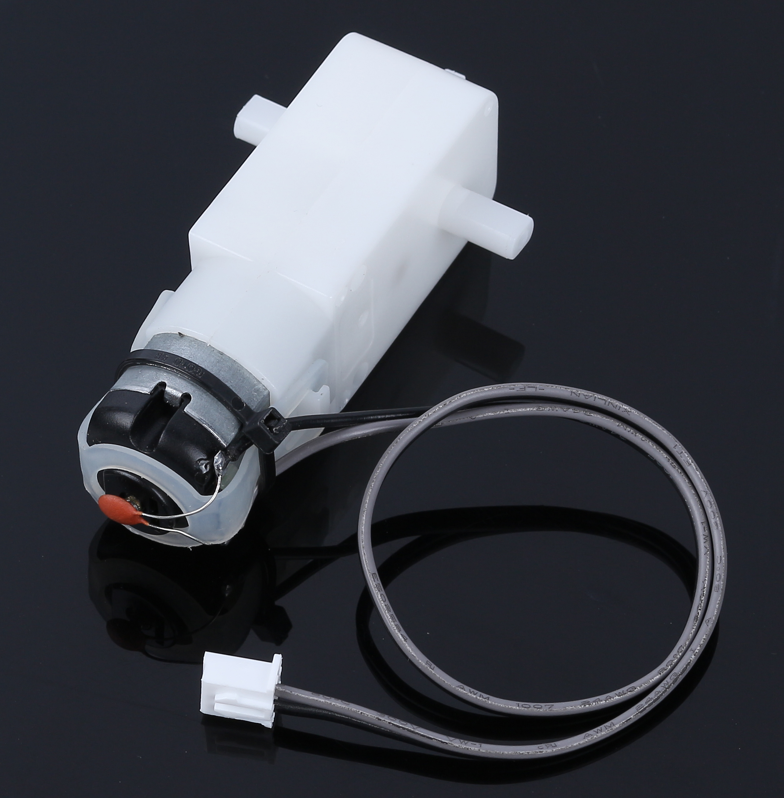
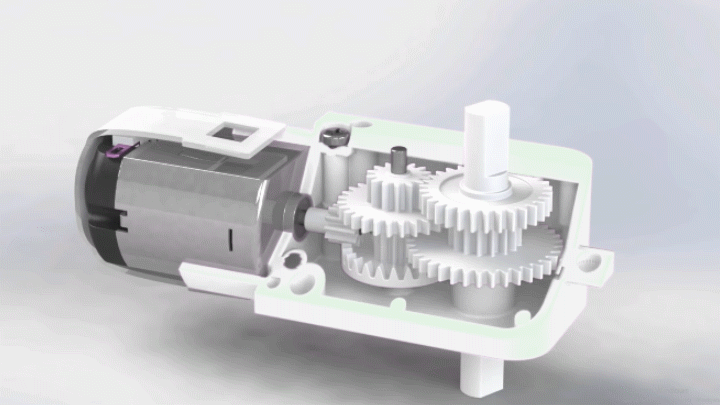
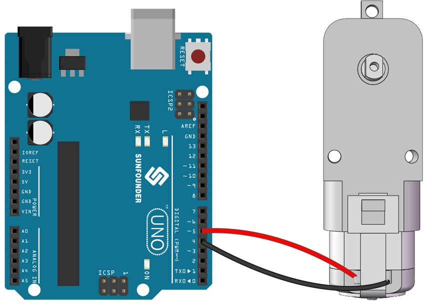
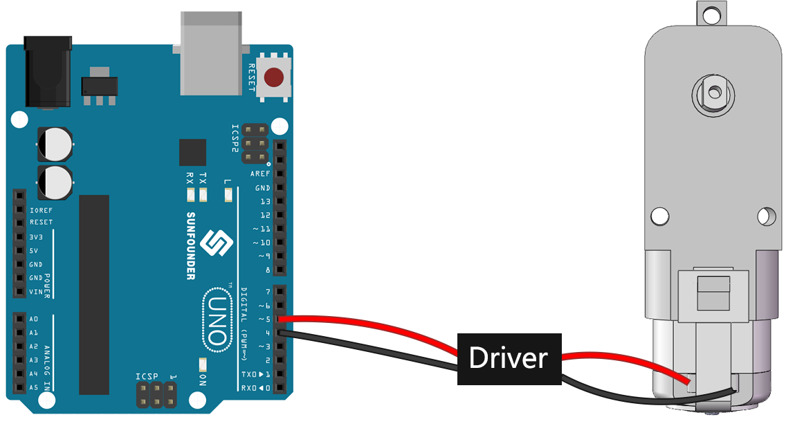
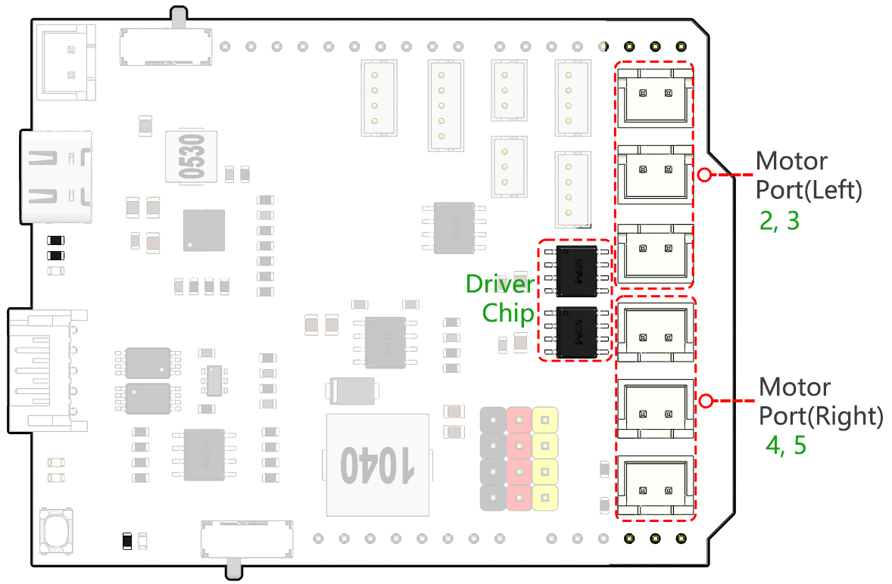
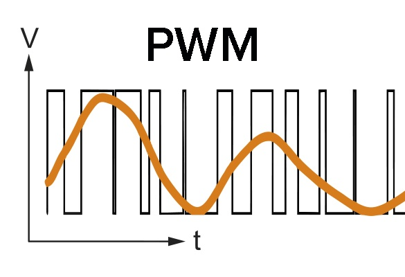

Lección 4: Dominando el Motor TT
=================================

En las lecciones anteriores, exploramos los rovers de Marte, sus sistemas de suspensión y profundizamos en el conocimiento sobre Arduino.

En este emocionante curso, exploraremos el funcionamiento de los motores, un componente clave que impulsa los rovers de Marte.
Comprenderemos los principios que alimentan estos motores y aprenderemos a controlarlos utilizando la placa SunFounder R3 y un Shield GalaxyRVR.

Al final de este curso, tendrás una comprensión sólida del funcionamiento del motor y experiencia práctica en el control de motores.

?Vamos a sumergirnos!

.. raw:: html

    <video width="600" loop autoplay muted>
        <source src="../_static/video/left_1.mp4" type="video/mp4">
        Tu navegador no soporta la etiqueta de video.
    </video>

.. note::

    Si estás aprendiendo este curso después de haber ensamblado completamente el GalaxyRVR, debes mover este interruptor hacia la derecha antes de cargar el código.

    .. image:: ../img/camera_upload.png
        :width: 500
        :align: center

Objetivos del Curso
----------------------
* Comprender los principios básicos de los motores y las características del motor TT.
* Aprender a controlar la dirección y velocidad del motor TT.
* Entender cómo el Shield GalaxyRVR controla seis motores.

Materiales del Curso
-----------------------

* Placa SunFounder R3
* Motor TT
* Shield GalaxyRVR
* Batería
* Cable USB
* Arduino IDE
* Computadora

Pasos del Curso
------------------

**Paso 1: ?Qué es un Motor?**

Los motores juegan un papel fundamental en nuestra vida diaria. ?Están en todas partes! Desde los ventiladores eléctricos que nos refrescan en los días calurosos, las batidoras que nos ayudan a hacer deliciosos pasteles, hasta los coches eléctricos que pasan zumbando por las calles – ?los motores hacen que las cosas se muevan!

Un motor es como el corazón de una máquina. Convierte la energía eléctrica en energía mecánica, ?dando vida a nuestros juguetes, electrodomésticos e incluso grandes vehículos!

La magia detrás de un motor no es magia en absoluto, es ciencia, específicamente el principio de inducción electromagnética. Así es como funciona: cuando se suministra electricidad a un motor, este genera un campo magnético. Este campo magnético luego interactúa con otros imanes dentro del motor, haciendo que el motor gire. Este giro, como el de una peonza, puede usarse para mover ruedas, hélices o cualquier otra parte móvil de una máquina.

.. image:: img/motor_rotate.gif
    :align: center

El tipo de motor en el que nos centramos en nuestro GalaxyRVR es un tipo específico llamado Motor con Engranajes TT.

Se trata esencialmente de un motor normal combinado con una serie de engranajes, todo encerrado dentro de una carcasa de plástico.

A medida que el motor gira, los engranajes transmiten este giro a las ruedas de nuestro rover. El uso de engranajes proporciona un beneficio crucial: aumenta el par motor, permitiendo que el motor mueva cargas más grandes y pesadas.

?No es fascinante ver cómo los principios de la ciencia y la ingeniería cobran vida? Los motores son un ejemplo perfecto de estos principios en acción. Al entender cómo funcionan los motores, podemos imaginar e inventar una amplia variedad de máquinas. ?Profundicemos en el mundo de los motores y liberemos nuestra creatividad!

**Paso 2: Explorando el Funcionamiento y Operación del Motor**

Habiendo entendido qué es un motor y su amplio espectro de aplicaciones, es hora de adentrarnos en el corazón del funcionamiento del motor.

En esencia, un motor funciona según el principio del electromagnetismo. Cuando una corriente eléctrica pasa a través de un cable, genera un campo magnético a su alrededor. Este campo magnético puede interactuar con otros campos magnéticos, provocando movimiento.

Considera un experimento simple donde conectamos un motor directamente a una batería. La corriente de la batería fluye hacia el motor, activando el mecanismo interno del motor para que comience a girar. Esta acción de giro se debe a las fuerzas magnéticas dentro del motor.

    .. image:: img/motor_battery.png

Curiosamente, si inviertes las conexiones a la batería, ?el motor gira en la dirección opuesta! Esto sucede porque la dirección del flujo de corriente cambia, alterando la dirección del campo magnético y, en consecuencia, la dirección del giro del motor.

Ahora sabemos que conectar el motor directamente a una batería puede hacerlo girar, pero a menudo queremos controlar su movimiento con código, por lo que incluimos una placa Arduino entre ellos. Pero, ?qué pasaría si intentáramos conectar el motor directamente a los pines de se?al de la placa Arduino?

Si adivinaste que el motor no giraría, ?estás en lo correcto! Pero, ?por qué es así?

La respuesta está en la salida de corriente de la placa Arduino. Los pines de se?al en una placa Arduino típica solo pueden emitir alrededor de 20 mA de corriente, lo cual es insuficiente para accionar un motor.

Entonces, ?cómo podemos controlar motores usando nuestro Arduino? Aquí es donde entra en escena un componente crucial: un driver de motor. Piensa en un driver de motor como un puente entre el Arduino y el motor. Toma la se?al de control de baja corriente del Arduino, la amplifica y la envía al motor, permitiendo así que el motor gire.

En nuestro próximo paso, profundizaremos en los detalles del driver de motor y entenderemos cómo podemos usarlo eficazmente con nuestra placa Arduino para controlar un motor. ?Mantente atento para más aprendizaje emocionante!

**Paso 3: Cómo el Motor es Controlado por el Driver de Motor**

Nuestro Shield GalaxyRVR, incluido en el kit, sirve como centro de control para nuestro Rover de Marte. Es el punto central donde conectamos todos nuestros sensores, motores y fuente de alimentación. Consiste en varios componentes que nos permiten controlar y alimentar nuestro Rover de manera efectiva.

En el lado derecho del shield, notarás seis puertos para motores. Sin embargo, están agrupados en dos conjuntos, cada uno controlado por un chip driver de motor independiente. Tres puertos marcados como "Left" (Izquierda) son controlados por un chip, y los otros tres puertos marcados como "Right" (Derecha) son controlados por otro.

Aprendamos cómo estos dos chips driver controlan los seis motores a través de la experiencia práctica:

* **1. Conexión del Circuito**

    #. Conecta el Shield GalaxyRVR a la placa R3, conecta un motor y, finalmente, conecta la batería para proporcionar energía a la placa de expansión.

        .. raw:: html

            <video width="600" loop autoplay muted>
                <source src="../_static/video/connect_shield.mp4" type="video/mp4">
                Tu navegador no soporta la etiqueta de video.
            </video>

    #. La primera vez que lo uses, se recomienda que conectes un cable USB Tipo-C para cargar completamente la batería primero. Luego enciende la alimentación.

        .. raw:: html

            <video width="600" loop autoplay muted>
                <source src="../_static/video/plug_usbc.mp4" type="video/mp4">
                Tu navegador no soporta la etiqueta de video.
            </video>

* **2. Escritura y Carga de Código**

    #. Abre el Arduino IDE e ingresa el siguiente código:

        .. code-block:: arduino

            void setup() {
                pinMode(2, OUTPUT);
                pinMode(3, OUTPUT);
            }

            void loop() {
                digitalWrite(2, LOW);
                digitalWrite(3, HIGH);
            }

        * ``pinMode()``: Esta función configura un pin como INPUT o OUTPUT, similar a decidir si un personaje en nuestra historia habla (OUTPUT) o escucha (INPUT).
        * ``digitalWrite()``: Esta función puede establecer un pin en HIGH (encendido) o LOW (apagado), como si encendiéramos y apagáramos una luz mágica.

    #. Una vez que hayas seleccionado la placa correcta (Arduino Uno) y el puerto, haz clic en el botón **Upload** (Cargar). Es como poner una carta en un buzón: ?estás enviando tus instrucciones a Arduino!

        .. image:: img/motor_upload.png

    #. Una vez que el código se haya cargado correctamente, verás que el motor comienza a girar en sentido horario.

        .. raw:: html

            <video width="600" loop autoplay muted>
                <source src="../_static/video/left_1.mp4" type="video/mp4">
                Tu navegador no soporta la etiqueta de video.
            </video>

* **3. Acerca de la Conexión Interna del Circuito**

    #. Puedes conectar dos motores más a los puertos marcados como "Left" (Izquierda). Verás que giran simultáneamente.

    #. Ahora, entendamos el principio simple de cómo los dos chips driver controlan los seis motores. Los pines 2 y 3 de la placa Arduino emiten se?ales al chip driver de motor, y el otro extremo del chip está conectado a tres motores en paralelo. De manera similar, los pines 4 y 5 emiten se?ales a otro chip driver, que a su vez está conectado a otros tres motores en paralelo.

        .. image:: img/motor_driver.png
            :width: 500

    #. Si quieres probar otro chip driver, solo necesitas cambiar los pines a ``4`` y ``5``.

        .. code-block:: arduino
            :emphasize-lines: 10,11

            const int in3 = 4;
            const int in4 = 5;

            void setup() {
                pinMode(in3, OUTPUT);
                pinMode(in4, OUTPUT);
            }

            void loop() {
                digitalWrite(in3, LOW);
                digitalWrite(in4, HIGH);
            }

        Aquí, definimos dos variables para representar los pines 4 y 5. Al usar variables, podemos gestionar y ajustar fácilmente nuestras asignaciones de pines en todo nuestro código.

        Piensa en ello como si asignáramos un rol o deber específico a cada número de pin. Cuando decidimos reasignar los roles, en lugar de revisar todo el script y cambiar cada instancia, solo actualizamos la asignación al comienzo del script (donde la variable se define inicialmente).

* **4. Acerca de la Lógica de Accionamiento**

    #. En las pruebas anteriores, habrás notado que los motores giran todos en una dirección. ?Cómo hacemos que giren en la dirección opuesta? Alguien podría sugerir intercambiar el HIGH y LOW de los dos pines. Eso es correcto.

        .. code-block:: arduino
            :emphasize-lines: 1,2

            const int in3 = 4;
            const int in4 = 5;

            void setup() {
                pinMode(in3, OUTPUT);
                pinMode(in4, OUTPUT);
            }

            void loop() {
                digitalWrite(in3, HIGH);
                digitalWrite(in4, LOW);
            }

        Una vez que hayas escrito tu código y lo hayas cargado en tu placa Arduino, el motor se comportará según lo indicado.

        .. raw:: html

            <video width="600" loop autoplay muted>
                <source src="../_static/video/right_cc.mp4" type="video/mp4">
                Tu navegador no soporta la etiqueta de video.
            </video>

    #. Veamos ahora la lógica interna de accionamiento del chip driver.

        .. list-table::
            :widths: 25 25 50
            :header-rows: 1

            * - INA
              - INB
              - Motor
            * - L
              - L
              - Standby (Espera)
            * - L
              - H
              - Clockwise (Horario)
            * - H
              - L
              - Counterclockwise (Antihorario)
            * - H
              - H
              - Brake (Freno)

    #. Ahora, intentemos hacer que el motor gire en sentido horario durante 2 segundos, en sentido antihorario durante 2 segundos y luego se detenga.

        .. code-block:: arduino
            :emphasize-lines: 10,11,12,13,14,15,16,17,18

            const int in3 = 4;
            const int in4 = 5;

            void setup() {
                pinMode(in3, OUTPUT);
                pinMode(in4, OUTPUT);
            }

            void loop() {
                digitalWrite(in3, LOW);
                digitalWrite(in4, HIGH);
                delay(2000);
                digitalWrite(in3, HIGH);
                digitalWrite(in4, LOW);
                delay(2000);
                digitalWrite(in3, HIGH);
                digitalWrite(in4, HIGH);
                delay(5000);
            }

        * Aquí usamos la función ``delay()`` para hacer que Arduino haga una pausa durante un cierto tiempo, como tomar una siesta en medio de nuestra historia.
        * En el código, usamos el estado "Brake" (Freno) para detener el motor, y notarás que el motor se detiene abruptamente. Intenta configurar ambos pines en LOW para probar el estado "Standby" (Espera), y descubrirás que el motor se desacelera gradualmente hasta detenerse.

Ahora deberías tener una mejor comprensión de cómo el chip driver de motor controla los motores a través del Shield GalaxyRVR y cómo podemos usar el código de Arduino para manipular los movimientos del motor. ?No es fascinante cómo unas pocas líneas de código pueden dictar el comportamiento de un objeto físico como nuestro motor?

Considera las siguientes preguntas a medida que avanzas:

* Si movemos todo el código de la función ``loop()`` a la función ``setup()``, ?cómo cambiaría el comportamiento del motor?
* ?Cómo modificarías el código para controlar seis motores simultáneamente?

Recuerda, cuanto más experimentes y juegues con tu código, más aprenderás. Siéntete libre de ajustar, modificar y optimizar tu código como consideres oportuno. ?Feliz codificación!

**Paso 4: Controlando la Velocidad del Motor**

En el paso anterior, controlamos la dirección del motor simplemente configurando sus pines en HIGH o LOW.
Esto es como darle al motor toda la potencia para impulsarlo, similar a presionar el pedal del acelerador a fondo en un coche.
Pero en muchas situaciones, es posible que queramos ajustar la velocidad del motor para adaptarla a diferentes escenarios,
igual que ajustamos la velocidad de un coche dependiendo de si estamos conduciendo en una ciudad o en una autopista.
Aquí es donde entra en juego la Modulación por Ancho de Pulso (PWM).

PWM es una técnica utilizada para crear el efecto de una salida de voltaje variable al conmutar rápidamente la salida entre HIGH y LOW.
Con PWM, podemos simular el efecto de una se?al analógica mientras solo emitimos se?ales digitales.

Puede que te resulte difícil de entender, ?y está bien! Aprenderemos cómo ajustar la velocidad del motor usando PWM mediante la codificación en las siguientes secciones.

Ten en cuenta que, aunque la placa SunFounder R3 tiene algunos pines con funcionalidad PWM incorporada, no podemos usarlos para nuestro motor porque ya están cumpliendo otras funciones. Por lo tanto, conectamos los chips driver a los pines 2, 3, 4 y 5, y utilizamos la librería SoftPWM de Arduino para habilitar PWM en estos pines.

Esto es lo que haremos a continuación:

#. Abre Arduino IDE, busca ``softpwm`` en el **LIBRARY MANAGER** (Administrador de Librerías) e instálalo.

    .. raw:: html

        <video width="600" loop autoplay muted>
            <source src="../_static/video/install_softpwm.mp4" type="video/mp4">
            Tu navegador no soporta la etiqueta de video.
        </video>

#. Ingresa el siguiente código en Arduino IDE. Después de cargar el código correctamente, el motor girará en sentido horario.

    .. code-block:: arduino
        :emphasize-lines: 1, 7,11,12

        #include <SoftPWM.h>

        const int in1 = 2;
        const int in2 = 3;

        void setup() {
            SoftPWMBegin();
        }

        void loop() {
            SoftPWMSet(in1, 0);
            SoftPWMSet(in2, 255);

        }

    * En el código anterior, primero agregamos ``SoftPWM.h`` al inicio del código, lo que nos permite usar las funciones de la librería ``SoftPWM`` directamente.
    * Luego, inicializamos la librería ``SoftPWM`` con la función ``SoftPWMBegin()``.
    * Finalmente, en la función ``loop()``, usamos ``SoftPWMSet()`` para asignar diferentes valores a ``in1`` e ``in2``, poniendo el motor en movimiento. Notarás que el efecto es similar a usar directamente ``LOW`` y ``HIGH``, pero aquí usamos valores numéricos dentro de un rango de ``0~255``.
    * Recuerda, en el mundo de Arduino, la velocidad se expresa como un valor entre 0 (como un coche en una se?al de stop) y 255 (?acelerando por la autopista!). Así que, cuando decimos ``SoftPWMSet(in2, 255)``, ?le estamos diciendo a ese motor que vaya a máxima velocidad!

#. Ahora, ingresemos otros valores y observemos las diferencias en la velocidad del motor.

    .. code-block:: arduino
        :emphasize-lines: 12,13,14,15

        #include <SoftPWM.h>

        const int in1 = 2;
        const int in2 = 3;

        void setup() {
            SoftPWMBegin();
        }

        void loop() {
            SoftPWMSet(in1, 0);
            for (int i = 0; i <= 255; i++) {
                SoftPWMSet(in2, i);
                delay(100);
        }
            delay(1000);
        }

    En el código anterior, usamos un bucle ``for`` para incrementar una variable ``i`` hasta ``255``. El bucle ``for`` en lenguaje C se utiliza para iterar sobre una parte del programa varias veces. Consta de tres partes:

    .. image:: img/motor_for123.png
        :width: 400
        :align: center

    * **Inicialización**: Este paso se ejecuta primero y solo una vez cuando entramos en el bucle por primera vez. Nos permite declarar e inicializar cualquier variable de control del bucle.
    * **Condición**: Este es el siguiente paso después de la inicialización. Si es verdadera, se ejecuta el cuerpo del bucle. Si es falsa, el cuerpo del bucle no se ejecuta y el flujo de control sale del bucle for.
    * **Incremento o Decremento**: Después de ejecutar los pasos de Inicialización y Condición y el código del cuerpo del bucle, se ejecuta el paso de Incremento o Decremento. Esta sentencia nos permite actualizar cualquier variable de control del bucle.

    El diagrama de flujo para el bucle for se muestra a continuación:

    .. image:: img/motor_for.png

    Entonces, después de ejecutar el código anterior, verás que la velocidad del motor aumenta gradualmente. Se detiene por un segundo, y luego comienza de nuevo desde 0 y aumenta gradualmente.

    .. raw:: html

        <video width="600" loop autoplay muted>
            <source src="../_static/video/left_speed.mp4" type="video/mp4">
            Tu navegador no soporta la etiqueta de video.
        </video>

En este paso, hemos aprendido sobre la Modulación por Ancho de Pulso (PWM), una técnica para controlar la velocidad de nuestro motor. Al usar la librería SoftPWM de Arduino, podemos ajustar la velocidad del motor, permitiéndonos simular se?ales analógicas mientras solo emitimos se?ales digitales. Esto nos proporciona un control más preciso sobre los movimientos de nuestro rover y nos prepara para maniobras más complejas en el futuro.

**Paso 5: Reflexiona y Mejora**

Habiendo completado esta lección, ahora deberías estar familiarizado con los principios de funcionamiento de los motores, así como con cómo controlar su dirección y velocidad mediante la programación.

Pongamos a prueba tu comprensión con estos desafíos:

* ?Cómo modificarías el bucle for para disminuir gradualmente la velocidad del motor?
* ?Cómo controlarías el motor para que acelere o desacelere mientras gira en sentido antihorario?

Puedes experimentar con el código proporcionado para responder estas preguntas. Siéntete libre de ajustar el código según tus hipótesis y observa los cambios en el comportamiento del motor.

Tus experimentos prácticos y reflexiones sobre estas preguntas profundizarán tu comprensión y mejorarán tus habilidades de resolución de problemas. Es a través de desafíos como estos que ocurre el verdadero aprendizaje. Recuerda siempre que no hay "correcto" o "incorrecto" en tu viaje exploratorio: ?todo se trata de aprender y descubrir!

