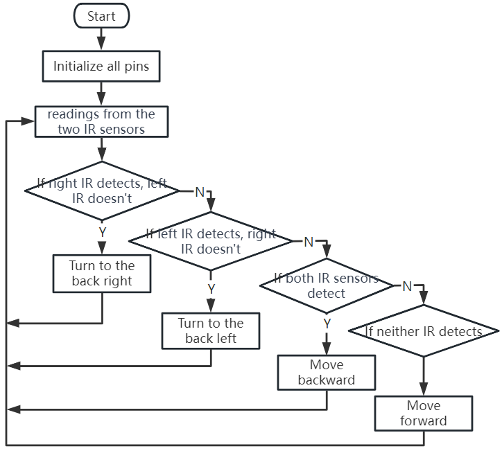


第6课：探索避障模块
==============================================================

我们将深入探索红外避障模块的世界。这些传感器安装在火星车的两侧，充当火星车的"眼睛"，帮助它躲避侧面的障碍物，并安全地在火星地貌中导航。

我们将学习如何将这些模块与我们的火星车集成，揭示其工作原理背后的奥秘，并编写代码使我们的火星车智能地避开遇到的任何障碍。

准备好为我们的火星车配备火星避障智能吧！让我们开始行动！

.. raw:: html

   <video width="600" loop autoplay muted>
      <source src="../_static/video/car_ir1.mp4" type="video/mp4">
      您的浏览器不支持此视频标签。
   </video>

.. note::

    如果你是在完全组装好GalaxyRVR之后学习本课程，你需要在上传代码之前将此开关拨到右侧。

    .. image:: ../img/camera_upload.png
        :width: 500
        :align: center

学习目标
----------------------

* 理解红外避障模块的工作原理和应用。
* 学习使用Arduino控制红外避障模块。
* 练习设计和构建基于红外避障的自动避障系统。

所需材料
---------------------

* 避障模块
* 基本工具和配件（例如螺丝刀、螺丝、导线等）
* 火星车模型（配备摇臂转向架系统、主板、电机）
* USB数据线
* Arduino IDE
* 计算机

步骤
-------------
**步骤1：安装避障模块**

现在我们将把两个避障模块安装到火星车上。

.. raw:: html

    <iframe width="600" height="400" src="https://www.youtube.com/embed/UWEj_ROYAt0" title="YouTube video player" frameborder="0" allow="accelerometer; autoplay; clipboard-write; encrypted-media; gyroscope; picture-in-picture; web-share" allowfullscreen></iframe>

组装步骤很简单，对吧？在接下来的步骤中，我们将了解这些模块的工作原理，以及它们如何帮助我们的火星车避障。敬请期待！

**步骤2：揭秘模块**

认识一下红外避障模块——我们火星车的智能助手。这个小设备充满了奇妙之处。让我们一探究竟：

.. image:: img/ir_avoid.png
    :width: 300
    :align: center

以下是引脚定义：

* **GND** ：这就像模块的锚点，将其连接到电路中的地或公共点。
* **+** ：这是模块获取能量的地方，需要3.3至5V直流电源。
* **Out** ：这是模块的通信器。默认情况下它保持高电平，只有在检测到障碍物时才变为低电平。
* **EN** ：这是模块的控制器。这个 **使能** 引脚决定模块何时工作。默认情况下，它连接到GND，意味着模块始终处于工作状态。

好奇这个小模块是如何工作的吗？这非常有趣！它使用一对红外组件——一个发射器和一个接收器。发射器就像模块的手电筒，发出红外光。
当出现障碍物时，红外光被反射回来并被接收器捕获。然后模块发出低电平信号，提醒我们的火星车有障碍物。

.. image:: img/ir_receive.png
    :align: center

我们的小模块相当强大，可以检测2-40cm范围内的障碍物，并具有出色的抗干扰能力。
然而，物体的颜色确实会影响其感应能力。较暗的物体，尤其是黑色的物体，检测距离较短。
在白色墙壁前，传感器的效率最高，感应范围在2-30cm内。

**EN** 引脚的低电平状态激活模块，跳线帽将 **EN** 引脚固定到GND。如果你希望通过代码控制 **EN** 引脚，则需要移除跳线帽。

.. image:: img/ir_cap.png
    :width: 400
    :align: center

模块上有两个电位器，一个用于调整发射功率，一个用于调整发射频率，通过调整这两个电位器，你可以调节其有效距离。

.. image:: img/ir_avoid_pot.png
    :width: 400
    :align: center

关于我们的小模块就介绍这么多了。在下一步中，我们将学习如何将其集成到我们的火星车中，并使用Arduino进行控制。敬请期待！

**步骤3：从两个模块读取数据**

就像好奇的太空探索者一样，让我们深入代码和传感器的宇宙！

#. 我们的火星车配备了两个特殊的"外星之眼"传感器，分别位于引脚7（右）和8（左）。这些"外星之眼"传感器实际上是我们的红外避障模块，时刻保持警惕，以躲避我们火星车星际旅程中的任何"太空岩石"（障碍物）！

    .. image:: img/ir_shield.png

#. 接下来，我们需要用Arduino代码这个通用语言与我们的火星车通信。

    首先，让我们给火星车的每只眼睛起一个独特的名字。我们称它们为 ``IR_RIGHT`` 和 ``IR_LEFT``，这样就不会混淆了。

        .. code-block:: arduino

            #define IR_RIGHT 7
            #define IR_LEFT 8

    现在，让我们的火星车知道这是它特殊的眼睛——它们将从外部世界获取信息，输入到火星车的电子大脑中。

        .. code-block:: arduino

            pinMode(IR_RIGHT, INPUT);
            pinMode(IR_LEFT, INPUT);

    为了确保我们的火星车与我们分享它的发现，我们建立了一条秘密通信线路，就像科幻电影中的间谍一样。下面这行代码以每秒9600位的速度启动串行对话——那是闪电般的速度！

        .. code-block:: arduino

            Serial.begin(9600);

    现在，我们的火星车用它的"外星之眼"扫描周围环境，并将发现结果传回给我们。如果它检测到障碍物，值将为0；如果路径畅通，值将为1。它不断向我们发送这些消息，让我们随时了解情况。

        .. code-block:: arduino

            int rightValue = digitalRead(IR_RIGHT);
            int leftValue = digitalRead(IR_LEFT);
            Serial.print("Right IR: ");
            Serial.println(rightValue);
            Serial.print("Left IR: ");
            Serial.println(leftValue);

    最后，火星车在每次传输后暂停片刻（约200毫秒）。这个短暂的中断让我们有机会在火星车发送下一条消息之前解读它的消息。

        .. code-block:: arduino

            delay(200);

    以下是完整的代码：

    .. raw:: html

        <iframe src=https://create.arduino.cc/editor/sunfounder01/98546821-5f4b-42ae-bc9f-e7ec15544c8b/preview?embed style="height:510px;width:100%;margin:10px 0" frameborder=0></iframe>

#. 代码准备好后，选择正确的板和端口，将代码上传到你的火星车。然后，点击右上角的串口监视器图标，调到我们的秘密通信线路。

    .. image:: img/ir_open_serial.png

#. 在开始接收火星车的消息之前，确保你的秘密通信线路调谐到与火星车相同的速度（9600波特）。好了——来自你火星车的实时更新！

    .. image:: img/ir_serial.png

#. 为了测试我们的系统，在一个传感器前挥动一块"太空岩石"（你的手）。你会看到值变为0，模块上相应的LED会亮起。那是火星车在说："注意，右边有太空岩石！"

    .. code-block::

        Right IR: 0
        Left IR: 1
        Right IR: 0
        Left IR: 1
        Right IR: 0
        Left IR: 1

到目前为止，你不仅穿越了太空，还破译了火星语言！迫不及待地想看看我们在下一个任务中会揭示什么星际秘密！

**步骤4：调整检测距离**

我们来到了一个关键步骤，那就是根据当前环境调整传感器的检测距离。出厂设置可能不是最优的。

如果两个红外模块的检测距离太短，火星车可能会撞上障碍物。如果太远，火星车可能会在距离障碍物还很远时就开始转弯，从而影响其移动。

以下是调整方法：

#. 首先调整右侧避障模块。在运输过程中，碰撞可能会导致红外模块上的发射器和接收器倾斜。因此，你需要手动将它们扶正。

    .. raw:: html

        <video width="600" loop autoplay muted>
            <source src="../_static/video/ir_adjust1.mp4" type="video/mp4">
            您的浏览器不支持此视频标签。
        </video>

#. 在右侧模块正前方约20厘米处放置一个障碍物。我们的火星车套件包装盒就是一个不错的选择！现在，旋转模块上的电位器，直到模块上的指示灯刚好亮起。然后，反复前后移动障碍物，检查指示灯是否在所需的距离亮起。如果指示灯未在正确距离亮起，或者它一直亮着不灭，你需要调整另一个电位器。

    .. raw:: html

        <video width="600" loop autoplay muted>
            <source src="../_static/video/ir_adjust2.mp4" type="video/mp4">
            您的浏览器不支持此视频标签。
        </video>

#. 对另一个模块重复相同的过程。

现在我们的传感器已完全准备好，让我们开始下一段旅程！

**步骤5：设计自动避障系统**

现在，让我们在太空探索中迈出一大步，利用这些来自火星车的消息。
我们将创建一个自动避障系统！

我们的计划是：如果右侧传感器检测到障碍物，火星车将向右后方转弯。如果左侧传感器检测到障碍物，火星车将向左后方转弯。如果两个传感器都检测到障碍物，火星车将向后移动。如果没有检测到障碍物，火星车将继续直线前进。

让我们用流程图来可视化这个计划，使其更加清晰。流程图是逻辑性规划的好方法，特别是在编程中！

让我们用火星车的语言（Arduino代码）将这个计划告诉它：

.. raw:: html

    <iframe src=https://create.arduino.cc/editor/sunfounder01/af6539d4-7b4b-4e74-a04a-9fa069391d4d/preview?embed style="height:510px;width:100%;margin:10px 0" frameborder=0></iframe>

在这段代码中，我们在 ``loop()`` 函数中使用了 ``if...else`` 语句。

    ``if...else`` 语句用于在两个备选方案中执行一段代码。
    然而，当我们需要在多于两个备选方案中选择时，我们使用 ``if...else if...else`` 语句。

    ``if...else if...else`` 语句的语法是：

    .. code-block:: arduino

        if (condition1) {
        // code block 1
        }
        else if (condition2){
        // code block 2
        }
        else if (condition3){
        // code block 3
        }
        else {
        // code block 4
        }

    其中，

    * 如果条件1为真，则执行代码块1。
    * 如果条件1为假，则评估条件2。
    * 如果条件2为真，则执行代码块2。
    * 如果条件2为假，则评估条件3。
    * 如果条件3为真，则执行代码块3。
    * 如果条件3为假，则执行代码块4。

现在我们已经设计了自动避障系统，是时候进行激动人心的部分了——将其付诸测试！

* 你可以观察火星车是否按照预期移动。
* 或者，将其放置在不同的光照条件下，观察其移动如何变化。

通过将科学融入我们的工程项目，我们正在成为太空侦探，解开火星车行为之谜。
这不仅仅是纠正错误，而是优化性能，使我们的火星车达到最佳状态！继续加油，太空侦探们！

**步骤6：反思与总结**

在测试阶段，你可能注意到了我们的火星车一个有趣的行为：虽然它能熟练地避开左右两侧的障碍物，但可能难以检测到正前方较小的障碍物。

我们如何解决这个挑战？

敬请期待下一课，我们将继续探索编程、传感器和障碍物检测的迷人世界。

请记住，每一个挑战都是学习和创新的机会。随着我们继续太空探索之旅，还有更多的发现和学习在等着我们！
