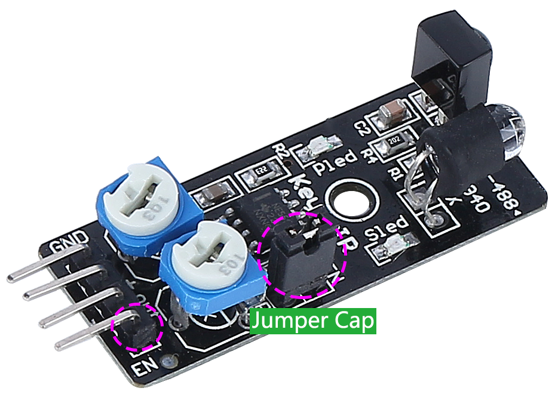
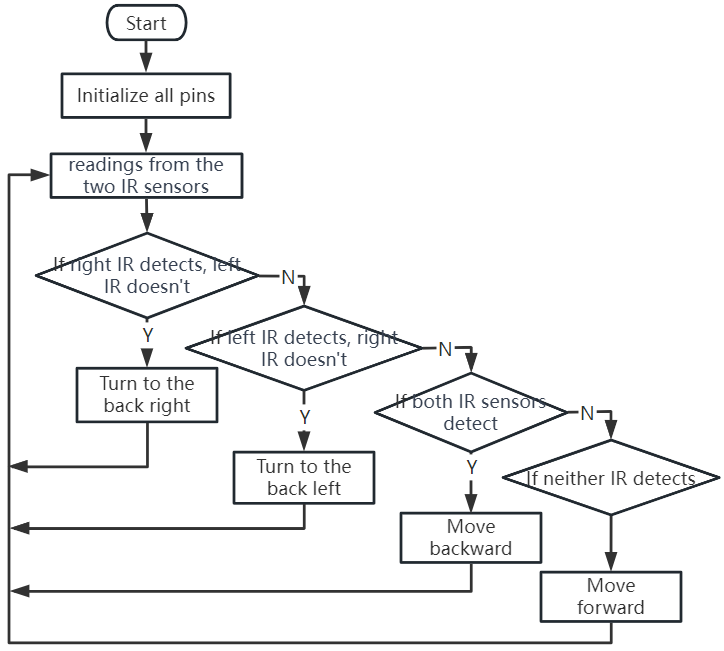

Lektion 6: Das Hindernisvermeidungsmodul erkunden
==========================================================

Wir tauchen ein in die Welt des Infrarot-Hindernisvermeidungsmoduls. Diese Sensoren, die an den Seiten unseres Mars Rovers angebracht sind, fungieren als die „Augen" des Rovers und helfen ihm, seitliche Hindernisse zu umgehen und sicher durch die Marslandschaft zu navigieren.

Wir lernen, wie man diese Module in unseren Rover integriert, die Magie hinter ihrer Funktionsweise entschlüsselt und Code entwickelt, der unseren Rover intelligent jedes Hindernis umgehen lässt.

Machen Sie sich bereit, unseren Rover mit einer marsianischen Hindernisausweich-Intelligenz auszustatten! Legen wir los!

.. raw:: html

   <video width="600" loop autoplay muted>
      <source src="../_static/video/car_ir1.mp4" type="video/mp4">
      Ihr Browser unterstützt das Video-Tag nicht.
   </video>

.. note::

    Wenn Sie diesen Kurs nach vollständiger Montage des GalaxyRVR lernen, müssen Sie diesen Schalter vor dem Hochladen des Codes nach rechts bewegen.

    .. image:: ../img/camera_upload.png
        :width: 500
        :align: center

Lernziele
-----------------------

* Das Arbeitsprinzip und die Anwendung des Infrarot-Hindernisvermeidungsmoduls verstehen.
* Lernen, mit Arduino das Infrarot-Hindernisvermeidungsmodul zu steuern.
* Üben, ein automatisches Hindernisvermeidungssystem auf Basis der Infrarot-Hindernisvermeidung zu entwerfen und zu bauen.

Benötigte Materialien
--------------------------

* Hindernisvermeidungsmodule
* Grundlegende Werkzeuge und Zubehör (z. B. Schraubendreher, Schrauben, Kabel usw.)
* Mars-Rover-Modell (ausgestattet mit Rocker-Bogie-System, Hauptplatinen, Motoren)
* USB-Kabel
* Arduino IDE
* Computer

Schritte
--------------
**Schritt 1: Das Hindernisvermeidungsmodul installieren**

Jetzt werden wir die beiden Hindernisvermeidungsmodule am Rover installieren.

.. raw:: html

    <iframe width="600" height="400" src="https://www.youtube.com/embed/UWEj_ROYAt0" title="YouTube video player" frameborder="0" allow="accelerometer; autoplay; clipboard-write; encrypted-media; gyroscope; picture-in-picture; web-share" allowfullscreen></iframe>

Die Montageschritte waren einfach, nicht wahr? In den folgenden Schritten lernen wir das Arbeitsprinzip dieser Module kennen und erfahren, wie sie unserem Mars Rover helfen, Hindernisse zu vermeiden. Bleiben Sie gespannt!

**Schritt 2: Das Modul entschlüsseln**

Lernen Sie das Infrarot-Hindernisvermeidungsmodul kennen – den cleveren Sidekick unseres Rovers. Dieses kleine Gerät steckt voller Wunder. Machen wir einen Rundgang:

.. image:: img/ir_avoid.png
    :width: 300
    :align: center

Hier sind die Pin-Definitionen:

* **GND**: Dies ist wie der Anker des Moduls, der es mit der Masse oder dem gemeinsamen Punkt in der Schaltung verbindet.
* **+**: Hier erhält das Modul seine Energie und benötigt eine Stromversorgung von 3,3 bis 5 V Gleichstrom.
* **Out**: Dies ist der Kommunikator des Moduls. Standardmäßig bleibt er auf HIGH und geht nur auf LOW, wenn es ein Hindernis erkennt.
* **EN**: Lernen Sie den Controller des Moduls kennen. Dieser **Enable**-Pin entscheidet, wann das Modul arbeiten soll. Standardmäßig ist er mit GND verbunden, was bedeutet, dass das Modul immer in Betrieb ist.

Neugierig, wie dieses winzige Modul funktioniert? Es ist ziemlich interessant! Es verwendet ein Paar IR-Komponenten – einen Sender und einen Empfänger. Der Sender ist wie die Taschenlampe des Moduls, die Infrarotlicht aussendet.
Wenn ein Hindernis auftaucht, wird das Infrarotlicht zurückgeworfen und vom Empfänger eingefangen. Das Modul gibt dann ein LOW-Signal aus und alarmiert unseren Rover vor dem Hindernis.

.. image:: img/ir_receive.png
    :align: center

Unser kleines Modul ist recht robust, erkennt Hindernisse in einem Bereich von 2-40 cm und verfügt über hervorragende Störsicherheitseigenschaften.
Allerdings beeinflusst die Farbe von Objekten seine Sensorik. Dunklere Objekte, insbesondere schwarze, werden in einer kürzeren Entfernung erkannt.
Vor einer weißen Wand arbeitet der Sensor am effizientesten und erfasst im Bereich von 2-30 cm.

Der LOW-Pegel des **EN**-Pins aktiviert das Modul, wobei die Jumper-Kappe den **EN**-Pin mit GND verbindet. Wenn Sie den **EN**-Pin über Code steuern möchten, muss die Jumper-Kappe entfernt werden.

Es gibt zwei Potentiometer auf dem Modul, eines zum Einstellen der Sendeleistung und eines zum Einstellen der Sendefrequenz. Durch Einstellen dieser beiden Potentiometer können Sie die effektive Reichweite anpassen.

.. image:: img/ir_avoid_pot.png
    :width: 400
    :align: center

Das war eine ganze Menge über unser kleines Modul. Im nächsten Schritt lernen wir, wie wir es in unseren Rover integrieren und mit dem Arduino steuern. Bleiben Sie gespannt!

**Schritt 3: Von den beiden Modulen lesen**

Wie neugierige Weltraumentdecker tauchen wir ein in das Universum der Codes und Sensoren!

#. Unser Mars Rover ist mit zwei speziellen „Alien-Auge"-Sensoren ausgestattet, die sich an den Pins 7 (rechts) und 8 (links) befinden. Diese „Alien-Auge"-Sensoren sind eigentlich unsere Infrarot-Hindernisvermeidungsmodule, die stets wachsam sind, um alle „Weltraumfelsen" (Hindernisse) auf der interstellaren Reise unseres Rovers zu umgehen!

    .. image:: img/ir_shield.png

#. Als Nächstes müssen wir mit unserem Rover in der universellen Sprache des Arduino-Codes kommunizieren.

    Zuerst geben wir jedem Auge des Rovers einen eindeutigen Namen. Nennen wir sie ``IR_RIGHT`` und ``IR_LEFT``, damit wir sie nicht verwechseln.

        .. code-block:: arduino

            #define IR_RIGHT 7
            #define IR_LEFT 8

    Nun lassen wir unseren Rover wissen, dass dies seine besonderen Augen sind – sie werden Informationen aus der Außenwelt in das elektronische Gehirn des Rovers einspeisen.

        .. code-block:: arduino

            pinMode(IR_RIGHT, INPUT);
            pinMode(IR_LEFT, INPUT);

    Damit unser Rover seine Erkenntnisse mit uns teilt, richten wir eine geheime Kommunikationslinie ein, wie Spione in einem Science-Fiction-Film. Die nächste Zeile startet eine serielle Unterhaltung mit einer Geschwindigkeit von 9600 Bit pro Sekunde – das ist blitzschnelles Geplapper!

        .. code-block:: arduino

            Serial.begin(9600);

    Nun scannt unser Rover seine Umgebung mit seinen „Alien-Augen" und übermittelt die Ergebnisse an uns zurück. Wenn er ein Hindernis erkennt, ist der Wert 0; wenn der Weg frei ist, ist der Wert 1. Er sendet uns ständig diese Nachrichten, um uns auf dem Laufenden zu halten.

        .. code-block:: arduino

            int rightValue = digitalRead(IR_RIGHT);
            int leftValue = digitalRead(IR_LEFT);
            Serial.print("Right IR: ");
            Serial.println(rightValue);
            Serial.print("Left IR: ");
            Serial.println(leftValue);

    Schließlich macht der Rover nach jeder Übertragung eine kurze Pause (etwa 200 Millisekunden). Diese winzige Pause gibt uns die Möglichkeit, die Nachricht des Rovers zu interpretieren, bevor er die nächste sendet.

        .. code-block:: arduino

            delay(200);

    Hier ist der vollständige Code:

    .. raw:: html

        <iframe src=https://create.arduino.cc/editor/sunfounder01/98546821-5f4b-42ae-bc9f-e7ec15544c8b/preview?embed style="height:510px;width:100%;margin:10px 0" frameborder=0></iframe>

#. Sobald Ihr Code fertig ist, wählen Sie das richtige Board und den richtigen Port aus und laden Sie den Code auf Ihren Mars Rover hoch. Dann schalten Sie sich in unsere geheime Kommunikationslinie (den Serial Monitor) ein, indem Sie auf das entsprechende Symbol oben rechts klicken.

    .. image:: img/ir_open_serial.png

#. Bevor Sie die Nachrichten des Rovers empfangen, stellen Sie sicher, dass Ihre geheime Kommunikationslinie auf die gleiche Geschwindigkeit (9600 Baud) wie Ihr Rover eingestellt ist. Und schon haben Sie Live-Updates von Ihrem Mars Rover!

    .. image:: img/ir_serial.png

#. Um unser System zu testen, halten Sie einen „Weltraumfelsen" (Ihre Hand) vor einen der Sensoren. Sie werden sehen, wie der Wert auf 0 umschaltet und die entsprechende LED auf dem Modul aufleuchtet. Das bedeutet der Rover sagt: „Vorsicht, Weltraumfelsen auf meiner rechten Seite!"

    .. code-block::

        Right IR: 0
        Left IR: 1
        Right IR: 0
        Left IR: 1
        Right IR: 0
        Left IR: 1

Sie haben nicht nur eine Reise durch den Weltraum unternommen, sondern auch Marsianisch entschlüsselt! Wir können es kaum erwarten zu sehen, welche interstellaren Geheimnisse wir in unserer nächsten Mission lüften werden!

**Schritt 4: Die Erkennungsdistanz einstellen**

Wir sind bei einem wesentlichen Schritt angelangt, nämlich der Anpassung der Erkennungsdistanzen unserer Sensoren an unsere aktuelle Umgebung. Die Werkseinstellungen sind möglicherweise nicht optimal.

Wenn die Erkennungsdistanz der beiden Infrarotmodule zu kurz ist, könnte der Mars Rover mit Hindernissen kollidieren. Wenn sie zu weit ist, könnte der Rover bereits in großer Entfernung von einem Hindernis abzubiegen beginnen, was seine Bewegung beeinträchtigen könnte.

So können Sie Anpassungen vornehmen:

#. Beginnen Sie mit der Einstellung des rechten Hindernisvermeidungsmoduls. Während des Transports können Stöße dazu führen, dass der Sender und der Empfänger auf dem Infrarotmodul kippen. Daher müssen Sie sie manuell geradebiegen.

    .. raw:: html

        <video width="600" loop autoplay muted>
            <source src="../_static/video/ir_adjust1.mp4" type="video/mp4">
            Ihr Browser unterstützt das Video-Tag nicht.
        </video>

#. Platzieren Sie ein Hindernis etwa 20 cm direkt vor dem rechten Modul. Die Schachtel, in der unser Rover-Bausatz geliefert wurde, ist eine gute Wahl dafür! Drehen Sie nun das Potentiometer auf dem Modul, bis die Anzeigeleuchte auf dem Modul gerade aufleuchtet. Bewegen Sie dann das Hindernis vor und zurück, um zu prüfen, ob die Anzeigeleuchte in der gewünschten Entfernung aufleuchtet. Wenn die Leuchte nicht in der richtigen Entfernung aufleuchtet oder dauerhaft an bleibt, ohne auszugehen, müssen Sie das andere Potentiometer einstellen.

    .. raw:: html

        <video width="600" loop autoplay muted>
            <source src="../_static/video/ir_adjust2.mp4" type="video/mp4">
            Ihr Browser unterstützt das Video-Tag nicht.
        </video>

#. Wiederholen Sie den gleichen Vorgang für das andere Modul.

Nachdem unsere Sensoren nun vollständig vorbereitet sind, begeben wir uns auf die nächste Reise!

**Schritt 5: Ein automatisches Hindernisvermeidungssystem entwerfen**

Jetzt machen wir einen großen Schritt in unserer Weltraumerkundung und nutzen diese Nachrichten vom Rover.
Wir werden ein automatisches Hindernisvermeidungssystem erstellen!

Hier ist unser Plan: Wenn der rechte Sensor ein Hindernis erkennt, biegt der Rover nach hinten rechts ab. Wenn der linke Sensor ein Hindernis erkennt, biegt der Rover nach hinten links ab. Wenn beide Sensoren ein Hindernis erkennen, fährt der Rover rückwärts. Wenn keine Hindernisse erkannt werden, fährt der Rover geradeaus weiter.

Visualisieren wir dies in einem Flussdiagramm, um es noch klarer zu machen. Flussdiagramme sind eine hervorragende Möglichkeit, einen Plan logisch zu skizzieren, besonders wenn es um Programmierung geht!

Flüstern wir diesen Plan unserem Rover in seiner Sprache (Arduino-Code) zu:

.. raw:: html

    <iframe src=https://create.arduino.cc/editor/sunfounder01/af6539d4-7b4b-4e74-a04a-9fa069391d4d/preview?embed style="height:510px;width:100%;margin:10px 0" frameborder=0></iframe>

In diesem Code verwenden wir die ``if...else``-Anweisung in der ``loop()``-Funktion.

    Die ``if...else``-Anweisung wird verwendet, um einen Codeblock aus zwei Alternativen auszuführen.
    Wenn wir jedoch zwischen mehr als zwei Alternativen wählen müssen, verwenden wir die ``if...else if...else``-Anweisung.

    Die Syntax der ``if...else if...else``-Anweisung lautet:

    .. code-block:: arduino

        if (condition1) {
        // code block 1
        }
        else if (condition2){
        // code block 2
        }
        else if (condition3){
        // code block 3
        }
        else {
        // code block 4
        }

    Hier gilt:

    * Wenn Bedingung1 wahr ist, wird Codeblock 1 ausgeführt.
    * Wenn Bedingung1 falsch ist, wird Bedingung2 ausgewertet.
    * Wenn Bedingung2 wahr ist, wird Codeblock 2 ausgeführt.
    * Wenn Bedingung2 falsch ist, wird Bedingung3 ausgewertet.
    * Wenn Bedingung3 wahr ist, wird Codeblock 3 ausgeführt.
    * Wenn Bedingung3 falsch ist, wird Codeblock 4 ausgeführt.

Nachdem wir nun unser automatisches Hindernisvermeidungssystem entworfen haben, ist es Zeit für den aufregenden Teil – es zu testen!

* Sie können beobachten, ob sich der Rover so bewegt, wie Sie es erwartet haben.
* Oder Sie platzieren ihn unter verschiedenen Lichtbedingungen, um zu sehen, wie sich seine Bewegungen ändern.

Durch die Integration von Wissenschaft in unser Ingenieursprojekt werden wir zu Weltraumdetektiven, die die Geheimnisse des Rover-Verhaltens lösen.
Es geht nicht nur darum, Fehler zu korrigieren, sondern die Leistung zu optimieren und unseren Rover so gut wie möglich zu machen! Machen Sie weiter so, Weltraumdetektive!

**Schritt 6: Reflexion und Zusammenfassung**

In der Testphase ist Ihnen vielleicht ein interessantes Verhalten unseres Mars Rovers aufgefallen: Während er Hindernisse zu seiner Linken und Rechten gekonnt vermeidet, könnte es ihm schwerfallen, kleinere Hindernisse direkt vor ihm zu erkennen.

Wie können wir diese Herausforderung lösen?

Bleiben Sie gespannt auf die nächste Lektion, in der wir unsere Erkundung der faszinierenden Welt der Programmierung, Sensoren und Hinderniserkennung fortsetzen werden.

Denken Sie daran: Jede Herausforderung ist eine Gelegenheit zum Lernen und für Innovationen. Und während wir unsere Weltraumerkundungsreise fortsetzen, gibt es noch so viel mehr zu entdecken und zu lernen!

