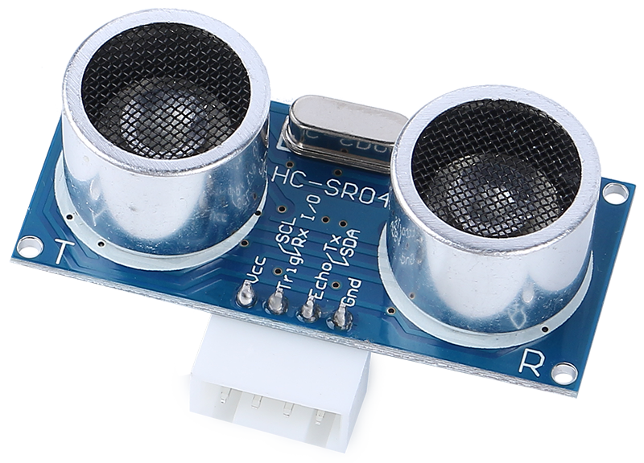
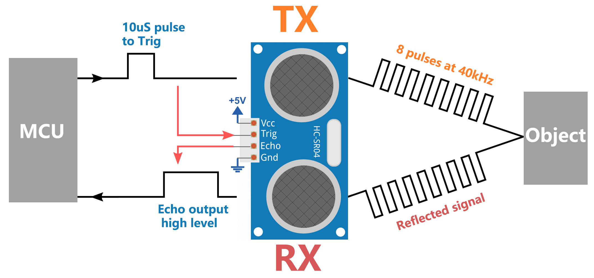
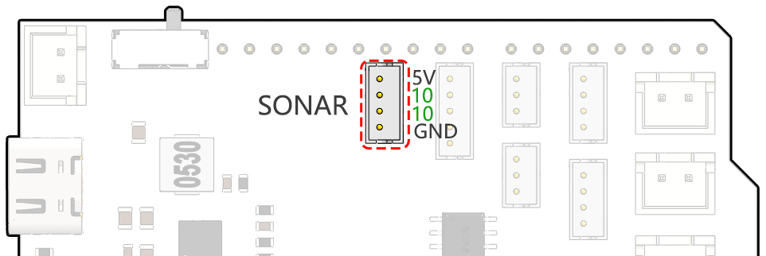

第7课：利用超声波模块增强火星车导航能力
=============================================================

在上一段冒险中，我们为火星车配备了侧面的"眼睛"，创建了一个基本的避障系统。然而，正前方还有一个盲区——这是一个我们准备克服的挑战！

今天，在这节课中，我们将给火星车一种新的"视觉"。我们将安装一个超声波传感器模块，作为一对中央眼睛，帮助我们的火星车检测正前方的障碍物。

我们将深入研究超声波波的迷人机制，并探索它们如何增强火星车在复杂地形中导航的能力。通过这一新增功能，我们的火星车将变得更加感知敏锐和灵活，准备好执行更雄心勃勃的探索任务。

加入我们，在这个激动人心的STEAM旅程中再进一步，让我们的火星车更加擅长探索未知领域！

.. raw:: html

   <video width="600" loop autoplay muted>
      <source src="../_static/video/ultrasonic_avoid.mp4" type="video/mp4">
      您的浏览器不支持此视频标签。
   </video>

.. note::

    如果你是在完全组装好GalaxyRVR之后学习本课程，你需要在上传代码之前将此开关拨到右侧。

    .. image:: ../img/camera_upload.png
        :width: 500
        :align: center

课程目标
--------------------------

* 理解超声波测距的原理。
* 学习如何使用Arduino和超声波模块进行距离测量。
* 练习在火星车模型上应用超声波模块进行避障。

所需材料
---------------------

* 超声波模块
* 基本工具和配件（例如螺丝刀、螺丝、导线等）
* 火星车模型（配备摇臂转向架系统、主板、电机、避障模块）
* USB数据线
* Arduino IDE
* 计算机

课程步骤
--------------------
**步骤1：组装超声波传感器模块**

既然我们已经着眼于为火星车配备强大的新"视觉"，是时候组装超声波传感器模块了。

.. raw:: html

  <iframe width="600" height="400" src="https://www.youtube.com/embed/c_xWAVapGic?si=ovuxheXdGVpHopPa" title="YouTube video player" frameborder="0" allow="accelerometer; autoplay; clipboard-write; encrypted-media; gyroscope; picture-in-picture; web-share" allowfullscreen></iframe>

好了！我们的火星车现在有了一个完全组装好的超声波传感器模块，准备帮助它以前所未有的方式进行导航。你兴奋地想看看它将如何改变我们火星车的障碍物检测能力吗？让我们开始吧！

**步骤2：探索超声波模块**

让我们来认识HC-SR04，一个强大的超声波距离传感器。这个微型设备可以精确测量从2厘米到400厘米的距离，所有这些都无需接触任何东西！很神奇，对吧？它就像拥有超级英雄的能力！它仅通过声波就能"看到"距离，就像蝙蝠在夜间导航一样。

它使用四种超能力，或者更确切地说，四个引脚来实现其魔力：

* **TRIG（触发脉冲输入）** - 这是我们超级英雄的启动按钮。它告诉我们的超级英雄，"嘿，是时候发出一束超音波了！"
* **ECHO（回波脉冲输出）** - 这是我们的超级英雄倾听它发出的声波回音的方式。
* **VCC** - 即使是超级英雄也需要一些能量。我们将其连接到5V电源。
* **GND** - 它是接地连接。就像超级英雄需要与现实保持联系一样！

想象我们的超级英雄，HC-SR04超声波传感器，在山中玩回声游戏。

* 首先，超级英雄的大脑，MCU，通过向我们的超级英雄发送至少10微秒的高电平信号，说"准备，预备，开始！"。这就像我们在向山谷大喊之前聚集能量一样。
* 听到"开始！"后，我们的超级英雄非常快速地大声喊叫8次。这种超音速喊叫以40 kHz的速度发出。超级英雄还启动了一个秒表，并倾听任何返回的喊叫声。
* 如果前面有障碍物，喊叫声会撞击障碍物并产生回声。听到回声后，我们的超级英雄停止秒表并记下时间。它还会发出一个高电平信号，让MCU知道它听到了回声。
* 最后，为了计算障碍物有多远，我们的超级英雄使用一个简单的公式。它用秒表记录的时间，除以2，再乘以声速（340m/s）。结果就是到障碍物的距离！

这就是我们的超级英雄传感器如何判断前方是否有障碍物以及距离有多远。很神奇，不是吗？接下来，我们将学习如何在火星车中使用这种超级英雄能力！

**步骤3：编写超级英雄传感器的代码**

在组装好我们的超级英雄传感器并理解它如何使用其超能力之后，是时候将这些能力付诸行动了！让我们编写一个Arduino草图，使我们的超声波传感器能够测量距离，然后向我们显示这些测量值。

以下是我们的超级英雄传感器将遵循的关键步骤：

* 我们已经将TRIG和ECHO引脚都连接到了GalaxyRVR扩展板的引脚10。这使我们能够使用单个Arduino引脚控制超声波模块的信号发送和接收。

.. code-block:: arduino

    // Define the pin for the ultrasonic module
    #define ULTRASONIC_PIN 10

* **准备** ：首先，我们以9600波特率建立串行通信，这样我们就可以在串口监视器中看到超级英雄的测量值。

.. code-block:: arduino

    void setup() {
        // Start the serial communication
        Serial.begin(9600);
    }

* **发声！** ：我们将 ``ULTRASONIC_PIN`` 设置为 ``OUTPUT`` 引脚，以发送一个10微秒的脉冲，这就像命令我们的超声波超级英雄发出强大的喊声（超声波声波）！

.. code-block:: arduino

    // A 4ms delay is required, otherwise the reading may be 0
    delay(4);

    //Set to OUTPUT to send signal
    pinMode(ULTRASONIC_PIN, OUTPUT);

    // Clear the trigger pin
    digitalWrite(ULTRASONIC_PIN, LOW);
    delayMicroseconds(2);

    // Trigger the sensor by sending a high pulse for 10us
    digitalWrite(ULTRASONIC_PIN, HIGH);
    delayMicroseconds(10);

    // Set the trigger pin back to low
    digitalWrite(ULTRASONIC_PIN, LOW);

* **等待并倾听** ：将 ``ULTRASONIC_PIN`` 设置为输入模式。这样，我们的超级英雄传感器现在准备倾听它喊声的回声。如果前面有障碍物，喊声会撞击它并产生回声。听到回声后，我们的超级英雄停止秒表并记下时间。它还会发出一个高电平信号，让MCU知道它听到了回声。

.. code-block:: arduino

    pinMode(ULTRASONIC_PIN, INPUT);
    float duration = pulseIn(ULTRASONIC_PIN, HIGH);

* **超级数学** ：回声返回后，我们的传感器使用声速计算到物体的距离。我们将总回声时间除以2，因为时间包括发声和等待回声的过程。

.. code-block:: arduino

    float distance = duration * 0.034 / 2;

* **报告结果** ：我们的超级英雄传感器然后揭示其任务的结果，将距离打印到串口监视器供我们查看。

.. code-block:: arduino

    // Print the distance to the serial monitor
    Serial.print("The distance is: ");
    Serial.print(distance);
    Serial.println(" cm");

* **休息与准备** ：每个超级英雄都需要休息，所以我们的传感器在下一次任务前会短暂暂停。这允许传感器在我们要求它开始下一次测量之前"重置"。

.. code-block:: arduino

    delay(200);

以下是将我们的传感器转变为超级英雄的完整代码：

.. raw:: html

  <iframe src=https://create.arduino.cc/editor/sunfounder01/35bddbcf-145c-4e4f-b3ea-21e8210af4a6/preview?embed style="height:510px;width:100%;margin:10px 0" frameborder=0></iframe>

**步骤4：编程超声波模块驱动火星车**

现在我们已经为火星车配备了超声波传感器模块，是时候编程使其根据传感器的测量结果做出响应了。

* 为了方便阅读，我们创建了一个名为 ``readSensorData()`` 的函数。这个函数封装了从超声波传感器读取距离所需的所有代码。

  .. code-block:: arduino

    float readSensorData() {
        // A 4ms delay is required, otherwise the reading may be 0
        delay(4);

        //Set to OUTPUT to send signal
        pinMode(ULTRASONIC_PIN, OUTPUT);

        // Clear the trigger pin
        digitalWrite(ULTRASONIC_PIN, LOW);
        delayMicroseconds(2);

        // Trigger the sensor by sending a high pulse for 10us
        digitalWrite(ULTRASONIC_PIN, HIGH);
        delayMicroseconds(10);

        // Set the trigger pin back to low
        digitalWrite(ULTRASONIC_PIN, LOW);

        //Set to INPUT to read
        pinMode(ULTRASONIC_PIN, INPUT);

        // pulseIn returns the duration of the pulse on the pin
        float duration = pulseIn(ULTRASONIC_PIN, HIGH);

        // Calculate the distance (in cm) based on the speed of sound (340 m/s or 0.034 cm/us)
        float distance = duration * 0.034 / 2;

        return distance;
    }

* 在 ``loop()`` 函数中，我们调用 ``readSensorData()`` 并将其返回值存储在 ``distance`` 变量中。

  .. code-block:: arduino

    float distance = readSensorData();

* 根据这个距离值，火星车将向前移动、向后移动或停止。

  .. code-block:: arduino

    // Control rover based on distance reading
    if (distance > 50) {  // If it's safe to move forward
      moveForward(200);
    } else if (distance < 15) {  // If there's an obstacle close
      moveBackward(200);
      delay(500);  // Wait for a while before attempting to turn
      backLeft(150);
      delay(1000);
    } else {  // For distances in between, proceed with caution
      moveForward(150);
    }

  * 如果路径畅通（障碍物超过50厘米远），我们的火星车勇敢地向前移动。
  * 如果障碍物正在接近（小于50厘米但大于15厘米），我们的火星车将以较低速度向前移动。
  * 如果障碍物距离太近（小于15厘米），火星车将向后移动，然后向左转弯。

  .. image:: img/ultrasonic_flowchart.png

以下是完整的代码。你可以将此代码上传到R3板，看看它是否达到预期效果。你也可以根据实际环境修改检测距离，使这个避障系统更加完善。

.. raw:: html

  <iframe src=https://create.arduino.cc/editor/sunfounder01/cded6408-1469-4289-b79b-7d445b56352b/preview?embed style="height:510px;width:100%;margin:10px 0" frameborder=0></iframe>

通过利用这些增强的功能，火星车将能更好地识别路径中的潜在障碍物，精确测量距离，并做出绕过它们的明智决策。这将显著降低可能阻碍火星车探索任务的碰撞或其他危险的可能性。

凭借其超级感知能力，火星车可以以更高的信心和效率运行，使其能够更深入地探索火星的奥秘，并为地球上的研究人员收集宝贵的科学数据。

**步骤5：总结与反思**

在本课中，我们深入研究了超声波的工作原理，以及如何通过编程将传感器接收到的回波时间转换为可测量的距离。

随后，我们利用超声波设计了一个避障系统。这个特定的系统根据与即将出现的障碍物的距离做出不同的响应。

现在，让我们通过一些问题来引导对本课的反思：

* 超声波模块如何检测距离？你能阐述其基本概念吗？
* 本课的避障系统与上一课的有何不同？它们各自的优点和缺点是什么？
* 是否有可能将这两种避障系统合并？

反思这些问题将有助于巩固我们的理解，并促使我们思考如何将这些概念应用于其他项目。期待我们的下一次冒险！
