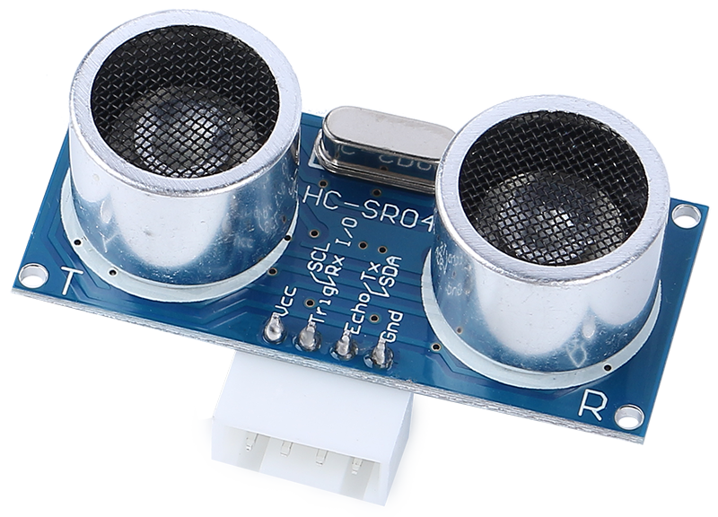

.. include:: /index.rst
   :start-after: start_hello_message
   :end-before: end_hello_message

Lezione 7: Migliorare la navigazione del Rover con il modulo a ultrasuoni
=========================================================================

Nella nostra ultima avventura, abbiamo equipaggiato il nostro Mars Rover con "occhi" sui suoi lati, creando un sistema base di evitamento ostacoli. Tuttavia, c'è un punto cieco proprio davanti: una sfida che siamo pronti a superare!

Oggi, in questa lezione, daremo al nostro Rover un nuovo senso della "vista". Installeremo un modulo sensore a ultrasuoni, che fungerà da paio di occhi centrali, aiutando il nostro rover a rilevare gli ostacoli direttamente di fronte.

Approfondiremo l'affascinante meccanica delle onde ultrasoniche ed esploreremo come migliorano la capacità del nostro Rover di navigare terreni complessi. Con questa aggiunta, il nostro Mars Rover sarà più percettivo e agile, pronto per intraprendere missioni esplorative più ambiziose.

Unisciti a noi mentre facciamo un passo avanti in questo entusiasmante viaggio STEAM, rendendo il nostro Mars Rover ancora più abile nell'esplorare territori inesplorati!

.. raw:: html

   <video width="600" loop autoplay muted>
      <source src="../_static/video/ultrasonic_avoid.mp4" type="video/mp4">
      Your browser does not support the video tag.
   </video>

.. note::

    Se stai seguendo questo corso dopo aver completamente assemblato il GalaxyRVR, devi spostare questo interruttore a destra prima di caricare il codice.

    .. image:: ../img/camera_upload.png
        :width: 500
        :align: center

Obiettivi del corso
--------------------------

* Comprendere il principio della misurazione di distanza a ultrasuoni.
* Imparare a utilizzare Arduino e il modulo a ultrasuoni per la misurazione di distanza.
* Esercitarsi nell'applicazione del modulo a ultrasuoni per l'evitamento ostacoli sul modello Mars Rover.

Materiali necessari
---------------------

* Modulo a ultrasuoni
* Strumenti e accessori di base (es. cacciavite, viti, cavi, ecc.)
* Modello Mars Rover (dotato di sistema rocker-bogie, schede principali, motori, modulo evitamento ostacoli)
* Cavo USB
* Arduino IDE
* Computer

Procedura del corso
--------------------
**Fase 1: Assemblare il modulo sensore a ultrasuoni**

Ora che abbiamo messo gli occhi sull'equipaggiare il nostro Mars Rover con un potente nuovo senso della "vista", è il momento di assemblare il modulo sensore a ultrasuoni.

.. raw:: html

  <iframe width="600" height="400" src="https://www.youtube.com/embed/c_xWAVapGic?si=ovuxheXdGVpHopPa" title="YouTube video player" frameborder="0" allow="accelerometer; autoplay; clipboard-write; encrypted-media; gyroscope; picture-in-picture; web-share" allowfullscreen></iframe>

Ed ecco fatto! Il nostro Mars Rover ha ora un modulo sensore a ultrasuoni completamente assemblato, pronto ad aiutarlo a navigare come mai prima d'ora. Sei entusiasta di vedere come cambia le capacità di rilevamento ostacoli del nostro Rover? Immergiamoci subito!

**Fase 2: Esplorare il modulo a ultrasuoni**

Conosciamo l'HC-SR04, un potente sensore di distanza a ultrasuoni. Questo piccolo dispositivo può misurare con precisione distanze da 2 cm fino a 400 cm, tutto senza toccare nulla! Incredibile, vero? È come avere un superpotere! Può "vedere" le distanze solo usando onde sonore, come un pipistrello che naviga di notte.

Usa quattro superpoteri, o meglio, quattro pin per fare la sua magia:

* **TRIG (Ingresso impulso di trigger)** - È il pulsante di avvio per il nostro supereroe. Dice al nostro supereroe: "Ehi, è ora di inviare un'onda supersonica!"
* **ECHO (Uscita impulso echo)** - È così che il nostro supereroe ascolta l'eco dell'onda sonora che ha inviato.
* **VCC** - Anche i supereroi hanno bisogno di energia. Lo colleghiamo a un'alimentazione a 5V.
* **GND** - È la connessione a terra. Proprio come i supereroi hanno bisogno di rimanere connessi alla realtà!

Immagina il nostro supereroe, il sensore a ultrasuoni HC-SR04, che gioca all'eco in montagna.

.. image:: img/ultrasonic_prin.jpg
    :width: 800

* Prima, il cervello del nostro supereroe, l'MCU, dice "Pronti, Partenza, Via!" inviando un segnale ad alto livello per almeno 10 microsecondi al nostro supereroe. È come quando raccogliamo energia prima di gridare in una valle.
* Sentendo "Via!", il nostro supereroe grida forte 8 volte molto rapidamente. Questo grido supersonico viene inviato a una velocità di 40 kHz. Il supereroe avvia anche un cronometro e tiene le orecchie aperte per eventuali grida di ritorno.
* Se c'è un ostacolo davanti, il grido lo colpirà e tornerà indietro come eco. Sentendo l'eco, il nostro supereroe ferma il cronometro e annota il tempo. Invia anche un segnale ad alto livello per far sapere all'MCU che ha sentito un'eco.
* Infine, per scoprire quanto è lontano l'ostacolo, il nostro supereroe usa una semplice formula. Prende il tempo registrato sul cronometro, lo divide per 2 e lo moltiplica per la velocità del suono (340 m/s). Il risultato è la distanza dall'ostacolo!

È così che il nostro sensore supereroe può capire se c'è un ostacolo sul suo cammino e quanto è lontano. Incredibile, vero? Successivamente, impareremo come possiamo usare questo superpotere nel nostro Mars Rover!

**Fase 3: Programmazione del nostro sensore supereroe**

Dopo aver assemblato il nostro sensore supereroe e capito come usa i suoi superpoteri, è il momento di mettere quei poteri in azione! Scriviamo uno sketch Arduino per permettere al nostro sensore a ultrasuoni di misurare le distanze e poi mostrarci quelle misurazioni.

Ecco i passaggi chiave che il nostro sensore supereroe seguirà:

* Abbiamo collegato entrambi i pin TRIG ed ECHO al pin 10 sul GalaxyRVR Shield. Questo ci permette di controllare sia la trasmissione che la ricezione del segnale del modulo a ultrasuoni usando un singolo pin Arduino.

.. image:: img/ultrasonic_shield.png

.. code-block:: arduino

    // Define the pin for the ultrasonic module
    #define ULTRASONIC_PIN 10

* **Preparazione**: Per iniziare, stabiliamo la comunicazione seriale a una velocità di 9600 baud in modo da poter vedere le misurazioni del supereroe nel nostro Monitor Seriale.

.. code-block:: arduino

    void setup() {
        // Start the serial communication
        Serial.begin(9600);
    }

* **Grida!**: Impostiamo il ``ULTRASONIC_PIN`` come pin ``OUTPUT`` per inviare un impulso di 10 microsecondi, che è come comandare al nostro supereroe a ultrasuoni di emettere un potente grido (onde sonore a ultrasuoni)!

.. code-block:: arduino

    // A 4ms delay is required, otherwise the reading may be 0
    delay(4);

    //Set to OUTPUT to send signal
    pinMode(ULTRASONIC_PIN, OUTPUT);

    // Clear the trigger pin
    digitalWrite(ULTRASONIC_PIN, LOW);
    delayMicroseconds(2);

    // Trigger the sensor by sending a high pulse for 10us
    digitalWrite(ULTRASONIC_PIN, HIGH);
    delayMicroseconds(10);

    // Set the trigger pin back to low
    digitalWrite(ULTRASONIC_PIN, LOW);

* **Aspetta e ascolta**: Imposta il ``ULTRASONIC_PIN`` come INPUT. In questo modo, il nostro sensore supereroe è ora pronto ad ascoltare l'eco del suo grido. Se c'è un ostacolo davanti, il grido lo colpirà e tornerà indietro come eco. Sentendo l'eco, il nostro supereroe ferma il cronometro e annota il tempo. Invia anche un segnale ad alto livello per far sapere all'MCU che ha sentito un'eco.

.. code-block:: arduino

    pinMode(ULTRASONIC_PIN, INPUT);
    float duration = pulseIn(ULTRASONIC_PIN, HIGH);

* **Super matematica**: Con l'eco restituito, il nostro sensore usa la velocità del suono per calcolare la distanza dall'oggetto. Dividiamo il tempo totale dell'eco per 2 perché il tempo include sia il grido che l'attesa dell'eco.

.. code-block:: arduino

    float distance = duration * 0.034 / 2;

* **Riporta i risultati**: Il nostro sensore supereroe rivela quindi il risultato della sua missione, stampando la distanza sul Monitor Seriale per farcela vedere.

.. code-block:: arduino

    // Print the distance to the serial monitor
    Serial.print("The distance is: ");
    Serial.print(distance);
    Serial.println(" cm");

* **Riposo e pronto**: Ogni supereroe ha bisogno di riposo, quindi il nostro sensore fa una breve pausa prima della prossima missione. Questo permette al sensore di "resettarsi" prima che gli chiediamo di iniziare un'altra misurazione.

.. code-block:: arduino

    delay(200);

Ecco il codice completo che trasforma il nostro sensore in un supereroe:

.. raw:: html

  <iframe src=https://create.arduino.cc/editor/sunfounder01/35bddbcf-145c-4e4f-b3ea-21e8210af4a6/preview?embed style="height:510px;width:100%;margin:10px 0" frameborder=0></iframe>

**Fase 4: Programmazione del modulo a ultrasuoni per guidare il Mars Rover**

Ora che abbiamo equipaggiato il nostro Mars Rover con un modulo sensore a ultrasuoni, è il momento di programmarlo per rispondere in base alle misurazioni del sensore.

* Per una lettura più semplice, abbiamo creato una funzione chiamata ``readSensorData()``. Questa funzione incapsula tutto il codice necessario per leggere la distanza dal sensore a ultrasuoni.

  .. code-block:: arduino

    float readSensorData() {
        // A 4ms delay is required, otherwise the reading may be 0
        delay(4);

        //Set to OUTPUT to send signal
        pinMode(ULTRASONIC_PIN, OUTPUT);

        // Clear the trigger pin
        digitalWrite(ULTRASONIC_PIN, LOW);
        delayMicroseconds(2);

        // Trigger the sensor by sending a high pulse for 10us
        digitalWrite(ULTRASONIC_PIN, HIGH);
        delayMicroseconds(10);

        // Set the trigger pin back to low
        digitalWrite(ULTRASONIC_PIN, LOW);

        //Set to INPUT to read
        pinMode(ULTRASONIC_PIN, INPUT);

        // pulseIn returns the duration of the pulse on the pin
        float duration = pulseIn(ULTRASONIC_PIN, HIGH);

        // Calculate the distance (in cm) based on the speed of sound (340 m/s or 0.034 cm/us)
        float distance = duration * 0.034 / 2;

        return distance;
    }

* Nella funzione ``loop()``, chiamiamo ``readSensorData()`` e memorizziamo il suo valore restituito nella variabile ``distance``.

  .. code-block:: arduino

    float distance = readSensorData();

* A seconda di questa distanza, il Rover avanzerà, indietreggerà o si fermerà.

  .. code-block:: arduino

    // Control rover based on distance reading
    if (distance > 50) {  // If it's safe to move forward
      moveForward(200);
    } else if (distance < 15) {  // If there's an obstacle close
      moveBackward(200);
      delay(500);  // Wait for a while before attempting to turn
      backLeft(150);
      delay(1000);
    } else {  // For distances in between, proceed with caution
      moveForward(150);
    }

  * Se il percorso è libero (l'ostacolo è a più di 50 cm), il nostro Rover avanza coraggiosamente.
  * Se un ostacolo si sta avvicinando (meno di 50 cm ma più di 15 cm), il nostro Rover avanzerà a velocità ridotta.
  * Se un ostacolo è troppo vicino per essere sicuri (meno di 15 cm), il Mars Rover indietreggerà e poi girerà a sinistra.

  .. image:: img/ultrasonic_flowchart.png

Di seguito è riportato il codice completo. Puoi caricare questo codice sulla scheda R3 e vedere se raggiunge l'effetto desiderato. Puoi anche modificare la distanza di rilevamento in base all'ambiente reale per rendere questo sistema di evitamento ostacoli più perfetto.

.. raw:: html

  <iframe src=https://create.arduino.cc/editor/sunfounder01/cded6408-1469-4289-b79b-7d445b56352b/preview?embed style="height:510px;width:100%;margin:10px 0" frameborder=0></iframe>

Sfruttando queste capacità migliorate, il Mars Rover sarebbe meglio equipaggiato per identificare potenziali ostacoli sul suo percorso, misurare le distanze con precisione e prendere decisioni informate per aggirarli. Questo ridurrebbe significativamente la probabilità di collisioni o altri pericoli che potrebbero ostacolare la missione esplorativa del rover.

Con i suoi super-sensi, il Mars Rover può operare con maggiore fiducia ed efficienza, permettendogli di approfondire i misteri di Marte e raccogliere preziosi dati scientifici per i ricercatori sulla Terra.

**Fase 5: Riepilogo e riflessione**

In questa lezione, abbiamo approfondito il funzionamento delle onde ultrasoniche e come tradurre il loro tempo di ritorno al sensore in distanza misurabile tramite la codifica.

Successivamente, abbiamo sfruttato le onde ultrasoniche per ideare un sistema di evitamento ostacoli. Questo particolare sistema varia le sue risposte in base alla distanza dall'ostacolo imminente.

Ora, stimoliamo un po' di introspezione su questa lezione attraverso alcune domande:

* Come fa un modulo a ultrasuoni a rilevare la distanza? Puoi spiegare il concetto sottostante?
* In che modo il sistema di evitamento ostacoli di questa lezione differisce da quello della lezione precedente? Quali sono i rispettivi vantaggi e svantaggi?
* È possibile amalgamare questi due sistemi di evitamento ostacoli?

Riflettere su queste domande aiuterà a consolidare la nostra comprensione e ci spingerà a contemplare l'applicazione di questi concetti ad altri progetti. In attesa della nostra prossima avventura!
