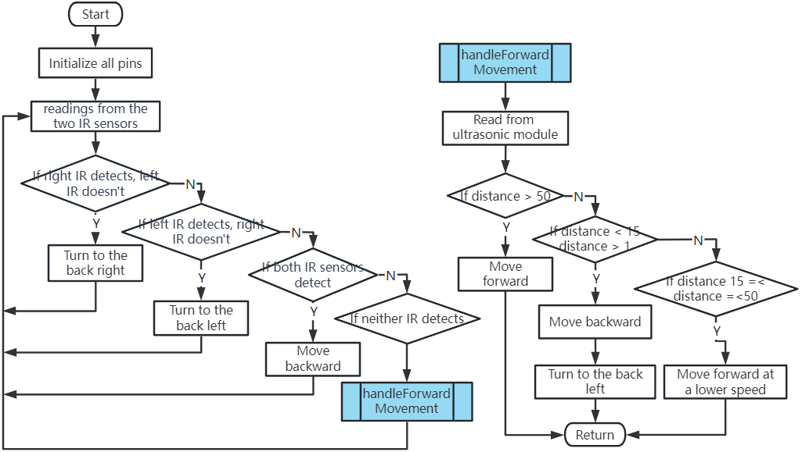
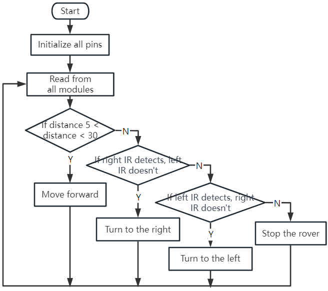

第8课：高级避障与智能跟随系统
=======================================================================

在今天的课程中，我们将把STEAM技能再推进一步。我们将结合避障模块
与超声波传感器，创建一个高级避障系统。
我们还将为火星车实现一个智能跟随系统。

到本节课结束时，我们的火星车不仅能够避开路径中的障碍物，
还能够跟随移动的物体。想象一下，有一个迷你机器人宠物跟在你身后！
太令人兴奋了，不是吗？那么让我们开始吧。

.. raw:: html

    <video width="600" loop autoplay muted>
        <source src="../_static/video/ultrasonic_ir_avoid.mp4" type="video/mp4">
        您的浏览器不支持此视频标签。
    </video>

.. note::

    如果你是在完全组装好GalaxyRVR之后学习本课程，你需要在上传代码之前将此开关拨到右侧。

    .. image:: ../img/camera_upload.png
        :width: 500
        :align: center

课程目标
--------------------------
* 学习如何将避障模块与超声波模块结合以实现改进的导航。
* 理解高级避障系统背后的原理和功能。
* 学习如何在火星车中实现智能跟随系统。

课程材料
------------------------

* 火星车模型（我们在前几课中搭建的）
* USB数据线
* Arduino IDE
* 计算机
* 当然，还有你富有创造力的头脑！

课程步骤
--------------------

**步骤1：理解概念**

顾名思义，避障模块帮助我们的火星车避开障碍物。
它通过发射红外信号，然后接收从物体反射回来的信号来检测障碍物。
如果模块前方有障碍物，红外信号被反射回来，模块就会检测到它。

现在，加入超声波传感器可以改进这个系统。超声波传感器通过
以特定频率发送声波，并倾听该声波反弹回来来测量距离。
通过记录声波产生和声波反弹回来之间的经过时间，
可以计算传感器与物体之间的距离。

将这两者结合起来，我们就得到了一个可靠、高效且多功能的避障系统！

**步骤2：构建高级避障系统**

在前几课中，我们已经学习了使用红外传感器进行避障的基础知识。我们还探索了超声波模块的工作原理。现在，我们将把所有这些部分结合起来，构建一个高级避障系统！

我们增强后的火星车现在将同时使用超声波和红外传感器来导航其周围环境。

让我们想象一下红外和超声波模块应该如何协同工作。为了帮助理清我们的逻辑，让我们使用流程图。学习如何创建流程图是我们编程之旅中宝贵的一步，因为它可以帮助你理清思路并系统性地规划方案。

现在让我们把这个流程图变成实际的代码，让我们的火星车活起来。

.. raw:: html

    <iframe src=https://create.arduino.cc/editor/sunfounder01/53d72ee5-a4c8-4524-92f8-4b0f4760c015/preview?embed style="height:510px;width:100%;margin:10px 0" frameborder=0></iframe>

注意，``handleForwardMovement()`` 函数是我们集成超声波传感器行为的地方。我们从传感器读取距离数据，并根据这些数据决定火星车的运动。

将代码上传到R3板后，是时候测试系统了。
确保火星车能够有效检测和避开障碍物。
请记住，你可能需要根据实际环境在代码中调整检测距离，以使系统更加完善。

**步骤3：编写智能跟随系统代码**

我们的火星车现在能够避障，让我们通过使其能够跟随物体来进一步增强它。我们的目标是修改现有代码，使火星车朝着移动物体运动。

有没有想过跟随系统和避障系统之间的区别？

关键区别在于，在跟随系统中，我们希望火星车响应检测到的物体而移动，而在避障系统中，我们是要避开检测到的物体。

让我们想象一下期望的工作流程：

* 如果超声波传感器检测到5-30厘米内的物体，我们的火星车应朝向它移动。
* 如果左侧红外传感器检测到物体，我们的火星车应向左转。
* 如果右侧红外传感器检测到物体，我们的火星车应向右转。
* 在所有其他情况下，我们的火星车应保持静止。

现在，是时候完成代码了。

.. raw:: html

    <iframe src=https://create.arduino.cc/editor/sunfounder01/75662c17-4b0a-4494-b18b-089cc2b32311/preview?embed style="height:510px;width:100%;margin:10px 0" frameborder=0></iframe>

代码完成后，测试火星车是否跟随你的移动。

与避障系统一样，测试我们的跟随系统并排查可能出现的任何问题至关重要。准备好了吗？

**步骤4：总结与反思**

今天，你完成了一件了不起的事情。你结合了不同的模块和概念，为火星车创建了一个高级避障和跟随系统。请记住，学习不会就此结束——继续探索、创新，并将你新学到的技能应用到其他项目中。

记得始终反思你的学习过程。思考以下问题：

* 为什么你认为我们在避障系统中优先考虑避障模块而不是超声波传感器，而在跟随系统中则相反？
* 如果我们在代码中交换这些模块的检查顺序，结果会有什么不同？

挑战和问题是STEAM学习过程中不可或缺的一部分，提供了宝贵的改进机会。不要回避故障排查——它本身就是一个强大的学习工具！

在你继续前行的过程中，要知道你克服的每一个障碍都让你离掌握STEAM技能更近一步。继续前进，享受旅程！
