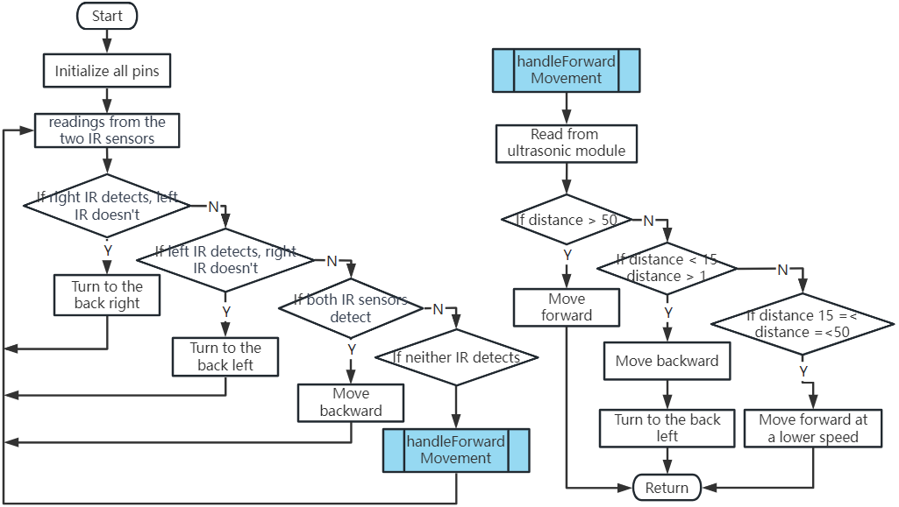
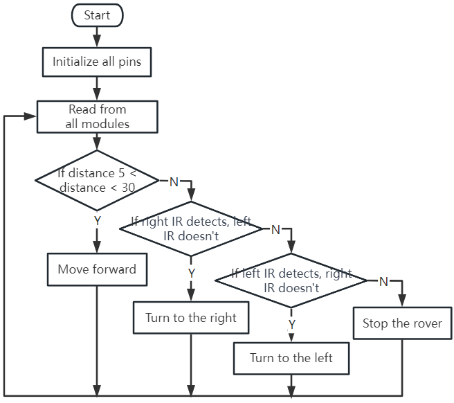

.. include:: /index.rst
   :start-after: start_hello_message
   :end-before: end_hello_message

Lezione 8: Evitamento ostacoli avanzato e sistema di inseguimento intelligente
==============================================================================

Nella lezione di oggi, porteremo le nostre competenze STEAM un passo avanti. Combineremo un modulo evitamento ostacoli
con un sensore a ultrasuoni per creare un sistema avanzato di evitamento ostacoli.
Implementeremo anche un sistema di inseguimento intelligente per il nostro Rover.

Alla fine di questa lezione, il nostro Mars Rover sarà in grado non solo di evitare gli ostacoli sul suo percorso
ma anche di seguire oggetti in movimento. Immagina di avere un mini animale robotico che ti segue in giro!
Entusiasmante, vero? Quindi iniziamo.

.. raw:: html

    <video width="600" loop autoplay muted>
        <source src="../_static/video/ultrasonic_ir_avoid.mp4" type="video/mp4">
        Your browser does not support the video tag.
    </video>

.. note::

    Se stai seguendo questo corso dopo aver completamente assemblato il GalaxyRVR, devi spostare questo interruttore a destra prima di caricare il codice.

    .. image:: ../img/camera_upload.png
        :width: 500
        :align: center

Obiettivi del corso
--------------------------
* Imparare a combinare moduli evitamento ostacoli con un modulo a ultrasuoni per una navigazione migliorata.
* Comprendere i principi e le funzionalità alla base di un sistema avanzato di evitamento ostacoli.
* Imparare a implementare un sistema di inseguimento intelligente nel Mars Rover.

Materiali del corso
------------------------

* Modello Mars Rover (quello che abbiamo costruito nelle lezioni precedenti)
* Cavo USB
* Arduino IDE
* Computer
* E naturalmente, la tua mente creativa!

Procedura del corso
--------------------

**Fase 1: Comprendere il concetto**

Il modulo evitamento ostacoli, come suggerisce il nome, aiuta il nostro Rover a evitare gli ostacoli.
Rileva gli ostacoli trasmettendo un segnale a infrarossi e poi ricevendo il segnale
riflesso dall'oggetto. Se c'è un ostacolo davanti al modulo,
il segnale a infrarossi viene riflesso e il modulo lo rileva.

Ora, l'aggiunta di un sensore a ultrasuoni migliora questo sistema. I sensori a ultrasuoni misurano la distanza
inviando un'onda sonora a una frequenza specifica e ascoltando il rimbalzo di quell'onda sonora.
Registrando il tempo trascorso tra la generazione dell'onda sonora e il suo rimbalzo,
è possibile calcolare la distanza tra il sensore e l'oggetto.

Combinando questi due otteniamo un sistema di evitamento ostacoli affidabile, efficiente e versatile!

**Fase 2: Costruzione di sistemi avanzati di evitamento ostacoli**

Nelle nostre lezioni precedenti, abbiamo appreso le basi dell'evitamento ostacoli utilizzando sensori a infrarossi. Abbiamo anche esplorato come funziona un modulo a ultrasuoni. Ora, metteremo insieme tutti questi pezzi e costruiremo un sistema avanzato di evitamento ostacoli!

Il nostro Mars Rover potenziato utilizzerà ora sia sensori a ultrasuoni che a infrarossi per navigare nell'ambiente circostante.

Immaginiamo come i moduli a infrarossi e a ultrasuoni dovrebbero lavorare insieme. Per aiutare a chiarire la nostra logica, usiamo un diagramma di flusso. Imparare a creare diagrammi di flusso è un passo inestimabile nel nostro viaggio di codifica in quanto può aiutarti a chiarire i tuoi pensieri e delineare sistematicamente il tuo piano.

Ora trasformiamo questo diagramma di flusso in codice reale per dare vita al nostro Rover.

.. raw:: html

    <iframe src=https://create.arduino.cc/editor/sunfounder01/53d72ee5-a4c8-4524-92f8-4b0f4760c015/preview?embed style="height:510px;width:100%;margin:10px 0" frameborder=0></iframe>

Nota che la funzione ``handleForwardMovement()`` è dove abbiamo integrato il comportamento del sensore a ultrasuoni. Leggiamo i dati di distanza dal sensore e, in base a questi dati, decidiamo il movimento del Rover.

Dopo aver caricato il codice sulla tua scheda R3, è il momento di testare il sistema.
Assicurati che il Rover possa rilevare ed evitare gli ostacoli in modo efficiente.
Ricorda, potresti dover regolare la distanza di rilevamento nel codice in base al tuo ambiente reale per perfezionare il sistema.

**Fase 3: Codifica del sistema di inseguimento intelligente**

Con il nostro Rover ora in grado di evitare ostacoli, miglioriamolo ulteriormente facendogli seguire gli oggetti. Il nostro obiettivo è modificare il nostro codice esistente per far sì che il Rover si muova verso un oggetto in movimento.

Ti sei mai chiesto quali siano le differenze tra un sistema di inseguimento e un sistema di evitamento ostacoli?

La chiave qui è che in un sistema di inseguimento, vogliamo che il nostro Rover si muova in risposta agli oggetti rilevati, mentre in un sistema di evitamento ostacoli, cerchiamo di stare alla larga dagli oggetti rilevati.

Visualizziamo il flusso di lavoro desiderato:

* Se il sensore a ultrasuoni rileva un oggetto entro 5-30 cm, il nostro Rover dovrebbe muoversi verso di esso.
* Se il sensore IR sinistro rileva un oggetto, il nostro Rover dovrebbe girare a sinistra.
* Se il sensore IR destro rileva un oggetto, il nostro Rover dovrebbe girare a destra.
* In tutti gli altri casi, il nostro Rover dovrebbe rimanere fermo.

Ora, è il momento di completare il codice.

.. raw:: html

    <iframe src=https://create.arduino.cc/editor/sunfounder01/75662c17-4b0a-4494-b18b-089cc2b32311/preview?embed style="height:510px;width:100%;margin:10px 0" frameborder=0></iframe>

Una volta completato il codice, verifica se il Rover segue i tuoi movimenti.

Come abbiamo fatto con il sistema di evitamento ostacoli, sarà cruciale testare il nostro sistema di inseguimento e risolvere eventuali problemi che potrebbero sorgere. Pronto per iniziare?

**Fase 4: Riepilogo e riflessione**

Oggi hai realizzato qualcosa di straordinario. Hai combinato diversi moduli e concetti per creare un sistema avanzato di evitamento ostacoli e inseguimento per il tuo Mars Rover. Ricorda, l'apprendimento non finisce qui: continua a esplorare, innovare e applicare le tue nuove competenze ad altri progetti.

Ricorda di riflettere sempre sul tuo processo di apprendimento. Pensa a quanto segue:

* Perché pensi che abbiamo dato priorità al modulo evitamento ostacoli prima del sensore a ultrasuoni nel nostro sistema di evitamento ostacoli, e viceversa nel sistema di inseguimento?
* Come differirebbe il risultato se dovessimo scambiare l'ordine in cui questi moduli vengono controllati nel codice?

Le sfide e i problemi sono parte integrante del processo di apprendimento STEAM, offrendo preziose opportunità di miglioramento. Non evitare la risoluzione dei problemi: è un potente strumento di apprendimento di per sé!

Mentre continui il tuo viaggio, sappi che ogni ostacolo che superi ti avvicina di un passo alla padronanza delle tue competenze STEAM. Continua così e goditi il viaggio!
