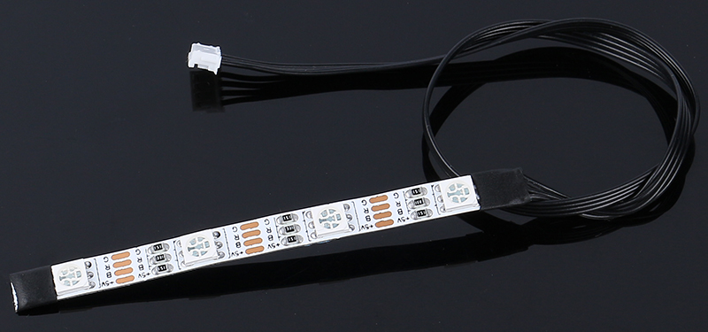
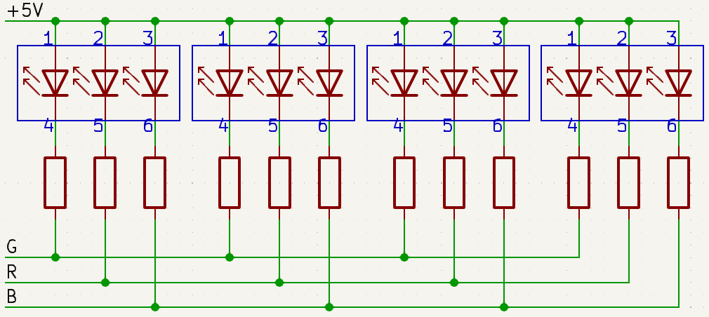
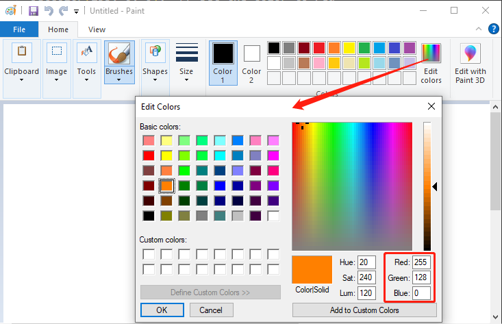


第9课：用RGB LED灯带照亮道路
============================================================

在迄今为止的旅程中，我们已经将火星车转变为一个智能探索者，能够熟练地绕过障碍物。它已经变得相当擅长在我们为它设置的火星地形中导航。

但是，如果我们能在实用性之外再加入一些亮点呢？让我们的火星车能够通过五彩缤纷的光影来表达自己。我们说的是集成RGB LED灯带——这个酷炫的功能将使我们的火星车即使在最黑暗的条件下也能照亮其路径。

想象一下——火星车留下一串颜色编码的信号，让我们更容易理解它的动作。前进时发出绿光，停止时发出严肃的红光，快速转弯时发出闪亮的黄光。它甚至可以为了纯粹的乐趣而发出五颜六色的光！

本课的目标是理解RGB LED灯带的原理，学习控制其颜色和亮度，然后将其与火星车的运动同步。到课程结束时，我们的火星车将不仅仅是一台机器。它将成为一个发光的、变色的实体，在广阔的火星地貌中引领道路！

.. raw:: html

    <video width="600" loop autoplay muted>
        <source src="../_static/video/car_rgb.mp4" type="video/mp4">
        您的浏览器不支持此视频标签。
    </video>

.. note::

    如果你是在完全组装好GalaxyRVR之后学习本课程，你需要在上传代码之前将此开关拨到右侧。

    .. image:: ../img/camera_upload.png
        :width: 500
        :align: center

目标
-------------

* 理解RGB LED灯带的工作原理和应用。
* 学习如何使用Arduino编程控制RGB LED灯带的颜色和亮度。
* 练习在火星车模型上安装和使用RGB LED灯带作为指示灯。

所需材料
-------------------------

* RGB LED灯带（每条灯带有8个RGB LED，共两条灯带）
* 基本工具和配件（例如螺丝刀、螺丝、导线等）
* 火星车模型（配备摇臂转向架系统、主板、电机、避障模块、超声波模块）
* USB数据线
* Arduino IDE
* 计算机

课程步骤
------------------
**步骤1：在火星车上安装RGB LED灯带**

现在，将两条RGB灯带固定到车的底部两侧。它们由同一组引脚控制，因此在接线过程中无需区分。

.. raw:: html

    <iframe width="600" height="400" src="https://www.youtube.com/embed/v4YGjNwPOJE" title="YouTube video player" frameborder="0" allow="accelerometer; autoplay; clipboard-write; encrypted-media; gyroscope; picture-in-picture; web-share" allowfullscreen></iframe>

**步骤2：用RGB LED灯带探索光的魔法**

你还记得上次看到彩虹是什么时候吗？它是如何用七种鲜艳的色彩让天空变得五彩缤纷的？你想不想在我们的小火星车上创造你自己的彩虹？让我们用RGB LED灯带深入探索光的魔法！

你可能会注意到我们的RGB LED灯带有四个引脚，标记如下：

* **+5V** ：这是我们灯带内部三个小灯泡（LED）的公共"正"端或"阳极"。它需要连接到DC 5V，一种为我们的小灯泡供电的电力！
* **B** ：这是蓝色LED的"负"端或"阴极"。
* **R** ：这是红色LED的"阴极"。
* **G** ：这是绿色LED的"阴极"。

.. image:: img/rgb_5050.jpg

你还记得我们在美术课上学到的三原色——红、蓝、绿吗？就像艺术家在调色板上混合这些颜色创造出新的色调一样，我们的灯带包含4个"5050"LED，可以混合这些原色创造出几乎任何颜色！每个"5050"LED就像一个小小的艺术工作室，容纳了这三种颜色的灯泡。

.. image:: img/rgb_5050_sche.png

这些小小的艺术工作室然后以巧妙的方式连接在一块柔性电路板上——就像一条微型电气高速公路！所有LED的"正"端（阳极）连接在一起，而"负"端（阴极）连接到它们对应的颜色通道（G到G，R到R，B到B）。

最酷的部分是？通过我们的指令，这个灯带上的所有LED可以同时改变颜色！就像我们指尖上拥有自己的光影乐队！

那么让我们准备好演奏一些光影音乐吧！在下一步中，我们将学习如何控制这些LED显示我们想要的颜色。这将像指挥一场光影交响乐！

**步骤3：点亮表演——用代码控制RGB LED灯带**

我们已经踏入了色彩的领域，是时候让我们的火星车活起来了。准备好用RGB LED灯带以光谱般的色彩来描绘黑暗吧。把这看作是将你的火星车变成一个移动迪斯科派对的机会！

* 在进入有趣的部分之前，让我们理解一下，虽然我们有两条LED灯带，但它们都由同一组引脚控制。可以把它想象成有两个炫目的舞者完美同步地跳舞！

    .. image:: img/rgb_shield.png

* 是时候召唤我们的编程魔法了。我们将用Arduino代码初始化我们的引脚。

    .. code-block:: arduino

        #include <SoftPWM.h>

        // Define the pin numbers for the RGB strips
        const int bluePin = 11;
        const int redPin = 12;
        const int greenPin = 13;

* 引脚就位后，我们现在将使用 ``SoftPWMSet()`` 函数来控制这些引脚。要使RGB灯带显示红色，我们打开红色LED并关闭其他两个。

    .. code-block:: arduino

        void setup() {
            // Initialize software-based PWM on all pins
            SoftPWMBegin();
        }

        void loop() {
            // Set the color to red by turning the red LED on and the others off
            SoftPWMSet(redPin, 255); // 255 is the maximum brightness
            SoftPWMSet(greenPin, 0); // 0 is off
            SoftPWMSet(bluePin, 0);  // 0 is off
            delay(1000); // Wait for 1 second
        }

在上面的代码中，我们仅演示了如何显示单一颜色。

如果我们要用这种方法展示多种颜色，代码会变得相当冗长。因此，为了使我们的代码更简洁和可维护，我们可以创建一个函数来为三个引脚分配PWM值。然后，在 ``loop()`` 中，我们可以轻松设置多种颜色。

.. raw:: html

  <iframe src=https://create.arduino.cc/editor/sunfounder01/cac90501-04c1-44c2-a1d7-4f863e50f186/preview?embed style="height:510px;width:100%;margin:10px 0" frameborder=0></iframe>

将代码上传到R3板后，你可能会发现橙色和黄色看起来有点不对。
这是因为灯带上的红色LED相比其他两个LED相对较暗。
因此，你需要在代码中引入偏移值来纠正这种颜色偏差。

.. raw:: html

  <iframe src=https://create.arduino.cc/editor/sunfounder01/60ec867f-5637-44bd-b72d-4709fc4f5349/preview?embed style="height:510px;width:100%;margin:10px 0" frameborder=0></iframe>

现在，RGB LED灯带应该能够显示正确的颜色了。如果你仍然发现偏差，可以手动调整 ``R_OFFSET``、``G_OFFSET`` 和 ``B_OFFSET`` 的值。

随意尝试并在LED灯带上显示你选择的任何颜色。你只需填入所需颜色的RGB值即可。

小贴士：你可以使用计算机上的画图工具来确定所需颜色的RGB值。

既然我们已经掌握了颜色设置的技巧，在下一步中，我们将把这些炫目的显示与火星车的运动结合起来。激动人心的时刻即将到来！

**步骤4：用颜色指示移动火星车**

现在，我们将为火星车的运动添加颜色指示。例如，我们可以用绿色表示前进，红色表示后退，黄色表示左转或右转。

为此，我们将在代码中添加一个控制机制，根据火星车的运动设置LED灯带的颜色。这将涉及修改我们的火星车控制代码，使其包含颜色控制函数。

让我们看一个如何实现这一点的示例：

.. raw:: html

  <iframe src=https://create.arduino.cc/editor/sunfounder01/5412eebe-75b8-4f98-a348-f0889e8a7fde/preview?embed style="height:510px;width:100%;margin:10px 0" frameborder=0></iframe>

在 ``loop()`` 函数中，我们通过调用不同的函数命令火星车执行一系列动作。
每个动作都有其对应的颜色显示——绿色表示向前移动，红色表示向后移动，黄色表示转弯。
这个颜色显示功能通过 ``setColor()`` 函数实现，该函数调节每个RGB颜色通道的亮度。

对于停止动作，我们引入了一个引人入胜的元素——红蓝光的呼吸效果。
这是通过在 ``stopMove()`` 函数中循环调节红色和蓝色通道的亮度来实现的。
因此，在停止时，LED灯带在红色和蓝色之间过渡颜色，创造出动态的视觉效果。

现在，我们的火星车拥有了自己鲜艳的色彩效果，留下一串颜色编码的信号，每个信号代表一个
独特的动作。

通过这个项目，我们发现了STEAM科目如何融合，为一个原本普通的机器注入生命，
将其转变为一个充满活力、互动且有趣的学习工具。

**步骤5：总结与反思**

在今天的课程中，我们深入探讨了RGB LED灯带的世界，探索了如何操控它们来显示一系列鲜艳的颜色。这些绚丽的色调为我们的火星车注入了新的活力，将其从一台普通的机器转变为一个充满活力的奇观。

现在，我邀请你思考——如果你是驾驶者，你会如何利用这些颜色来增强你的火星车？你希望它展示哪些独特的效果？

此外，通过这个过程，我希望你能够亲身体验到不同的STEAM概念如何在一个引人入胜的项目中相互交织，为你提供更广阔的实践应用视角。

下次精彩冒险再见！
