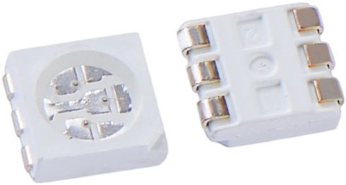
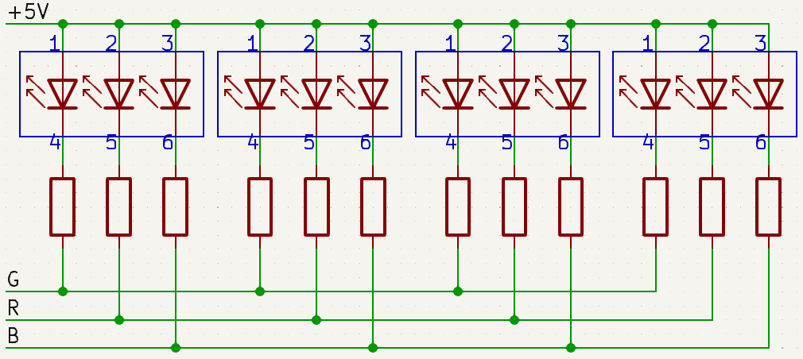
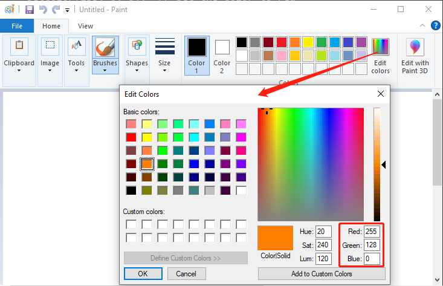

.. include:: /index.rst
   :start-after: start_hello_message
   :end-before: end_hello_message

レッスン 9: RGBストリップで道を照らす
============================================================

これまでの旅で、私たちはマーズローバーを、障害物を巧みに回避できるスマートな探検者に変えてきました。私たちが設定した火星のような地形をナビゲートすることに非常に熟達してきました。

しかし、実用性に少し華やかさを加えたらどうでしょうか？ローバーに色と光のスペクタクルを通じて自己表現する能力を与えましょう。RGB LEDストリップの組み込みです。これは、暗い状況でもローバーが進路を照らすことができるクールな機能です。

想像してみてください。ローバーが色分けされた信号の痕跡を残し、その動きを理解しやすくします。移動中は緑色の輝き、停止時は厳格な赤色、素早い旋回時には派手な黄色。まったくの楽しみのために、さまざまな色で光ることもできます。

このレッスンの目標は、RGB LEDストリップの原理を理解し、その色と明るさを制御する方法を学び、そしてこれをローバーの動きと同期させることです。最後には、マーズローバーは単なる機械以上のものになります。広大な火星の風景を導く、輝く変色する存在になるでしょう！

.. raw:: html

    <video width="600" loop autoplay muted>
        <source src="../_static/video/car_rgb.mp4" type="video/mp4">
        お使いのブラウザはこのビデオタグをサポートしていません。
    </video>

.. note::

    GalaxyRVRを完全に組み立てた後にこのコースを学習する場合、コードをアップロードする前にこのスイッチを右側に移動する必要があります。

    .. image:: ../img/camera_upload.png
        :width: 500
        :align: center

学習目標
-------------

* RGB LEDストリップの動作原理と応用を理解します。
* Arduinoプログラミングを使用してRGB LEDストリップの色と明るさを制御する方法を学びます。
* マーズローバーモデルにインジケーターとしてRGB LEDストリップを取り付け、使用する練習をします。

必要な材料
-------------------------

* RGB LEDストリップ（各ストリップに8個のRGB LED、合計2本のストリップ）
* 基本的な工具とアクセサリー（例：ドライバー、ネジ、ワイヤーなど）
* マーズローバーモデル（ロッカーボギーシステム、メインボード、モーター、障害物回避モジュール、超音波モジュールを搭載）
* USBケーブル
* Arduino IDE
* コンピューター

コースの手順
------------------
**ステップ 1: マーズローバーにRGB LEDストリップを取り付ける**

2本のRGB LEDストリップを車体の底面側面に固定します。これらは1組のピンで制御されるため、配線時に区別する必要はありません。

.. raw:: html

    <iframe width="600" height="400" src="https://www.youtube.com/embed/v4YGjNwPOJE" title="YouTube video player" frameborder="0" allow="accelerometer; autoplay; clipboard-write; encrypted-media; gyroscope; picture-in-picture; web-share" allowfullscreen></iframe>

**ステップ 2: RGB LEDストリップで光の魔法を探求する**

最後に虹を見たのはいつですか？7つの鮮やかな色合いで空をカラフルにした様子を覚えていますか？この小さな火星ローバーで、自分だけの虹を作ってみませんか？RGB LEDストリップで光の魔法に飛び込みましょう！

.. image:: img/4_rgb_strip.jpg

RGB LEDストリップには、次のラベルが付いた4つのピンがあることに気づくでしょう：

* **+5V**: これはストリップ内部の3つの小さな電球（LED）の共通の「プラス」端、つまり「アノード」です。DC 5Vに接続する必要があります。これは小さな電球に電力を供給する電気の力です！
* **B**: これは青色LEDの「マイナス」端、つまり「カソード」です。
* **R**: これは赤色LEDの「カソード」です。
* **G**: これは緑色LEDの「カソード」です。

図工の授業で学んだ3原色（赤、青、緑）を覚えていますか？アーティストがパレット上でこれらの色を混ぜて新しい色合いを作り出すように、私たちのストリップには4つの「5050」LEDが含まれており、これらの原色を混ぜて実質的にあらゆる色を作り出すことができます！各「5050」LEDは、これら3つの色の電球を収めた小さなアートスタジオのようなものです。

.. image:: img/rgb_5050_sche.png

これらの小さなアートスタジオは、フレキシブル回路基板上でスマートに接続されています。まるでミニ電気ハイウェイのようです！すべてのLEDの「プラス」端（アノード）は一緒に接続され、「マイナス」端（カソード）は対応する色のレーン（GからG、RからR、BからB）に接続されています。

そして一番クールな部分は？私たちのコマンドで、このストリップ上のすべてのLEDが一度に色を変えることができるのです！まるで指先に自分だけの光のオーケストラを持っているかのようです！

それでは、光の音楽を奏でる準備をしましょう！次のステップでは、これらのLEDを制御して好きな色を表示する方法を学びます。光の交響曲を指揮するようなものです！

**ステップ 3: ショーを輝かせる - RGB LEDストリップを制御するコーディング**

色の領域に足を踏み入れました。マーズローバーに命を吹き込む時が来ました。RGB LEDストリップを使って、暗闇を色のスペクトルで描く準備をしてください。これはマーズローバーを移動可能なディスコパーティーに変えるチャンスだと考えてください！

* 楽しい部分に飛び込む前に、2本のLEDストリップがあるにもかかわらず、両方とも同じピンセットで制御されていることを理解しましょう。まるで2人のまばゆいダンサーが完全に同期して動いていると考えてください！

    .. image:: img/rgb_shield.png

* コーディングの魔法を呼び出す時です。Arduinoコードでピンを初期化します。

    .. code-block:: arduino

        #include <SoftPWM.h>

        // Define the pin numbers for the RGB strips
        const int bluePin = 11;
        const int redPin = 12;
        const int greenPin = 13;

* ピンが配置されたので、``SoftPWMSet()`` 関数を使ってこれらのピンを制御します。RGBストリップに赤色を表示するには、赤色LEDをオンにして他をオフにします。

    .. code-block:: arduino

        void setup() {
            // Initialize software-based PWM on all pins
            SoftPWMBegin();
        }

        void loop() {
            // Set the color to red by turning the red LED on and the others off
            SoftPWMSet(redPin, 255); // 255 is the maximum brightness
            SoftPWMSet(greenPin, 0); // 0 is off
            SoftPWMSet(bluePin, 0);  // 0 is off
            delay(1000); // Wait for 1 second
        }

上記のコードでは、1色のみの表示方法を示しました。

この方法でさまざまな色を表示しようとすると、コードがかなり煩雑になる可能性があります。そのため、コードをより簡潔で保守しやすくするために、3つのピンにPWM値を割り当てる関数を作成できます。その後、``loop()`` 内で簡単に多数の色を設定できます。

.. raw:: html

  <iframe src=https://create.arduino.cc/editor/sunfounder01/cac90501-04c1-44c2-a1d7-4f863e50f186/preview?embed style="height:510px;width:100%;margin:10px 0" frameborder=0></iframe>

コードをR3ボードにアップロードした後、オレンジ色と黄色が少しおかしく見えるかもしれません。これは、ストリップ上の赤色LEDが他の2つのLEDと比較して比較的暗いためです。したがって、コードにオフセット値を導入して、この色の不一致を修正する必要があります。

.. raw:: html

  <iframe src=https://create.arduino.cc/editor/sunfounder01/60ec867f-5637-44bd-b72d-4709fc4f5349/preview?embed style="height:510px;width:100%;margin:10px 0" frameborder=0></iframe>

これで、RGB LEDストリップは正しい色を表示できるはずです。まだ不一致に気づく場合は、``R_OFFSET``、``G_OFFSET``、``B_OFFSET`` の値を手動で調整できます。

自由に実験して、LEDストリップに好きな色を表示してください。希望する色のRGB値を入力するだけです。

ヒント：コンピューターのペイントツールを使用して、希望する色のRGB値を調べることができます。

色設定の技術を習得したので、次のステップでは、これらのまばゆい表示をマーズローバーの動きと統合します。楽しみな時間が待っています！

**ステップ 4: 色表示でローバーを動かす**

次に、マーズローバーの動きに色表示を追加します。たとえば、前進に緑色、後退に赤色、左右の旋回に黄色を使用できます。

これを行うために、ローバーの動きに基づいてLEDストリップの色を設定する制御メカニズムをコードに追加します。これには、ローバー制御コードを変更して色制御関数を含めることが含まれます。

その方法の例を見てみましょう：

.. raw:: html

  <iframe src=https://create.arduino.cc/editor/sunfounder01/5412eebe-75b8-4f98-a348-f0889e8a7fde/preview?embed style="height:510px;width:100%;margin:10px 0" frameborder=0></iframe>

``loop()`` 関数内で、異なる関数を呼び出すことによってローバーに一連のアクションを実行するよう命令しました。各アクションには対応する色表示がありました。前進には緑色、後退には赤色、旋回には黄色です。この色表示機能は、各RGBカラーチャンネルの明るさを操作する ``setColor()`` 関数を使用して実現されました。

停止アクションでは、赤色と青色の光を使ったブレス効果という魅力的な要素を導入しました。これは、``stopMove()`` 関数内で赤と青のチャンネルの明るさを周期的に調整することで実現されました。これにより、停止時にLEDストリップが赤と青の間で色を遷移させ、ダイナミックな視覚効果を生み出しました。

これで、マーズローバーは独自の鮮やかな色彩効果を持ち、それぞれが独自の動きを表す色分けされた信号の跡を残すようになりました。

このプロジェクトを通じて、STEAM科目がどのように融合して、普通の機械に命を吹き込み、活気に満ちたインタラクティブで楽しい学習ツールに変えることができるかを発見しました。

**ステップ 5: まとめと振り返り**

今日のレッスンでは、RGB LEDストリップの世界に飛び込み、それらを操作して鮮やかな色の配列を表示する方法を探求しました。これらの輝く色合いはマーズローバーに新たな命を吹き込み、単なる機械から鮮やかなスペクタクルへと変貌させました。

さて、考えてみてください。もしあなたが運転席にいたら、これらの色をどのように活用してマーズローバーを強化しますか？どんなユニークな効果を表示させたいですか？

さらに、このプロセスを通じて、多様なSTEAMの概念がどのように魅力的なプロジェクトに織り交ぜられ、その実用的な応用についてより広い視点を提供できるかを実感していただけたと思います。

それでは、次のエキサイティングな冒険でお会いしましょう！
