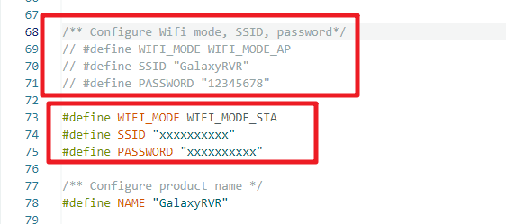
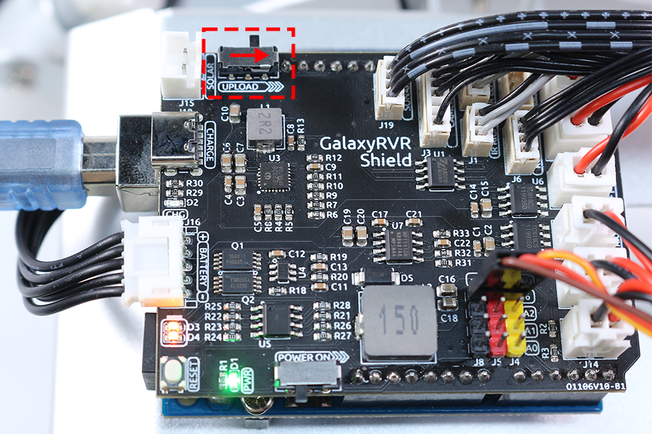

.. note::

    ¡Hola! Bienvenido a la comunidad de entusiastas de SunFounder Raspberry Pi, Arduino y ESP32 en Facebook. ¡Sumérgete en el mundo de Raspberry Pi, Arduino y ESP32 con otros entusiastas!

    **¿Por qué unirte?**

    - **Soporte de expertos**: Resuelve problemas postventa y desafíos técnicos con la ayuda de nuestra comunidad y equipo.
    - **Aprende y comparte**: Intercambia consejos y tutoriales para mejorar tus habilidades.
    - **Previsualizaciones exclusivas**: Obtén acceso anticipado a anuncios de nuevos productos y adelantos exclusivos.
    - **Descuentos especiales**: Disfruta de descuentos exclusivos en nuestros productos más recientes.
    - **Promociones festivas y sorteos**: Participa en sorteos y promociones durante las festividades.

    👉 ¿Listo para explorar y crear con nosotros? Haz clic en [|link_sf_facebook|] y únete hoy mismo!

FAQ
==============

.. _ap_to_sta:

P1: Cambiar de modo AP a modo STA
-------------------------------------------------

* Necesitarás descargar el código relevante.

    * :download:`GalaxyRVR Codes <https://github.com/sunfounder/galaxy-rvr/archive/refs/heads/main.zip>`

* Instala el IDE, luego instala las bibliotecas ``SoftPWM`` y ``SunFounder AI Camera``. :ref:`install_lib` .

* Luego, abre el archivo ``galaxy-rvr.ino`` que se encuentra en el directorio ``galaxy-rvr-main\galaxy-rvr``.

* Comenta las líneas 69-71, descomenta las líneas 73-75 y cambia ``SSID`` y ``PASSWORD`` por tu red WLAN.

* Conecta el Arduino y la computadora con un cable USB, y luego cambia el interruptor de **upload** del coche al modo de subida.

* Sube tu código.

.. _install_lib:

P2: Error de compilación: ¿SoftPWM.h: No such file or directory?
---------------------------------------------------------------------
Si recibes un aviso de "Error de compilación: SoftPWM.h: No such file or directory", significa que no tienes instalada la biblioteca SoftPWM.

Por favor, instala las dos bibliotecas requeridas ``SoftPWM`` y ``SunFounder AI Camera`` como se muestra.

    .. raw:: html

        <video width="600" loop autoplay muted>
            <source src="_static/video/install_softpwm.mp4" type="video/mp4">
            Your browser does not support the video tag.
        </video>

P3: avrdude: stk500_getsync() intento 10 de 10: ¿no sincronizado: resp=0x6e?
---------------------------------------------------------------------------------
Si el siguiente mensaje sigue apareciendo después de hacer clic en el botón **Upload** y la placa y el puerto se han seleccionado correctamente.

.. code-block::

    avrdude: stk500_recv(): programmer is not responding
    avrdude: stk500_getsync() attempt 1 of 10: not in sync: resp=0x00
    avrdude: stk500_recv(): programmer is not responding
    avrdude: stk500_getsync() attempt 2 of 10: not in sync: resp=0x00
    avrdude: stk500_recv(): programmer is not responding
    avrdude: stk500_getsync() attempt 3 of 10: not in sync: resp=0x00

En este punto, debes asegurarte de que el ESP32 CAM esté desconectado.

El ESP32-CAM y la placa Arduino comparten los mismos pines RX (recepción) y TX (transmisión). Entonces, antes de subir el código, deberás desconectar primero el ESP32-CAM para evitar conflictos o problemas potenciales.

    .. image:: img/camera_upload.png
        :width: 500
        :align: center

Después de que el código se haya subido correctamente, si necesitas usar el ESP32 CAM, debes mover el interruptor a la izquierda para encender el ESP32 CAM.

    .. image:: img/camera_run.png
        :width: 500
        :align: center

.. _stt_android:

P4: ¿Cómo puedo usar el modo STT en mi dispositivo Android?
------------------------------------------------------------------------

El modo STT requiere que el dispositivo móvil Android esté conectado a Internet y tenga instalado el componente de servicio de Google.

Sigue los siguientes pasos:

#. Modifica el archivo ``galaxy-rvr.ino`` de modo AP a modo STA.

    * Abre el archivo ``galaxy-rvr.ino`` que se encuentra en el directorio ``galaxy-rvr-main\galaxy-rvr``. 
    * Luego comenta el código relacionado con el modo AP. Descomenta el código del modo STA y rellena el ``SSID`` y ``PASSWORD`` de tu Wi-Fi doméstico.

        .. code-block:: arduino

            /** Configurar modo Wifi, SSID, contraseña*/
            // #define WIFI_MODE WIFI_MODE_AP
            // #define SSID "GalaxyRVR"
            // #define PASSWORD "12345678"

            #define WIFI_MODE WIFI_MODE_STA
            #define SSID "xxxxxxxxxx"
            #define PASSWORD "xxxxxxxxxx"

    * Guarda este código, selecciona la placa correcta (Arduino Uno) y el puerto, luego haz clic en el botón **Upload** para subirlo a la placa R3.

#. Busca ``google`` en Google Play, encuentra la app que se muestra a continuación e instálala.

    .. image:: img/google_voice.png
        :width: 500
        :align: center

#. Conecta tu dispositivo móvil a la misma red Wi-Fi que escribiste en el código.

    .. image:: img/sta_wifi.png
        :width: 500
        :align: center

#. Abre el controlador previamente creado en SunFounder Controller y conéctalo a ``GalaxyRVR`` a través del botón |app_connect|.

    .. image:: img/app/camera_connect.png
        :width: 400
        :align: center

#. Toca y mantén presionado el widget **STT(J)** después de hacer clic en el botón |app_run|. Aparecerá un aviso indicando que está escuchando. Di los siguientes comandos para mover el coche.

    .. image:: img/app/play_speech.png

    * ``stop``: Detiene todos los movimientos del rover.
    * ``forward``: Mueve el rover hacia adelante.
    * ``backward``: Mueve el rover hacia atrás.
    * ``left``: Gira el rover hacia la izquierda.
    * ``right``: Gira el rover hacia la derecha.

P5: Acerca del Firmware del ESP32 CAM
---------------------------------------------------

Aquí está el enlace del firmware del ESP32 CAM: |link_ai_camera_firmware|

.. ↓ this firmware only for sunfounder controller

.. Q6: How to Flash New Firmware to an ESP32 CAM?
.. ----------------------------------------------------
.. The camera module comes pre-flashed from the factory. However, if you encounter a data corruption issue, you can re-flash it with new firmware using the Arduino IDE. Here's how:

.. **1. Prepare the Programmer**

.. #. First, get a programmer ready.

..     .. image:: img/esp32_cam_programmer.png
..         :width: 300
..         :align: center

.. #. Insert the ESP32 CAM into the programmer and then plug the programmer into your computer.

..     .. image:: img/esp32_cam_usb.jpg
..         :width: 300
..         :align: center

.. **2. Install the ESP32 Board**

.. To program the ESP32 microcontroller, you must install the ESP32 board package in the Arduino IDE. Follow these steps:

.. #. Go to **File** and select **Preferences** from the drop-down menu.

..     .. image:: img/install_esp321.png
..         :width: 500
..         :align: center

.. #. In the **Preferences** window, find the **Additional Board Manager URLs** field. Click on it to enable the text box.

..     .. image:: img/install_esp322.png
..         :width: 500
..         :align: center

.. #. Add this URL to the **Additional Board Manager URLs** field: https://espressif.github.io/arduino-esp32/package_esp32_index.json. This URL links to the package index file for ESP32 boards. Click **OK** to save the changes.

..     .. image:: img/install_esp323.png
..         :width: 500
..         :align: center

.. #.  In the **Boards Manager** window, search for **ESP32**. Click the **Install** button to begin installation. This downloads and installs the ESP32 board package.

..     .. image:: img/install_esp324.png
..         :align: center

.. **3. Install the Libraries**

.. #. Install the ``WebSockets`` library from the **LIBRARY MANAGER**.

..     .. image:: img/esp32_cam_websockets.png
..         :width: 500
..         :align: center

.. #. Follow the same steps to install the ``ArduinoJson`` library.

..     .. image:: img/esp32_cam_arduinojson.png
..         :width: 500
..         :align: center

.. **3. Download and Upload Firmware**

.. #. Download the firmware file.

..     * :download:`ai-camera-firmware <https://github.com/sunfounder/ai-camera-firmware/archive/refs/heads/main.zip>`

.. #. Extract the downloaded firmware file and rename the extracted folder from ``ai-camera-firmware-main`` to ``ai-camera-firmware``.

..     .. image:: img/esp32_cam_change_name.png
..         :align: center

.. #. Open ``ai-camera-firmware.ino`` with the Arduino IDE, which also opens the associated code files.

..     .. image:: img/esp32_cam_ino.png
..         :align: center

.. #. Select **Board** -> **esp32** -> **ESP32 Dev Module**.

..     .. image:: img/esp32_cam_board.png
..         :width: 500
..         :align: center

.. #. Choose the correct port.

..     .. image:: img/esp32_cam_port.png
..         :width: 400
..         :align: center

.. #. Ensure to enable **PSRAM** and select **Huge APP** in the **Partition Scheme**.

..     .. image:: img/esp32_cam_psram.png
..         :width: 400
..         :align: center

.. #. Finally, upload the firmware to the ESP32 CAM.

..     .. image:: img/esp32_cam_upload.png
..         :width: 500
..         :align: center

.. #. After successful firmware upload, you can find more information at this link: https://github.com/sunfounder/ai-camera-firmware.

