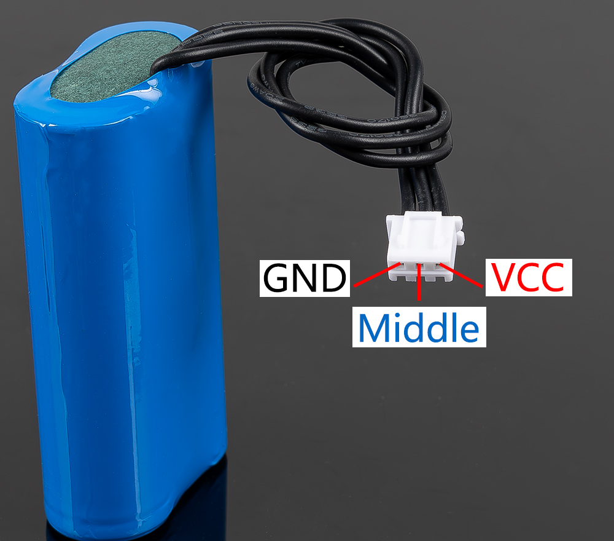

18650 电池
=================

* **VCC** ：电池正极，这里有两组 VCC 和 GND 是为了增加电流并减少电阻。
* **中间引脚** ：用于平衡两个电芯之间的电压，从而保护电池。
* **GND** ：电池负极。

这是 SunFounder 定制的电池组，由两节 18650 电池组成，容量为 2000mAh。
连接器为 XH2.54 3P，插入扩展板后即可直接充电。

**特性**

* 电池充电：5V/2A
* 电池输出：5V/5A
* 电池容量：3.7V 2000mAh x 2
* 续航时间：90分钟
* 充电时间：130分钟
* 连接器：XH2.54 3P
