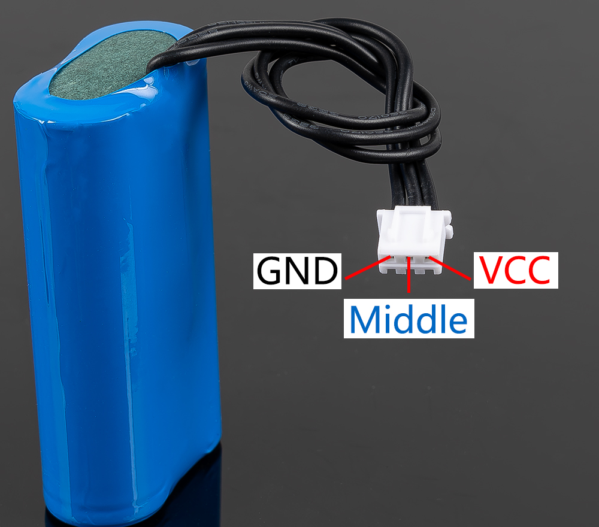

.. include:: /index.rst
   :start-after: start_hello_message
   :end-before: end_hello_message

18650 バッテリー
=================

* **VCC**: バッテリーのプラス端子です。ここには 2 組の VCC と GND があり、電流を増やし抵抗を減らすためのものです。
* **中央**: 2 つのセル間の電圧を均衡させ、バッテリーを保護します。
* **GND**: バッテリーのマイナス端子です。

これは SunFounder 製のカスタムバッテリーパックで、2000mAh の容量を持つ 2 つの 18650 バッテリーで構成されています。
コネクタは XH2.54 3P で、シールドに挿入した後、直接充電できます。

**特徴**

* バッテリー充電: 5V/2A
* バッテリー出力: 5V/5A
* バッテリー容量: 3.7V 2000mAh x 2
* バッテリー寿命: 90分
* バッテリー充電時間: 130分
* コネクタ: XH2.54 3P
