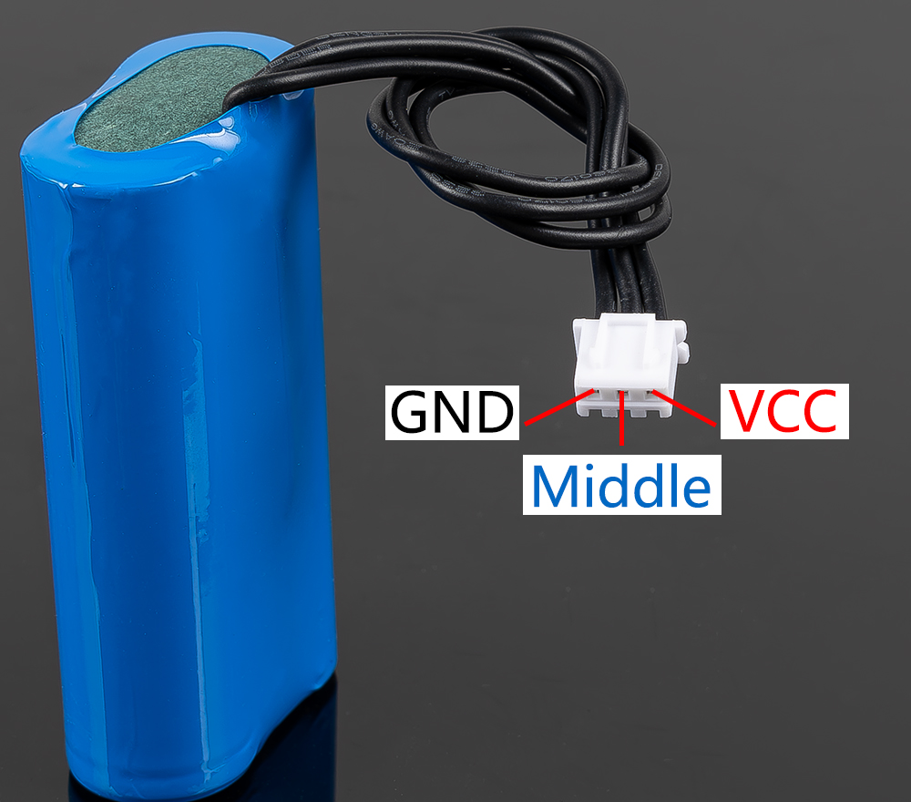

.. _18650_battery:

18650 电池
=================

* **VCC**：电池正极端子，设置了两组 VCC 和 GND 用于增加电流和减少电阻。
* **Middle**：用于平衡两节电池之间的电压，从而保护电池。
* **GND**：电池负极端子。

这是 SunFounder 定制的电池组，由两节 18650 电池组成，容量为 2000mAh。连接器为 
XH2.54 3P，插入保护板后即可直接充电。

**特点**

* 电池充电：5V/2A
* 电池输出：5V/5A
* 电池容量：3.7V 2000mAh x 2
* 电池续航：90分钟
* 电池充电时间：130分钟
* 连接器：XH2.54 3P
