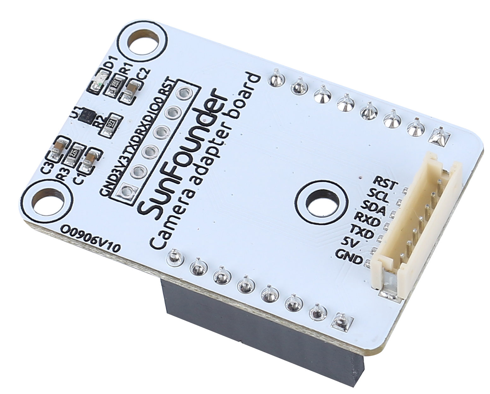
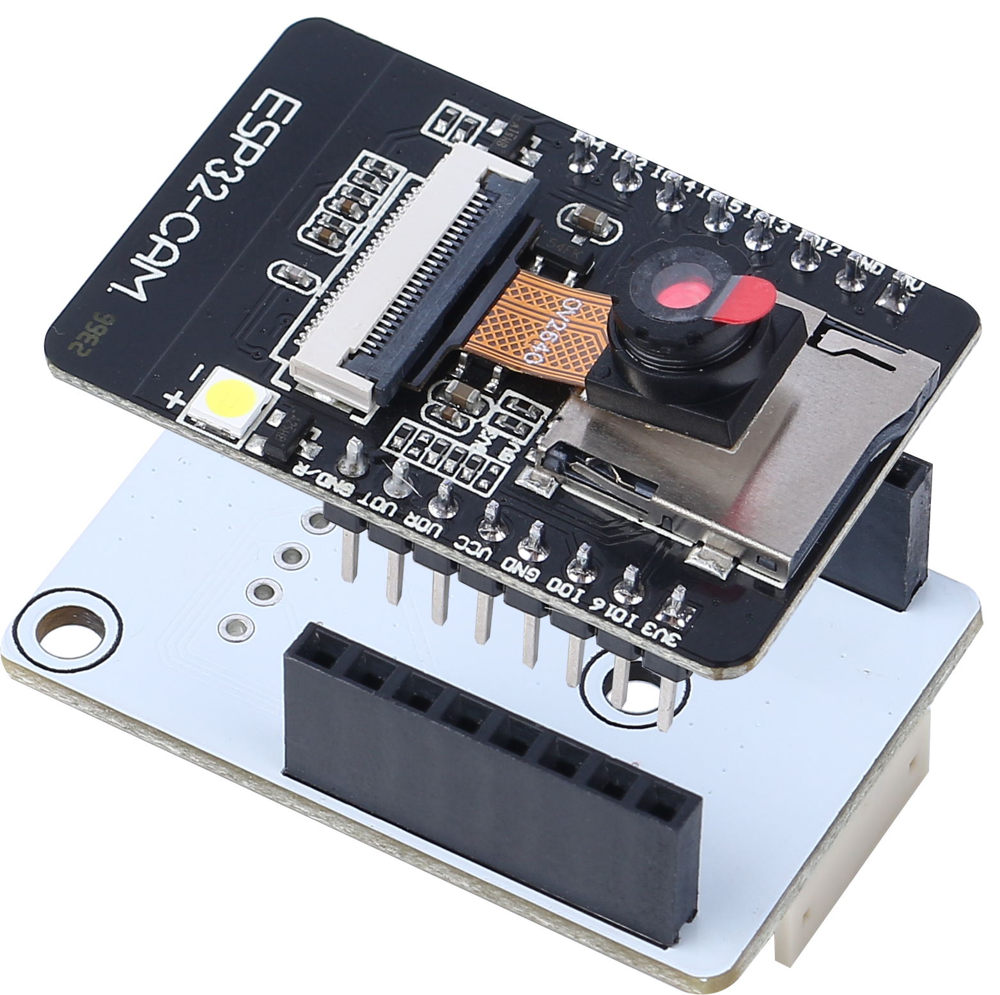
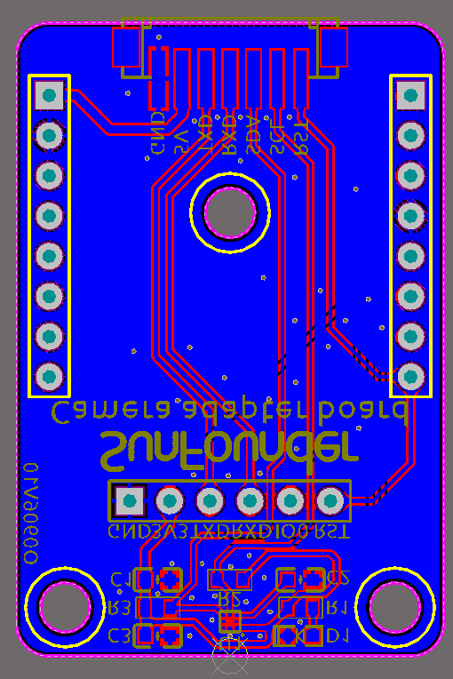
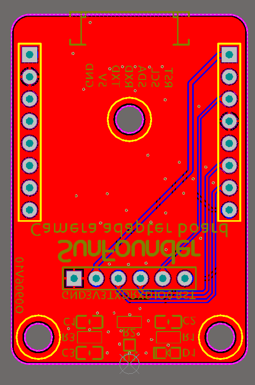
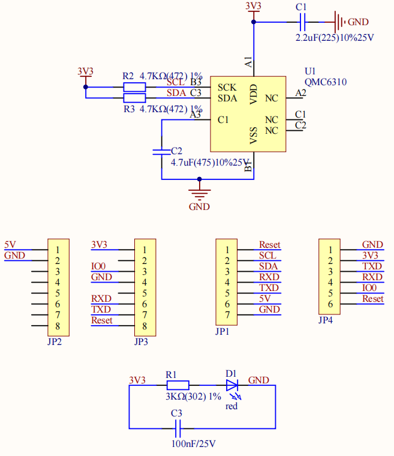

カメラアダプターボード
=======================

* **RST**: ESP32-CAMのリセットに使用します。
* **SCL**: QMC6310用のシリアルデータピンです。
* **SDA**: QMC6310のシリアルクロックピンです。
* **RXD**: ESP32-CAMのRXDピンです。ESP32-CAMへのコードのアップロードにはこの2つのシリアルピン、RXDとTXDを使用する必要があります。
* **TXD**: ESP32-CAMのTXDピンです。
* **5V**: 5Vの直流電源入力
* **GND**: グラウンド入力

名前の通り、カメラアダプターボードはESP-32 CAM用の拡張ボードです。ESP32-CAMをロボットに固定し、簡単に配線できるようにするために使用されます。

また、磁気センサーQMC6310はモーターの干渉を受けやすいため、できるだけモーターから離れた位置にこのカメラアダプターボードに配置しています。

.. image:: img/cam_adapter_qmc6310.png
    :width: 400
    :align: center

**特徴**

* 動作電圧: 5V
* インターフェースモデル: ZH1.5、7P
* 寸法: 40mm x 27mm x 15mm
* 通信プロトコル: UARTおよびI2C

**ドキュメント**

* PCB

* 回路図

**QMC6310について**

QMC6310は、磁気センサーと信号調整ASICを1つのシリコンチップに統合した3軸磁気センサーです。このLand Grid Arrayパッケージ（LGA）は、携帯電話やウェアラブルデバイスのeコンパス、地図の回転、ゲーム、個人のナビゲーションなどのアプリケーションを対象としています。

QMC6310は最新の高分解能磁気抵抗技術を基にしており、カスタム設計の16ビットADC ASICとともに、低ノイズ、高精度、低消費電力、オフセットキャンセル、温度補償などの利点を提供します。QMC6310は1°から2°のコンパスの方位精度を実現します。I²Cシリアルバスにより、簡単なインターフェースが可能です。

QMC6310は1.2x1.2x0.53mm3の表面実装8ピンLGAパッケージに入っています。

* |link_qmc6310_datasheet|