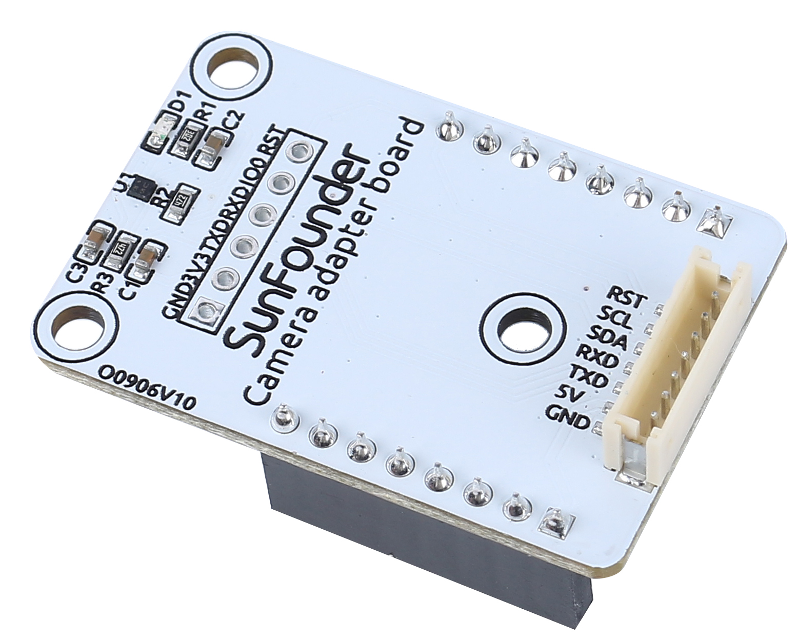
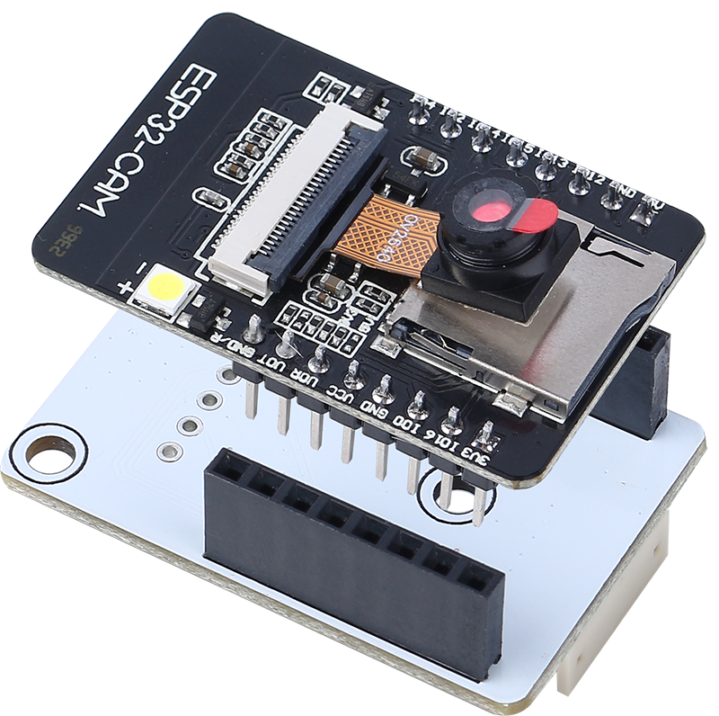
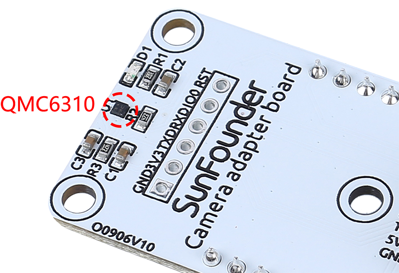
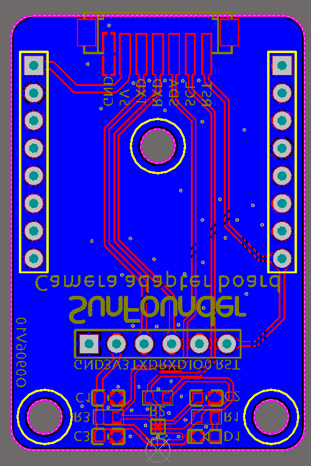
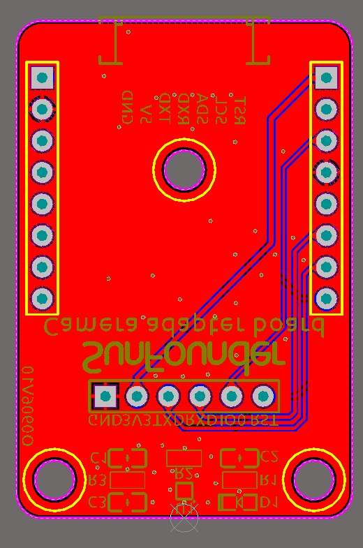
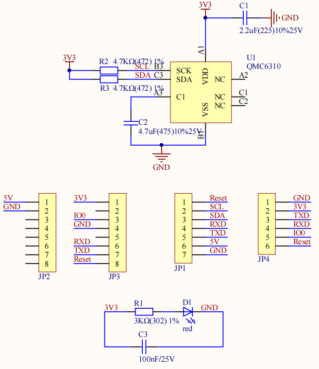

摄像头适配器板
=====================

* **RST** ：用于复位 ESP32-CAM。
* **SCL** ：QMC6310 的串行数据引脚
* **SDA** ：QMC6310 的串行时钟引脚
* **RXD** ：ESP32-CAM 的 RXD，你需要通过这两个串行引脚 RXD 和 TXD 向 ESP32-CAM 上传代码。
* **TXD** ：ESP32-CAM 的 TXD
* **5V** ：5V 直流电源输入
* **GND** ：接地输入

摄像头适配器板，顾名思义，是 ESP-32 CAM 的扩展板，用于扩展 ESP32-CAM，使其可以固定在机器人上，并且方便接线。

另外，由于地磁芯片 QMC6310 容易受到电机干扰，我们将其放置在此摄像头适配器板上，使其尽可能远离电机。

**特性**

* 工作电压：5V
* 接口类型：ZH1.5，7P
* 尺寸：40mm x 27mm x 15mm
* 通信协议：UART 和 I2C

**文档**

* PCB

* 原理图

**关于 QMC6310**

QMC6310 是一款三轴磁传感器，将磁传感器和信号调理 ASIC 集成在一个硅芯片中。此 LGA（栅格阵列封装）专为电子罗盘、地图旋转、游戏以及移动和可穿戴设备中的个人导航等应用而设计。

QMC6310 基于先进的高分辨率磁阻技术。结合定制设计的 16 位 ADC ASIC，具有低噪声、高精度、低功耗、偏移消除和温度补偿等优点。QMC6310 可实现 1° 至 2° 的罗盘航向精度。I²C 串行总线提供了简便的接口。

QMC6310 采用 1.2x1.2x0.53mm3 表面贴装 8 引脚 LGA 封装。

* |link_qmc6310_datasheet|
