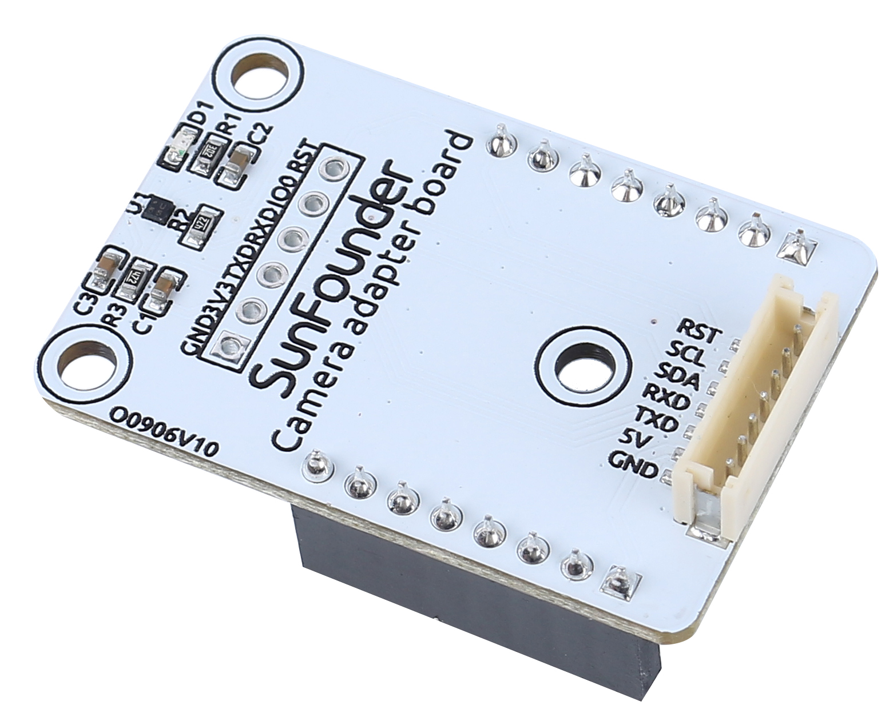
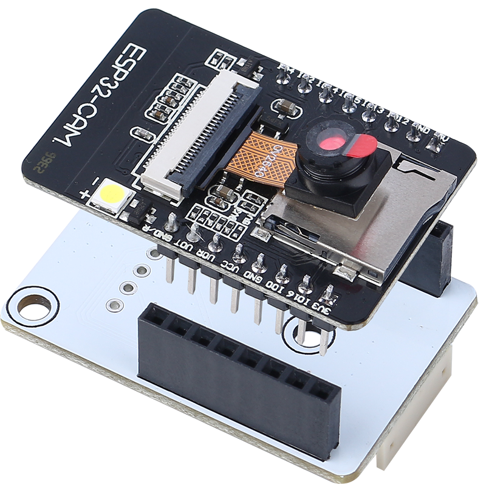
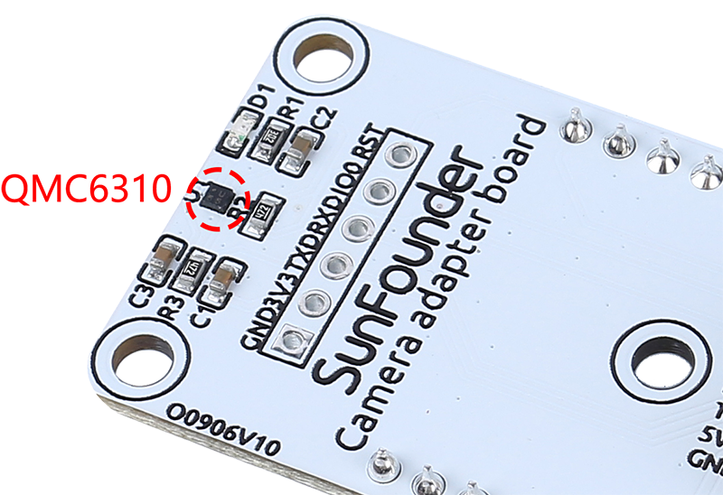
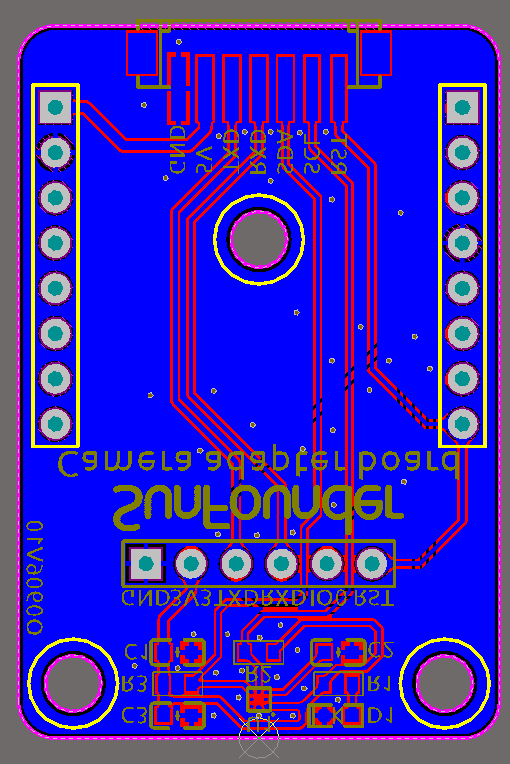
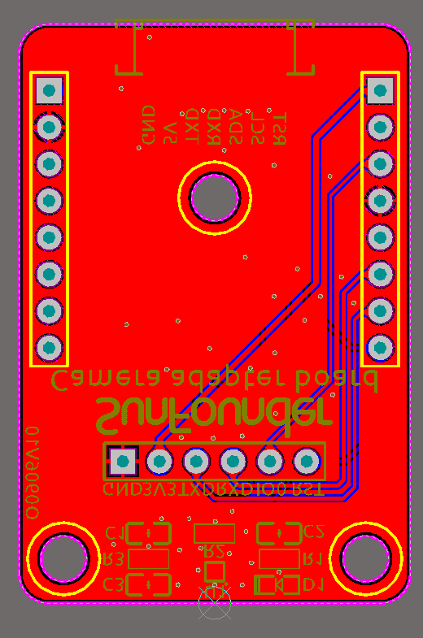
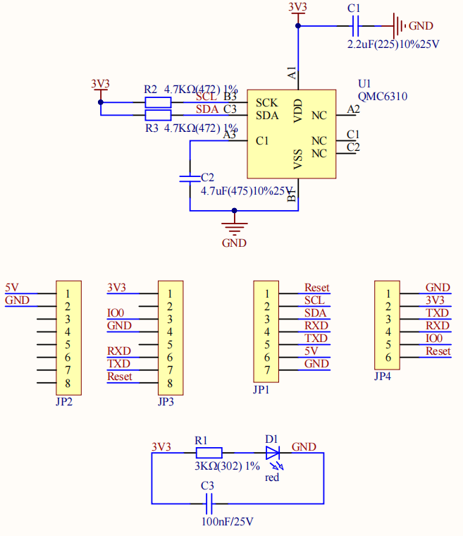

.. include:: /index.rst
   :start-after: start_hello_message
   :end-before: end_hello_message

Carte adaptateur caméra
========================

* **RST** : Utilisé pour réinitialiser l'ESP32-CAM.
* **SCL** : Broche de données série pour QMC6310
* **SDA** : Broche d'horloge série du QMC6310
* **RXD** : Le RXD de l'ESP32-CAM, vous devez téléverser le code vers l'ESP32-CAM via ces deux broches série, RXD et TXD.
* **TXD** : TXD de l'ESP32-CAM
* **5V** : Entrée d'alimentation 5V CC
* **GND** : Entrée de masse

La carte adaptateur caméra, comme son nom l'indique, est une carte d'extension pour l'ESP-32 CAM, utilisée pour étendre l'ESP32-CAM afin qu'il puisse être fixé au robot et facilement câblé.

De plus, comme la puce géomagnétique QMC6310 est sensible aux interférences des moteurs, nous l'avons placée sur cette carte adaptateur caméra pour la maintenir aussi loin que possible des moteurs.

**Caractéristiques**

* Tension de fonctionnement : 5V
* Modèle d'interface : ZH1.5, 7P
* Dimensions : 40mm x 27mm x 15mm
* Protocole de communication : UART et I2C

**Documents**

* PCB

* Schéma

**À propos du QMC6310**

Le QMC6310 est un capteur magnétique à trois axes, qui intègre des capteurs magnétiques et un ASIC de conditionnement de signal sur une seule puce de silicium. Ce boîtier Land Grid Array (LGA) est destiné à des applications telles que la boussole électronique, la rotation de carte, les jeux et la navigation personnelle dans les appareils mobiles et portables.

Le QMC6310 est basé sur une technologie magnéto-résistive de pointe à haute résolution. Avec l'ASIC ADC 16 bits conçu sur mesure, il offre les avantages d'un faible bruit, d'une haute précision, d'une faible consommation d'énergie, d'une annulation de décalage et de compensations de température. Le QMC6310 permet une précision de cap de boussole de 1° à 2°. Le bus série I²C permet une interface facile.

Le QMC6310 est dans un boîtier LGA à 8 broches à montage en surface de 1,2x1,2x0,53mm³.

* |link_qmc6310_datasheet|