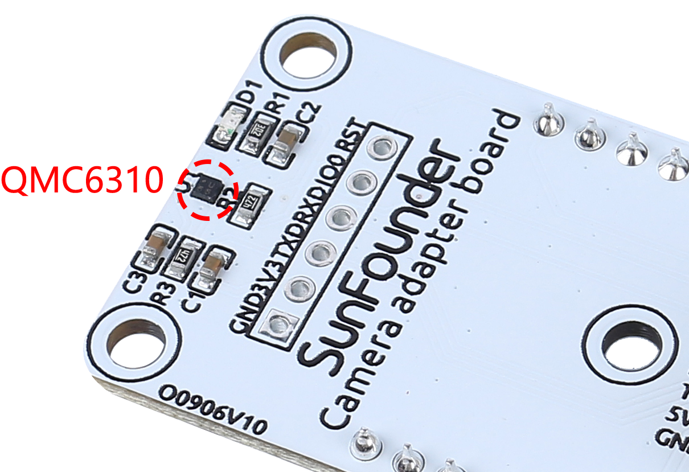

.. note::

    Hallo und willkommen in der SunFounder Raspberry Pi & Arduino & ESP32 Enthusiasten-Gemeinschaft auf Facebook! Tauchen Sie tiefer ein in die Welt von Raspberry Pi, Arduino und ESP32 mit anderen Enthusiasten.

    **Warum beitreten?**

    - **Expertenunterstützung**: Lösen Sie Nachverkaufsprobleme und technische Herausforderungen mit Hilfe unserer Gemeinschaft und unseres Teams.
    - **Lernen & Teilen**: Tauschen Sie Tipps und Anleitungen aus, um Ihre Fähigkeiten zu verbessern.
    - **Exklusive Vorschauen**: Erhalten Sie frühzeitigen Zugang zu neuen Produktankündigungen und exklusiven Einblicken.
    - **Spezialrabatte**: Genießen Sie exklusive Rabatte auf unsere neuesten Produkte.
    - **Festliche Aktionen und Gewinnspiele**: Nehmen Sie an Gewinnspielen und Feiertagsaktionen teil.

    👉 Sind Sie bereit, mit uns zu erkunden und zu erschaffen? Klicken Sie auf [|link_sf_facebook|] und treten Sie heute bei!

Kamera-Adapterplatine
=====================

.. image:: img/cam_adapter_board.jpg
    :width: 500
    :align: center

* **RST**: Wird verwendet, um die ESP32-CAM zurückzusetzen.
* **SCL**: Serieller Datenpin für QMC6310
* **SDA**: Serieller Uhrenpin des QMC6310
* **RXD**: RXD der ESP32-CAM, Sie benötigen diese beiden seriellen Pins, RXD und TXD, um Code auf die ESP32-CAM hochzuladen.
* **TXD**: TXD der ESP32-CAM
* **5V**: 5V DC-Eingang
* **GND**: Masse-Eingang

Die Kamera-Adapterplatine ist, wie der Name schon sagt, eine Erweiterungsplatine für die ESP-32-CAM, die verwendet wird, um die ESP32-CAM zu erweitern, sodass sie am Roboter befestigt und leicht verkabelt werden kann.

.. image:: img/cam_adapter_esp32cam.png
    :width: 400
    :align: center

Da der geomagnetische Chip QMC6310 anfällig für Störungen durch Motoren ist, haben wir ihn auf diese Kamera-Adapterplatine gesetzt, um ihn so weit wie möglich von den Motoren entfernt zu halten.

**Merkmale**

* Betriebsspannung: 5V
* Schnittstellenmodell: ZH1.5, 7P
* Abmessungen: 40mm x 27mm x 15mm
* Kommunikationsprotokoll: UART und I2C

**Dokumente**

* PCB

.. image:: img/cam_adap_pcb_bottom.png
    :width: 300

.. image:: img/cam_adap_pcb_top.png
    :width: 300

* Schaltplan

.. image:: img/cam_adapter_sche.png

**Über QMC6310**

Der QMC6310 ist ein dreiaxialer Magnetfeldsensor, der magnetische Sensoren und Signalzustands-ASIC in einem Siliziumchip integriert. Dieses Land Grid Array-Paket (LGA) ist für Anwendungen wie E-Kompass, Kartenrotation, Gaming und persönliche Navigation in mobilen und tragbaren Geräten konzipiert.

Der QMC6310 basiert auf modernster, hochauflösender, magnetoresistiver Technologie. Zusammen mit dem eigens entwickelten 16-Bit-ADC-ASIC bietet er die Vorteile von geringem Rauschen, hoher Genauigkeit, geringem Stromverbrauch, Offset-Kompensation und Temperaturkompensationen. QMC6310 ermöglicht eine Kompassgenauigkeit von 1° bis 2°. Der I²C-Serienbus ermöglicht eine einfache Schnittstelle.

Der QMC6310 ist in einem 1,2x1,2x0,53mm3 großen, oberflächenmontierbaren 8-Pin-LGA-Gehäuse untergebracht.

* |link_qmc6310_datasheet|
