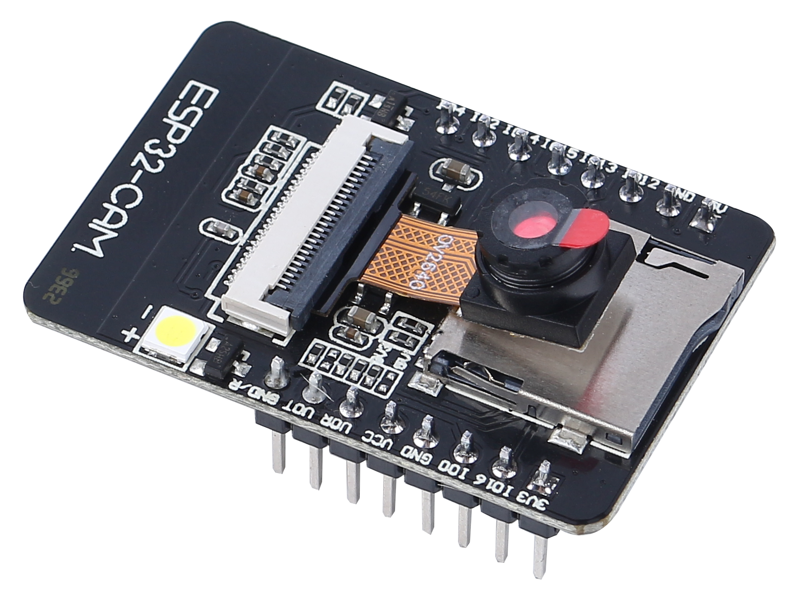
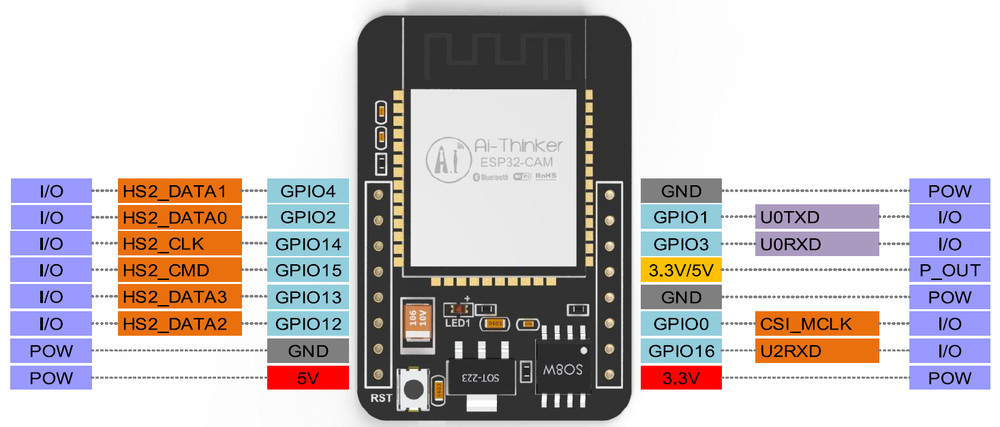

.. note:: 

    你好，欢迎加入 SunFounder 树莓派、Arduino 和 ESP32 爱好者社区！与其他爱好者一起，深入探索树莓派、Arduino 和 ESP32。

    **为什么加入？**

    - **专家支持**：通过社区和团队的帮助解决售后问题和技术挑战。
    - **学习与分享**：交流技巧和教程，提升你的技能。
    - **独家预览**：提前体验新产品发布和独家内容。
    - **专属折扣**：享受最新产品的专属优惠。
    - **节庆促销与赠品**：参与节日促销和赠品活动。

    👉 准备好与我们一起探索和创造了吗？点击 [|link_sf_facebook|] 即刻加入！

ESP32 CAM
=================

ESP32-CAM 是一款非常小巧的摄像头模块，搭载 ESP32-S 芯片，价格大约为 10 美元。除了 OV2640 摄像头和多个 GPIO 引脚用于连接外设外，它还配备了一个 microSD 卡插槽，可以用于存储拍摄的图像或存储文件以供客户端使用。

该模块可以作为最小的独立系统运行，尺寸仅为 27*40.5*4.5mm，且深度睡眠电流低至 6mA。

ESP32-CAM 可广泛应用于各种物联网 (IoT) 应用，适用于家庭智能设备、工业无线控制、无线监控、二维码无线识别、无线定位系统信号等物联网场景，是物联网应用的理想解决方案。

**技术规格**

.. list-table::
    :widths: 25 50

    * - 模块型号
      - ESP32-CAM
    * - 封装类型
      - DIP-16
    * - 尺寸
      - 27*40.5*4.5（±0.2）mm
    * - SPI 闪存
      - 默认 32Mbit
    * - RAM
      - 内部 520KB + 外部 8MB PSRAM
    * - 蓝牙
      - 支持 Bluetooth 4.2 BR/EDR 和 BLE 标准
    * - Wi-Fi
      - 802.11 b/g/n/e/i
    * - 支持接口
      - UART、SPI、I2C、PWM
    * - 支持 TF 卡
      - 最大支持 4G
    * - IO 引脚
      - 9 个
    * - 串口速率
      - 默认 115200 bps
    * - 图像输出格式
      - JPEG（仅支持 OV2640）、BMP、灰度图
    * - 频谱范围
      - 2400 ~ 2483.5MHz
    * - 天线类型
      - 板载 PCB 天线，增益 2dBi
    * - 发射功率
      - 802.11b: 17±2 dBm（@11Mbps）
    * - 
      - 802.11g: 14±2 dBm（@54Mbps）
    * - 
      - 802.11n: 13±2 dBm（@MCS7）
    * - 接收灵敏度
      - CCK, 1 Mbps: -90dBm
    * - 
      - CCK, 11 Mbps: -85 dBm
    * - 
      - 6 Mbps (1/2 BPSK): -88 dBm
    * - 
      - 54 Mbps (3/4 64-QAM): -70dBm
    * - 
      - MCS7 (65 Mbps, 72.2 Mbps): -67dBm
    * - 功耗
      - 闪光灯关闭：180mA@5V
    * - 
      - 闪光灯开启并最大亮度：310mA@5V
    * - 
      - 深度睡眠：最低功耗可达 6mA@5V
    * - 
      - 常规睡眠：最低 20mA@5V
    * - 
      - 浅睡眠：最低 6.7mA@5V
    * - 安全性
      - WPA/WPA2/WPA2-Enterprise/WPS
    * - 电源范围
      - 4.75-5.25V
    * - 工作温度
      - -20 ℃ ~ 70 ℃
    * - 存储环境
      - -40 ℃ ~ 125 ℃ ，< 90%RH

**ESP32-CAM 引脚图**

以下是 ESP32-CAM 引脚图（AI-Thinker 模块）。

* 有三个 **GND** 引脚和三个电源引脚：3.3V、5V 和 3.3V 或 5V（任选）。
* **GPIO 1** 和 **GPIO 3** 是串口引脚。你需要使用这些引脚将代码上传到开发板。
* 此外，**GPIO 0** 也起着重要作用，因为它决定了 ESP32 是否处于闪烁模式。当 **GPIO 0** 连接到 **GND** 时，ESP32 进入闪烁模式。

* 以下引脚与 microSD 卡读取器内部连接：

* GPIO 14: CLK
* GPIO 15: CMD
* GPIO 2: Data 0
* GPIO 4: Data 1（也与板载 LED 相连）
* GPIO 12: Data 2
* GPIO 13: Data 3

**注意事项**

* 请确保模块输入电源至少为 5V 2A，否则图像可能出现水波纹。
* ESP32 GPIO32 引脚控制摄像头电源。当摄像头工作时，请将 GPIO32 拉低。
* 由于 GPIO0 连接到摄像头的 XCLK 引脚，请在使用时将 GPIO0 保持浮空，不要连接高电平或低电平。
* 默认固件已预装在出厂时，请谨慎操作，如需重新烧录其他固件。

**文档**

* 原理图：|link_esp32cam_schematic|
* 摄像头规格（英文版）：|link_cam_ov2640|

.. note::
    上述所有信息来源于 |link_aithiner|
