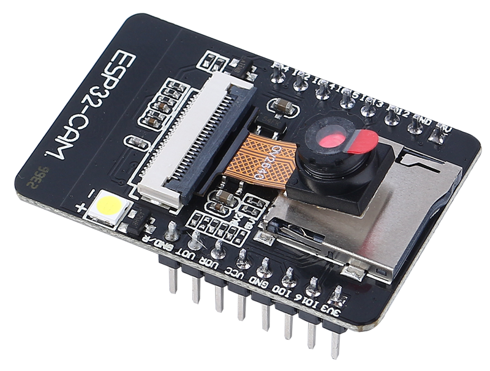
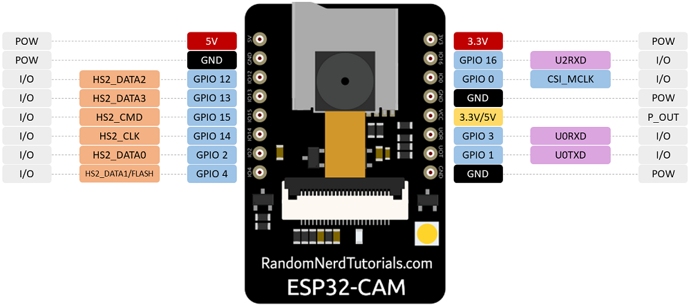

.. include:: /index.rst
   :start-after: start_hello_message
   :end-before: end_hello_message

ESP32 CAM
=================

ESP32-CAM は、ESP32-S チップを搭載した非常に小型のカメラモジュールで、価格は約 10 ドルです。OV2640 カメラと周辺機器を接続するための複数の GPIO に加えて、カメラで撮影した画像の保存やクライアントに提供するファイルの保存に使用できる microSD カードスロットも備えています。

このモジュールは最小システムとして独立して動作でき、サイズはわずか 27*40.5*4.5mm、ディープスリープ電流は 6mA と低くなっています。

ESP32-CAM は、さまざまな IoT アプリケーションで広く使用でき、ホームスマートデバイス、産業用ワイヤレス制御、ワイヤレス監視、QR ワイヤレス識別、ワイヤレスポジショニングシステム信号などの IoT アプリケーションに適しています。IoT アプリケーションにとって理想的なソリューションです。

**技術仕様**

.. list-table::
    :widths: 25 50

    * - モジュールモデル
      - ESP32-CAM
    * - パッケージ
      - DIP-16
    * - サイズ
      - 27*40.5*4.5（±0.2）mm
    * - SPI フラッシュ
      - デフォルト 32Mbit
    * - RAM
      - 内部 520KB + 外部 8MB PSRAM
    * - ブルートゥース
      - Bluetooth 4.2 BR/EDR および BLE 規格
    * - Wi-Fi
      - 802.11 b/g/n/e/i
    * - 対応インターフェース
      - UART、SPI、I2C、PWM
    * - 対応 TF カード
      - 最大 4G
    * - IO ピン
      - 9
    * - シリアルポート速度
      - デフォルト 115200 bps
    * - 画像出力形式
      - JPEG（OV2640 のみ対応）、BMP、GRAYSCALE
    * - スペクトル範囲
      - 2400 ~2483.5MHz
    * - アンテナタイプ
      - オンボード PCB アンテナ、ゲイン 2dBi
    * - 送信電力
      - 802.11b\: 17±2 dBm (@11Mbps)
    * -
      - 802.11g\: 14±2 dBm (@54Mbps)
    * -
      - 802.11n\: 13±2 dBm (@MCS7)
    * - 受信感度
      - CCK, 1 Mbps\: -90dBm,
    * -
      - CCK, 11 Mbps\: -85 dBm
    * -
      - 6 Mbps (1/2 BPSK)\: -88 dBm
    * -
      - 54 Mbps (3/4 64-QAM)\: -70dBm
    * -
      - MCS7 (65 Mbps, 72.2 Mbps)\: -67dBm
    * - 消費電力
      - フラッシュオフ\: 180mA\@5V,
    * -
      - フラッシュオンで明るさ最大\: 310mA\@5V
    * -
      - ディープスリープ\: 最低消費電力 6mA\@5V
    * -
      - モデムスリープ\: 最小 20mA\@5V
    * -
      - ライトスリープ\: 最小 6.7mA\@5V
    * - セキュリティ
      - WPA/WPA2/WPA2-Enterprise/WPS
    * - 電源供給範囲
      - 4.75-5.25V
    * - 動作温度
      - -20 ℃ ~ 70 ℃
    * - 保管環境
      - -40 ℃ ~ 125 ℃ 、< 90%RH

**ESP32-CAM ピン配置**

次の図は、ESP32-CAM（AI-Thinker モジュール）のピン配置を示しています。

* **GND** ピンが 3 つあり、電源用のピンが 3 つ（3.3V、5V、および 3.3V または 5V）あります。
* **GPIO 1** と **GPIO 3** はシリアルピンです。これらのピンは、ボードにコードをアップロードするために必要です。
* さらに、 **GPIO 0** も重要な役割を果たします。これは ESP32 がフラッシュモードかどうかを決定するためです。 **GPIO 0** が **GND** に接続されている場合、ESP32 はフラッシュモードになります。

* 次のピンは microSD カードリーダーに内部的に接続されています。

* GPIO 14: CLK
* GPIO 15: CMD
* GPIO 2: Data 0
* GPIO 4: Data 1（オンボード LED にも接続）
* GPIO 12: Data 2
* GPIO 13: Data 3

**注意**

* モジュールの入力電源は最低 5V 2A 以上としてください。そうしないと、画像に水線が入る可能性があります。
* ESP32 の GPIO32 ピンはカメラの電源を制御します。カメラ動作時は、GPIO32 を Low にしてください。
* GPIO0 はカメラの XCLK に接続されているため、使用時は GPIO0 をオープン状態にし、High または Low に接続しないでください。
* 工場出荷時にはデフォルトのファームウェアがすでに含まれており、追加のダウンロードは提供されません。他のファームウェアを再書き込みする必要がある場合は、注意してください。

**ドキュメント**

* 回路図: |link_esp32cam_schematic|
* カメラ仕様（英語版）: |link_cam_ov2640|

.. note::
    上記のすべての情報は |link_aithiner| からのものです。
