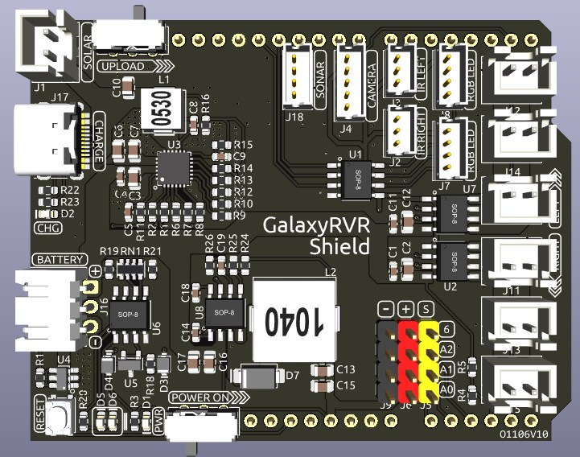
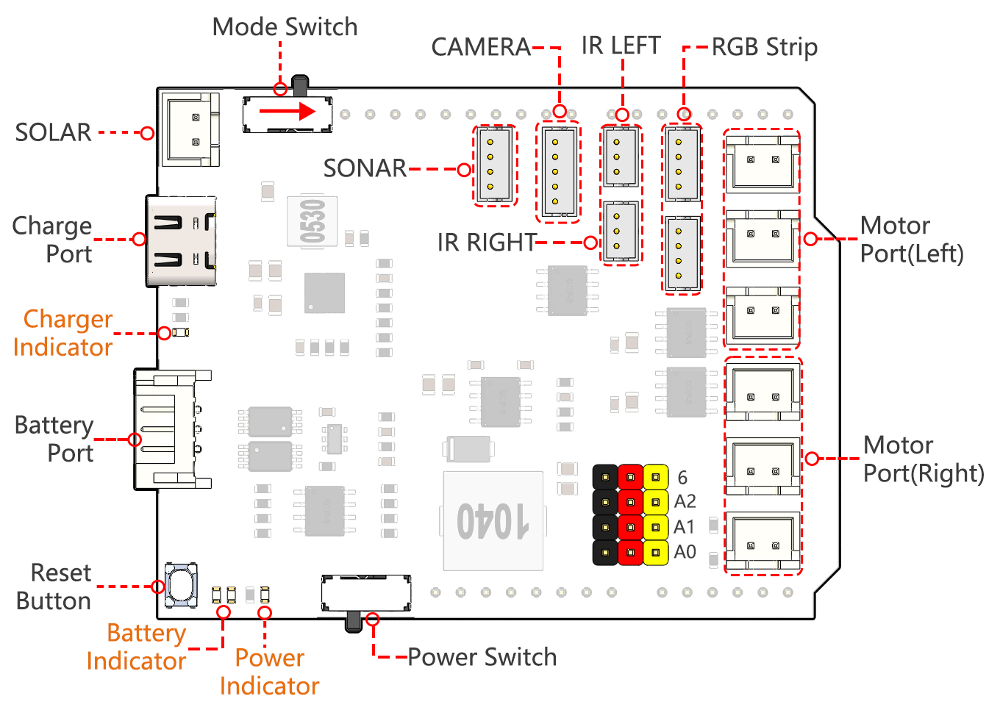
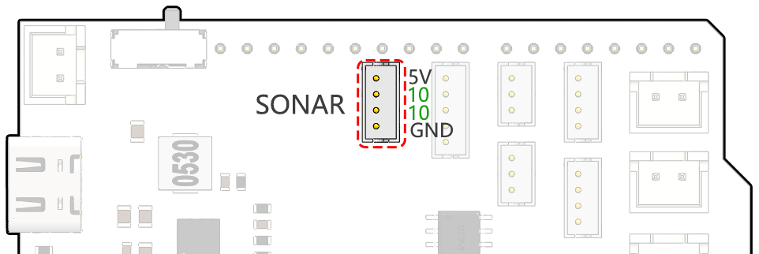
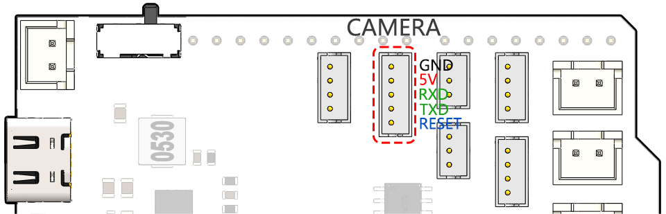
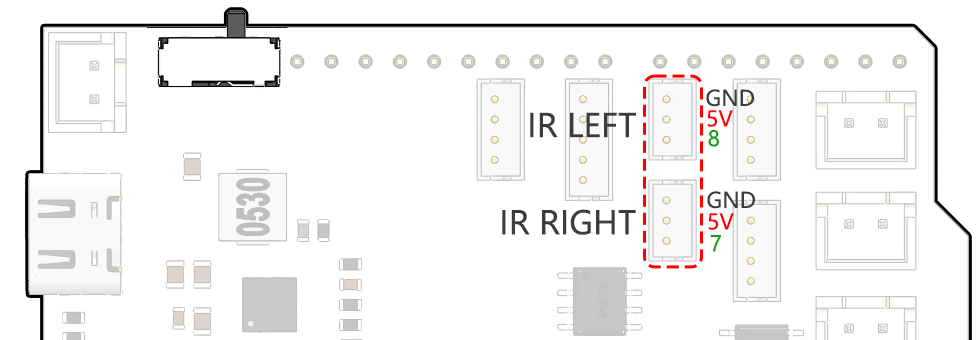
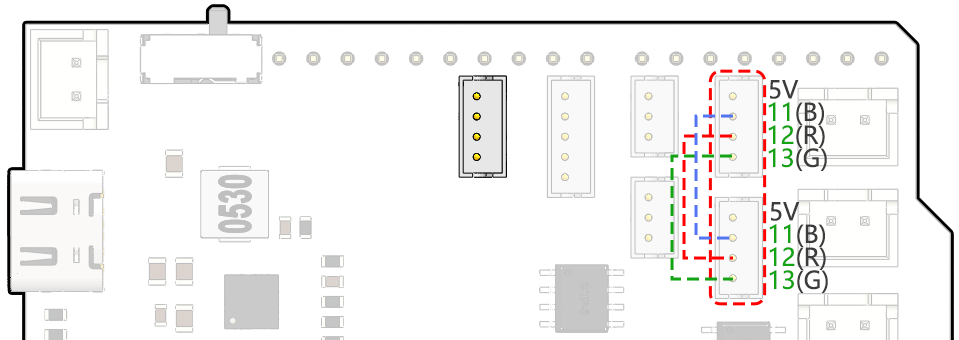
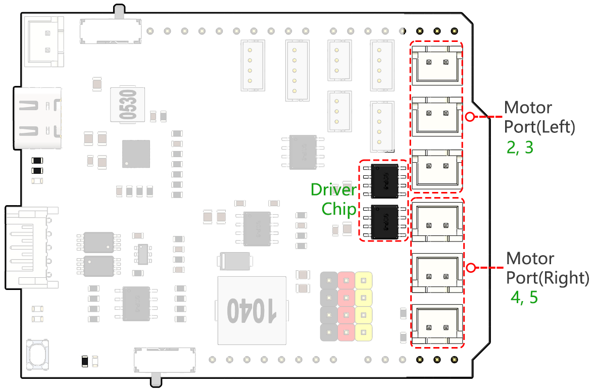

GalaxyRVR Shield
=========================

This is an all-in-one expansion board designed for Arduino by SunFounder, which contains various module ports 
such as motor, RGB strip, obstacle avoidance, grayscale, ESP32 CAM and ultrasonic module. 

This expansion board also has a built-in charging circuit, which can charge the battery with PH2.0-3P interface, 
and the estimated charging time is 130 minutes.

**Pinout**

* Charge Port
    * After plugging into the 5V/2A USB-C port, it can be used to charge the battery for 130min.

* **Battery Port**: 
    * 6.6V~8.4V PH2.0-3P power input.
    * Powering the GalaxyRVR Shield and Arduino board at the same time.

* Reset Button
    * Press this button to reset the program on the Arduino board.

* Indicators
    * **Charge Indicator**: Glows red when the shield is charging through the USB-C port.
    * **Power Indicator**: Glows green when the power switch is in the "ON" position.
    * **Battery Indicator**: Two orange indicators represent different battery levels. They flash during charging and turn off when the battery needs charging.

* Power Switch
    * Slide to ON to power on the GalaxyRVR.

* :ref:`shield_motor_pin`
    * **Motor Port(Right)**: 3 motors can be connected, but all 3 motors are controlled by the same set of signal **pins 2 and 3**.
    * **Motor Port(Left)**: 3 motors can be connected, but all 3 motors are controlled by the same set of signal **pins 4 and 5**.
    * Port Type: XH2.54, 2P.

* :ref:`shield_strip_pin`
    * For connecting 2 RGB LED Strips, the three pins of the strip are connected to **12, 13 and 11** respectively.
    * Port Type: ZH1.5, 4P.

* :ref:`shield_avoid_pin`
    * Used for connecting two IR obstacle avoidance modules.
    * The **left obstacle avoidance module** is connected to **pin 8**, the **right obstacle avoidance module** is connected to **pin 7**.
    * Port Type: ZH1.5, 3P.

* :ref:`shield_camera_pin`
    * The Camera Adapter Board port.
    * Port Type: ZH1.5, 5P.

* :ref:`shield_ultrasonic_pin`
    * To connect the ultrasonic module, both Trig & Echo pins are connected on **pin 10** of the Arduino board.
    * Port Type: ZH1.5, 4P.

* Mode Switch
    * The ESP32-CAM and the Arduino board share the same RX (receive) and TX (transmit) pins. 
    * So, when you're uploading code, you'll need to toggle this switch to the **right side** to disconnect the ESP32-CAM to avoid any conflicts or potential issues.
    * When you need to use the camera, toggle this switch to the **left side** so that the ESP32-CAM can communicate with the Arduino board.

* SOLAR
    * This is the port for the solar panel, which can charge the battery when plugged into the solar panel.
    * Port Type: XH2.54, 2P.

.. _shield_ultrasonic_pin:

Ultrasonic Port
--------------------

This is the pinout for the ZH1.5-4P ultrasonic port, with the Trig & Echo pins connected to pin 10 of the Arduino board.

.. _shield_camera_pin:

Camera Adapter Port
----------------------

The camera adapter interface pin diagram is shown here, the type is ZH1.5-7P.

* TX and RX are used for ESP32 CAM.

.. _shield_avoid_pin:

Obstacle Avoidance Port
----------------------------

This is the pinout of the obstacle avoidance port.

.. _shield_strip_pin:

RGB LED Strip Port
-------------------------

Below is the pinout diagram of the two RGB LED Strip, they are connected in parallel and the pinouts are the same.

.. _shield_motor_pin:

Motor Port
---------------

Here is the pinout of the 2 sets of motor ports.

