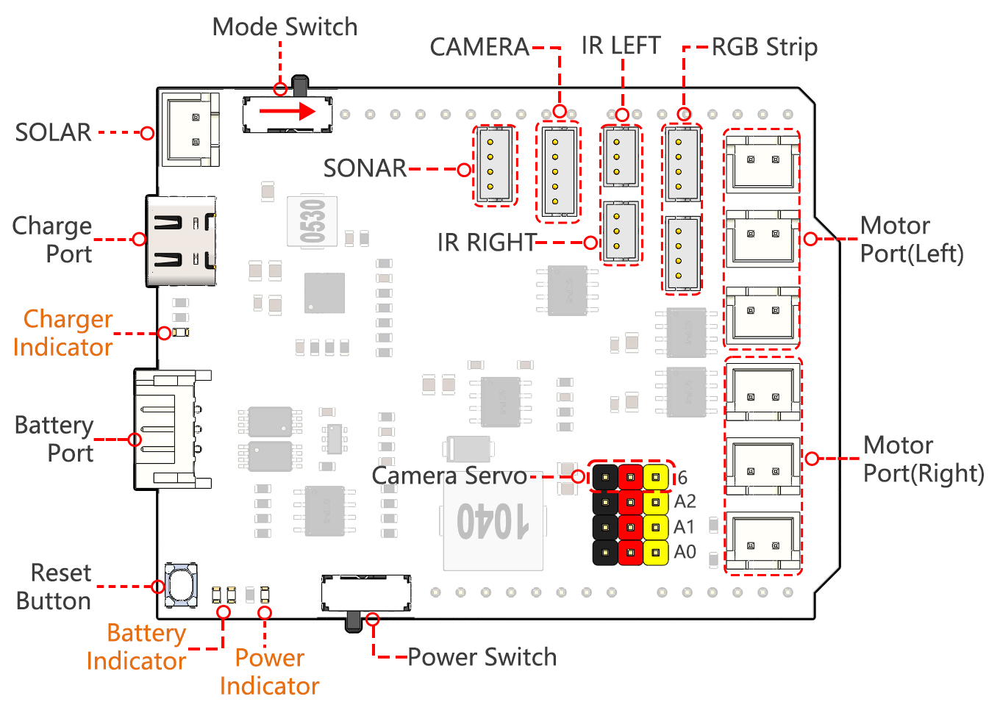

.. note:: 

    你好，欢迎加入 SunFounder 树莓派、Arduino 和 ESP32 爱好者社区！与其他爱好者一起，深入探索树莓派、Arduino 和 ESP32。

    **为什么加入？**

    - **专家支持**：通过社区和团队的帮助解决售后问题和技术挑战。
    - **学习与分享**：交流技巧和教程，提升你的技能。
    - **独家预览**：提前体验新产品发布和独家内容。
    - **专属折扣**：享受最新产品的专属优惠。
    - **节庆促销与赠品**：参与节日促销和赠品活动。

    👉 准备好与我们一起探索和创造了吗？点击 [|link_sf_facebook|] 即刻加入！

GalaxyRVR 扩展板
=========================

.. image:: img/galaxy_shield.jpg
    :width: 500
    :align: center

这是由 SunFounder 为 Arduino 设计的一款一体化扩展板，包含多个模块接口，如电机、
RGB 灯条、避障、灰度传感器、ESP32 CAM 和超声波模块。

此扩展板还内置了充电电路，可以通过 PH2.0-3P 接口为电池充电，预计充电时间为 130 分钟。

**引脚定义**

* 充电端口
    * 插入 5V/2A USB-C 端口后，可以为电池充电，充电时间为 130 分钟。

* **电池端口**：
    * 输入电压范围为 6.6V~8.4V，使用 PH2.0-3P 接口。
    * 同时为 GalaxyRVR Shield 和 Arduino 板供电。

* 重置按钮
    * 按下此按钮以重置 Arduino 板上的程序。

* 指示灯
    * **充电指示灯**：当通过 USB-C 端口充电时，指示灯为红色。
    * **电源指示灯**：当电源开关处于“开”位置时，指示灯为绿色。
    * **电池指示灯**：两个橙色指示灯代表不同的电池电量。在充电过程中闪烁，电池电量低时关闭。

* 电源开关
    * 将开关滑动到“开”位置为 GalaxyRVR 通电。

* 摄像头舵机
    * 摄像头的舵机连接至此。
    * 棕色线连接至“-”，红色线连接至“+”，黄色线连接至 Pin 6。

* :ref:`shield_motor_pin`
    * **电机端口（右侧）**：最多可连接 3 个电机，但所有 3 个电机由同一组信号引脚（ **Pins 2 和 3** ）控制。
    * **电机端口（左侧）**：最多可连接 3 个电机，但所有 3 个电机由同一组信号引脚（ **Pins 4 和 5** ）控制。
    * 端口类型：XH2.54，2P。

* :ref:`shield_strip_pin`
    * 用于连接 2 条 RGB LED 灯条，灯条的三个引脚分别连接至 **Pins 12、13 和 11**。
    * 端口类型：ZH1.5，4P。

* :ref:`shield_avoid_pin`
    * 用于连接两个红外避障模块。
    * **左侧避障模块**连接至 **Pin 8**，**右侧避障模块**连接至 **Pin 7**。
    * 端口类型：ZH1.5，3P。

* :ref:`shield_camera_pin`
    * 摄像头适配板接口端口。
    * 端口类型：ZH1.5，5P。

* :ref:`shield_ultrasonic_pin`
    * 用于连接超声波模块，Trig 和 Echo 引脚连接至 Arduino 板的 **Pin 10**。
    * 端口类型：ZH1.5，4P。

* 模式开关
    * ESP32-CAM 和 Arduino 板共享同一组 RX（接收）和 TX（发送）引脚。
    * 因此，当上传代码时，需将此开关拨至 **右侧**，以断开 ESP32-CAM，避免出现冲突或潜在问题。
    * 当需要使用摄像头时，请将此开关拨至 **左侧**，以便 ESP32-CAM 与 Arduino 板进行通信。

* SOLAR
    * 这是连接太阳能面板的端口，插入太阳能面板后可以为电池充电。
    * 端口类型：XH2.54，2P。

.. _shield_ultrasonic_pin:

超声波模块
--------------------

这是 ZH1.5-4P 超声波端口的引脚定义，Trig 和 Echo 引脚连接至 Arduino 板的 Pin 10。

.. image:: img/ultrasonic_shield.png

.. _shield_camera_pin:

摄像头模块
----------------------

这是摄像头适配板的引脚图，端口类型为 ZH1.5-7P。

* TX 和 RX 用于 ESP32 CAM。

.. image:: img/camera_shield.png

.. _shield_avoid_pin:

左侧/右侧避障模块
----------------------------

这是左侧和右侧避障模块的引脚。

.. image:: img/ir_shield.png

.. _shield_strip_pin:

RGB LED 灯条
-------------------------

以下是两条 RGB LED 灯条的引脚图，它们并联连接，且引脚定义相同。

.. image:: img/rgb_shield.png

.. _shield_motor_pin:

电机端口
---------------

这是两组电机端口的引脚定义。

.. image:: img/motor_shield.png
    :width: 600
    :align: center

