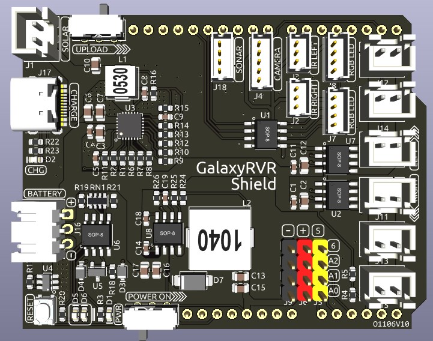
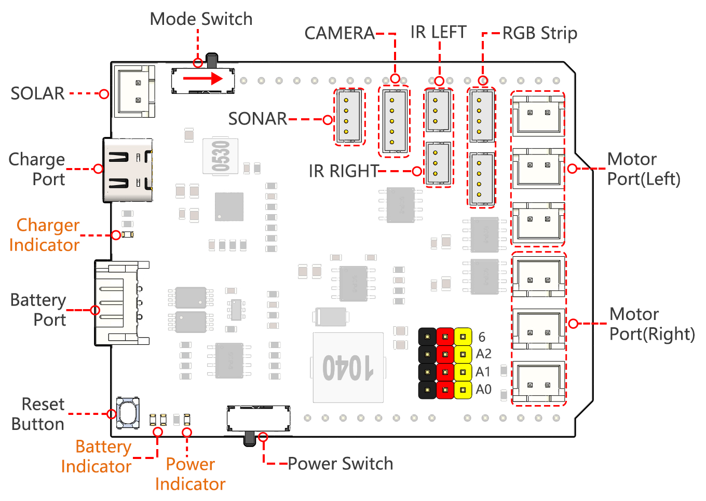
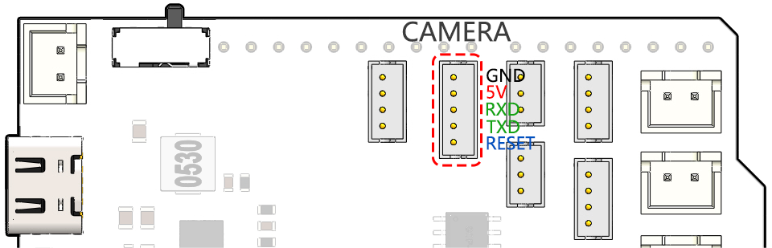
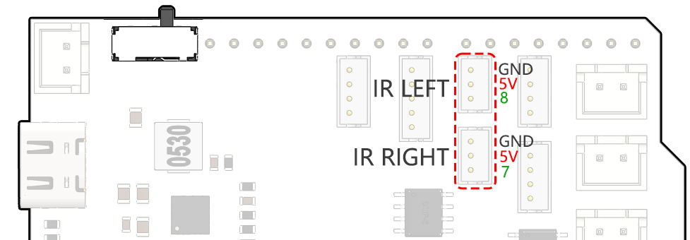
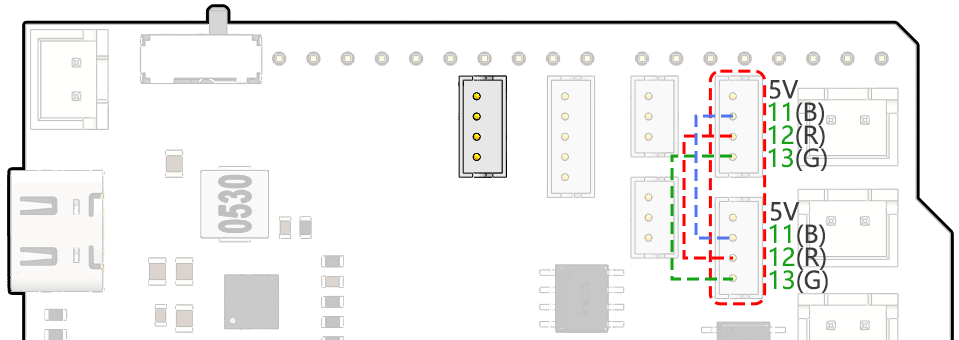
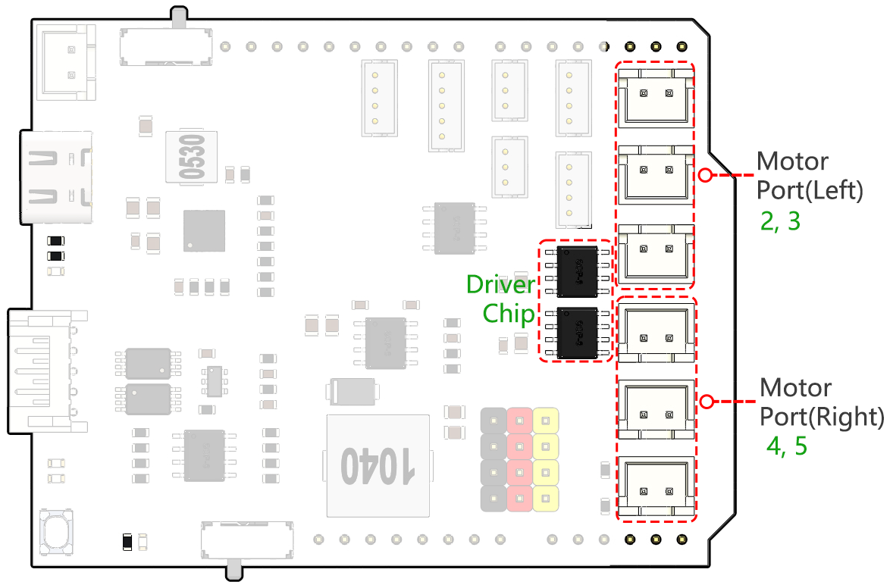

GalaxyRVR 扩展板
=========================

这是 SunFounder 为 Arduino 设计的一体化扩展板，包含各种模块接口，
如电机、RGB 灯带、避障、灰度、ESP32 CAM 和超声波模块。

该扩展板还内置充电电路，可通过 PH2.0-3P 接口为电池充电，
预计充电时间为 130 分钟。

**引脚图**

* 充电口
    * 插入 5V/2A USB-C 接口后，可用于为电池充电，充电时间 130 分钟。

* **电池接口** ：
    * 6.6V~8.4V PH2.0-3P 电源输入。
    * 同时为 GalaxyRVR 扩展板和 Arduino 板供电。

* 复位按钮
    * 按下此按钮可复位 Arduino 板上的程序。

* 指示灯
    * **充电指示灯** ：当扩展板通过 USB-C 接口充电时，呈红色亮起。
    * **电源指示灯** ：当电源开关处于 "ON" 位置时，呈绿色亮起。
    * **电池指示灯** ：两个橙色指示灯代表不同的电池电量水平。充电时闪烁，电池需要充电时熄灭。

* 电源开关
    * 滑动至 ON 以开启 GalaxyRVR 电源。

* 摄像头舵机
    * 摄像头上的舵机连接于此。
    * 棕线连接 "-"，红线连接 "+"，黄线连接引脚 6。

* :ref:`shield_motor_pin`
    * **电机接口（右）** ：可连接 3 个电机，但所有 3 个电机由同一组信号 **引脚 2 和 3** 控制。
    * **电机接口（左）** ：可连接 3 个电机，但所有 3 个电机由同一组信号 **引脚 4 和 5** 控制。
    * 接口类型：XH2.54，2P。

* :ref:`shield_strip_pin`
    * 用于连接 2 条 RGB LED 灯带，灯带的三个引脚分别连接到 **12、13 和 11** 。
    * 接口类型：ZH1.5，4P。

* :ref:`shield_avoid_pin`
    * 用于连接两个红外避障模块。
    * **左侧避障模块** 连接到 ** 引脚 8**，** 右侧避障模块** 连接到 ** 引脚 7**。
    * 接口类型：ZH1.5，3P。

* :ref:`shield_camera_pin`
    * 摄像头适配器板接口。
    * 接口类型：ZH1.5，5P。

* :ref:`shield_ultrasonic_pin`
    * 用于连接超声波模块，Trig 和 Echo 引脚均连接到 Arduino 板的 **引脚 10** 。
    * 接口类型：ZH1.5，4P。

* 模式切换开关
    * ESP32-CAM 和 Arduino 板共享相同的 RX（接收）和 TX（发送）引脚。
    * 因此，在上传代码时，你需要将此开关切换到 **右侧** ，以断开 ESP32-CAM 的连接，避免任何冲突或潜在问题。
    * 当需要使用摄像头时，将此开关切换到 **左侧** ，以便 ESP32-CAM 与 Arduino 板进行通信。

* SOLAR
    * 这是太阳能板的接口，连接太阳能板后可为电池充电。
    * 接口类型：XH2.54，2P。

.. _shield_ultrasonic_pin:

SONAR
--------------------

这是 ZH1.5-4P 超声波接口的引脚图，Trig 和 Echo 引脚连接到 Arduino 板的引脚 10。

.. image:: img/ultrasonic_shield.png

.. _shield_camera_pin:

CAMERA
----------------------

摄像头适配器接口引脚图如下，类型为 ZH1.5-7P。

* TX 和 RX 用于 ESP32 CAM。

.. _shield_avoid_pin:

左侧/右侧 红外
----------------------------

这是左右两侧避障模块的引脚。

.. _shield_strip_pin:

RGB 灯带
-------------------------

以下是两条 RGB LED 灯带的引脚图，它们并联连接，引脚定义相同。

.. _shield_motor_pin:

电机接口
---------------

以下是 2 组电机接口的引脚图。

