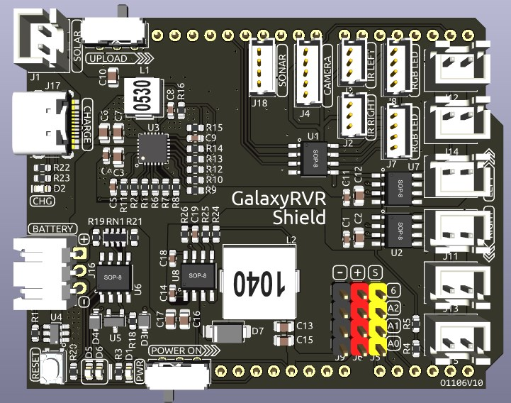
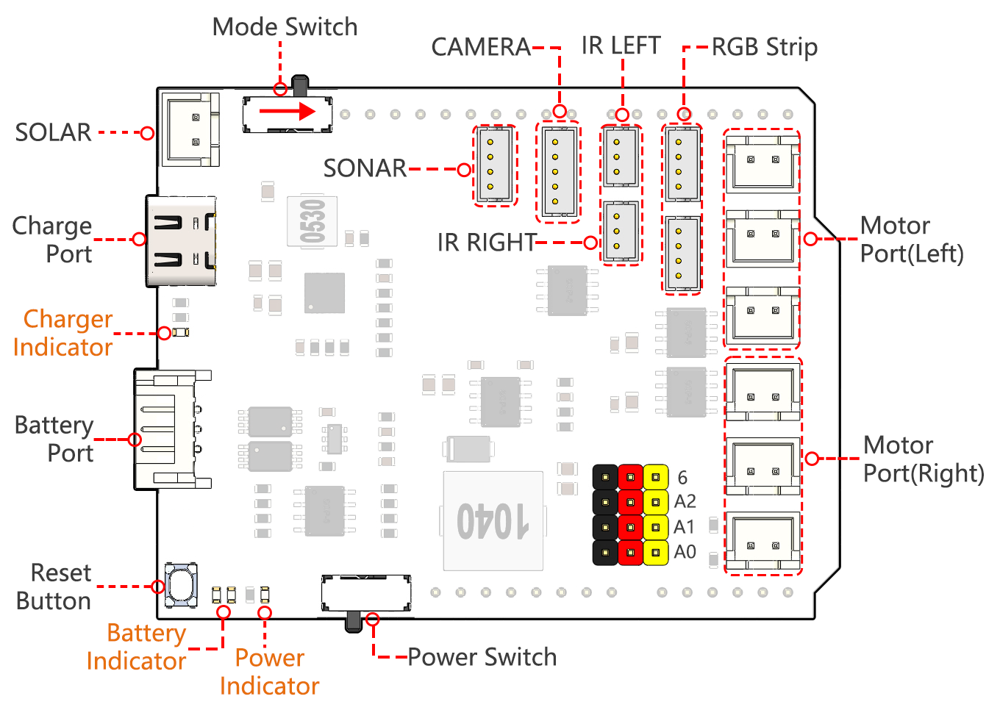
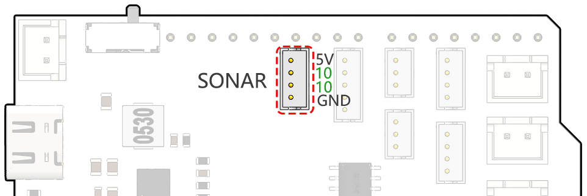
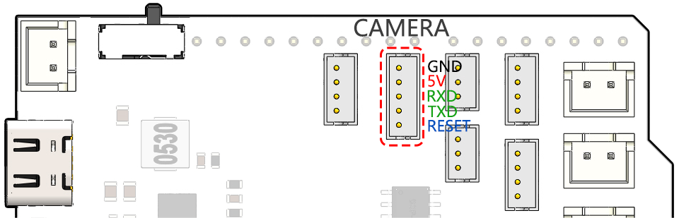
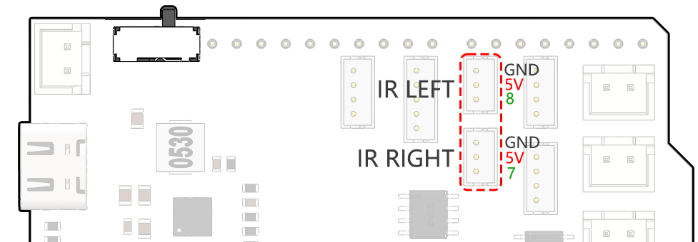
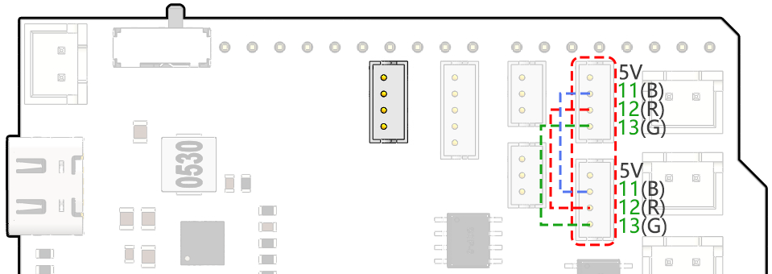

.. include:: /index.rst
   :start-after: start_hello_message
   :end-before: end_hello_message

GalaxyRVR Shield
=========================

Esta es una placa de expansión todo en uno diseñada para Arduino por SunFounder, que contiene varios puertos de módulos
como motor, tira RGB, evitación de obstáculos, escala de grises, ESP32 CAM y módulo ultrasónico.

Esta placa de expansión también tiene un circuito de carga incorporado, que puede cargar la batería con interfaz PH2.0-3P,
y el tiempo de carga estimado es de 130 minutos.

**Distribución de pines**

* Puerto de carga
    * Después de conectarlo al puerto USB-C de 5V/2A, se puede usar para cargar la batería durante 130 minutos.

* **Puerto de batería**:
    * Entrada de alimentación PH2.0-3P de 6.6V~8.4V.
    * Alimenta la GalaxyRVR Shield y la placa Arduino al mismo tiempo.

* Botón de reinicio
    * Presione este botón para reiniciar el programa en la placa Arduino.

* Indicadores
    * **Indicador de carga**: Brilla en rojo cuando la shield se está cargando a través del puerto USB-C.
    * **Indicador de encendido**: Brilla en verde cuando el interruptor de alimentación está en la posición "ON".
    * **Indicador de batería**: Dos indicadores naranjas representan diferentes niveles de batería. Parpadean durante la carga y se apagan cuando la batería necesita carga.

* Interruptor de alimentación
    * Deslícelo a ON para encender la GalaxyRVR.

* Servo de cámara
    * El servo de la cámara se conecta aquí.
    * El cable marrón se conecta a "-", el cable rojo se conecta a "+", y el cable amarillo se conecta al Pin 6.

* :ref:`shield_motor_pin`
    * **Puerto de motor (derecho)**: Se pueden conectar 3 motores, pero los 3 motores están controlados por el mismo conjunto de pines de señal **2 y 3**.
    * **Puerto de motor (izquierdo)**: Se pueden conectar 3 motores, pero los 3 motores están controlados por el mismo conjunto de pines de señal **4 y 5**.
    * Tipo de puerto: XH2.54, 2P.

* :ref:`shield_strip_pin`
    * Para conectar 2 tiras de LED RGB, los tres pines de la tira se conectan a **12, 13 y 11** respectivamente.
    * Tipo de puerto: ZH1.5, 4P.

* :ref:`shield_avoid_pin`
    * Se utiliza para conectar dos módulos infrarrojos de evitación de obstáculos.
    * El **módulo de evitación de obstáculos izquierdo** está conectado al **pin 8**, el **módulo de evitación de obstáculos derecho** está conectado al **pin 7**.
    * Tipo de puerto: ZH1.5, 3P.

* :ref:`shield_camera_pin`
    * El puerto de la Placa Adaptadora de Cámara.
    * Tipo de puerto: ZH1.5, 5P.

* :ref:`shield_ultrasonic_pin`
    * Para conectar el módulo ultrasónico, ambos pines Trig y Echo están conectados al **pin 10** de la placa Arduino.
    * Tipo de puerto: ZH1.5, 4P.

* Interruptor de modo
    * El ESP32-CAM y la placa Arduino comparten los mismos pines RX (recepción) y TX (transmisión).
    * Por lo tanto, cuando esté cargando código, deberá cambiar este interruptor al **lado derecho** para desconectar el ESP32-CAM y evitar conflictos o problemas potenciales.
    * Cuando necesite usar la cámara, cambie este interruptor al **lado izquierdo** para que el ESP32-CAM pueda comunicarse con la placa Arduino.

* SOLAR
    * Este es el puerto para el panel solar, que puede cargar la batería cuando está conectado al panel solar.
    * Tipo de puerto: XH2.54, 2P.

.. _shield_ultrasonic_pin:

SONAR
--------------------

Esta es la distribución de pines para el puerto ultrasónico ZH1.5-4P, con los pines Trig y Echo conectados al pin 10 de la placa Arduino.

.. _shield_camera_pin:

CÁMARA
----------------------

El diagrama de pines de la interfaz del adaptador de cámara se muestra aquí, el tipo es ZH1.5-7P.

* TX y RX se utilizan para ESP32 CAM.

.. _shield_avoid_pin:

INFRARROJO IZQUIERDO/DERECHO
----------------------------

Estos son los pines para los módulos de evitación de obstáculos izquierdo y derecho.

.. _shield_strip_pin:

Tira RGB
-------------------------

A continuación se muestra el diagrama de distribución de pines de las dos tiras de LED RGB, están conectadas en paralelo y las distribuciones de pines son las mismas.

.. _shield_motor_pin:

Puerto de motor
---------------

Aquí está la distribución de pines de los 2 conjuntos de puertos de motor.

.. image:: img/motor_shield.png
    :width: 600
    :align: center
