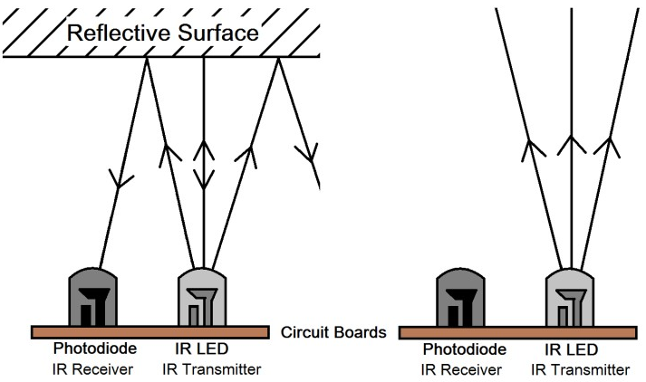
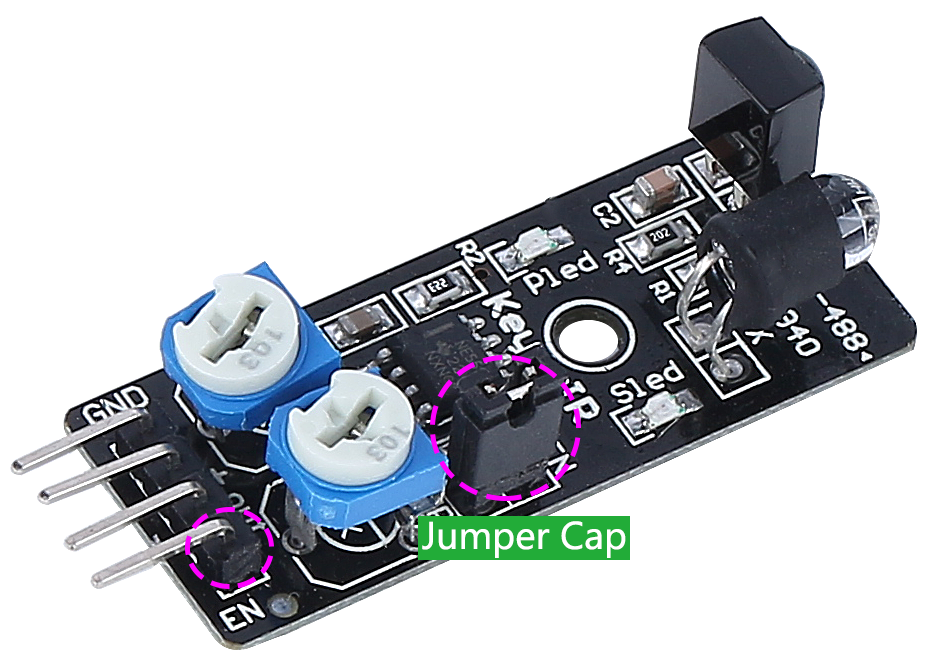
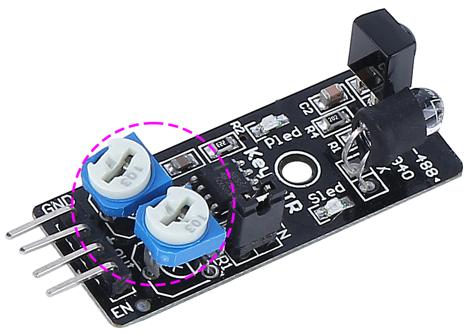

IR Obstacle Avoidcance Module
=======================================

This is an infrared obstacle avoidance module that can detect the presence of objects ahead. It is commonly used in robots, automation systems, and other intelligent devices. Its detection range is 2cm to 40cm, and objects of different colors have different levels of reflectivity. Therefore, the darker the object, the shorter the detection distance.

.. image:: img/ir_avoid.png
    :width: 400
    :align: center

Here are the pin definitions:

* **GND**: Ground
* **+**: Power supply, 3.3 ~ 5V DC.
* **Out**: By default, it stays high and only goes low when it spots an obstacle.
* **EN**: This **enable** pin decides when the module should work. By default, it is connected to GND, meaning the module is always on the job.

**How it works?**

This module contains a pair of IR transmitting and receiving components. Basically, the transmitter emits infrared light, when the emitted infrared light encounters an obstacle, it is reflected back and received by the receiver. Upon detection, the indicator lights up. After circuit processing, it outputs a low level signal.

The **EN** pin's low-level state activates the module, with the jumper cap securing the **EN** pin to the GND. To control the EN pin programmatically, remove the jumper cap.

There are two potentiometers on the module, one for adjusting the transmitting power and one for adjusting the transmitting frequency, and by adjusting these two potentiometers you can adjust its effective distance.

**Adjust the detection distance**

The obstacle avoidance module's detection range must be precisely calibrated for optimal performance, as default factory settings may not align with specific requirements.

Calibration involves the following steps:

#. Alignment of the Module: Start with the right-hand side obstacle avoidance module. Transportation can occasionally displace the alignment of the module's infrared transmitter and receiver. They should be manually realigned to ensure accuracy.

    .. raw:: html

        <video width="600" loop autoplay muted>
            <source src="../_static/video/ir_adjust1.mp4" type="video/mp4">
            Your browser does not support the video tag.
        </video>

#. Place an obstacle about 20 cm directly in front of the right module. The box in which our Rover kit came is a good choice for this! Now, turn the potentiometer on the module until the indicator light on the module just lights up. Then, keep moving the obstacle back and forth to check if the indicator light comes on at the desired distance. If the light doesn't turn on at the correct distance or if it remains on without going out, you'll need to adjust the other potentiometer.

    .. raw:: html

        <video width="600" loop autoplay muted>
            <source src="../_static/video/ir_adjust2.mp4" type="video/mp4">
            Your browser does not support the video tag.
        </video>

#. Repeat the same process for another module.

**Features**

* operating voltage: 3.3 V to 5 V
* output: digital (on/off)
* detection threshold: adjustable by 2 potentiometers
* distance range: 2 to 40 cm
* adjustment R5: frequency adjustment 38 kHz (already optimized)
* adjustment R6: IR LED duty cycle adjustment (already optimized)
* operating temperature: -10 °C to +50 °C
* effective angle: 35°
* I/O interface: 4 wire interface (- / + / S / EN)
* dimensions: 45 x 16 x 10 mm
* weight: 9 g 
