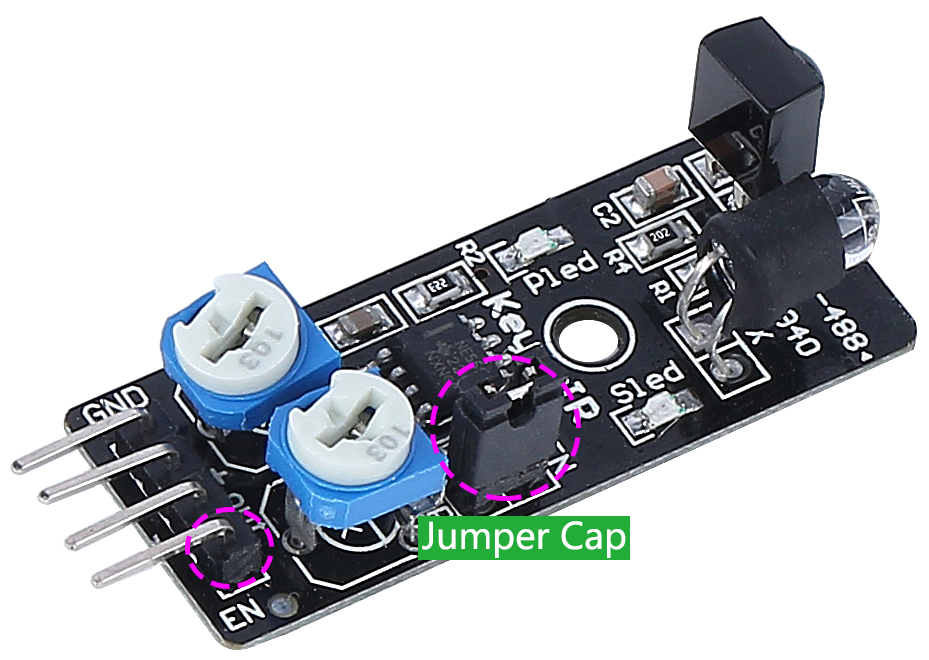
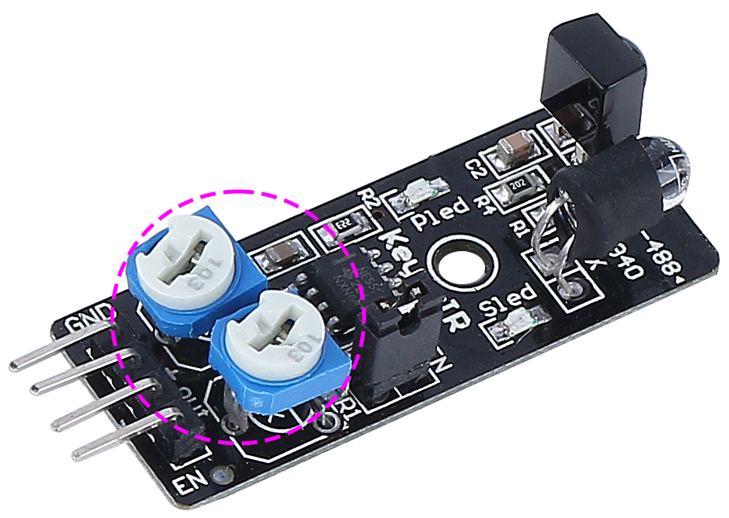

红外避障模块
=======================================

这是一个红外避障模块，可以检测前方是否存在障碍物。它常用于机器人、自动化系统和其他智能设备。其检测范围为 2cm 到 40cm，不同颜色的物体具有不同的反射率。因此，物体颜色越深，检测距离越短。

.. image:: img/ir_avoid.png
    :width: 400
    :align: center

以下是引脚定义：

* **GND** ：接地
* **+** ：电源，3.3 ~ 5V 直流。
* **Out** ：默认保持高电平，仅在检测到障碍物时变为低电平。
* **EN** ：此 **使能** 引脚决定模块何时工作。默认情况下，它连接到 GND，表示模块始终处于工作状态。

**工作原理？**

该模块包含一对红外发射和接收组件。基本上，发射器发射红外光，当发射的红外光遇到障碍物时，会被反射回来并由接收器接收。检测到障碍物时，指示灯亮起。经过电路处理后，输出低电平信号。

.. image:: img/ir_receive.png
    :width: 600
    :align: center

**EN** 引脚的低电平状态激活模块，跳线帽将 **EN** 引脚固定到 GND。要通过编程控制 EN 引脚，请取下跳线帽。

模块上有两个电位器，一个用于调节发射功率，一个用于调节发射频率，通过调节这两个电位器可以调整其有效距离。

**调整检测距离**

避障模块的检测范围必须精确校准以获得最佳性能，因为出厂默认设置可能不符合特定要求。

校准包括以下步骤：

#. 模块对齐：从右侧避障模块开始。运输过程中有时会导致模块红外发射器和接收器的对齐发生偏移。应手动重新对齐以确保准确性。

    .. raw:: html

        <video width="600" loop autoplay muted>
            <source src="../_static/video/ir_adjust1.mp4" type="video/mp4">
            您的浏览器不支持此视频标签。
        </video>

#. 在右侧模块正前方约 20 cm 处放置一个障碍物。我们的 Rover 套件包装盒就是一个不错的选择！现在，旋转模块上的电位器，直到模块上的指示灯刚好亮起。然后，来回移动障碍物，检查指示灯是否在所需距离处亮起。如果指示灯未在正确距离处亮起，或者一直亮着不熄灭，则需要调节另一个电位器。

    .. raw:: html

        <video width="600" loop autoplay muted>
            <source src="../_static/video/ir_adjust2.mp4" type="video/mp4">
            您的浏览器不支持此视频标签。
        </video>

#. 对另一个模块重复相同的过程。

**特性**

* 工作电压：3.3 V 至 5 V
* 输出：数字信号（开/关）
* 检测阈值：可通过 2 个电位器调节
* 距离范围：2 至 40 cm
* 调节 R5：频率调节 38 kHz（已优化）
* 调节 R6：红外 LED 占空比调节（已优化）
* 工作温度：-10 °C 至 +50 °C
* 有效角度：35°
* I/O 接口：4 线接口（- / + / S / EN）
* 尺寸：45 x 16 x 10 mm
* 重量：9 g
