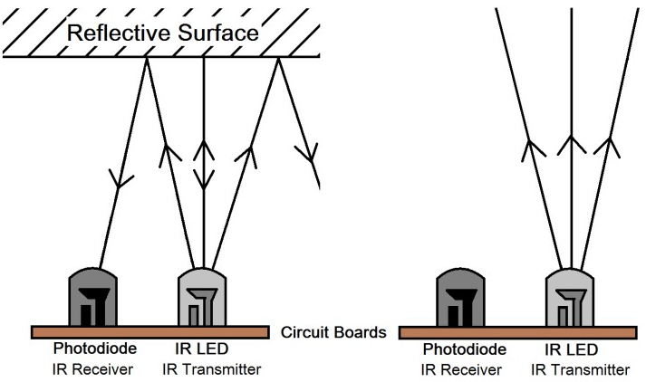
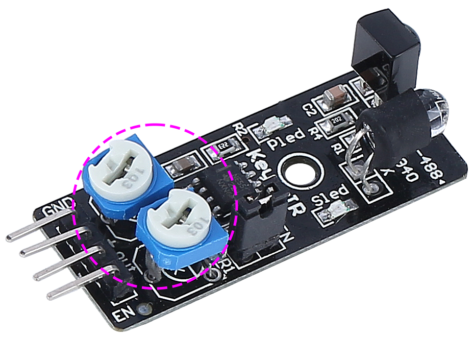

.. note::

    Ciao, benvenuto nella community SunFounder per appassionati di Raspberry Pi, Arduino e ESP32 su Facebook! Approfondisci la tua conoscenza di Raspberry Pi, Arduino e ESP32 con altri appassionati.

    **Perché unirsi?**

    - **Supporto esperto**: Risolvi problemi post-vendita e sfide tecniche con l'aiuto della nostra community e del nostro team.
    - **Impara e condividi**: Scambia consigli e tutorial per migliorare le tue competenze.
    - **Anteprime esclusive**: Ottieni accesso anticipato agli annunci di nuovi prodotti e anteprime.
    - **Sconti speciali**: Goditi sconti esclusivi sui nostri prodotti più recenti.
    - **Promozioni festive e omaggi**: Partecipa a omaggi e promozioni festive.

    👉 Pronto a esplorare e creare con noi? Clicca [|link_sf_facebook|] e unisciti oggi!

Modulo evitamento ostacoli IR
=======================================

Questo è un modulo evitamento ostacoli a infrarossi in grado di rilevare la presenza di oggetti davanti a sé. È comunemente utilizzato in robot, sistemi di automazione e altri dispositivi intelligenti. La sua portata di rilevamento va da 2 cm a 40 cm, e oggetti di diversi colori hanno diversi livelli di riflettività. Pertanto, più scuro è l'oggetto, minore è la distanza di rilevamento.

.. image:: img/ir_avoid.png
    :width: 400
    :align: center

Ecco le definizioni dei pin:

* **GND**: Massa
* **+**: Alimentazione, 3,3 ~ 5V CC.
* **Out**: Per impostazione predefinita, rimane alto e va basso solo quando rileva un ostacolo.
* **EN**: Questo pin di **abilitazione** decide quando il modulo deve funzionare. Per impostazione predefinita, è collegato a GND, il che significa che il modulo è sempre in funzione.

**Come funziona?**

Questo modulo contiene una coppia di componenti di trasmissione e ricezione IR. Fondamentalmente, il trasmettitore emette luce infrarossa; quando la luce infrarossa emessa incontra un ostacolo, viene riflessa e ricevuta dal ricevitore. Al rilevamento, l'indicatore si illumina. Dopo l'elaborazione del circuito, emette un segnale a livello basso.

Lo stato a livello basso del pin **EN** attiva il modulo, con il cappuccio jumper che fissa il pin **EN** a GND. Per controllare il pin EN programmaticamente, rimuovi il cappuccio jumper.

.. image:: img/ir_cap.png
    :width: 400
    :align: center

Ci sono due potenziometri sul modulo, uno per regolare la potenza di trasmissione e uno per regolare la frequenza di trasmissione; regolando questi due potenziometri puoi regolare la sua distanza effettiva.

**Regolazione della distanza di rilevamento**

La portata di rilevamento del modulo evitamento ostacoli deve essere calibrata con precisione per prestazioni ottimali, poiché le impostazioni predefinite di fabbrica potrebbero non essere in linea con i requisiti specifici.

La calibrazione prevede i seguenti passaggi:

#. Allineamento del modulo: Inizia con il modulo evitamento ostacoli sul lato destro. Il trasporto può occasionalmente spostare l'allineamento del trasmettitore e del ricevitore a infrarossi del modulo. Devono essere riallineati manualmente per garantire la precisione.

    .. raw:: html

        <video width="600" loop autoplay muted>
            <source src="../_static/video/ir_adjust1.mp4" type="video/mp4">
            Your browser does not support the video tag.
        </video>

#. Posiziona un ostacolo a circa 20 cm direttamente davanti al modulo destro. La scatola in cui è arrivato il nostro kit Rover è una buona scelta per questo! Ora, gira il potenziometro sul modulo finché la spia indicatrice sul modulo si accende appena. Quindi, continua a muovere l'ostacolo avanti e indietro per verificare se la spia si accende alla distanza desiderata. Se la spia non si accende alla distanza corretta o se rimane accesa senza spegnersi, dovrai regolare l'altro potenziometro.

    .. raw:: html

        <video width="600" loop autoplay muted>
            <source src="../_static/video/ir_adjust2.mp4" type="video/mp4">
            Your browser does not support the video tag.
        </video>

#. Ripeti lo stesso processo per l'altro modulo.

**Caratteristiche**

* tensione operativa: da 3,3 V a 5 V
* uscita: digitale (on/off)
* soglia di rilevamento: regolabile tramite 2 potenziometri
* intervallo di distanza: da 2 a 40 cm
* regolazione R5: regolazione frequenza 38 kHz (già ottimizzata)
* regolazione R6: regolazione duty cycle LED IR (già ottimizzata)
* temperatura operativa: da -10 °C a +50 °C
* angolo effettivo: 35°
* interfaccia I/O: interfaccia a 4 fili (- / + / S / EN)
* dimensioni: 45 x 16 x 10 mm
* peso: 9 g
