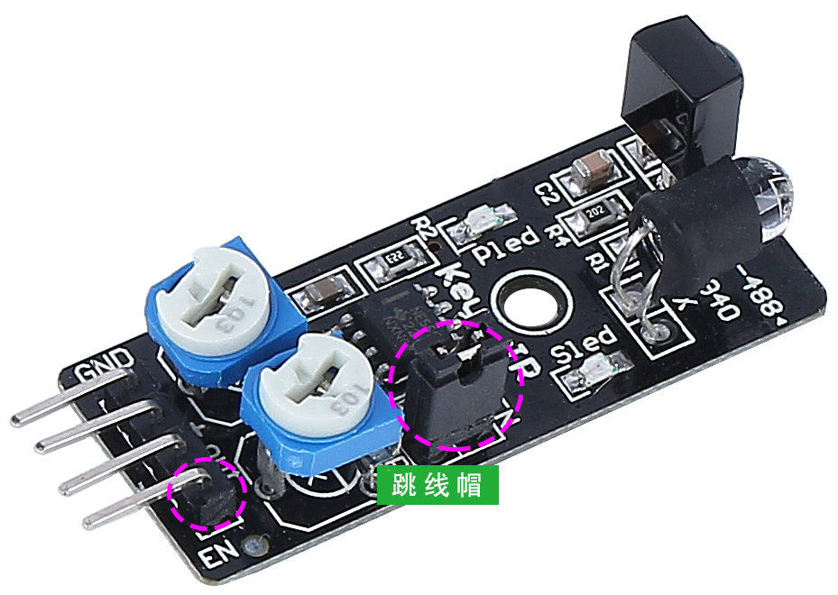

.. _ir_obstacle_module:

红外避障模块
=======================================

这是一个红外避障模块，可以检测前方是否有物体。它常用于机器人、自动化系统以及其他智能设备中。其检测范围为 2cm 至 40cm，不同颜色的物体具有不同的反射率。因此，物体越暗，检测距离越短。

.. image:: img/ir_avoid.png
    :width: 400
    :align: center

以下是引脚定义：

* **GND**：地线
* **+**：电源输入，支持 3.3V 至 5V DC。
* **Out**：默认保持高电平，仅在检测到障碍物时输出低电平。
* **EN**：此 **使能** 引脚决定模块的工作状态。默认连接至 GND，表示模块始终处于工作状态。

**工作原理**

该模块包含一对红外发射和接收元件。发射器发射红外光，当红外光遇到障碍物时，会反射回来并被接收器接收。检测到障碍物时，指示灯会亮起。经过电路处理后，模块输出低电平信号。

.. image:: img/ir_receive1.png
    :width: 600
    :align: center

**EN** 引脚的低电平状态激活模块，跳线帽将 **EN** 引脚连接到 GND。若要通过程序控制 EN 引脚，请拆除跳线帽。

模块上有两个可调电位器，一个用于调整发射功率，另一个用于调整发射频率。通过调节这两个电位器，可以调整模块的有效检测距离。

.. image:: img/ir_avoid_pot.png
    :width: 400
    :align: center

**调整检测距离**

为了获得最佳性能，避障模块的检测范围需要精确校准，因为默认的工厂设置可能不符合特定需求。

校准过程包括以下步骤：

#. 对准模块：首先调整右侧的避障模块。运输过程中，模块的红外发射器和接收器可能会发生偏移。需要手动重新对准，确保其准确性。

    .. raw:: html

        <video width="600" loop autoplay muted>
            <source src="../_static/video/ir_adjust1.mp4" type="video/mp4">
            Your browser does not support the video tag.
        </video>

#. 在右侧模块前方约 20 厘米处放置一个障碍物。我们的 Rover 套件包装盒非常适合用于此测试！然后，旋转模块上的电位器，直到模块上的指示灯刚刚亮起。接着，反复移动障碍物，检查指示灯是否在所需的距离处亮起。如果指示灯没有在正确的距离亮起，或者在到达目标距离后一直亮着，可能需要调整另一个电位器。

    .. raw:: html

        <video width="600" loop autoplay muted>
            <source src="../_static/video/ir_adjust2.mp4" type="video/mp4">
            Your browser does not support the video tag.
        </video>

#. 对另一个模块重复相同的过程。

**特点**

* 工作电压：3.3V 至 5V
* 输出类型：数字（开/关）
* 检测阈值：可通过两个电位器调节
* 检测范围：2 至 40 厘米
* 调整 R5：频率调节 38 kHz（已优化）
* 调整 R6：红外 LED 占空比调节（已优化）
* 工作温度：-10°C 至 +50°C
* 有效角度：35°
* I/O 接口：四线接口（- / + / S / EN）
* 尺寸：45 x 16 x 10 毫米
* 重量：9 克
