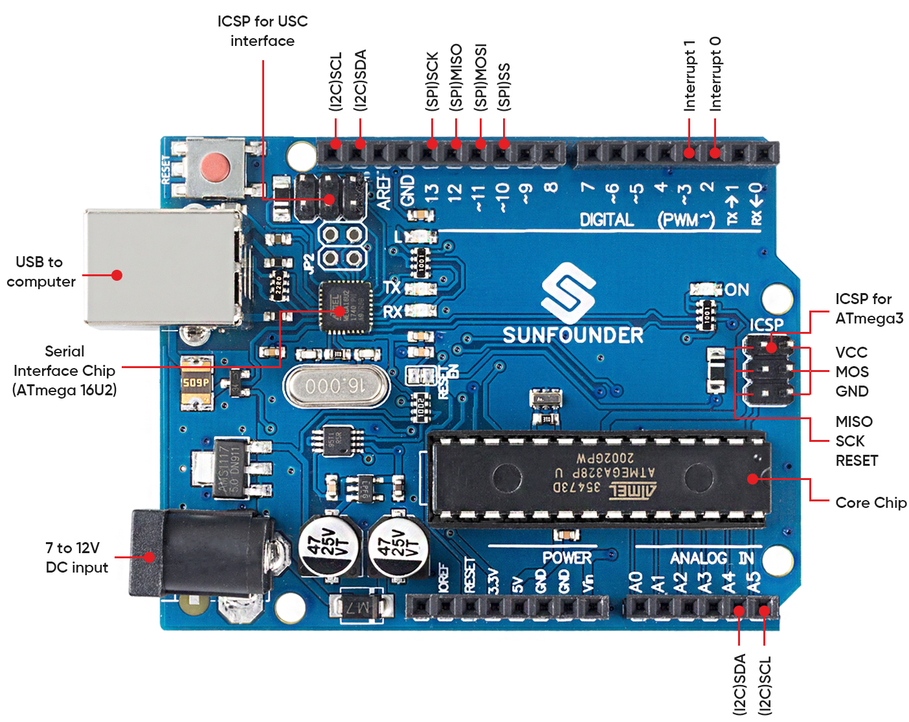

.. note::

    Hallo und willkommen in der SunFounder Raspberry Pi & Arduino & ESP32 Enthusiasten-Gemeinschaft auf Facebook! Tauchen Sie tiefer ein in die Welt von Raspberry Pi, Arduino und ESP32 mit anderen Enthusiasten.

    **Warum beitreten?**

    - **Expertenunterstützung**: Lösen Sie Nachverkaufsprobleme und technische Herausforderungen mit Hilfe unserer Gemeinschaft und unseres Teams.
    - **Lernen & Teilen**: Tauschen Sie Tipps und Anleitungen aus, um Ihre Fähigkeiten zu verbessern.
    - **Exklusive Vorschauen**: Erhalten Sie frühzeitigen Zugang zu neuen Produktankündigungen und exklusiven Einblicken.
    - **Spezialrabatte**: Genießen Sie exklusive Rabatte auf unsere neuesten Produkte.
    - **Festliche Aktionen und Gewinnspiele**: Nehmen Sie an Gewinnspielen und Feiertagsaktionen teil.

    👉 Sind Sie bereit, mit uns zu erkunden und zu erschaffen? Klicken Sie auf [|link_sf_facebook|] und treten Sie heute bei!

.. _cpn_uno:

SunFounder R3 Board
===========================

.. image:: img/uno_r3.jpg
    :width: 600
    :align: center

.. note::

    Das SunFounder R3 Board ist ein Hauptboard mit fast denselben Funktionen wie das `Arduino Uno <https://store.arduino.cc/products/arduino-uno-rev3/>`_, und beide Boards können austauschbar verwendet werden.

Das SunFounder R3 Board ist ein Mikrocontroller-Board, das auf dem ATmega328P basiert (`Datenblatt <http://ww1.microchip.com/downloads/en/DeviceDoc/Atmel-7810-Automotive-Microcontrollers-ATmega328P_Datasheet.pdf>`_). Es hat 14 digitale Ein-/Ausgangspins (von denen 6 als PWM-Ausgänge verwendet werden können), 6 analoge Eingänge, einen 16 MHz Keramikresonator (CSTCE16M0V53-R0), eine USB-Verbindung, eine Strombuchse, einen ICSP-Header und einen Reset-Knopf. Es enthält alles, was benötigt wird, um den Mikrocontroller zu unterstützen; einfach mit einem USB-Kabel an einen Computer anschließen oder mit einem AC-DC-Adapter oder einer Batterie betreiben, um zu starten.

**Technische Parameter**

* MIKROCONTROLLER: ATmega328P
* BETRIEBSSPANNUNG: 5V
* EINGANGSSPANNUNG (EMPFOHLEN): 7-12V
* EINGANGSSPANNUNG (LIMIT): 6-20V
* DIGITALE I/O-PINS: 14 (0-13, davon 6 für PWM-Ausgang(3, 5, 6, 9-11))
* PWM DIGITALE I/O-PINS: 6 (3, 5, 6, 9-11)
* ANALOGE EINGANGSPINS: 6 (A0-A5)
* DC STROM PRO I/O-PIN: 20 mA
* DC STROM FÜR 3.3V PIN: 50 mA
* FLASH-SPEICHER: 32 KB (ATmega328P), davon 0,5 KB durch Bootloader verwendet
* SRAM: 2 KB (ATmega328P)
* EEPROM: 1 KB (ATmega328P)
* TAKTFREQUENZ: 16 MHz
* LED_BUILTIN: 13
* LÄNGE: 68,6 mm
* BREITE: 53,4 mm
* GEWICHT: 25 g
* I2C-Port: A4(SDA), A5(SCL)

**Was gibt's noch**

* `Arduino IDE <https://www.arduino.cc/en/software>`_
* `Arduino Programmiersprachenreferenz <https://www.arduino.cc/reference/en/>`_
* `ATmega328P Datenblatt <http://ww1.microchip.com/downloads/en/DeviceDoc/Atmel-7810-Automotive-Microcontrollers-ATmega328P_Datasheet.pdf>`_

