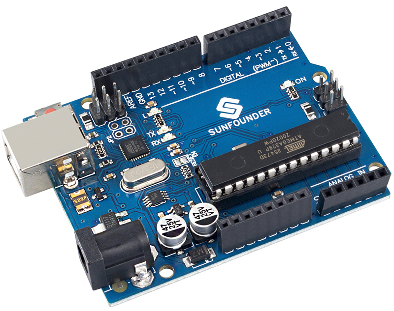
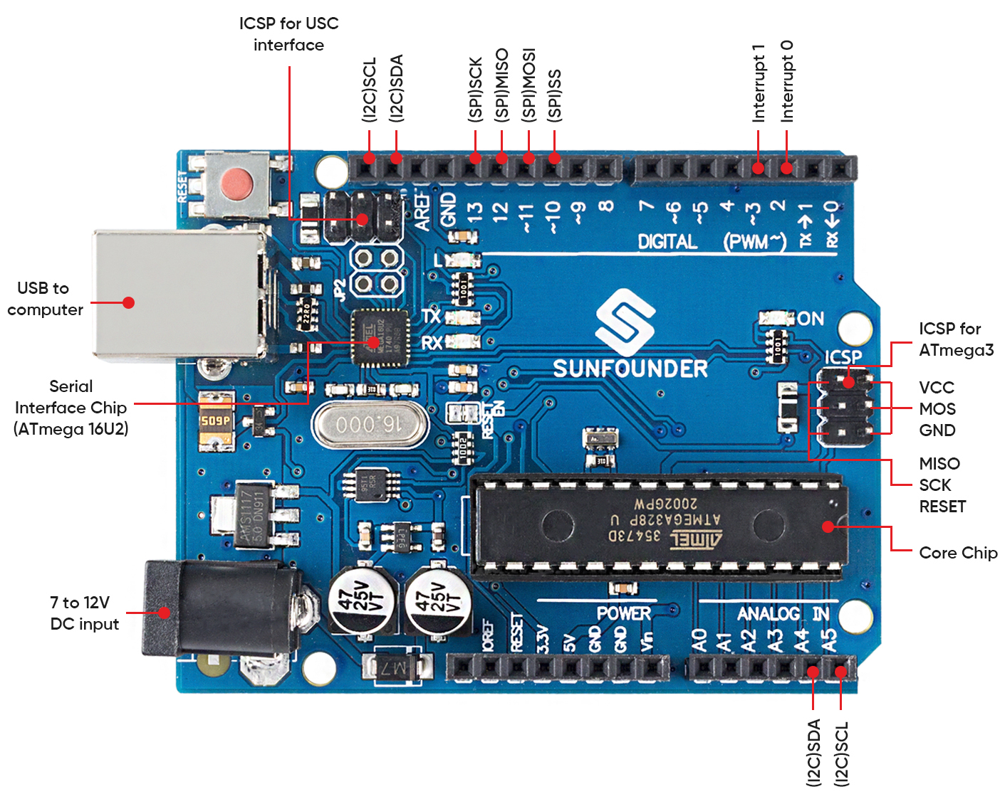

.. _cpn_uno:

SunFounder R3 板
===========================

.. note::

    SunFounder R3 板是一款与 `Arduino Uno <https://store.arduino.cc/products/arduino-uno-rev3/>`_ 功能几乎相同的主板，两块板可以互换使用。

SunFounder R3 板是一款基于 ATmega328P（`数据手册 <http://ww1.microchip.com/downloads/en/DeviceDoc/Atmel-7810-Automotive-Microcontrollers-ATmega328P_Datasheet.pdf>`_）的微控制器板。它有 14 个数字输入/输出引脚（其中 6 个可用作 PWM 输出）、6 个模拟输入、一个 16 MHz 陶瓷谐振器（CSTCE16M0V53-R0）、一个 USB 连接、一个电源插座、一个 ICSP 接口和一个复位按钮。它包含了支持微控制器所需的一切；只需通过 USB 线缆连接到计算机，或用 AC-DC 适配器或电池供电即可开始使用。

**技术参数**

* 微控制器：ATmega328P
* 工作电压：5V
* 输入电压（推荐）：7-12V
* 输入电压（限制）：6-20V
* 数字 I/O 引脚：14（0-13，其中 6 个提供 PWM 输出（3, 5, 6, 9-11））
* PWM 数字 I/O 引脚：6（3, 5, 6, 9-11）
* 模拟输入引脚：6（A0-A5）
* 每个 I/O 引脚的直流电流：20 mA
* 3.3V 引脚的直流电流：50 mA
* 闪存：32 KB（ATmega328P），其中 0.5 KB 用于引导加载程序
* SRAM：2 KB（ATmega328P）
* EEPROM：1 KB（ATmega328P）
* 时钟速度：16 MHz
* LED_BUILTIN：13
* 长度：68.6 mm
* 宽度：53.4 mm
* 重量：25 g
* I2C 接口：A4(SDA), A5(SCL)

**更多信息**

* `Arduino IDE <https://www.arduino.cc/en/software>`_
* `Arduino 编程语言参考 <https://www.arduino.cc/reference/en/>`_
* `ATmega328P 数据手册 <http://ww1.microchip.com/downloads/en/DeviceDoc/Atmel-7810-Automotive-Microcontrollers-ATmega328P_Datasheet.pdf>`_
