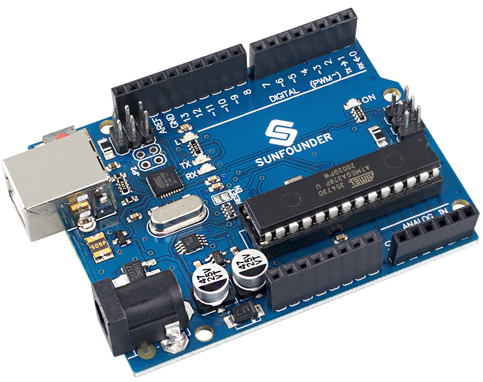
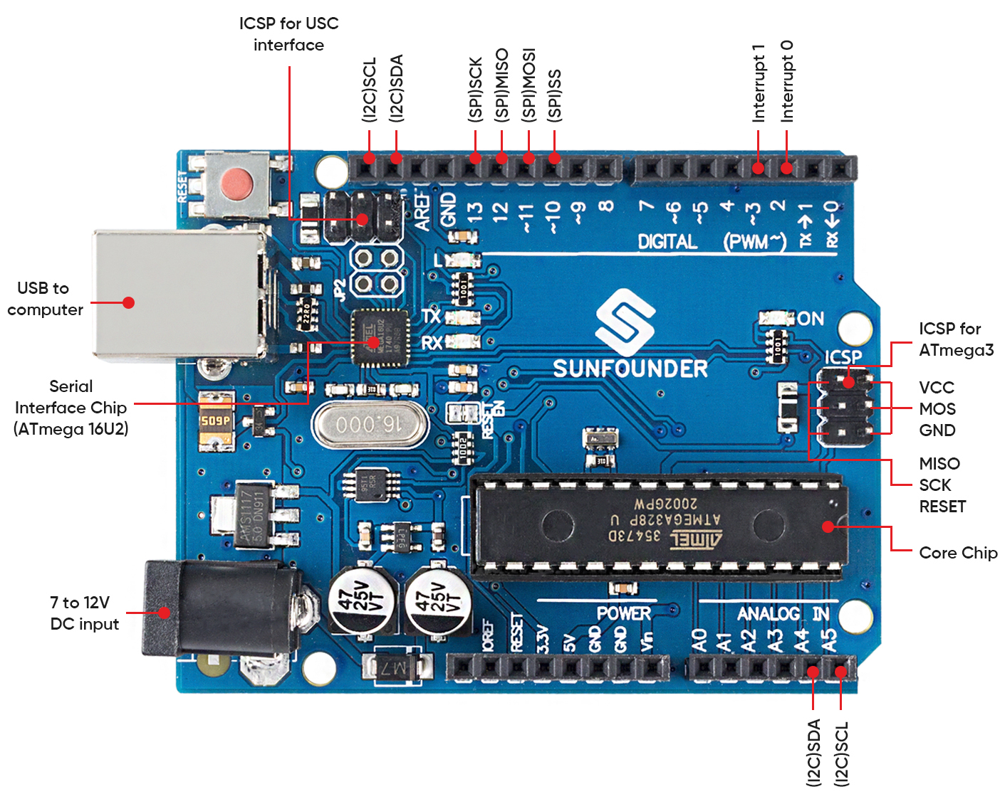

.. include:: /index.rst
   :start-after: start_hello_message
   :end-before: end_hello_message

.. _cpn_uno:

SunFounder R3 ボード
===========================

.. note::

    SunFounder R3 ボードは、`Arduino Uno <https://store.arduino.cc/products/arduino-uno-rev3/>`_ とほぼ同じ機能を持つメインボードであり、2 つのボードは互換性を持って使用できます。

SunFounder R3 ボードは、ATmega328P（`データシート <http://ww1.microchip.com/downloads/en/DeviceDoc/Atmel-7810-Automotive-Microcontrollers-ATmega328P_Datasheet.pdf>`_）ベースのマイクロコントローラーボードです。14 個のデジタル入出力ピン（うち 6 個は PWM 出力として使用可能）、6 個のアナログ入力、16 MHz のセラミック共振器（CSTCE16M0V53-R0）、USB 接続、電源ジャック、ICSP ヘッダー、リセットボタンを備えています。マイクロコントローラーをサポートするために必要なすべてのものが含まれています。USB ケーブルでコンピューターに接続するか、AC-DC アダプターまたはバッテリーで電源を供給するだけで使用を開始できます。

**技術パラメータ**

* マイクロコントローラー: ATmega328P
* 動作電圧: 5V
* 入力電圧（推奨）: 7-12V
* 入力電圧（制限）: 6-20V
* デジタル I/O ピン: 14（0-13、うち 6 つは PWM 出力を提供(3、5、6、9-11)）
* PWM デジタル I/O ピン: 6（3、5、6、9-11）
* アナログ入力ピン: 6（A0-A5）
* I/O ピンあたりの DC 電流: 20 mA
* 3.3V ピンの DC 電流: 50 mA
* フラッシュメモリ: 32 KB（ATmega328P）、うち 0.5 KB はブートローダーが使用
* SRAM: 2 KB（ATmega328P）
* EEPROM: 1 KB（ATmega328P）
* クロック速度: 16 MHz
* LED_BUILTIN: 13
* 長さ: 68.6 mm
* 幅: 53.4 mm
* 重量: 25 g
* I2C ポート: A4(SDA)、A5(SCL)

**詳細情報**

* `Arduino IDE <https://www.arduino.cc/en/software>`_
* `Arduino プログラミング言語リファレンス <https://www.arduino.cc/reference/en/>`_
* `ATmega328P データシート <http://ww1.microchip.com/downloads/en/DeviceDoc/Atmel-7810-Automotive-Microcontrollers-ATmega328P_Datasheet.pdf>`_
