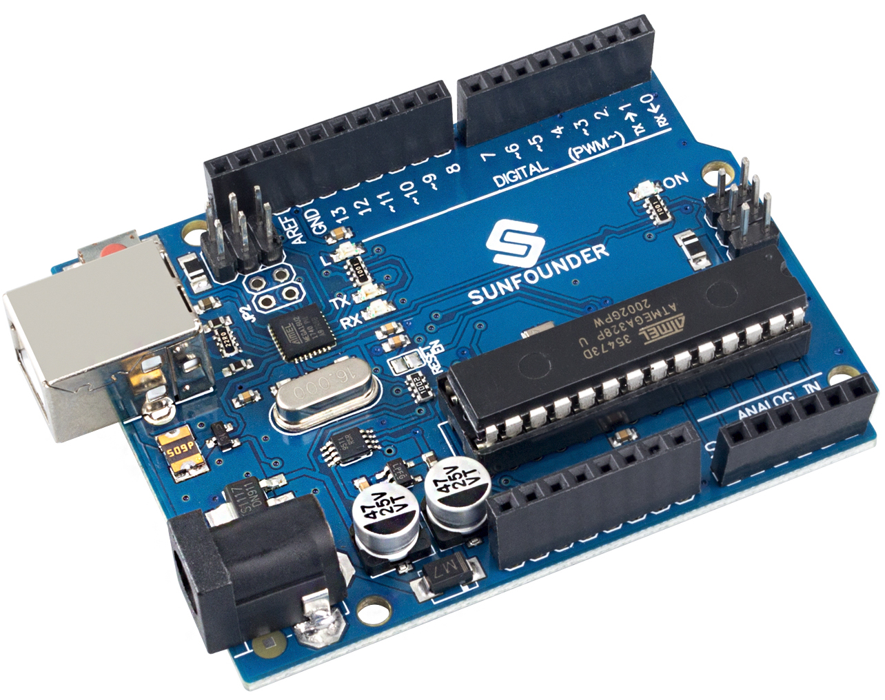

.. note::

    Ciao, benvenuto nella community di appassionati di SunFounder Raspberry Pi & Arduino & ESP32 su Facebook! Approfondisci il tuo interesse per Raspberry Pi, Arduino e ESP32 insieme ad altri appassionati.

    **Perché unirti a noi?**

    - **Supporto tecnico**: Risolvi problemi post-vendita e sfide tecniche con l'aiuto della nostra community e del nostro team.
    - **Impara e condividi**: Scambia suggerimenti e tutorial per migliorare le tue competenze.
    - **Anteprime esclusive**: Ottieni accesso anticipato a nuovi annunci di prodotti e anteprime speciali.
    - **Sconti esclusivi**: Approfitta di sconti esclusivi sui nostri prodotti più recenti.
    - **Promozioni festive e giveaway**: Partecipa a giveaway e promozioni festive.

    👉 Pronto per esplorare e creare con noi? Clicca [|link_sf_facebook|] e unisciti oggi stesso!

.. _cpn_uno:

SunFounder R3 Board
===========================

.. note::

    La scheda SunFounder R3 è una scheda principale con quasi le stesse funzioni dell'`Arduino Uno <https://store.arduino.cc/products/arduino-uno-rev3/>`_, e le due schede possono essere utilizzate in modo intercambiabile.

La scheda SunFounder R3 è una scheda microcontrollore basata sull'ATmega328P (`datasheet <http://ww1.microchip.com/downloads/en/DeviceDoc/Atmel-7810-Automotive-Microcontrollers-ATmega328P_Datasheet.pdf>`_). Dispone di 14 pin di input/output digitali (di cui 6 possono essere utilizzati come uscite PWM), 6 ingressi analogici, un risonatore ceramico da 16 MHz (CSTCE16M0V53-R0), una connessione USB, una presa di alimentazione, un'intestazione ICSP e un pulsante di reset. Contiene tutto il necessario per supportare il microcontrollore; è sufficiente collegarlo a un computer con un cavo USB o alimentarlo con un adattatore AC-DC o una batteria per iniziare.

**Parametri Tecnici**

.. image:: img/uno.jpg
    :align: center

* MICROCONTROLLER: ATmega328P
* TENSIONE DI FUNZIONAMENTO: 5V
* TENSIONE DI INGRESSO (RACCOMANDATA): 7-12V
* TENSIONE DI INGRESSO (LIMITE): 6-20V
* PIN I/O DIGITALI: 14 (0-13, di cui 6 forniscono uscita PWM (3, 5, 6, 9-11))
* PIN I/O DIGITALI PWM: 6 (3, 5, 6, 9-11)
* PIN DI INGRESSO ANALOGICI: 6 (A0-A5)
* CORRENTE CONTINUA PER PIN I/O: 20 mA
* CORRENTE CONTINUA PER PIN 3.3V: 50 mA
* MEMORIA FLASH: 32 KB (ATmega328P), di cui 0.5 KB utilizzati dal bootloader
* SRAM: 2 KB (ATmega328P)
* EEPROM: 1 KB (ATmega328P)
* VELOCITÀ DI CLOCK: 16 MHz
* LED_BUILTIN: 13
* LUNGHEZZA: 68.6 mm
* LARGHEZZA: 53.4 mm
* PESO: 25 g
* Porta I2C: A4(SDA), A5(SCL)

**Cos'altro c'è da sapere**

* `Arduino IDE <https://www.arduino.cc/en/software>`_
* `Arduino Programming Language Reference <https://www.arduino.cc/reference/en/>`_
* `ATmega328P Datasheet <http://ww1.microchip.com/downloads/en/DeviceDoc/Atmel-7810-Automotive-Microcontrollers-ATmega328P_Datasheet.pdf>`_

