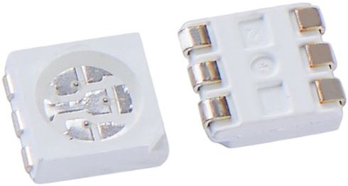
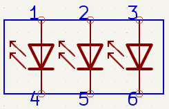
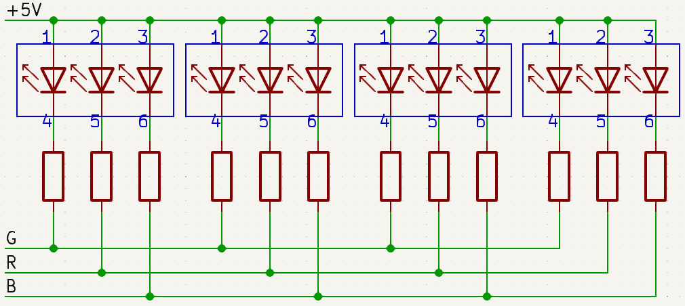

.. note:: 

    你好，欢迎加入 SunFounder 树莓派、Arduino 和 ESP32 爱好者社区！与其他爱好者一起，深入探索树莓派、Arduino 和 ESP32。

    **为什么加入？**

    - **专家支持**：通过社区和团队的帮助解决售后问题和技术挑战。
    - **学习与分享**：交流技巧和教程，提升你的技能。
    - **独家预览**：提前体验新产品发布和独家内容。
    - **专属折扣**：享受最新产品的专属优惠。
    - **节庆促销与赠品**：参与节日促销和赠品活动。

    👉 准备好与我们一起探索和创造了吗？点击 [|link_sf_facebook|] 即刻加入！

4 RGB LED 灯条
====================

.. image:: img/4_rgb_strip.jpg

* **+5V**：三颗 LED 的共阳极，需要连接至 DC 5V 电源
* **B**：蓝色 LED 的阴极
* **R**：红色 LED 的阴极
* **G**：绿色 LED 的阴极

这款 RGB LED 灯条包含四颗 R5050 RGB LED，能够通过组合红色、蓝色和绿色三种基础颜色，创建出各种颜色的光效。

R5050 RGB LED 采用共阳极设计。每颗 LED 都作为独立的电路工作，这使得你可以在指定的切割点将灯条剪切，而不会影响其他部分。灯条的柔性和适应性通过 FPC 板的结构得到增强，且背面有双面胶带，方便安装。

**什么是 R5050 RGB LED？**

R5050 RGB LED 是一种将红色、蓝色和绿色发光二极管集成在一个封装中的 LED 类型。该封装内的每个 LED 都有自己的引脚，可以单独控制。通过调整每个 LED 的亮度，可以产生广泛的颜色。

在典型的应用中，多个 R5050 RGB LED 被智能地布置在柔性电路板上。所有 LED 的“正极”（阳极）相连，而所有 LED 的“负极”（阴极）则分别连接到各自的颜色通道。这意味着所有绿色的阴极连接在一起，所有红色的阴极连接在一起，所有蓝色的阴极也连接在一起。这样的布置使得颜色混合和光强度的控制更加高效，因此这些 LED 在需要定制化色彩照明的应用中非常流行，如装饰照明、标牌和显示技术等。

**特性**

* 工作电压：DC5V
* 颜色：全彩 RGB
* 工作温度：-15°C 到 50°C
* RGB 类型：5050RGB
* 电流：150mA（单电路）
* 功率：1.5W
* 灯条厚度：2mm
* 灯条宽度：5.5mm
* 电缆：ZH1.5-4P，25cm，28AWG，黑色
