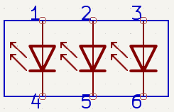

4 颗 RGB LED 灯带
====================

.. image:: img/4_rgb_strip.jpg

* **+5V** ：三个 LED 的公共阳极，需要连接到直流 5V
* **B** ：蓝色 LED 的阴极
* **R** ：红色 LED 的阴极
* **G** ：绿色 LED 的阴极

此 RGB LED 灯带具有四颗 R5050 RGB LED，能够通过组合红、蓝、绿三种基色创造任何颜色。

R5050 RGB LED 采用共阳极配置设计。灯带上的每颗 LED 都是一个独立电路，允许您在指定位置裁剪灯带而不会影响其他部分。灯带采用 FPC 板制造，背面带有双面胶，便于安装，增强了灵活性和适应性。

**什么是 R5050 RGB LED？**

R5050 RGB LED 是一种将红、蓝、绿发光二极管集成在单个封装中的 LED。该封装中的每颗 LED 都有自己的引脚，可进行独立控制。这种配置通过改变每颗 LED 的强度，可以产生多种颜色。

.. image:: img/rgb_5050.jpg
    :width: 400

在典型应用中，多个 R5050 RGB LED 以智能配置方式排列在柔性电路上。这是通过将所有 LED 的 "正极" 端（阳极）连接在一起，而 "负极" 端（阴极）则连接到各自对应的颜色通道来实现的。这意味着所有绿色阴极连接在一起，所有红色阴极连接在一起，所有蓝色阴极连接在一起。这种布置方式可以有效地控制混色和光强度，使得这些 LED 在需要可定制彩色照明的应用中非常受欢迎，例如装饰照明、标牌和显示技术。

.. image:: img/rgb_strip_sche.png

**特性**

* 工作电压：DC5V
* 颜色：全彩 RGB
* 工作温度：-15-50
* RGB 类型：5050RGB
* 电流：150mA（单路）
* 功率：1.5W
* 灯带厚度：2mm
* 灯带宽度：5.5mm
* 线缆：ZH1.5-4P，25cm，28AWG，黑色
