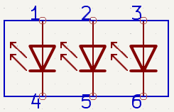

.. include:: /index.rst
   :start-after: start_hello_message
   :end-before: end_hello_message

Striscia 4 LED RGB
====================

.. image:: img/4_rgb_strip.jpg

* **+5V**: Anodo comune dei tre LED, deve essere collegato a 5V CC
* **B**: Catodo del LED blu
* **R**: Catodo del LED rosso
* **G**: Catodo del LED verde

Questa striscia LED RGB presenta quattro LED R5050 RGB, in grado di creare qualsiasi tonalità di colore combinando i tre colori primari: rosso, blu e verde.

I LED R5050 RGB sono progettati con una configurazione ad anodo comune. Ogni LED sulla striscia funziona come un circuito indipendente, permettendoti di tagliare la striscia in punti designati senza influenzare le altre sezioni. La flessibilità e l'adattabilità della striscia sono migliorate dalla sua costruzione su una scheda FPC, che è supportata da adesivo biadesivo per una facile installazione.

**Che cos'è il LED R5050 RGB?**

Il LED R5050 RGB è un tipo di LED che combina diodi a emissione di luce rossa, blu e verde in un unico package. Ogni LED all'interno di questo package ha il proprio pin, consentendo un controllo individuale. Questa configurazione permette la produzione di un'ampia gamma di colori variando l'intensità di ciascun LED.

.. image:: img/rgb_5050.jpg
    :width: 400

In un'applicazione tipica, più LED R5050 RGB sono disposti su un circuito flessibile in una configurazione intelligente. Ciò avviene collegando insieme le estremità "positive" (anodi) di tutti i LED, mentre le estremità "negative" (catodi) sono collegate alle rispettive linee di colore. Ciò significa che tutti i catodi verdi sono collegati insieme, tutti i catodi rossi sono collegati insieme e tutti i catodi blu sono collegati insieme. Questa disposizione consente un controllo efficiente della miscelazione dei colori e dell'intensità luminosa, rendendo questi LED popolari in applicazioni dove si desidera un'illuminazione colorata personalizzabile, come nell'illuminazione decorativa, nella segnaletica e nelle tecnologie di visualizzazione.

.. image:: img/rgb_strip_sche.png

**Caratteristiche**

* Tensione di lavoro: 5V CC
* Colore: RGB a colori completi
* Temperatura di lavoro: -15-50
* Tipo RGB: 5050RGB
* Corrente: 150mA (circuito singolo)
* Potenza: 1,5W
* Spessore striscia luminosa: 2mm
* Larghezza striscia luminosa: 5,5mm
* Cavo: ZH1.5-4P, 25cm, 28AWG, Nero
