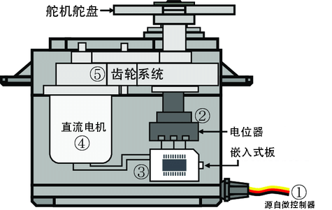

.. _cpn_servo:

舵机
===========

舵机是一种专用电机，以其在控制特定角度位置上的精准度而著称。

.. image:: img/servo.png
    :align: center

* **棕色线**：GND
* **橙色线**：信号引脚，连接至主板的 PWM 引脚。
* **红色线**：VCC

与普通电机连续旋转不同，舵机能够精确地转动到特定的位置并保持不动。它通过齿轮、可调电阻和控制电路的组合来实现这一点。舵机广泛应用于需要精确控制物体或机制位置的各种场合。

**特性**

* **电机类型**：核心电机
* **工作电压**：4.8~6V DC
* **待机电流**：≤4 mA
* **消耗电流（在 4.8V 空载时）**：≦50mA
* **消耗电流（在 6V 空载时）**：≦60mA
* **堵转电流（在 4.8V 时锁定）**：≦550mA
* **堵转电流（在 6V 时锁定）**：≦650mA
* **额定扭矩**：4.8V, ≥0.6 kgf·cm；6V, ≥0.7 kgf·cm
* **最大扭矩**：4.8V, ≥1.4 kgf·cm；6V, ≥1.6 kgf·cm
* **空载转速**：4.8V, ≦0.14秒/60°；6V, ≦0.12秒/60°
* **注意**：扭矩保护：≥0.9 kgf·cm；连续工作 5 秒后具断电保护
* **工作温度范围**：-10℃~+50℃
* **存储温度范围**：-20℃~+60℃
* **工作湿度范围**：≤ 90%RH
* **存储湿度范围**：≤ 90%RH
* **重量**：10± 0.5g
* **材质**：ABS
* **工作角度**：180°±10°（500~2500us）
* **机械限制角度**：360°
* **左右行程角度**：≤ 6°
* **回中偏差**：≤ 1°
* **背隙**：≤ 4 us
* **放大器类型**：数字型
* **电缆材质**：Ф1.08,19 PVC
* **电缆长度**：245±5mm（无插头）
* **连接器类型**：JR2.54mm/3Pin

**工作原理**

舵机内部的关键组件共同实现了其独特的功能。舵机的核心是一台常规电机，该电机通过复杂的齿轮系统与电机轴上的小齿轮相连接。这个齿轮布局将电机的快速旋转运动有效地转换为较慢但有力的动作。

然而，舵机真正的“魔力”来自于一个微小的电子组件——可调电阻（或称电位器）和复杂的控制电路。每当舵机发生运动时，电位器就会旋转，改变其电阻值。控制电路精准地检测并解读这一电阻变化，从而确定舵机的精确位置，这一过程展现了其卓越的技术。

在舵机控制中，一种独特的信号调制方法——脉宽调制（PWM）发挥了重要作用。通过巧妙地调整脉冲的宽度，操控者可以精确地指令舵机进行运动，并保持其稳定的位置。这正是舵机电机技术的精髓所在，它将精确度与控制力结合，广泛应用于各类精确控制的场合。
