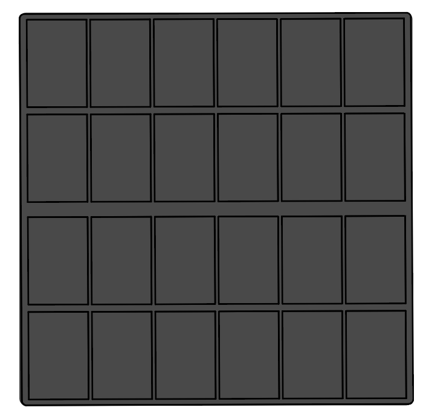

.. note::

    Ciao, benvenuto nella community SunFounder Raspberry Pi & Arduino & ESP32 su Facebook! Approfondisci il mondo di Raspberry Pi, Arduino ed ESP32 insieme ad altri appassionati.

    **Perché unirti a noi?**

    - **Supporto esperto**: Risolvi problemi post-vendita e sfide tecniche con l'aiuto della nostra community e del nostro team.
    - **Impara e condividi**: Scambia suggerimenti e tutorial per migliorare le tue competenze.
    - **Anteprime esclusive**: Ottieni accesso anticipato a nuovi annunci di prodotti e anteprime.
    - **Sconti speciali**: Approfitta di sconti esclusivi sui nostri prodotti più recenti.
    - **Promozioni festive e giveaway**: Partecipa a giveaway e promozioni speciali durante le festività.

    👉 Pronto per esplorare e creare con noi? Clicca [|link_sf_facebook|] e unisciti oggi stesso!

Pannello Solare
=======================

I pannelli solari sono dispositivi che convertono la luce solare in elettricità. Sono costituiti da celle fotovoltaiche (PV), realizzate con materiali semiconduttori come il silicio. Quando la luce solare colpisce una cella fotovoltaica, libera gli elettroni dai loro atomi. Questi elettroni fluiscono attraverso la cella, generando una corrente elettrica.

I pannelli solari possono essere utilizzati per generare elettricità per diversi scopi, tra cui l'alimentazione di case, aziende e persino intere comunità. Rappresentano una fonte di energia pulita e rinnovabile che può contribuire a ridurre la nostra dipendenza dai combustibili fossili.

**Caratteristiche**

* Potenza in uscita: 6V/660mA
* Tempo per caricare completamente la batteria: 7,2h (valore teorico, assumendo forte luce solare)
* Dimensioni: 170mm x 170mm
* Fili: Grigio e Nero, 24AWG, 200mm
* Connettore: Bianco, XH2.54-2P
